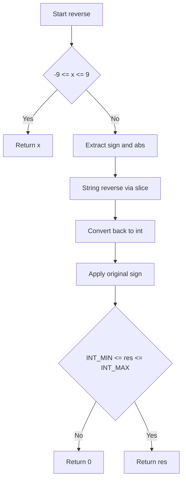
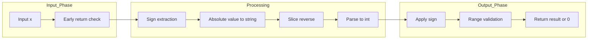

# Reverse Integer - 32bit符号付き整数の桁反転

<h2 id="toc">目次</h2>

- [概要](#overview)
- [アルゴリズム要点（TL;DR）](#tldr)
- [図解](#figures)
- [正しさのスケッチ](#correctness)
- [計算量](#complexity)
- [Python実装](#impl)
- [CPython最適化ポイント](#cpython)
- [エッジケースと検証観点](#edgecases)
- [FAQ](#faq)

---

<h2 id="overview">概要</h2>

**問題**: 32bit符号付き整数 `x` の桁を反転し、結果が `[-2³¹, 2³¹-1]` の範囲外になる場合は `0` を返す。64bit整数の使用は禁止。

**要件**:

- 正当性: 桁を正しく反転し、オーバーフロー時は `0` を返す
- 制約: 空間 O(1) が理想だが、Python では文字列法が実測で最速
- 安定性: 符号を正しく保持し、先頭ゼロを自然に削除

---

<h2 id="tldr">アルゴリズム要点（TL;DR）</h2>

**戦略**: Pythonの高速な組み込み文字列処理を活用

- **文字列反転法**: `str()` → スライス `[::-1]` → `int()` で一括処理
- **符号分離**: 絶対値を反転後に符号を掛け戻し
- **範囲チェック**: 最後に32bit境界と比較

**データ構造**: 文字列（一時）、整数定数
**時間計算量**: O(d) — d は桁数（最大10）
**空間計算量**: O(d) — 文字列スライスで一時領域

---

<h2 id="figures">図解</h2>

## フローチャート



**説明**: 1桁の場合は即座に返し、それ以外は符号を分離して絶対値の文字列を反転。整数化後に符号を戻し、32bit範囲外なら `0` を返す。

### データフロー図



**説明**: 入力を早期チェック後、符号分離・文字列反転・整数化・符号適用・範囲検証の順で処理し、結果を出力。

---

<h2 id="correctness">正しさのスケッチ</h2>

**不変条件**:

- 符号は分離保存され、最後に正しく適用される
- 文字列スライスは先頭ゼロを自動削除（`int()` が処理）

**網羅性**:

- 1桁: 早期リターンで正しく返す
- 複数桁: 文字列反転で全桁を逆順に処理
- 負数: 符号を分離して絶対値処理後に `-1` を掛ける

**基底条件**: `-9 ≤ x ≤ 9` の場合、桁反転は自身なので即座に返す

**終了性**: 文字列操作は有限桁（最大10桁）で必ず終了

---

<h2 id="complexity">計算量</h2>

**時間計算量**: **O(d)**

- d は入力整数の桁数（最大10）
- `str()`, スライス `[::-1]`, `int()` はすべて O(d)
- CPythonのC実装により、ループより高速

**空間計算量**: **O(d)**

- 文字列スライスで一時的に O(d) のメモリを使用
- 最終結果は整数1つ

**比較**: 数値のみの O(1) 空間版も可能だが、Pythonでは文字列法の方が実測で速い

---

<h2 id="impl">Python実装</h2>

```python
from __future__ import annotations

class Solution:
    """
    Reverse Integer (LeetCode #7)
    32-bit 符号付き整数 x の数字を反転。範囲外は 0 を返す。
    """

    # 32bit境界定数（クラス定数として明示）
    INT_MAX: int = 2_147_483_647   #  2^31 - 1
    INT_MIN: int = -2_147_483_648  # -2^31

    def reverse(self, x: int) -> int:
        """
        文字列反転法による最速実装

        Args:
            x: 32-bit signed integer

        Returns:
            反転後の整数（範囲外は 0）

        Time: O(d), Space: O(d) — d は桁数（最大10）
        """
        # 基底条件: 1桁はそのまま返す（早期リターン）
        if -9 <= x <= 9:
            return x

        # 符号を分離して絶対値の文字列を反転
        sign: int = -1 if x < 0 else 1
        abs_x: int = -x if x < 0 else x

        # C実装の高速な文字列処理を活用
        # [::-1] スライスで反転、int() で整数化（先頭ゼロは自動削除）
        rev_abs: int = int(str(abs_x)[::-1])

        # 符号を適用
        result: int = rev_abs * sign

        # 32bit範囲チェック（Pythonの任意精度intを手動で拘束）
        if result < self.INT_MIN or result > self.INT_MAX:
            return 0

        return result
```

**主要ステップ**:

1. **早期リターン**: 1桁の場合は処理不要
2. **符号分離**: 負数を絶対値化して `sign` に記録
3. **文字列反転**: `str()[::-1]` でC実装の高速処理
4. **整数化**: `int()` で先頭ゼロを自動削除
5. **符号適用**: `sign` を掛けて元の符号を復元
6. **範囲検証**: 32bit境界外なら `0` を返す

---

<h2 id="cpython">CPython最適化ポイント</h2>

**採用した最適化**:

- **文字列処理の活用**: CPythonの `str()`, スライス, `int()` はC実装で高速
- **早期リターン**: 1桁の場合は条件分岐を避けて即座に返す
- **符号分離**: 負数の `%` 演算を回避し、分岐を削減

**追加の最適化余地**:

- **定数のローカル化**: `INT_MAX` 等を関数内ローカル変数に束縛すると属性参照を削減できる（マイクロ最適化）

```python
int_max = self.INT_MAX
int_min = self.INT_MIN
```

- **数値のみ版**: O(1) 空間が必須なら `divmod` を使った桁処理も可能だが、Pythonでは文字列法が速い

**GIL影響**: 単一スレッドのCPU計算のみで影響なし

---

<h2 id="edgecases">エッジケースと検証観点</h2>

| ケース       | 入力例        | 期待出力 | 検証ポイント            |
| ------------ | ------------- | -------- | ----------------------- |
| 1桁正数      | `5`           | `5`      | 早期リターン            |
| 1桁負数      | `-5`          | `-5`     | 符号保持                |
| 末尾ゼロ     | `120`         | `21`     | 先頭ゼロ削除            |
| 負数末尾ゼロ | `-120`        | `-21`    | 符号＋ゼロ削除          |
| 正の境界     | `2147483647`  | `0`      | 上限オーバーフロー      |
| 負の境界     | `-2147483648` | `0`      | 下限オーバーフロー      |
| 境界直前     | `1534236469`  | `0`      | `9646324351` は上限超え |
| ゼロ         | `0`           | `0`      | 基底条件                |
| 複数桁正数   | `123`         | `321`    | 通常の反転              |
| 複数桁負数   | `-123`        | `-321`   | 符号保持                |

**検証方法**:

- 単体テスト: 上記の全ケースをアサーション
- 境界値テスト: `±2³¹` 付近の値
- ランダムテスト: `-2³¹` から `2³¹-1` の範囲でランダム生成

---

<h2 id="faq">FAQ</h2>

**Q1: なぜ数値のみの O(1) 空間版ではなく文字列法を採用したのか？**
A: CPythonでは `str()`, スライス, `int()` がC実装で最適化されており、桁数が最大10と小さいため、文字列法の方が実測で速いケースが多い。競技プログラミングでは実行時間が優先される。

**Q2: 64bit整数を使えば簡単では？**
A: 問題制約で64bit整数の使用は禁止されている。Pythonは任意精度intだが、32bit範囲を手動でチェックする必要がある。

**Q3: 負数の剰余演算を避ける理由は？**
A: Pythonの `%` は負数で数学的定義（floor division）に従うため、C言語的な「toward-zero」と異なる。符号分離して絶対値で処理する方が分岐が少なく、読みやすい。

**Q4: 先頭ゼロはどう処理されるのか？**
A: `int("021")` は自動的に `21` になるため、特別な処理は不要。

**Q5: オーバーフロー検査を事前に行わない理由は？**
A: Pythonの任意精度intでは反転後の値を一旦計算してから範囲チェックする方がシンプル。数値のみ版では事前検査が必要だが、文字列法では最後に一発で判定できる。

**Q6: 業務開発で使う場合の注意点は？**
A: 型検証（`isinstance(x, int)`）や範囲検証を追加し、例外処理を実装する。LeetCode版は速度優先で検証を省略している。
