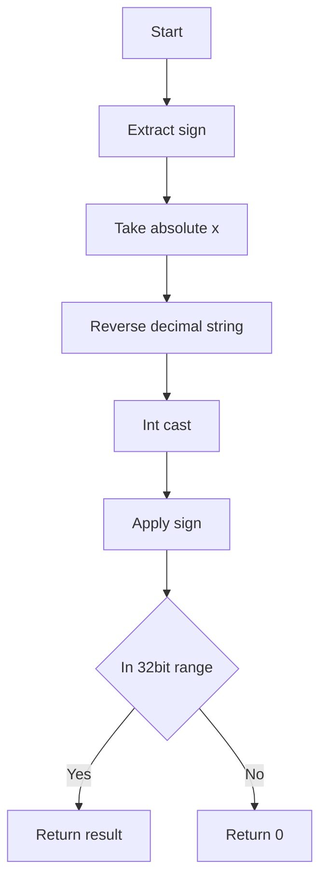
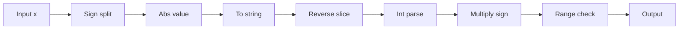

# Reverse Integer - 32bit範囲での十進桁反転

## Table of Contents

- [概要](#overview)
- [アルゴリズム要点（TL;DR）](#tldr)
- [図解](#figures)
- [正しさのスケッチ](#correctness)
- [計算量](#complexity)
- [Python 実装](#impl)
- [CPython最適化ポイント](#cpython)
- [エッジケースと検証観点](#edgecases)
- [FAQ](#faq)

<h2 id="overview">概要</h2>

- **プラットフォーム/ID**: LeetCode 7
- **問題タイトル**: Reverse Integer
- **要約**: 符号付き 32bit 整数 `x` の十進数の桁を逆順にした整数を返す。結果が 32bit 範囲 `[-2^31, 2^31-1]` を外れる場合は `0` を返す。
- **入出力仕様（簡潔）**:
    - 入力: `x: int`
    - 出力: 反転後の `int`（範囲外なら `0`）

- **関数シグネチャ（LeetCode準拠）**:
    - `class Solution: def reverse(self, x: int) -> int:`

- **想定データ構造**: 整数（十進表現）。補助構造は不要。
- **代表例**:
    - `x = 123` → `321`
    - `x = -123` → `-321`
    - `x = 120` → `21`

- **制約**: `-2^31 <= x <= 2^31 - 1`、任意精度 `int` の Python でも 32bit に**制限**して判定する。

<h2 id="tldr">アルゴリズム要点（TL;DR）</h2>

- **戦略**: Pythonでは C 実装の `str`/スライス/`int` が高速なため、**文字列反転**で最短化し、最後に 32bit 範囲チェック。
- **手順**:
    1. `x` の符号を分離し、絶対値の十進文字列を `[::-1]` で反転。
    2. `int(...)` に戻して符号を掛け戻す。
    3. 32bit 範囲 `[-2^31, 2^31-1]` から外れていれば `0` を返す。

- **計算量**: Time **O(d)**、Space **O(d)**（d は桁数、最大 10）
- **安定性**: 例外を投げず、範囲外は必ず `0` を返す。

<h2 id="figures">図解</h2>

## **フローチャート**



短い説明: 符号分離→絶対値化→文字列反転→整数変換→符号適用→32bitチェックの順で処理します。

## **データフロー図**



短い説明: データは文字列化→反転→整数化と一方向に流れ、最後に範囲でフィルタします。

<h2 id="correctness">正しさのスケッチ</h2>

- **不変条件**: 反転操作は十進の桁順序を逆転するが、桁集合（各桁の多重集合）は不変。
- **網羅性**: 正・負・零を別々に扱い、符号は最後に掛け戻すため、すべての整数に対して定義される。
- **基底条件**: 1桁の整数は反転しても同値（実装ではそのまま返すか、一般手順で同値になる）。
- **終了性**: 反転は有限桁の文字列処理であり、必ず終了する。
- **範囲検証**: 出力が `[-2^31, 2^31-1]` を外れる場合に `0` を返すため、問題仕様に合致。

<h2 id="complexity">計算量</h2>

- **Time**: O(d) — 文字列化・反転・整数化はいずれも桁数に線形。
- **Space**: O(d) — 反転文字列が一時的に必要。
- **備考**: d ≤ 10（32bit 整数の最大桁数）なので、実用上のオーバーヘッドは極小。

<h2 id="impl">Python 実装</h2>

> 要件: LeetCode クラス形式、pylance で型エラーなし、外部副作用なし（Pure）。

```python
from __future__ import annotations
from typing import Final

class Solution:
    """
    Reverse Integer (#7)
    32-bit 符号付き整数 x の桁を反転。範囲外なら 0 を返す。
    """

    # 32bit 範囲を Final 定数として定義（pylance に優しい明示型）
    INT_MAX: Final[int] = 2_147_483_647    #  2^31 - 1
    INT_MIN: Final[int] = -2_147_483_648   # -2^31

    def reverse(self, x: int) -> int:
        """
        文字列反転で最短ルート
        Time: O(d), Space: O(d)  d は桁数（最大 10）

        Args:
            x: 32-bit signed integer

        Returns:
            反転後の整数（範囲外は 0）
        """
        # 1桁は早期リターン
        if -9 <= x <= 9:
            return x

        # 符号分離
        sign: int = -1 if x < 0 else 1
        abs_x: int = -x if x < 0 else x

        # 十進文字列を反転し整数化（C 実装の高速パス）
        rev_abs: int = int(str(abs_x)[::-1])

        # 符号を掛け戻し
        res: int = rev_abs * sign

        # 32bit 範囲チェック
        if res < self.INT_MIN or res > self.INT_MAX:
            return 0
        return res
```

- 実装は**純粋関数的**（引数のみを使用・外部状態変更なし）。
- 主要ステップ（符号分離→反転→範囲判定）に沿ってコメントを配置。

<h2 id="cpython">CPython最適化ポイント</h2>

- **C 実装の活用**: `str()`, スライス `[::-1]`, `int()` は C で最適化され、短い整数ではループより速い。
- **属性アクセス削減**: `INT_MAX/INT_MIN` を `Final` でクラス定数化。局所変数へ束縛してもよいが、桁数が小さいため差は僅少。
- **例外非使用**: 正常系は例外を投げず直線実行。
- **代替案（数値のみ）**: 逐次 `divmod` で桁処理＋`INT_MAX` のみ事前オーバーフロー判定でも実装可（O(1) 追加メモリ）。Python では実測で文字列法が有利なことが多い。

<h2 id="edgecases">エッジケースと検証観点</h2>

- `0`（そのまま `0`）
- 1桁正負: `5` → `5`, `-8` → `-8`
- 末尾ゼロ: `120` → `21`, `-120` → `-21`
- 符号: `-123` → `-321`
- 上限超過: `1534236469` → 反転 `9646324351` は `INT_MAX` 超過 → `0`
- 境界: `2147483647` → 反転は超過 → `0`、`-2147483648` → 反転は超過 → `0`

<h2 id="faq">FAQ</h2>

- **Q. 文字列を使うのは反則では？**
  **A.** 問題は文字列使用を禁止していません。Python では C 実装の高速化恩恵が大きく、最短経路です。

- **Q. 数値演算のみで書くとしたら？**
  **A.** `sign = -1 if x < 0 else 1`、`n = abs(x)` として `while n: rev = rev * 10 + n % 10; n //= 10`。
  最後に `rev * sign`。`INT_MAX` 事前チェックでオーバーフローを防ぎます。

- **Q. なぜ 32bit チェックが必要？**
  **A.** Python の `int` は任意精度ですが、問題仕様が 32bit 範囲を要求するためです。範囲外は `0` を返します。
