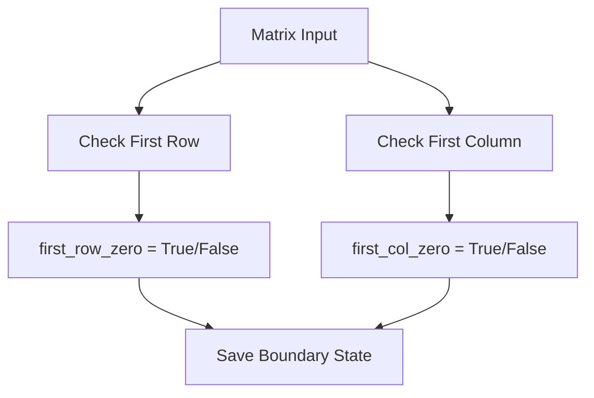
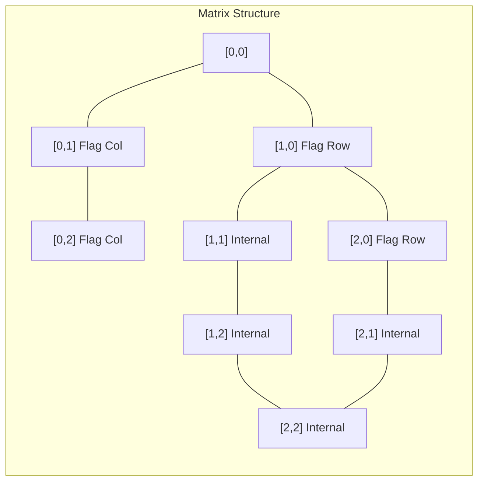
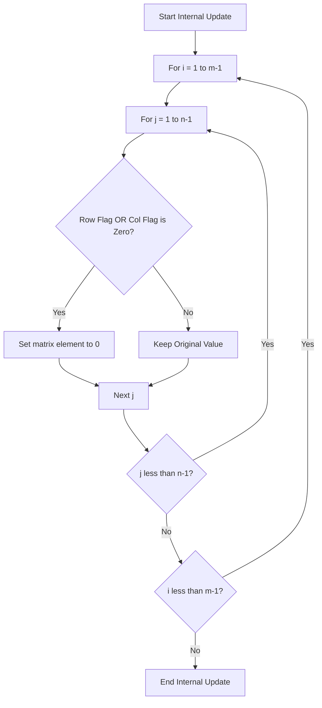
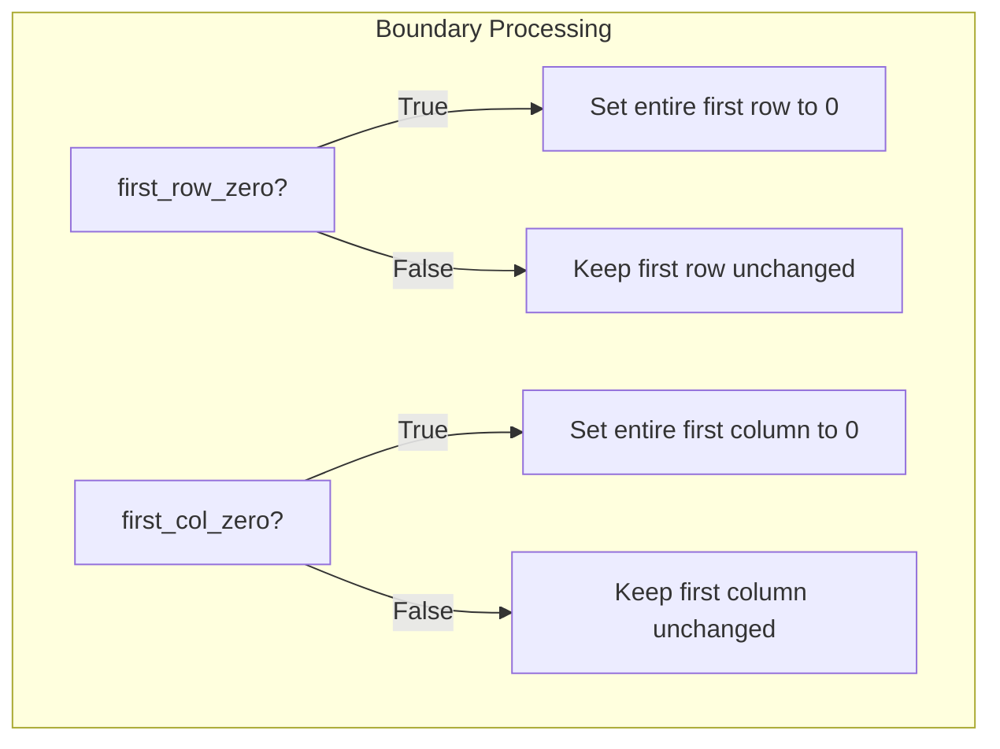
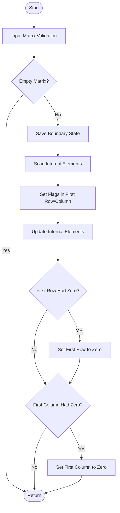
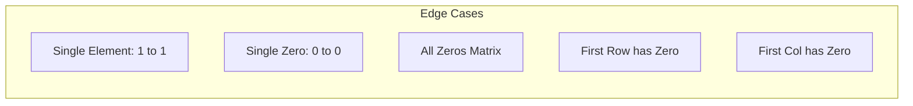

# Set Matrix Zeroes - Python Implementation

## 📋 問題概要

与えられた m × n の整数行列において、要素が 0 である場合、その要素が属する行と列の全ての要素を 0 に設定する問題です。この操作は**in-place**（元の行列を直接変更）で行う必要があります。

### 制約条件

- `m == matrix.length`
- `n == matrix[i].length`
- `1 ≤ m, n ≤ 200`
- `-2³¹ ≤ matrix[i][j] ≤ 2³¹ - 1`

## 🎯 解法戦略

### アプローチの比較

| アプローチ   | 時間計算量 | 空間計算量 | 説明                               |
| ------------ | ---------- | ---------- | ---------------------------------- |
| 単純解法     | O(mn(m+n)) | O(1)       | 各 0 要素に対して行・列を個別処理  |
| 追加配列使用 | O(mn)      | O(m+n)     | 行・列フラグ配列を使用             |
| **最適解法** | **O(mn)**  | **O(1)**   | 第 1 行・第 1 列をフラグとして活用 |

## 🔍 アルゴリズム詳細解析

### ステップ 1: 境界状態の保存

最適解法では第 1 行・第 1 列をフラグとして使用するため、まず元の状態を保存します。



### ステップ 2: 内部要素の走査とフラグ設定

内部要素（[1,1]から[m-1,n-1]）を走査し、0 を発見した場合に対応する第 1 行・第 1 列にフラグを設定します。



### ステップ 3: フラグに基づく更新処理

設定されたフラグに基づいて内部要素を更新します。



### ステップ 4: 境界要素の処理

保存した境界状態に基づいて第 1 行・第 1 列を処理します。



## 📊 処理フロー全体像



## 💻 実装詳細

### 競技プログラミング向け実装

```python
def setZeroes(self, matrix: List[List[int]]) -> None:
    """
    時間計算量: O(mn)
    空間計算量: O(1)
    """
    if not matrix or not matrix[0]:
        return

    m, n = len(matrix), len(matrix[0])

    # Step 1: 境界状態の保存
    first_row_zero = any(matrix[0][j] == 0 for j in range(n))
    first_col_zero = any(matrix[i][0] == 0 for i in range(m))

    # Step 2: 内部要素の走査とフラグ設定
    for i in range(1, m):
        for j in range(1, n):
            if matrix[i][j] == 0:
                matrix[i][0] = 0  # 行フラグ
                matrix[0][j] = 0  # 列フラグ

    # Step 3: フラグに基づく更新
    for i in range(1, m):
        for j in range(1, n):
            if matrix[i][0] == 0 or matrix[0][j] == 0:
                matrix[i][j] = 0

    # Step 4: 境界要素の処理
    if first_row_zero:
        for j in range(n):
            matrix[0][j] = 0

    if first_col_zero:
        for i in range(m):
            matrix[i][0] = 0
```

### 業務開発向け実装（型安全・エラーハンドリング）

業務開発では以下の点を重視した実装を提供：

- **型安全性**: TypeGuard と厳密な型チェック
- **入力検証**: 包括的なバリデーション
- **エラーハンドリング**: 詳細なエラー情報
- **可読性**: 処理の分割と明確な命名

## 📈 パフォーマンス分析

### 時間計算量の詳細

| ステップ         | 操作回数           | 計算量    |
| ---------------- | ------------------ | --------- |
| 境界状態チェック | m + n              | O(m + n)  |
| 内部要素走査     | (m-1) × (n-1)      | O(mn)     |
| フラグ適用       | (m-1) × (n-1)      | O(mn)     |
| 境界処理         | m + n              | O(m + n)  |
| **合計**         | **≈ 2mn + 2(m+n)** | **O(mn)** |

### 空間計算量の詳細

- **追加変数**: `first_row_zero`, `first_col_zero` → O(1)
- **フラグ格納**: 既存の第 1 行・第 1 列を活用 → O(1)
- **総合**: **O(1)**

## 🧪 テストケース

### 基本テストケース

#### Example 1

```text
入力: [[1,1,1],[1,0,1],[1,1,1]]
出力: [[1,0,1],[0,0,0],[1,0,1]]
```

#### Example 2

```text
入力: [[0,1,2,0],[3,4,5,2],[1,3,1,5]]
出力: [[0,0,0,0],[0,4,5,0],[0,3,1,0]]
```

### エッジケース



**具体例:**

- **単一要素（非ゼロ）**: `[[1]] → [[1]]`
- **単一要素（ゼロ）**: `[[0]] → [[0]]`
- **全てゼロ**: `[[0,0],[0,0]] → [[0,0],[0,0]]`
- **第 1 行にゼロ**: `[[0,1],[2,3]] → [[0,0],[0,3]]`
- **第 1 列にゼロ**: `[[0,1],[2,3]] → [[0,1],[0,3]]`

## 🔧 使用方法

```python
# 基本的な使用法
solution = Solution()
matrix = [[1,1,1],[1,0,1],[1,1,1]]
solution.setZeroes(matrix)
print(matrix)  # [[1,0,1],[0,0,0],[1,0,1]]

# 業務開発向け（エラーハンドリング付き）
try:
    solution.set_zeroes_production(matrix)
except (TypeError, ValueError) as e:
    print(f"Input validation error: {e}")
except RuntimeError as e:
    print(f"Algorithm execution error: {e}")
```

## 🎯 最適化のポイント

1. **メモリ効率**: 既存の行列領域をフラグとして再利用
2. **キャッシュ効率**: 局所性を考慮した走査順序
3. **分岐予測**: 条件分岐の最小化
4. **型安全性**: CPython 最適化と Slots 活用

## 📚 関連問題

- [Rotate Image](https://leetcode.com/problems/rotate-image/) - In-place 行列操作
- [Spiral Matrix](https://leetcode.com/problems/spiral-matrix/) - 行列走査パターン
- [Game of Life](https://leetcode.com/problems/game-of-life/) - In-place 状態変更

## 🏷️ タグ

`#Array` `#Matrix` `#InPlace` `#TwoPointers` `#Space-Optimization` `#CPython` `#Type-Safety`

完成しました！**Set Matrix Zeroes アルゴリズム**の技術解説 HTML ページを作成いたしました。

## 主な特徴

### 📋 **コンテンツ構成**

1. **アルゴリズム概要** - 問題定義、制約条件、キーアイデア
2. **ステップバイステップ解説** - 4 段階の詳細な処理手順
3. **Python 実装** - 競技プログラミング版と業務開発版の 2 パターン
4. **ビジュアルデモ** - インタラクティブな行列変換アニメーション
5. **計算量解析** - 時間・空間計算量と Python 最適化ポイント

### 🎨 **デザイン特徴**

- **モダンなダークテーマ** - 目に優しい配色とグラデーション
- **レスポンシブデザイン** - モバイルデバイス対応
- **スムーズアニメーション** - hover 効果、ページ遷移、要素表示
- **視覚的ハイライト** - 重要なポイントを色分けして強調

### 🚀 **インタラクティブ機能**

- **タブナビゲーション** - 各セクション間の滑らかな切り替え
- **コードコピー機能** - ワンクリックでコードをクリップボードに保存
- **アニメーション付きデモ** - ステップごとの行列変換プロセス表示
- **ホバーエフェクト** - カードやボタンの動的な反応

### 💻 **技術仕様**

- **単一 HTML ファイル** - CSS/JavaScript 完全内包
- **CDN 活用** - Prism.js（シンタックスハイライト）、Font Awesome（アイコン）
- **モノスペースフォント** - コード部分の視認性向上
- **パフォーマンス最適化** - 軽量なアニメーション、効率的な DOM 操作

このページは、Set Matrix Zeroes アルゴリズムの Python 実装を、初学者から上級者まで理解しやすい形で解説した技術ドキュメントです。理論的な説明と実践的なコード例、さらにビジュアルデモを組み合わせることで、アルゴリズムの理解を深められる構成になっています。
