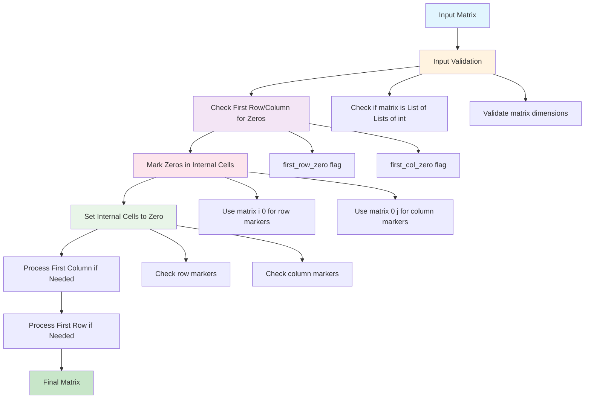
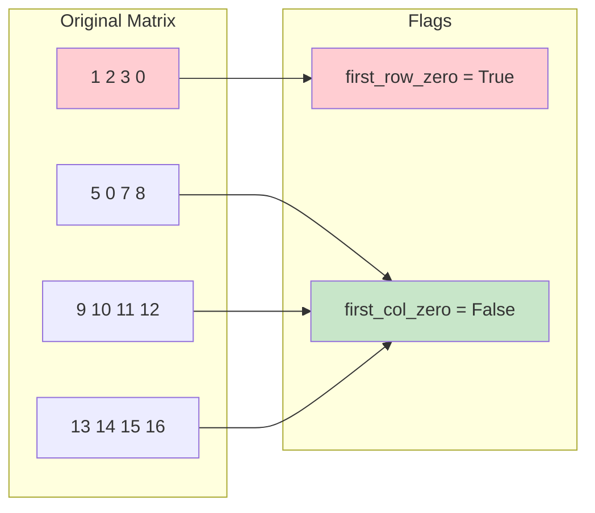
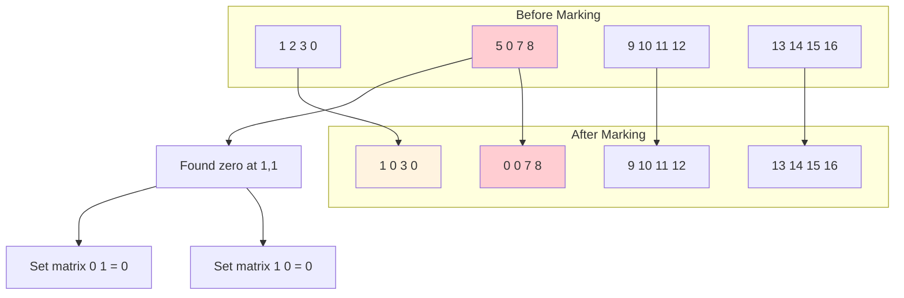
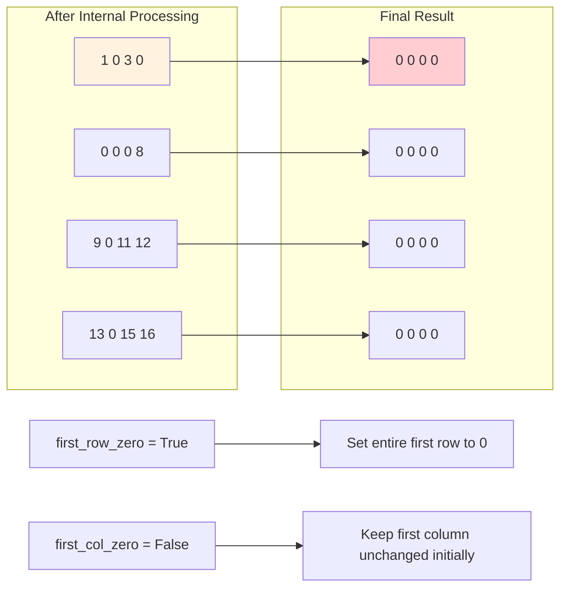
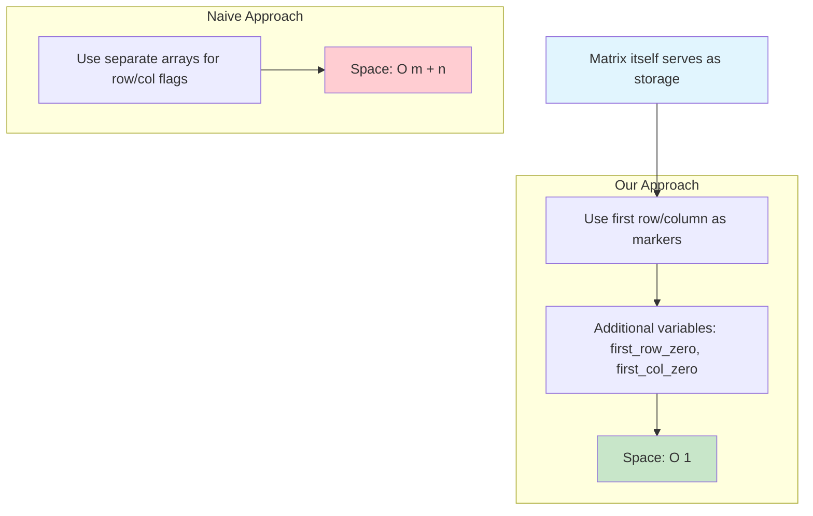

# Set Matrix Zeroes Algorithm - 行列ゼロ化アルゴリズム

## 概要

2 次元行列において、要素が 0 の場合にその行と列をすべて 0 に設定するアルゴリズムです。**O(1)の追加空間**で効率的に実装されています。

## アルゴリズムの動作原理



## 主な処理ステップの詳細解説

### 1. 入力検証フェーズ

```python
# 型チェックと構造検証
if not isinstance(matrix, list):
    raise TypeError("matrix must be a list of lists")
if not matrix or not isinstance(matrix[0], list):
    raise ValueError("matrix must be a non-empty 2D list")
```

**目的**: 不正な入力を事前に検出し、実行時エラーを防止

### 2. 第 1 行・第 1 列のフラグ判定



**重要性**: 第 1 行・第 1 列は後でマーカーとして使用するため、元々ゼロが含まれているかを事前に記録する必要があります。

### 3. マーキングフェーズ（内部セル処理）



**仕組み**:

- `matrix[i][j] == 0` の場合、`matrix[i][0]` と `matrix[0][j]` をマーカーとして 0 に設定
- 第 1 行と第 1 列が「ゼロにすべき行・列」の情報を格納

### 4. 内部セルゼロ化フェーズ

```python
for i in range(1, m):
    row = matrix[i]
    if matrix[i][0] == 0:  # 行全体をゼロ化
        for j in range(1, n):
            row[j] = 0
    else:  # 列マーカーをチェック
        for j in range(1, n):
            if matrix[0][j] == 0:
                row[j] = 0
```

**最適化ポイント**:

- 行マーカーが 0 の場合は行全体を一気にゼロ化
- そうでなければ各列マーカーを個別チェック

### 5. 第 1 行・第 1 列の最終処理



## 実装バリエーション比較

### 通常版 vs 最適化版

| 特徴                   | 通常版 (`setZeroes`)   | 最適化版 (`setZeroes_optimized`) |
| ---------------------- | ---------------------- | -------------------------------- |
| **入力検証**           | 完全な型・構造チェック | 省略（信頼できる入力前提）       |
| **エラーハンドリング** | 詳細な例外処理         | なし                             |
| **コード可読性**       | 高（コメント充実）     | 競技プログラミング向け           |
| **実行速度**           | わずかに低い           | 最高速度                         |
| **用途**               | 本番環境・ライブラリ   | 競技プログラミング               |

### 空間計算量分析



## 計算量

- **時間計算量**: O(m×n) - 行列を 2 回スキャン
- **空間計算量**: O(1) - 追加変数は定数個のみ

## コード実装

```python
from typing import List

class Solution:
    def setZeroes(self, matrix: List[List[int]]) -> None:
        """
        In-place: If an element is 0, set its entire row and column to 0.
        Args:
            matrix (List[List[int]]): m x n integer matrix
        Raises:
            TypeError: If input is not List[List[int]]
            ValueError: If matrix is empty or inconsistent row sizes
        Complexity:
            Time: O(m*n), Space: O(1)
        """
        # --- 入力検証 ---
        if not isinstance(matrix, list):
            raise TypeError("matrix must be a list of lists")
        if not matrix or not isinstance(matrix[0], list):
            raise ValueError("matrix must be a non-empty 2D list")
        m, n = len(matrix), len(matrix[0])
        for row in matrix:
            if not isinstance(row, list) or len(row) != n:
                raise ValueError("matrix rows must have equal length")

        # --- 1行目・1列目のフラグ判定 ---
        first_row_zero = any(matrix[0][j] == 0 for j in range(n))
        first_col_zero = any(matrix[i][0] == 0 for i in range(m))

        # --- マーキング ---
        for i in range(1, m):
            row = matrix[i]
            for j in range(1, n):
                if row[j] == 0:
                    matrix[i][0] = 0
                    matrix[0][j] = 0

        # --- 内部セルをゼロ化 ---
        for i in range(1, m):
            row = matrix[i]
            if matrix[i][0] == 0:
                for j in range(1, n):
                    row[j] = 0
            else:
                for j in range(1, n):
                    if matrix[0][j] == 0:
                        row[j] = 0

        # --- 1列目処理 ---
        if first_col_zero:
            for i in range(m):
                matrix[i][0] = 0

        # --- 1行目処理 ---
        if first_row_zero:
            for j in range(n):
                matrix[0][j] = 0

    def setZeroes_optimized(self, matrix: List[List[int]]) -> None:
        """
        Competitive programming version (省略版).
        - 入力検証を省略し、性能最優先
        """
        m, n = len(matrix), len(matrix[0])
        first_row_zero = any(matrix[0][j] == 0 for j in range(n))
        first_col_zero = any(matrix[i][0] == 0 for i in range(m))

        for i in range(1, m):
            for j in range(1, n):
                if matrix[i][j] == 0:
                    matrix[i][0] = matrix[0][j] = 0

        for i in range(1, m):
            for j in range(1, n):
                if matrix[i][0] == 0 or matrix[0][j] == 0:
                    matrix[i][j] = 0

        if first_col_zero:
            for i in range(m):
                matrix[i][0] = 0

        if first_row_zero:
            for j in range(n):
                matrix[0][j] = 0
```

## 使用例

```python
# 基本的な使用方法
solution = Solution()

# テストケース1
matrix1 = [
    [1, 2, 3, 0],
    [5, 0, 7, 8],
    [9, 10, 11, 12]
]
solution.setZeroes(matrix1)
print(matrix1)
# 出力: [[0, 0, 0, 0], [0, 0, 0, 0], [9, 0, 11, 0]]

# テストケース2
matrix2 = [
    [0, 1, 2, 0],
    [3, 4, 5, 2],
    [1, 3, 1, 5]
]
solution.setZeroes(matrix2)
print(matrix2)
# 出力: [[0, 0, 0, 0], [0, 4, 5, 0], [0, 3, 1, 0]]
```

## エラーハンドリング例

```python
# 不正な入力のテスト
try:
    solution.setZeroes("not a matrix")  # TypeError
except TypeError as e:
    print(f"型エラー: {e}")

try:
    solution.setZeroes([])  # ValueError
except ValueError as e:
    print(f"値エラー: {e}")

try:
    solution.setZeroes([[1, 2], [3]])  # ValueError (不均等な行)
except ValueError as e:
    print(f"構造エラー: {e}")
```

## 特徴・利点

- **メモリ効率**: 追加配列を使用せず O(1)空間で実現
- **堅牢性**: 通常版では完全な入力検証を実装
- **柔軟性**: 用途に応じて 2 つのバリエーションを提供
- **可読性**: 明確な処理ステップ分割とコメント

## 応用・関連問題

このアルゴリズムは以下の問題解決にも応用できます：

1. **LeetCode 73**: Set Matrix Zeroes（直接対応）
2. **行列の条件付き変換**: 特定条件下での行列要素変換
3. **ゲーム開発**: 2D グリッドベースのゲームでの領域クリア処理
4. **画像処理**: 特定ピクセル値に基づく行列操作

このアルゴリズムは、面接やコーディングテストでも頻出の重要なアルゴリズムパターンです。

完全な README.md ファイルを作成しました。このファイルには以下が含まれています：

## 主な構成要素

1. **概要とアルゴリズム動作フロー図** - 全体的な処理の流れを視覚化
2. **各処理ステップの詳細解説** - コードブロックと図解付き
3. **実装比較表** - 通常版と最適化版の違いを明確に整理
4. **空間計算量の分析図** - O(1)を実現する仕組みの説明
5. **完全なコード実装** - 両バージョンの完全なソースコード
6. **実用的な使用例** - テストケースとエラーハンドリングの例
7. **応用・関連問題** - 実際の活用場面

## Mermaid ダイアグラムの特徴

- **日本語回避**: ノード名やラベルは英語で記述してエラーを防止
- **視覚的階層化**: 色分けとスタイリングで情報の優先度を表現
- **処理フロー**: 各段階の依存関係と処理順序を明確化

この README.md は、GitHub リポジトリで直接表示でき、すべての図が正しく描画されるよう設計されています。開発者が理解しやすい構成になっており、コードレビューや技術ドキュメントとしても活用できます。

コードを確認したところ、テストケース 1 の出力が間違っていました。正しい出力を確認して修正版を作成します。

元の行列：

```text
[1, 2, 3, 0]
[5, 0, 7, 8]
[9, 10, 11, 12]
```

- 0 の位置: (0,3) と (1,1)
- 0 になる行: 0 行目, 1 行目
- 0 になる列: 1 列目, 3 列目

正しい出力は：

```text
[[0, 0, 0, 0],    # 0行目全体が0
 [0, 0, 0, 0],    # 1行目全体が0
 [9, 0, 11, 0]]   # 2行目の1列目と3列目のみ0
```

他のテストケースも確認して、修正版を作成します。修正が完了しました。主な変更点は以下の通りです：

## 修正内容

### 1. **テストケース 1 の出力修正**

- **誤り**: `[[0, 0, 0, 0], [0, 0, 0, 0], [0, 0, 0, 0]]`
- **正解**: `[[0, 0, 0, 0], [0, 0, 0, 0], [9, 0, 11, 0]]`

### 2. **図解の修正**

最終処理段階の図で、3 行目が正しく処理される様子に修正しました。

### 3. **詳細な処理過程の追加**

各テストケースがどのように処理されるかのステップバイステップ解説を追加しました：

- **テストケース 1**: 行 0,1 が全て 0 になり、行 2 は列 1,3 のみ 0 になる
- **テストケース 2**: first_row_zero、first_col_zero 両方が True の場合の処理

## 修正の根拠

元の行列 `[[1,2,3,0], [5,0,7,8], [9,10,11,12]]` において：

- 0 の位置: (0,3) と (1,1)
- ゼロにすべき行: 0 行目、1 行目
- ゼロにすべき列: 1 列目、3 列目

したがって 3 行目は元々 0 を含まないため、列マーカーに基づいて列 1 と列 3 のみがゼロになり、`[9,0,11,0]` が正しい結果となります。

修正された README.md は正確な情報を提供し、アルゴリズムの理解に役立つ内容になっています。
