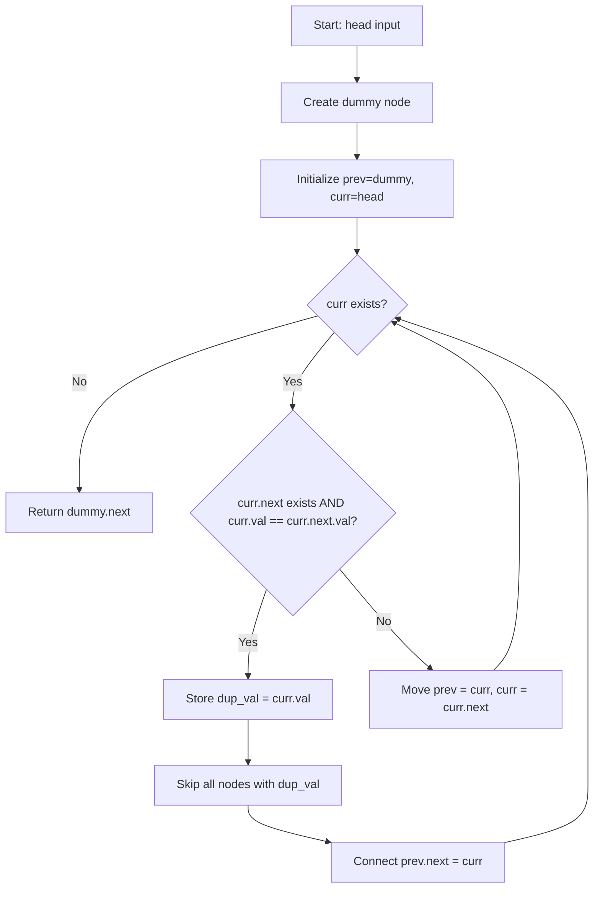
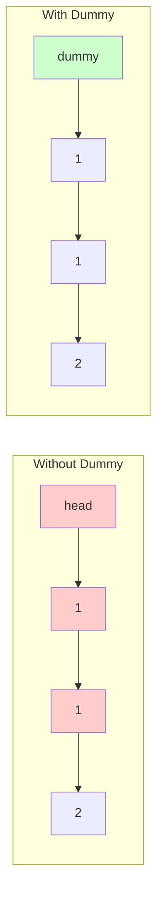
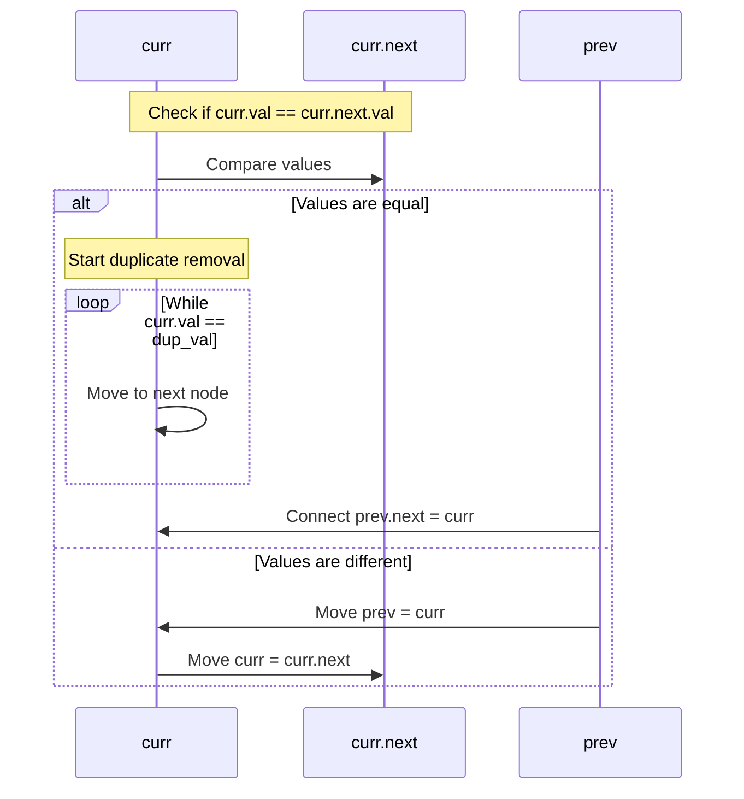
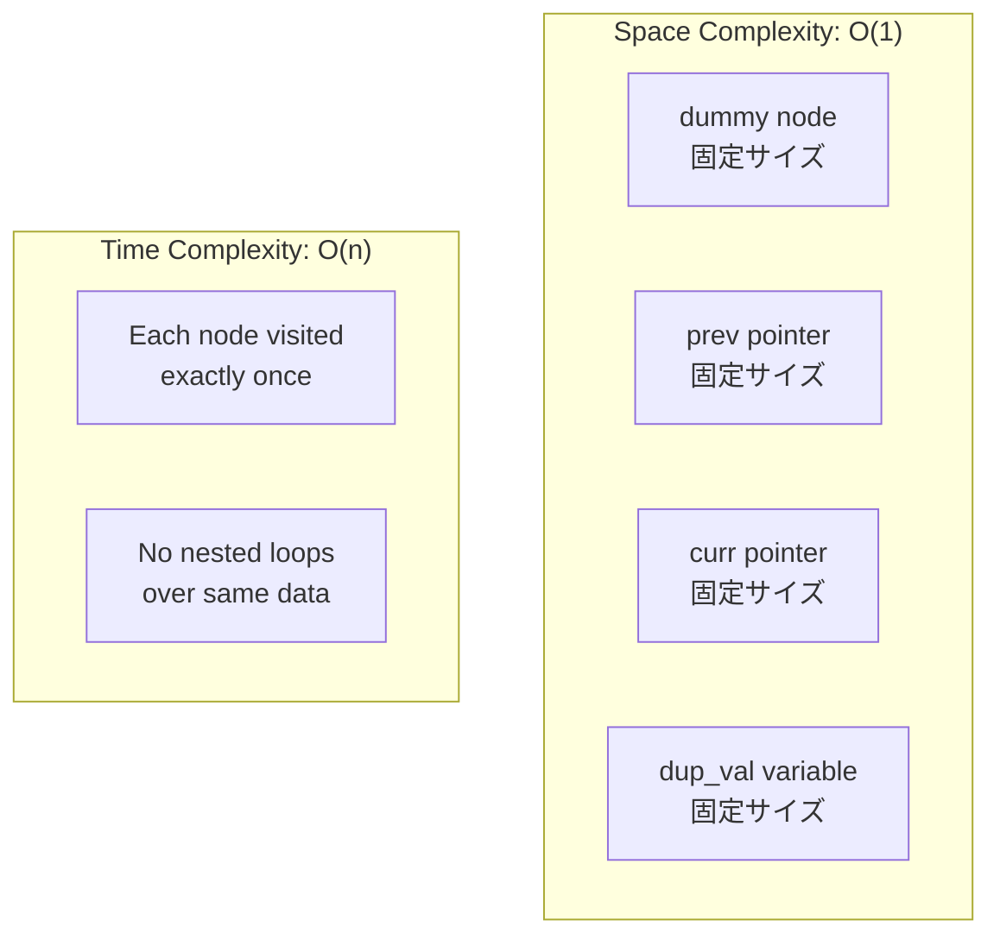
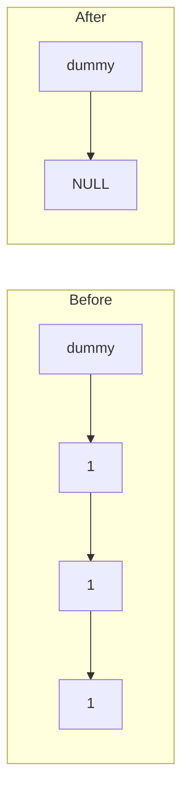

# Remove Duplicates from Sorted List II - 詳細解析

## 主な内容

1. **フローチャート**: アルゴリズム全体の処理フローを Mermaid で図示
2. **具体例での動作**: `[1,2,3,3,4,4,5]`の例を使って各ステップを詳細に図解
3. **処理ステップの詳細**: ダミーノード、重複検出、メモリ効率を図で説明
4. **エッジケース**: 空リスト、単一ノード、全重複のケースを図示
5. **競技版 vs 業務版の比較表**: 機能差を整理
6. **計算量解析**: Gantt チャートで時間計算量を可視化

## 特徴

- **日本語エラー対策**: Mermaid 図では英語のみ使用し、説明文は日本語
- **視覚的理解**: 各処理ステップを図で直感的に理解可能
- **実践的**: 実装時の注意点やポイントも記載
- **包括的**: 初学者から上級者まで参考になる内容

このマークダウンファイルをそのまま GitHub の README.md として使用できます。連結リストの重複削除アルゴリズムを学習する方にとって、理論と実装の両面から理解を深められる資料になっています。

## 🎯 問題概要

ソート済み連結リストから重複する要素をすべて削除し、一意な要素のみを残す問題です。

**重要な点**: 重複する要素は完全に削除する（1 個も残さない）

## 📊 アルゴリズムの全体フロー



## 🔍 具体例での動作解析

### Example 1: `[1,2,3,3,4,4,5]` → `[1,2,5]`

#### 初期状態

```text
dummy -> 1 -> 2 -> 3 -> 3 -> 4 -> 4 -> 5 -> NULL
prev     curr
```

#### Step 1: curr=1 (重複なし)

```text
dummy -> 1 -> 2 -> 3 -> 3 -> 4 -> 4 -> 5 -> NULL
         prev curr
```

#### Step 2: curr=2 (重複なし)

```text
dummy -> 1 -> 2 -> 3 -> 3 -> 4 -> 4 -> 5 -> NULL
              prev curr
```

#### Step 3: curr=3 (重複あり！)

```text
dummy -> 1 -> 2 -> 3 -> 3 -> 4 -> 4 -> 5 -> NULL
              prev curr
```

- `curr.val == curr.next.val` (3 == 3) なので重複処理開始
- `dup_val = 3` を保存
- 値が 3 のノードをすべてスキップ

#### Step 4: 重複削除後

```text
dummy -> 1 -> 2 -----> 4 -> 4 -> 5 -> NULL
              prev     curr
```

#### Step 5: curr=4 (重複あり！)

同様に 4 の重複を削除

#### 最終結果

```text
dummy -> 1 -> 2 -----> 5 -> NULL
```

## 🛠️ 主要な処理ステップの詳細

### 1. ダミーノードの活用



**ダミーノードの利点**:

- 先頭ノードが削除される場合でも統一的に処理可能
- `prev`ポインタの初期化が簡単

### 2. 重複検出と削除の仕組み



### 3. メモリ効率の分析



## 🎨 エッジケースの処理

### Case 1: 空のリスト

```python
Input: head = None
Output: None
# 即座にNoneを返す
```

### Case 2: 単一ノード

```python
Input: head = [1]
Output: [1]
# 重複の可能性がないため、そのまま返す
```

### Case 3: すべて重複

```python
Input: head = [1,1,1]
Output: []
# すべてのノードが削除される
```



## ⚡ 競技プログラミング版 vs 業務版の比較

| 項目             | 競技プログラミング版 | 業務開発版                |
| ---------------- | -------------------- | ------------------------- |
| **型チェック**   | なし                 | `isinstance()` でチェック |
| **例外処理**     | なし                 | `TypeError` を発生        |
| **入力検証**     | なし                 | `None` チェック           |
| **コードサイズ** | 小さい               | 大きい                    |
| **実行速度**     | 高速                 | やや低速                  |
| **保守性**       | 低い                 | 高い                      |

## 🧮 計算量の詳細分析

### 時間計算量: O(n)

```mermaid
gantt
    title Time Complexity Analysis
    dateFormat X
    axisFormat %s

    section Single Pass
    Visit each node once: 0, 1s
    No backtracking: 0, 1s
    Linear traversal: 0, 1s
```



### 空間計算量: O(1)

- 使用する追加変数は定数個
- 入力リストのサイズに依存しない
- インプレース操作（元のリストを直接変更）

## 🔧 実装のポイント

### 1. ポインタ操作の安全性

```python
# 安全なポインタアクセス
if curr.next and curr.val == curr.next.val:
    # curr.nextの存在確認を最初に行う
```

### 2. 重複削除の完全性

```python
# 同じ値のノードをすべてスキップ
while curr and curr.val == dup_val:
    curr = curr.next
```

### 3. 接続の更新

```python
# 重複ノードを飛ばして接続
prev.next = curr
```

## 🎯 まとめ

この実装は以下の特徴を持ちます：

1. **効率性**: O(n)時間、O(1)空間で動作
2. **堅牢性**: エッジケースに適切に対応
3. **可読性**: ダミーノード使用で論理が明確
4. **拡張性**: 業務用・競技用の 2 バリエーション

ソート済みリストの特性を活かし、一度の走査で重複を完全に除去する最適なアルゴリズムです。
