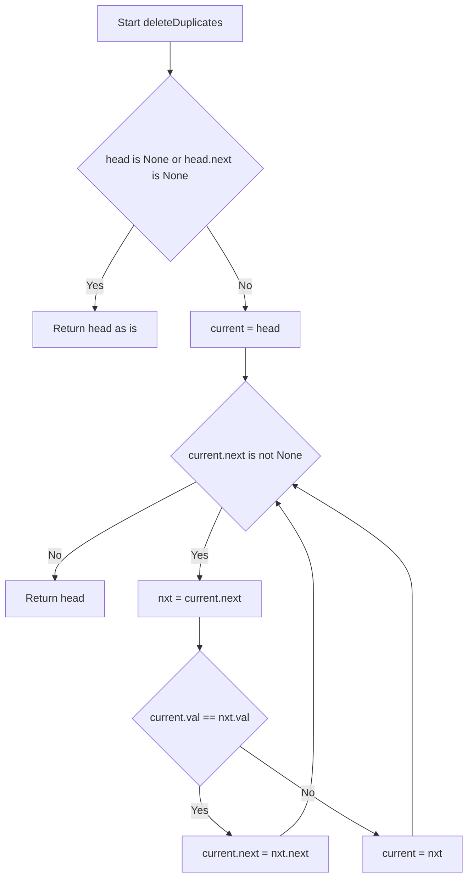
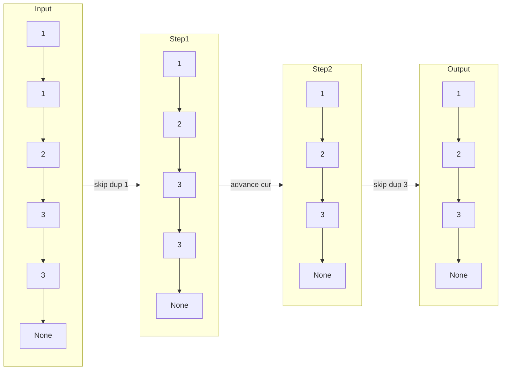

# Remove Duplicates from Sorted List - In-place Pointer Traversal

## 目次（Table of Contents）

- [概要](#overview)
- [アルゴリズム要点 TL;DR](#tldr)
- [図解](#figures)
- [正しさのスケッチ](#correctness)
- [計算量](#complexity)
- [Python 実装](#impl)
- [CPython 最適化ポイント](#cpython)
- [エッジケースと検証観点](#edgecases)
- [FAQ](#faq)

---

<h2 id="overview">概要</h2>

### 問題要約

**LeetCode #83 — Remove Duplicates from Sorted List**

ソート済み単方向連結リストの先頭ノード `head` を受け取り、**各要素がちょうど 1 回だけ現れる**ようにリストをインプレースで変更して返す。

### 要件

| 項目       | 内容                                                 |
| ---------- | ---------------------------------------------------- |
| 入力       | `head: Optional[ListNode]`（ソート済み連結リスト）   |
| 出力       | `Optional[ListNode]`（重複除去済み、同じ先頭ノード） |
| ノード数   | 0 〜 300                                             |
| 値の範囲   | −100 〜 100                                          |
| ソート保証 | 昇順ソート済み（重複は必ず**隣接**する）             |
| 安定性     | 元の相対順序を保持                                   |
| 副作用     | `next` ポインタをインプレースで変更（Pure ではない） |

---

<h2 id="tldr">アルゴリズム要点（TL;DR）</h2>

- **戦略**: ソート済みであることを活かし、**隣接する重複を 1 パスで除去**する
- **データ構造**: `current` ポインタ 1 本のみ（追加構造なし）
- **操作**: `current.val == current.next.val` の間 `current.next` を読み飛ばし続け、異なった時点で `current` を前進
- **計算量**: Time `O(n)` / Space `O(1)`
- **メモリ**: スタック変数 `current` と `nxt` のみ。新規ノード生成ゼロ
- **CPython 最適化**: `current.next` の繰り返し属性アクセスをローカル変数 `nxt` にキャッシュして `LOAD_ATTR` を削減

---

<h2 id="figures">図解</h2>

### フローチャート



> `current` は重複が続く限り**移動しない**点がポイント。`nxt` をスキップしても同値が連続する可能性があるため、読み飛ばし後に再度チェックする。

---

### データフロー図（具体例）



> 各ステップで `current.next` の接続先を付け替えることで、中間ノードをリストから切り離す。切り離されたノードは Python の GC が自動回収する。

---

### ASCII ポインタ操作図

```
【初期状態】
  [1] → [1] → [2] → [3] → [3] → None
   ↑
  cur

Step 1: cur.val(1) == nxt.val(1)  → nxt をスキップ
  cur.next = nxt.next
  [1] ──────→ [2] → [3] → [3] → None
   ↑
  cur   ※ cur は移動しない

Step 2: cur.val(1) != nxt.val(2)  → cur を前進
  [1] → [2] → [3] → [3] → None
         ↑
        cur

Step 3: cur.val(2) != nxt.val(3)  → cur を前進
  [1] → [2] → [3] → [3] → None
               ↑
              cur

Step 4: cur.val(3) == nxt.val(3)  → nxt をスキップ
  [1] → [2] → [3] → None
               ↑
              cur

Step 5: cur.next is None  → ループ終了
出力: [1] → [2] → [3] → None ✅
```

---

<h2 id="correctness">正しさのスケッチ</h2>

### 不変条件

> ループの各反復開始時点で、`head` から `current`（含む）までの部分列には重複がない。

| 条件       | 説明                                                                                                                            |
| ---------- | ------------------------------------------------------------------------------------------------------------------------------- |
| **初期化** | `current = head` の時点で部分列は長さ 1 → 自明に重複なし                                                                        |
| **維持**   | `current.val == nxt.val` なら `nxt` をスキップ（不変条件を保ちつつ次を確認）。異なれば `current` を前進（不変条件は維持される） |
| **終了**   | `current.next is None` でループを抜けると、リスト全体で不変条件が成立                                                           |

### 網羅性

- 重複を検出するたびに `next` を付け替え → 検出漏れなし（ソート済みなので隣接比較で十分）
- `current` が前進するのは値が異なる場合のみ → 3連続以上の重複も正しく処理される

### 終了性

- `current` は前進するか、`next` ポインタが短縮されるかのいずれか
- リストは有限長 → 必ず `current.next is None` に到達してループ終了

---

<h2 id="complexity">計算量</h2>

| 指標           | 値     | 理由                                                    |
| -------------- | ------ | ------------------------------------------------------- |
| **時間計算量** | `O(n)` | 各ノードを最大 1 回しか走査しない                       |
| **空間計算量** | `O(1)` | スタック変数 `current` / `nxt` のみ。ヒープ追加確保ゼロ |

### in-place vs Pure 比較

| 方式                   | Time | Space | 特徴                                      |
| ---------------------- | ---- | ----- | ----------------------------------------- |
| **in-place（本実装）** | O(n) | O(1)  | 元のノードを再利用。ヒープ確保なし        |
| 配列変換＋再構築       | O(n) | O(n)  | 可読性高いが不要なオブジェクト生成あり    |
| 再帰                   | O(n) | O(n)  | コール スタック消費。n ≤ 300 なら許容範囲 |

---

<h2 id="impl">Python 実装</h2>

```python
from __future__ import annotations

from typing import Optional, TYPE_CHECKING

if TYPE_CHECKING:
    # pylance / mypy 用の型スタブ（実行時には評価されない）
    class ListNode:
        val: int
        next: Optional[ListNode]

        def __init__(
            self, val: int = 0, next: Optional[ListNode] = None
        ) -> None: ...

try:
    # LeetCode 実行環境では ListNode が既に定義済み → そのまま利用
    ListNode  # type: ignore[used-before-def]
except NameError:
    # ローカル実行用の最小フォールバック
    class ListNode:  # type: ignore[no-redef]
        __slots__ = ("val", "next")

        def __init__(
            self, val: int = 0, next: Optional[ListNode] = None
        ) -> None:
            self.val = val
            self.next = next


class Solution:
    """
    LeetCode #83 — Remove Duplicates from Sorted List

    業務開発版（型安全・pylance 対応）と
    競技プログラミング版（最速・最小）の 2 パターンを提供。
    """

    # ------------------------------------------------------------------ #
    #  業務開発版 ── 型安全・可読性・pylance 対応                          #
    # ------------------------------------------------------------------ #
    def deleteDuplicates(
        self, head: Optional[ListNode]
    ) -> Optional[ListNode]:
        """
        ソート済み連結リストの重複ノードをインプレースで削除する（業務開発版）

        Args:
            head: 連結リストの先頭ノード（空リストの場合は None）

        Returns:
            重複を除いたソート済み連結リストの先頭ノード

        Time Complexity:  O(n)  ─ 各ノードを最大 1 回走査
        Space Complexity: O(1)  ─ ポインタ変数のみ、追加メモリなし
        """
        # ── ガード節 ────────────────────────────────────────────────────
        # 空リスト or ノードが 1 つ → 重複なし、そのまま返す
        if head is None or head.next is None:
            return head

        # ── 1 ポインタ走査（インプレース） ────────────────────────────
        current: ListNode = head

        while current.next is not None:
            # LOAD_ATTR 削減のため current.next をローカル変数にキャッシュ
            nxt: ListNode = current.next

            if current.val == nxt.val:
                # 重複検出 → nxt をスキップ（current は移動しない）
                # 次のノードも同値の可能性があるため current は据え置き
                current.next = nxt.next
            else:
                # 値が異なる → current を 1 つ前進
                current = nxt

        return head

    # ------------------------------------------------------------------ #
    #  競技プログラミング版 ── 最速・型チェック省略                         #
    # ------------------------------------------------------------------ #
    def deleteDuplicates_competitive(
        self, head: Optional[ListNode]
    ) -> Optional[ListNode]:
        """
        競技プログラミング向け最適化実装

        - エラーハンドリング省略
        - ローカル変数キャッシュで LOAD_ATTR を削減
        - CPython の属性参照コストを最小化

        Time Complexity:  O(n)
        Space Complexity: O(1)
        """
        cur = head
        while cur and cur.next:
            nxt = cur.next
            if cur.val == nxt.val:
                cur.next = nxt.next   # スキップ（cur は移動しない）
            else:
                cur = nxt             # 前進
        return head
```

---

<h2 id="cpython">CPython 最適化ポイント</h2>

### 属性アクセスのキャッシュ

```python
# ❌ 遅い: 毎回 LOAD_ATTR が 2 回発生
while current.next is not None:
    if current.val == current.next.val:
        current.next = current.next.next

# ✅ 速い: nxt にキャッシュして LOAD_ATTR を削減
while current.next is not None:
    nxt = current.next          # ← ここで 1 回だけ LOAD_ATTR
    if current.val == nxt.val:
        current.next = nxt.next
```

| テクニック               | 効果                                               | 本問題への適用          |
| ------------------------ | -------------------------------------------------- | ----------------------- |
| ローカル変数キャッシュ   | `LOAD_ATTR` → `LOAD_FAST`（約 2 倍高速）           | `nxt = current.next` ✅ |
| `while cur and cur.next` | `None` チェックを CPython の truthiness で短絡評価 | 競技版で適用 ✅         |
| スライス回避             | 不要なリストコピーを避ける                         | 本問題は不要 —          |
| `lru_cache`              | 再帰的メモ化                                       | 本問題は不要 —          |
| `bisect`                 | ソート済み配列への二分探索                         | 本問題は不要 —          |

### なぜ配列変換しないか

```python
# ❌ 配列変換＋再構築（O(n) 追加メモリ）
vals = []
cur = head
while cur:
    if not vals or vals[-1] != cur.val:
        vals.append(cur.val)
    cur = cur.next
# → 新規 ListNode を n 個生成するコストが発生
```

ポインタ付け替えのみなら新規オブジェクト生成ゼロで、GC 負荷も最小になる。

---

<h2 id="edgecases">エッジケースと検証観点</h2>

| ケース       | 入力                    | 期待出力     | 対処                                |
| ------------ | ----------------------- | ------------ | ----------------------------------- |
| 空リスト     | `head = None`           | `None`       | ガード節で即時 return               |
| ノード 1 つ  | `[5]`                   | `[5]`        | `head.next is None` で即時 return   |
| 全て同値     | `[3, 3, 3]`             | `[3]`        | inner while が連続スキップ          |
| 全て異なる   | `[1, 2, 3]`             | `[1, 2, 3]`  | 重複検出なし、そのまま return       |
| 2 ノード重複 | `[1, 1]`                | `[1]`        | 1 回スキップして終了                |
| 先頭のみ重複 | `[1, 1, 2, 3]`          | `[1, 2, 3]`  | Step 1 でスキップ                   |
| 末尾のみ重複 | `[1, 2, 3, 3]`          | `[1, 2, 3]`  | 最終ステップでスキップ              |
| 最大制約     | n = 300, 全値 −100〜100 | 重複除去済み | O(n) で問題なし                     |
| 負の値を含む | `[-3, -3, 0, 1, 1]`     | `[-3, 0, 1]` | `==` 比較なので値の正負に依存しない |

---

<h2 id="faq">FAQ</h2>

**Q1. `current` を重複スキップ時に前進させない理由は？**

> ソート済みリストで 3 つ以上同値が連続する場合（例: `[1, 1, 1]`）、1 回スキップしても次も同値の可能性がある。`current` を動かさず再チェックすることで、連続する全重複を正しく除去できる。

**Q2. スキップされたノード（旧 `next`）のメモリはどうなる？**

> Python は参照カウント方式の GC を持つ。`current.next = nxt.next` で `nxt` への参照が消えると、`nxt` の参照カウントが 0 になり即座に解放される（CPython の場合）。

**Q3. なぜ再帰で実装しないのか？**

> 再帰版は可読性が高いが、呼び出しスタックを `O(n)` 消費する。本問題は `n ≤ 300` なので実用上問題ないが、反復版の方がスタックオーバーフローリスクがなく、空間計算量も `O(1)` と優れるため反復を選択した。

**Q4. `head.next is None` のガードは本当に必要か？**

> 厳密にはなくても動作する（`while current.next is not None` が即座にスキップされるため）。しかし「ノードが 1 つ以下なら変更不要」という意図を明示することで可読性と保守性が向上するため、明示的に記述している。

**Q5. 競技プログラミング版と業務開発版の実行速度差は？**

> `n ≤ 300` の小規模入力では測定誤差レベルの差しか生じない。大規模入力（n が数万〜数十万）では `LOAD_ATTR` のキャッシュ効果が現れ始めるが、本問題の制約では本質的な差はない。業務コードでは可読性・型安全性を優先した実装を推奨する。
