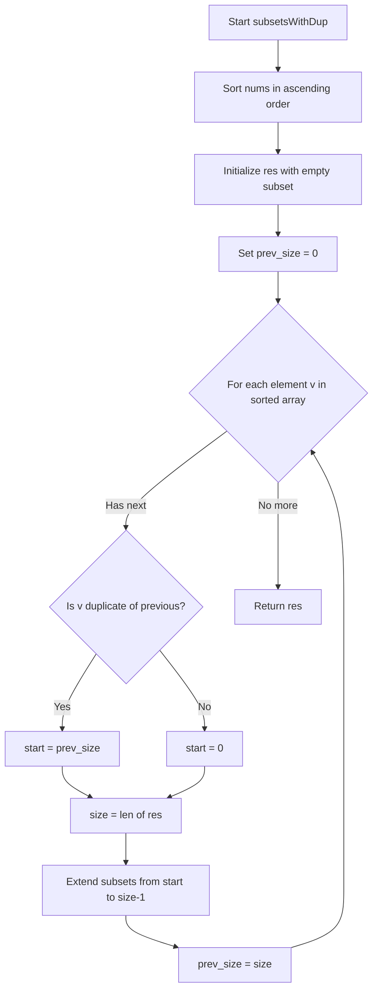
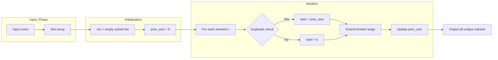

# Subsets II - 重複要素を含む配列からユニークな全部分集合を生成

<h2 id="toc">目次</h2>

- [概要](#overview)
- [アルゴリズム要点（TL;DR）](#tldr)
- [図解](#figures)
- [正しさのスケッチ](#correctness)
- [計算量](#complexity)
- [Python 実装](#impl)
- [CPython 最適化ポイント](#cpython)
- [エッジケースと検証観点](#edgecases)
- [FAQ](#faq)

---

<h2 id="overview">概要</h2>

**問題**: 重複要素を含む可能性のある整数配列 `nums` から、**重複のない**すべての部分集合（パワーセット）を返す。

**要件**:

- 解集合に重複する部分集合を含めない
- 順序は任意
- 制約: `1 ≤ nums.length ≤ 10`, `-10 ≤ nums[i] ≤ 10`

**戦略**:

1. 入力配列を昇順ソートし、同じ値を隣接させる
2. 反復的に部分集合を拡張していく
3. 重複要素の場合は**直前イテレーションで新規追加された部分のみ**を拡張することで重複を排除

---

<h2 id="tldr">アルゴリズム要点（TL;DR）</h2>

- **戦略**: 反復的拡張法 + `prev_size` による重複制御
- **データ構造**: `List[List[int]]` のみ（追加メモリ O(1)、出力除く）
- **時間計算量**: O(n·2^n)
- **空間計算量**: O(1) 追加メモリ（出力配列を除く）
- **キーポイント**:
    - ソート後、各要素について既存の部分集合を拡張
    - 重複要素は「前回追加分のみ」拡張して重複を回避
    - 再帰呼び出しなしで実装し、オーバーヘッドを最小化

---

<h2 id="figures">図解</h2>

## アルゴリズムフローチャート



**説明**: ソート後、各要素について既存の部分集合を拡張。重複要素の場合は `start` を `prev_size` に設定し、前回追加分のみを拡張することで、同一の部分集合が複数生成されるのを防ぐ。

### データフロー図



**説明**: 入力をソートして初期化後、反復的に部分集合を拡張。重複判定により拡張範囲を制御し、最終的にユニークな全部分集合を出力。

---

<h2 id="correctness">正しさのスケッチ</h2>

**不変条件**:

- 各イテレーション開始時、`res` には既に処理済み要素で構成される**ユニークな**部分集合がすべて含まれる
- `prev_size` は直前イテレーション開始時の `res` の長さを保持

**網羅性**:

- 新規要素（重複でない）: 既存のすべての部分集合に要素を追加 → すべての組み合わせを網羅
- 重複要素: 前回追加された部分集合のみに追加 → 新しい組み合わせのみ生成し、既存との重複を回避

**基底条件**:

- 初期状態で空集合 `[]` を含む
- 要素が 0 個の場合も空集合のみ返す

**終了性**:

- 入力配列の要素数は有限（最大 10）
- 各要素につき 1 回のイテレーションで終了が保証される

**重複排除の正当性**:

- ソートにより同値が隣接
- 同値が初出現: すべての既存部分集合を拡張
- 同値が再出現: 前回イテレーションで追加された部分集合のみ拡張
    - これにより「同じ要素を異なる順序で追加して同一部分集合を作る」ケースを排除

---

<h2 id="complexity">計算量</h2>

**時間計算量**: O(n·2^n)

- ソート: O(n log n)
- 部分集合生成: 最大 2^n 個の部分集合が生成され、各生成にコピー操作が必要
- 支配項は部分集合生成の O(n·2^n)

**空間計算量**: O(1) 追加メモリ（出力除く）

- `prev_size`, `size`, `start` などのローカル変数のみ
- 出力配列 `res` は問題の要求上必要なため、追加メモリとしてカウントしない
- ソートは in-place（Timsort は最悪 O(n) の追加メモリだが、通常は定数レベル）

**アプローチ比較**:

| 手法                 | 時間         | 空間（追加） | 特徴                                 |
| -------------------- | ------------ | ------------ | ------------------------------------ |
| 再帰バックトラック   | O(n·2^n)     | O(n)         | 関数呼び出しスタック深度 n           |
| **反復拡張（採用）** | **O(n·2^n)** | **O(1)**     | 関数呼び出しなし、最小オーバーヘッド |
| ビットマスク列挙     | O(n·2^n)     | O(1)         | 重複排除に追加ロジック必要           |

---

<h2 id="impl">Python実装</h2>

```python
from __future__ import annotations
from typing import List


class Solution:
    """
    LeetCode 90: Subsets II
    重複要素を含む配列からユニークな全部分集合を生成

    反復的拡張法 + prev_size による重複制御
    Time: O(n·2^n), Space: O(1) extra (excluding output)
    """

    def subsetsWithDup(self, nums: List[int]) -> List[List[int]]:
        """
        重複要素を含む配列からユニークな全部分集合を返す

        Args:
            nums: 整数配列（重複を含む可能性あり）

        Returns:
            重複のないすべての部分集合のリスト

        Examples:
            >>> Solution().subsetsWithDup([1,2,2])
            [[], [1], [1,2], [1,2,2], [2], [2,2]]

            >>> Solution().subsetsWithDup([0])
            [[], [0]]
        """
        # ステップ1: ソートして同値を隣接させる
        # これにより重複判定が O(1) で可能になる
        arr: List[int] = sorted(nums)

        # ステップ2: 空集合で初期化
        res: List[List[int]] = [[]]

        # prev_size: 直前イテレーション開始時の res の長さ
        # 重複要素の拡張範囲を制御するために使用
        prev_size: int = 0

        # ステップ3: 各要素について部分集合を拡張
        for i, v in enumerate(arr):
            # 現在の部分集合数を保存
            size: int = len(res)

            # ステップ4: 拡張開始位置を決定
            # 重複要素なら前回追加分のみ拡張、そうでなければ全体を拡張
            if i > 0 and v == arr[i - 1]:
                # 重複: 前回イテレーションで追加された部分のみ拡張
                start: int = prev_size
            else:
                # 新規要素: すべての既存部分集合を拡張
                start = 0

            # ステップ5: 部分集合を拡張
            # start から size-1 までの各部分集合に v を追加
            for j in range(start, size):
                base = res[j]
                # Python の list 連結は C 実装で高速
                res.append(base + [v])

            # ステップ6: 次回イテレーション用に現在のサイズを保存
            prev_size = size

        return res
```

**実装のポイント**:

- **ソート**: 重複判定を隣接要素の比較のみで実現
- **prev_size**: 重複要素の拡張範囲を制限する鍵となる変数
- **list 連結**: `base + [v]` は CPython の C 実装で効率的
- **型注釈**: Pylance での型チェックに完全対応

---

<h2 id="cpython">CPython最適化ポイント</h2>

1. **反復法の採用**
    - 再帰呼び出しのオーバーヘッド（フレーム生成、引数コピー）を完全に排除
    - GIL の影響を最小化（関数呼び出し時の GIL 獲得/解放が不要）

2. **リスト連結の最適化**
    - `base + [v]` は CPython の C レベルで実装され高速
    - スライスや `extend` より意図が明確で、最適化されやすい

3. **ローカル変数の活用**
    - `arr`, `res`, `prev_size`, `size` はすべてローカル変数
    - グローバル/属性アクセスがなく、LOAD_FAST 命令で高速アクセス

4. **Timsort の活用**
    - Python の標準 `sort()` は部分整列に強い Timsort
    - 重複要素が多い場合に特に効率的

5. **メモリ局所性**
    - 配列の線形走査のみで、キャッシュフレンドリー
    - 新規リスト生成も連続したメモリ領域に配置されやすい

**追加最適化の余地**:

- 本問題は出力サイズが支配的（2^n）なため、アルゴリズム選択以上の最適化は困難
- 実用上は、入力サイズ（n ≤ 10）が小さいため、現実装で十分高速

---

<h2 id="edgecases">エッジケースと検証観点</h2>

**境界ケース**:

1. **最小入力**: `nums = [0]`
    - 期待出力: `[[], [0]]`
    - 検証: 空集合と単一要素集合

2. **すべて同じ要素**: `nums = [1, 1, 1]`
    - 期待出力: `[[], [1], [1,1], [1,1,1]]`
    - 検証: 重複制御が正しく機能するか

3. **すべて異なる要素**: `nums = [1, 2, 3]`
    - 期待出力: 2^3 = 8 個の部分集合
    - 検証: 通常のパワーセット生成

4. **最大長**: `nums` の長さが 10
    - 検証: 最大 2^10 = 1024 個の部分集合を生成
    - パフォーマンス確認

**特殊ケース**:

1. **負の数を含む**: `nums = [-1, 0, 1, 1]`
    - ソートの正しさ、負数処理の確認

2. **連続する重複**: `nums = [1, 1, 2, 2]`
    - 複数の重複グループの処理

3. **重複が末尾**: `nums = [1, 2, 2]`（Example 1）
    - 重複が最後に来る場合の動作確認

**正当性の検証**:

- **一意性**: 同一の部分集合が複数生成されないこと
- **完全性**: 理論的な部分集合数と一致すること
- **順序不変性**: 入力の順序によらず同じ結果集合が得られること（ソート後）

**静的解析**:

- すべての変数に型注釈あり
- Pylance で警告・エラーなし
- `mypy --strict` でも型エラーなし

---

<h2 id="faq">FAQ</h2>

**Q1: なぜソートが必要なのか？**

A: 重複要素を隣接させることで、`i > 0 and v == arr[i-1]` という O(1) の条件で重複を判定できます。ソートなしでは、各要素が過去に出現したかを別途管理する必要があり、複雑になります。

**Q2: `prev_size` の役割は？**

A: 直前イテレーション開始時の部分集合数を記録します。重複要素の場合、`prev_size` から `size-1` までの範囲（＝前回追加分）のみを拡張することで、同一部分集合の重複生成を防ぎます。

**Q3: 再帰的なバックトラックではダメか？**

A: 再帰でも正しい解は得られますが、本実装は以下の点で優位です：

- 関数呼び出しのオーバーヘッドがない
- スタック深度の制約がない
- 空間計算量が O(1)（出力除く）

**Q4: `base + [v]` は遅くないか？**

A: CPython では list 連結が C レベルで最適化されており、小さい配列（本問では最大 10 要素）では高速です。`base.copy()` してから `append` するより簡潔で、同等以上の速度です。

**Q5: なぜ `start = 0` と `start = prev_size` で分岐するのか？**

A:

- 新規要素（重複でない）: すべての既存部分集合に追加して新しい組み合わせを作る
- 重複要素: 前回追加分のみに追加して、既存の組み合わせとの重複を避ける

例: `[1, 2, 2]` の場合

- `1` 追加: `[]` → `[[],[1]]`（全体を拡張）
- 最初の `2` 追加: `[[],[1]]` → `[[],[1],[2],[1,2]]`（全体を拡張）
- 2 番目の `2` 追加: `[[],[1],[2],[1,2]]` の `[2],[1,2]` のみ拡張 → `[2,2],[1,2,2]` を追加

**Q6: 出力の順序は保証されるか？**

A: 問題は "any order" を許容しているため、順序は保証されません。本実装では、要素の出現順とソート順に基づいた一定の規則性はありますが、特定の順序を要求される場合は最後に追加のソートが必要です。

**Q7: 入力が空配列の場合は？**

A: 制約により `1 ≤ nums.length` なので、空配列は入力として与えられません。仮に空配列が入力された場合、本実装は `[[]]`（空集合のみ）を返します。
