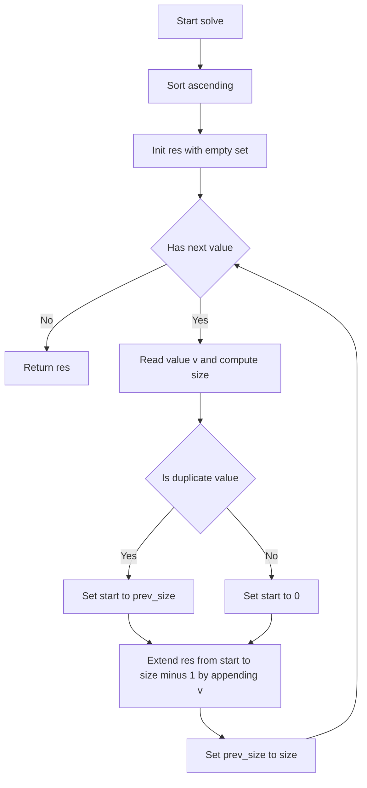
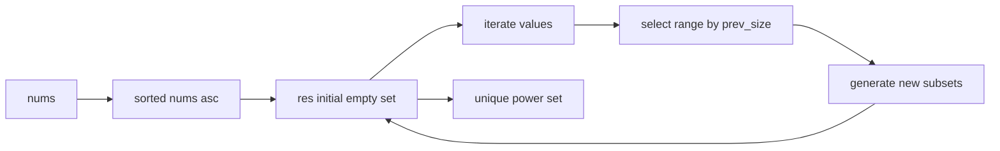

# Subsets II - 重複排除で作るパワーセットの最短手順

## Table of Contents

- [概要](#overview)
- [アルゴリズム要点 TLDR](#tldr)
- [図解](#figures)
- [正しさのスケッチ](#correctness)
- [計算量](#complexity)
- [Python 実装](#impl)
- [CPython 最適化ポイント](#cpython)
- [エッジケースと検証観点](#edgecases)
- [FAQ](#faq)

<h2 id="overview">概要</h2>

- **問題**: 整数配列 `nums`（重複可）から **重複しない** 全ての部分集合（パワーセット）を列挙する。順序は任意。
- **要件**:

  - 出力集合に重複を含めないこと。
  - 制約: `1 <= len(nums) <= 10`, `-10 <= nums[i] <= 10`。

- **核心**: 先に `nums` を **昇順ソート**し、各値の処理で **直前イテレーションで増えた部分集合のみ** を拡張することで、同値による重複生成を抑止する。

<h2 id="tldr">アルゴリズム要点（TL;DR）</h2>

- **戦略**: ソート → 反復生成（拡張区間を `prev_size` で限定）
- **データ構造**: `List[List[int]]` を 1 本（`res`）。各ステップで `res` の末尾に新集合を追加。
- **重複制御**:

  - 異なる値: `start = 0`（全範囲を拡張）
  - 同じ値: `start = prev_size`（直前に新規追加された範囲のみ拡張）

- **計算量**: Time `O(n·2^n)`、Space `O(1)` 追加（出力を除く）
- **実装**: 再帰なし・単純 for ループのみで速くて読みやすい。

<h2 id="figures">図解</h2>

## **フローチャート**



_説明_: 配列をソートし、各値 `v` の処理では **拡張開始位置 `start`** を「同値なら `prev_size`、異なるなら `0`」に設定してから `res` を拡張する。

## **データフロー図**



_説明_: 入力をソートしてから `prev_size` を鍵に拡張範囲を選び、新しい部分集合を生成するループで結果を完成させる。

<h2 id="correctness">正しさのスケッチ</h2>

- **不変条件**:

  - `res` は常に入力の先頭 `i` 個の要素から作れる **全てのユニーク部分集合**を保持する。

- **基底条件**:

  - 初期値 `res = [[]]` は空集合のみで正しい。

- **帰納ステップ**:

  - 次の値 `v` が **新規の値**なら、既存の全部分集合に `v` を付ける拡張で全網羅となる。
  - `v` が **重複の値**なら、直前の値の処理で新しく増えた部分集合にだけ `v` を付けることで、`v` の重複による **同一集合の多重生成を防止**しつつ、網羅性を維持する。

- **終了性**:

  - `i` は配列長まで単調増加し、有限回で終了。

<h2 id="complexity">計算量</h2>

- **時間計算量**: `O(n·2^n)`
  各要素で既存集合の一部を拡張し、最終的な集合数は高々 `2^n`。
- **空間計算量**: `O(1)` 追加（出力を除く）
  作業用の補助領域は定数。出力サイズは不可避に `Θ(2^n)`。

<h2 id="impl">Python 実装</h2>

```python
from __future__ import annotations
from typing import List

class Solution:
    """
    Subsets II: 重複要素を含む配列から重複なしの全部分集合を列挙する
    反復・拡張区間限定（prev_size）方式
    Time: O(n·2^n), Space: O(1) extra (excluding output)
    """

    def subsetsWithDup(self, nums: List[int]) -> List[List[int]]:
        """
        Args:
            nums: 整数配列（重複可）

        Returns:
            すべてのユニークな部分集合（順不同）

        実装メモ:
            - まず昇順ソートで同値を隣接
            - 直前イテレーション開始時の res 長さを prev_size に保持
            - 同値のときは start=prev_size、異なるときは start=0 から拡張
        """
        arr: List[int] = sorted(nums)
        res: List[List[int]] = [[]]

        # 直前イテレーション開始時点での res の長さ
        prev_size: int = 0

        for i, v in enumerate(arr):
            size: int = len(res)
            # 重複値なら直前に増えた領域のみ拡張、非重複なら全域拡張
            start: int = prev_size if i > 0 and v == arr[i - 1] else 0

            # start..size-1 の各 subset に v を追加して末尾に積む
            for j in range(start, size):
                base = res[j]
                # base は再利用し、新しい配列を生成（pure）
                res.append(base + [v])

            # 次のループのために今回開始時点の長さを保存
            prev_size = size

        return res
```

- **Pure**: 引数は変更せず、新しいリストのみを作る。
- **pylance 対応**: `List[int]` / `List[List[int]]` で明確に型注釈。

<h2 id="cpython">CPython最適化ポイント</h2>

- **再帰を使わない反復**: 関数呼び出し・スタックオーバーヘッドを排除。
- **`base + [v]` の利用**: C 実装のリスト連結で簡潔かつ高速。
- **ローカル変数束縛**: `arr`, `res`, `prev_size`, `size`, `start` をローカルで参照し属性アクセスを減らす。
- **ソートの恩恵**: Timsort により部分整列や小規模入力に強い。

<h2 id="edgecases">エッジケースと検証観点</h2>

- **単一要素**: `[0]` → `[[], [0]]`
- **全要素同一**: `[2,2,2]` → `[[], [2], [2,2], [2,2,2]]`
- **重複混在**: `[1,2,2]` → `[[], [1], [1,2], [1,2,2], [2], [2,2]]`
- **負数を含む**: `[-1,-1,2]` → 符号に依存せず正しく重複排除
- **境界長**: `n=10` で `2^10=1024` 個の出力を確認

<h2 id="faq">FAQ</h2>

- **Q. ソートは必須ですか**
  A. はい。ソートで同値を隣接させることで、重複判定を局所化し、重複生成を一切せずに網羅できます。

- **Q. 再帰バックトラックとの違いは**
  A. 正しさは等価です。ここでは再帰のオーバーヘッドを避け、`prev_size` による範囲拡張で安定高速化しています。

- **Q. 出力順は固定ですか**
  A. 要件は順不同です。この実装は自然な生成順になりますが、順序要件はありません。
