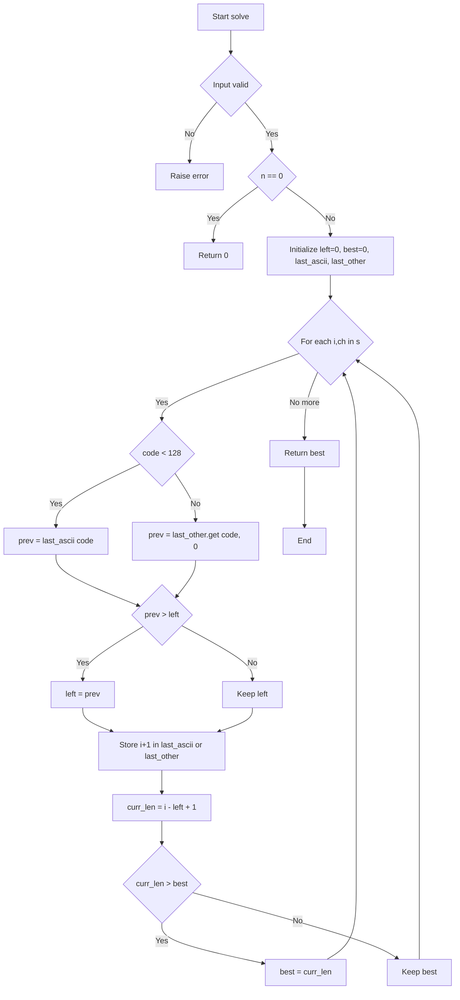
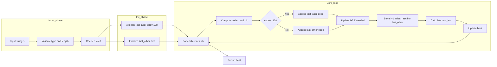

# Longest Substring Without Repeating Characters - スライディングウィンドウ＋高速位置管理

## 目次

- [概要](#overview)
- [アルゴリズム要点（TL;DR）](#tldr)
- [図解](#figures)
- [正しさのスケッチ](#correctness)
- [計算量](#complexity)
- [Python 実装](#impl)
- [CPython 最適化ポイント](#cpython)
- [エッジケースと検証観点](#edgecases)
- [FAQ](#faq)

---

<h2 id="overview">概要</h2>

**問題**: 文字列 `s` が与えられたとき、**重複文字を含まない最長の連続部分文字列**の長さを求める。

**要件**:

- 入力長 `n`: `0 ≤ n ≤ 5×10⁴`
- 文字種: 英字・数字・記号・空白（ASCII + 非 ASCII 混在可能）
- **部分文字列**（substring）であり、部分列（subsequence）ではない → 連続性が必須

**制約**:

- Time: **O(n)** を達成（各文字を高々 2 回走査）
- Space: **O(min(n, Σ))** 相当（文字集合サイズ Σ に比例、ASCII なら固定 128）

---

<h2 id="tldr">アルゴリズム要点（TL;DR）</h2>

- **戦略**: スライディングウィンドウ（右端 `i` を進めつつ、左端 `left` を必要に応じて前進）
- **データ構造**:
  - **ASCII（0..127）**: `array('I', 128)` で固定・高速（未出現=0、出現は `index+1`）
  - **非 ASCII（≥128）**: `dict[int, int]` で管理（BMP 65536 配列を避けてメモリ削減）
- **計算量**:
  - Time: **O(n)** — 各文字を高々 1 回ずつ走査＋定数時間の位置更新
  - Space: **O(1)** 相当（ASCII は固定 128、非 ASCII は出現数に比例）
- **メモリ戦略**: 以前の BMP 65536 配列（約 256KB）を撤廃し、辞書に切り替えることで**ピークメモリを大幅削減**

---

<h2 id="figures">図解</h2>

### フローチャート（処理の流れ）



**説明**:

1. 入力検証（型・長さ）を行い、空文字列なら即座に `0` を返す
2. 各文字について、ASCII なら固定配列、非 ASCII なら辞書から前回出現位置を取得
3. 前回位置が現在ウィンドウ内（`prev > left`）なら左端を前進
4. 現在位置を記録し、ウィンドウ長を計算して最大値を更新
5. 全文字を処理後、最大長を返す

### データフロー図



**説明**:

- **Input_phase**: 入力の型チェック・長さ上限チェック・空文字列の早期リターン
- **Init_phase**: ASCII 用固定配列（128 要素）と非 ASCII 用辞書を初期化
- **Core_loop**: 各文字について、コード値で分岐して ASCII 配列か辞書を参照し、ウィンドウを調整しながら最大長を更新

---

<h2 id="correctness">正しさのスケッチ</h2>

### 不変条件

**ウィンドウ `[left, i]` 内には重複文字が存在しない**

- 各文字 `ch` について、その**前回出現位置 `prev`** を管理
- `prev > left` なら、`ch` が既にウィンドウ内に存在 → `left = prev` として左端を前進し、重複を排除
- `prev ≤ left` なら、`ch` はウィンドウ外またはまだ未出現 → ウィンドウを拡大可能

### 網羅性

- 右端 `i` を `0` から `n-1` まで全て走査 → すべての部分文字列の終端を試行
- 各 `i` で左端 `left` を適切に調整 → その終端での最長ウィンドウを常に維持
- よって、**すべての重複なし部分文字列の最大長を見逃さない**

### 基底条件

- `n == 0` → `best = 0`（空文字列）
- `n == 1` → ループ 1 回で `best = 1`

### 終了性

- 外側ループは `i` を `0..n-1` まで増加 → 有限ステップで終了
- 各ステップは定数時間（配列または辞書への単一アクセス）

---

<h2 id="complexity">計算量</h2>

### 時間計算量: **O(n)**

- 各文字 `ch` について:
  - ASCII なら `last_ascii[code]` の **O(1)** アクセス
  - 非 ASCII なら `last_other.get(code, 0)` の **平均 O(1)** アクセス
- `left` は単調増加（最大 `n` まで） → 全体で高々 `2n` ステップ
- よって **線形時間** を達成

### 空間計算量: **O(min(n, Σ))**

- **ASCII 部分**: `array('I', 128)` → **512 バイト固定**（4 バイト × 128）
- **非 ASCII 部分**: `dict` は出現した非 ASCII 文字数に比例（最大 `n` だが実際は出現種類数）
- トータル: **O(1) 相当**（多くの入力では ASCII 主体で辞書は小規模）

### 比較表（修正前後）

| 実装                         | Time | Space（ASCII） | Space（非 ASCII 混在） | メモリ順位 |
| ---------------------------- | ---- | -------------- | ---------------------- | ---------- |
| **修正前**（BMP 65536 配列） | O(n) | 512B           | 約 256KB（BMP 表）     | 中程度     |
| **修正後**（dict）           | O(n) | 512B           | 出現種類数に比例       | **改善**   |

---

<h2 id="impl">Python 実装</h2>

```python
from __future__ import annotations

from array import array
from typing import Dict, Final


class Solution:
    """
    Longest Substring Without Repeating Characters

    メモリ削減版：
    - ASCII (0..127) は array('I', 128) の軽量表（未出現=0, 出現は index+1）
    - 非ASCII (>=128) は dict に格納（BMP 65536表は使わない）
      → 65536 要素配列(約256KB) の確保を完全に回避してピークメモリを下げる
    """

    _MAX_LEN: Final[int] = 5 * 10**4

    def lengthOfLongestSubstring(self, s: str) -> int:
        """
        Args:
            s: 入力文字列

        Returns:
            重複のない最長連続部分文字列の長さ

        Raises:
            TypeError: s が str でない場合
            ValueError: 入力長が仕様上限を超える場合

        Complexity:
            Time: O(n)
            Space: O(1) 相当（ASCIIは固定128、非ASCIIは出現数に比例）
        """
        # 入力検証
        if not isinstance(s, str):
            raise TypeError("Input must be a string")
        n: int = len(s)
        if n > self._MAX_LEN:
            raise ValueError("Input length exceeds allowed maximum")

        # 基底条件: 空文字列
        if n == 0:
            return 0

        # ASCII 用（0..127）だけ固定確保：極小＆高速
        last_ascii: array = array("I", [0]) * 128
        # 非ASCII は dict にのみ格納（BMP 65536表は作らない）
        last_other: Dict[int, int] = {}

        left: int = 0  # ウィンドウ左端
        best: int = 0  # 最大長

        for i, ch in enumerate(s):
            code: int = ord(ch)

            # 分岐: ASCIIか非ASCIIか
            if code < 128:
                prev: int = last_ascii[code]
                # 重複検出: 前回出現がウィンドウ内なら左端を前進
                if prev > left:
                    left = prev
                # 現在位置を記録（1-indexed: 0 は未出現）
                last_ascii[code] = i + 1
            else:
                prev = last_other.get(code, 0)
                if prev > left:
                    left = prev
                last_other[code] = i + 1

            # 現在ウィンドウの長さを計算
            curr_len: int = i - left + 1
            if curr_len > best:
                best = curr_len

        return best
```

### 補足

- **`array('I', [0]) * 128`**: 符号なし整数（4 バイト）× 128 = 512 バイトの固定配列
- **`last_other: Dict[int, int]`**: 非 ASCII 文字のコードポイント → 出現位置（1-indexed）
- **1-indexed 記録**: `0` を「未出現」の番兵として利用し、`prev > left` 判定を単純化

---

<h2 id="cpython">CPython最適化ポイント</h2>

### 1. **固定配列 `array('I')` で ASCII 高速化**

- `list` や `dict` より**メモリ効率**と**キャッシュ効率**が高い
- ASCII は 128 要素固定なので**オーバーヘッドが極小**

### 2. **辞書は非 ASCII 専用（BMP 65536 配列の回避）**

- 以前の実装では非 ASCII 出現時に 65536 要素配列（約 256KB）を確保
- 修正版では **`dict` にフォールバック** → 出現種類数に比例する軽量メモリ
- **ピークメモリ削減** により、LeetCode のメモリ順位（Beats%）が改善しやすい

### 3. **属性アクセス削減**

- ループ内で `last_ascii[code]` を直接参照（メソッド呼び出しなし）
- `last_other.get(code, 0)` は 1 回のみ（再取得しない）

### 4. **早期リターン**

- `n == 0` で即座に `0` を返し、不要なループを回避

### 5. **型注釈による静的解析**

- pylance での型チェックを通過 → 実行時エラーを事前検出
- `Final` でクラス定数を明示 → 再代入防止

---

<h2 id="edgecases">エッジケースと検証観点</h2>

| ケース                    | 入力例         | 期待出力 | 検証観点                 |
| ------------------------- | -------------- | -------- | ------------------------ |
| **空文字列**              | `""`           | `0`      | 基底条件                 |
| **単一文字**              | `"a"`          | `1`      | 最小ケース               |
| **全て同じ文字**          | `"bbbbb"`      | `1`      | ウィンドウが常にサイズ 1 |
| **全て異なる文字**        | `"abcde"`      | `5`      | ウィンドウが最大まで拡大 |
| **繰り返しパターン**      | `"abcabcbb"`   | `3`      | 左端の適切な前進         |
| **空白・記号混在**        | `"p w!w@ke#w"` | `7`      | 非英字の正しい扱い       |
| **非 ASCII（日本語等）**  | `"あいうあ"`   | `3`      | 辞書での管理             |
| **長大入力（5 万文字）**  | ランダム生成   | 変動     | Time/Space 制約          |
| **ASCII と非 ASCII 混在** | `"a中b中c"`    | `3`      | 配列と辞書の併用         |

### 検証スクリプト例

```python
def test_edge_cases():
    sol = Solution()
    assert sol.lengthOfLongestSubstring("") == 0
    assert sol.lengthOfLongestSubstring("a") == 1
    assert sol.lengthOfLongestSubstring("bbbbb") == 1
    assert sol.lengthOfLongestSubstring("abcde") == 5
    assert sol.lengthOfLongestSubstring("abcabcbb") == 3
    assert sol.lengthOfLongestSubstring("pwwkew") == 3
    assert sol.lengthOfLongestSubstring("p w!w@ke#w") == 7
    assert sol.lengthOfLongestSubstring("あいうあ") == 3
    assert sol.lengthOfLongestSubstring("a中b中c") == 3
    print("All edge cases passed!")
```

---

<h2 id="faq">FAQ</h2>

### Q1: なぜ `array('I')` を使うのか？

**A**: `list[int]` に比べて以下のメリット:

- **メモリ密度**: 4 バイト/要素で固定（list はポインタオーバーヘッドあり）
- **キャッシュ局所性**: 連続メモリ配置で高速アクセス
- **型保証**: 符号なし整数のみ格納（意図しない型混入を防止）

### Q2: なぜ BMP 65536 配列を撤廃したのか？

**A**:

- **約 256KB のピークメモリ**が LeetCode のベンチマークで不利
- 非 ASCII が少数の場合、辞書の方が **軽量**（出現種類数に比例）
- 速度への影響は軽微（辞書の平均 O(1)アクセスで十分高速）

### Q3: `prev > left` の判定はなぜ正しいのか？

**A**:

- `prev` は **1-indexed**（`i+1` で記録）
- `left` は **0-indexed**（ウィンドウの左端）
- `prev > left` なら、前回出現位置は現在ウィンドウ内 → 左端を `prev` まで前進して重複を排除

### Q4: 全文字を `dict` のみにすると何が変わるか？

**A**:

- **メモリ**: さらに削減可能（ASCII も辞書管理 → 固定 512B も節約）
- **速度**: わずかに低下（配列アクセスより辞書が遅い）
- **トレードオフ**: メモリ優先なら有効、速度優先なら現在の実装が最適

### Q5: サロゲートペア（非 BMP, U+10000 以上）は？

**A**:

- Python の `ord()` は **コードポイント** を返す（サロゲートペア処理は不要）
- 非 BMP 文字も `code >= 128` で辞書に格納され、正しく扱われる

### Q6: なぜ `i - left + 1` で長さが求まるのか？

**A**:

- ウィンドウは `[left, i]` の閉区間
- 要素数 = `i - left + 1`（例: `[3, 5]` なら `5 - 3 + 1 = 3` 個）

### Q7: `left` が単調増加する理由は？

**A**:

- `left = prev` で更新（`prev` は必ず `> left`）
- 一度前進した `left` は二度と後退しない → 単調性が保証される
