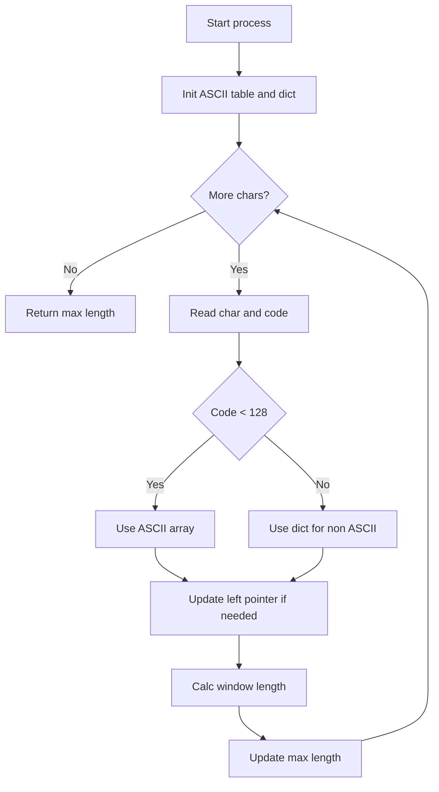
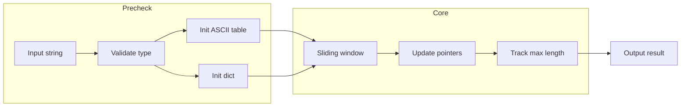
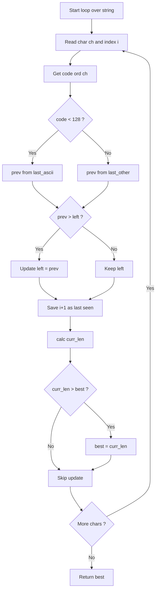

# Longest Substring Without Repeating Characters - 最長部分文字列長の計算

## Table of Contents

- [概要](#overview)
- [アルゴリズム要点（TL;DR）](#tldr)
- [図解](#figures)
- [正しさのスケッチ](#correctness)
- [計算量](#complexity)
- [Python 実装](#impl)
- [CPython 最適化ポイント](#cpython)
- [エッジケースと検証観点](#edgecases)
- [FAQ](#faq)

---

<h2 id="overview">概要</h2>

与えられた文字列から、**重複する文字を含まない最長の連続部分文字列の長さ**を求める問題です。

要件:

- 入力: 文字列 `s`（長さは最大 50,000 程度）
- 出力: 最長部分文字列の長さ（整数）
- 制約: 高速な O(n) 時間で解く必要あり。
- 安定性: 入力が空文字や特殊文字を含んでも正しく処理すること。

---

<h2 id="tldr">アルゴリズム要点（TL;DR）</h2>

- スライディングウィンドウで左右ポインタを維持
- ASCII 文字 (0..127) は固定長 `array('I', 128)` で直近出現位置を管理
- 非 ASCII は `dict` に格納（65536 要素配列は使わずメモリ削減）
- 更新規則: 出現済みなら左ポインタを前回出現位置+1 に進める
- 各ステップで部分文字列長を更新して最大値を記録
- **計算量**: Time O(n), Space O(1) 相当

---

<h2 id="figures">図解</h2>



_スライディングウィンドウで逐次的に文字を処理し、ASCII は配列、非 ASCII は辞書で管理する流れを示す。_



_入力検証からデータ構造準備、スライディングウィンドウでの処理、最終結果出力までのデータフロー。_

---

<h2 id="correctness">正しさのスケッチ</h2>

- **不変条件**: ウィンドウ内は常に重複なし。
- **基底条件**: 空文字なら結果は 0。
- **更新規則**: 新しい文字が重複した場合、左ポインタを安全に進めることで重複を排除。
- **終了性**: 各ステップで右ポインタは進み続け、有限長 n で必ず終了。
- **網羅性**: 全ての部分文字列候補をウィンドウで走査するため、最大長を確実に記録できる。

---

<h2 id="complexity">計算量</h2>

- **時間計算量**: O(n) — 各文字を 1 回処理
- **空間計算量**: O(1) — ASCII は固定 128、非 ASCII は出現数分の辞書

比較表:

| 実装                  | Time | Space       | 備考                       |
| --------------------- | ---- | ----------- | -------------------------- |
| 配列 + 辞書（本実装） | O(n) | O(1)        | 高速かつ省メモリ           |
| 配列 65536 固定       | O(n) | O(1) だが大 | 256KB の配列コスト         |
| dict のみ             | O(n) | O(k)        | k=文字種数、速度は若干低下 |

---

<h2 id="impl">Python 実装</h2>

```python
from __future__ import annotations
from array import array
from typing import Dict, Final

class Solution:
    """
    Longest Substring Without Repeating Characters

    ASCIIは固定配列で管理し、非ASCIIはdictに保存。
    65536配列を回避し、省メモリ化。
    """

    _MAX_LEN: Final[int] = 5 * 10**4

    def lengthOfLongestSubstring(self, s: str) -> int:
        if not isinstance(s, str):
            raise TypeError("Input must be a string")
        n: int = len(s)
        if n > self._MAX_LEN:
            raise ValueError("Input length exceeds allowed maximum")
        if n == 0:
            return 0

        # ASCII用の128長配列（未出現=0）
        last_ascii: array = array("I", [0]) * 128
        # 非ASCIIは辞書に格納
        last_other: Dict[int, int] = {}

        left: int = 0
        best: int = 0

        for i, ch in enumerate(s):
            code: int = ord(ch)
            if code < 128:
                prev: int = last_ascii[code]
                if prev > left:
                    left = prev
                last_ascii[code] = i + 1
            else:
                prev = last_other.get(code, 0)
                if prev > left:
                    left = prev
                last_other[code] = i + 1

            curr_len: int = i - left + 1
            if curr_len > best:
                best = curr_len

        return best
```

---

<h2 id="cpython">CPython最適化ポイント</h2>

- `for i, ch in enumerate(s)` を使いインデックスと文字を同時取得 → ループ高速化
- `ord(ch)` を直接利用し、余計な変換を避ける
- `array('I')` は連続メモリで高速アクセス＆GC 負担軽減
- 例外チェック（型・長さ）はホットパス外にまとめることで本ループは軽量化
- dict へのアクセスは `get` を利用して 1 ステップ化

---

<h2 id="edgecases">エッジケースと検証観点</h2>

- 空文字列 → 出力 0
- 全て同じ文字（"aaaa"）→ 出力 1
- 全て異なる文字（"abcd"）→ 出力 len(s)
- 非 ASCII 文字（"あいうえお"）→ 辞書処理が正しく動作
- 入力長が最大（50,000）→ O(n) 内で処理可能

---

<h2 id="faq">FAQ</h2>

**Q1. メモリが他解より大きいのはなぜ?**
A. CPython 常駐コスト（十数 MB）が基準として計測されるため。配列 65536 要素を避けることで 256KB を削減済み。

**Q2. dict のみ実装と比べてどちらがよい?**
A. ASCII 主体なら配列が圧倒的に速い。本実装は ASCII 高速＋非 ASCII 柔軟のバランス型。

**Q3. surrogate pair（U+10000 以上）は扱える?**
A. Python の `str` は UTF-32 に近いコードポイント管理をしており、`ord`で自然に処理できる。

## ループ処理について

このループ部分はアルゴリズムの核心で、**各文字を読み取り → 直近の位置を更新 → ウィンドウ長を計算 → 最大値を更新**という流れをしています。
これをより理解しやすいように、**図解付きで分解**して説明します。

---

## ステップごとの処理

```python
for i, ch in enumerate(s):
    code: int = ord(ch)              # 文字コードに変換
    if code < 128:                   # ASCII 文字？
        prev: int = last_ascii[code] # 過去の出現位置 (0=未出現)
        if prev > left:              # 左ポインタを前に進める必要あり？
            left = prev
        last_ascii[code] = i + 1     # 現在位置を保存
    else:                            # 非ASCII文字
        prev = last_other.get(code, 0)
        if prev > left:
            left = prev
        last_other[code] = i + 1

    curr_len: int = i - left + 1     # ウィンドウ長
    if curr_len > best:              # 最大値を更新
        best = curr_len
```

---

## 処理の流れ（フローチャート）



👉 この図から分かるように、

- **ASCII なら配列に保存**
- **非 ASCII なら辞書に保存**
- 直近出現位置が左境界より右にある場合は、ウィンドウを縮めて**重複を解消**
- その時点のウィンドウ長を計算し、最大値を更新
  という流れを繰り返しています。

---

## データ構造の状態イメージ

入力例: `abcad`

| i   | ch  | left | last_ascii/dict 更新 | curr_len | best |
| --- | --- | ---- | -------------------- | -------- | ---- |
| 0   | a   | 0    | last_ascii['a']=1    | 1        | 1    |
| 1   | b   | 0    | last_ascii['b']=2    | 2        | 2    |
| 2   | c   | 0    | last_ascii['c']=3    | 3        | 3    |
| 3   | a   | 1    | last_ascii['a']=4    | 3        | 3    |
| 4   | d   | 1    | last_ascii['d']=5    | 4        | 4    |

👉 `a` が 2 回目に出た時 (`i=3`)、`left` を `1` に進めて重複を回避。
最後に `"bcad"` の長さ `4` が最大となる。

---

## まとめ

- `left` は「現在のウィンドウの左端」を意味し、重複が見つかると更新されます。
- `last_ascii`/`last_other` は「その文字が最後に出現したインデックス+1」を保持します。
- `curr_len` を毎回計算し、最大値を `best` に保存することで最長長さを記録します。

---
