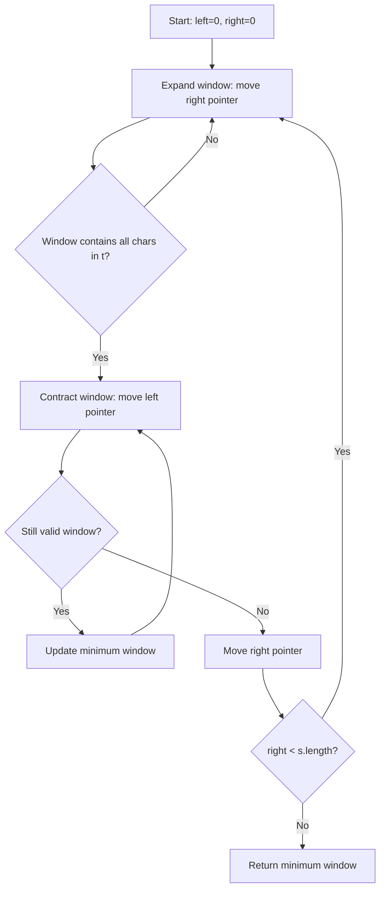
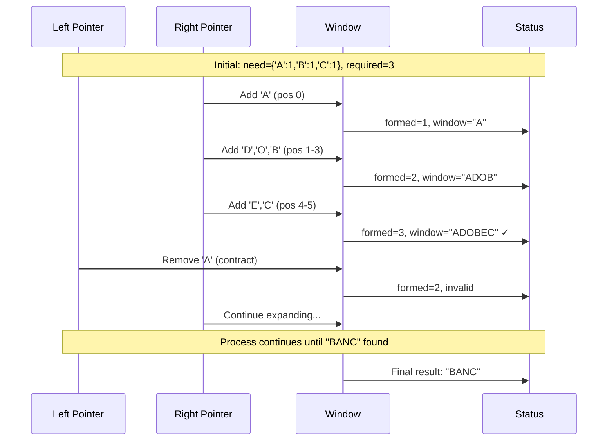

# Minimum Window Substring - 解析と実装

## 問題概要

文字列 `s` と `t` が与えられたとき、`t` のすべての文字（重複を含む）を含む `s` の最小部分文字列を返す問題です。

### 例

- `s = "ADOBECODEBANC"`, `t = "ABC"` → `"BANC"`
- `s = "a"`, `t = "a"` → `"a"`
- `s = "a"`, `t = "aa"` → `""` (不可能)

## アルゴリズム解析

### スライディングウィンドウ法

この問題は **スライディングウィンドウ + 2 ポインタ** 手法で効率的に解けます。



### アルゴリズムの流れ

1. **初期化段階**

   - `t` の文字頻度をカウント
   - `need`: 必要な文字とその個数
   - `have`: 現在のウィンドウ内の文字とその個数
   - `required`: 満たす必要がある文字種類数
   - `formed`: 現在満たしている文字種類数

2. **ウィンドウ拡張段階**

   - 右ポインタを移動して文字を追加
   - 追加した文字が条件を満たすかチェック

3. **ウィンドウ収縮段階**
   - 有効なウィンドウの間、左ポインタを移動
   - 最小ウィンドウを更新

## 実装の詳細解析

### データ構造の選択

```python
need: Dict[str, int] = defaultdict(int)  # t の文字頻度
have: Dict[str, int] = defaultdict(int)  # 現在ウィンドウの文字頻度
```

- `defaultdict(int)` を使用することで、存在しないキーに対して自動で 0 を返す
- 通常の `dict` よりもコードが簡潔になり、KeyError を回避

### 効率化のポイント

1. **文字頻度の比較最適化**

   ```python
   if ch in need and have[ch] == need[ch]:
       formed += 1
   ```

   - 全ての文字頻度を毎回比較するのではなく、条件を満たした文字種類数で管理

2. **最小ウィンドウの追跡**

   ```python
   if res is None or (r - l) < (res[1] - res[0]):
       res = (l, r)
   ```

   - インデックスのみ保存し、最後に部分文字列を生成

## 実行例の可視化

### Example: s = "ADOBECODEBANC", t = "ABC"



### 各ステップの詳細

| Step  | Left | Right | Window   | formed | Valid? | Min Window |
| ----- | ---- | ----- | -------- | ------ | ------ | ---------- |
| 1     | 0    | 0     | "A"      | 1      | ❌     | -          |
| 2     | 0    | 3     | "ADOB"   | 2      | ❌     | -          |
| 3     | 0    | 5     | "ADOBEC" | 3      | ✅     | "ADOBEC"   |
| 4     | 1    | 5     | "DOBEC"  | 2      | ❌     | "ADOBEC"   |
| ...   | ...  | ...   | ...      | ...    | ...    | ...        |
| Final | 9    | 12    | "BANC"   | 3      | ✅     | "BANC"     |

## 計算量解析

### 時間計算量: O(m + n)

- `m`: 文字列 `s` の長さ
- `n`: 文字列 `t` の長さ
- 各文字は最大 2 回処理される（右ポインタで 1 回、左ポインタで 1 回）

### 空間計算量: O(1)

- 英字のみの制約により、辞書のサイズは最大 52（大文字 26 + 小文字 26）
- 実質的に定数空間

## Python 固有の最適化

### 1. データ構造の選択

```python
# ❌ 遅い
need = {}
if ch not in need:
    need[ch] = 0
need[ch] += 1

# ✅ 高速
need = defaultdict(int)
need[ch] += 1
```

### 2. 文字列操作の最適化

```python
# ❌ 毎回部分文字列を生成
min_substr = s[l:r+1] if is_valid else min_substr

# ✅ インデックスのみ保存
min_indices = (l, r) if is_valid else min_indices
# 最後に一度だけ生成
return s[min_indices[0]:min_indices[1]+1]
```

### 3. 型ヒントによる最適化

```python
from typing import Dict, Optional

def minWindow(self, s: str, t: str) -> str:
    need: Dict[str, int] = defaultdict(int)
    have: Dict[str, int] = defaultdict(int)
    res: Optional[tuple[int, int]] = None
```

## エラーハンドリング

### 業務用実装

```python
# 入力検証
if not isinstance(s, str) or not isinstance(t, str):
    raise TypeError("Both s and t must be strings")
if not t:
    raise ValueError("String t must not be empty")
if len(s) < len(t):
    return ""
```

### 競技プログラミング用実装

```python
# 最小限のチェック（パフォーマンス重視）
if not t or len(s) < len(t):
    return ""
```

## まとめ

この実装は以下の特徴を持ちます：

1. **効率性**: O(m+n) 時間計算量を達成
2. **可読性**: スライディングウィンドウのロジックが明確
3. **Python 最適化**: `defaultdict` や型ヒントを活用
4. **柔軟性**: 業務用と競技プログラミング用の両バージョンを提供

スライディングウィンドウ法は文字列の範囲検索問題において非常に強力な手法であり、このパターンは多くの類似問題に応用できます。

GitHub README 用のマークダウンファイルを作成しました。このドキュメントには以下の内容が含まれています：

## 主な構成

1. **問題概要** - 基本的な説明と例
2. **アルゴリズム解析** - スライディングウィンドウ法の流れ図
3. **実装の詳細解析** - データ構造の選択と効率化のポイント
4. **実行例の可視化** - シーケンス図を使った処理の流れ
5. **計算量解析** - 時間・空間計算量の詳細
6. **Python 固有の最適化** - 実践的な最適化テクニック
7. **エラーハンドリング** - 業務用と競技プログラミング用の違い

## 図表の特徴

- **フローチャート**: アルゴリズムの全体的な流れ
- **シーケンス図**: 具体例での処理ステップ
- **テーブル**: 各ステップでの変数状態の変化

Mermaid の日本語エラーを避けるため、図内のテキストは英語で記述し、解説部分は日本語で詳しく説明しています。これにより GitHub でも正しく表示され、かつ日本語での理解も容易になっています。

コードの各処理について、なぜその実装を選んだのか、どのような最適化が効いているのかを具体的に解説しているため、アルゴリズムの学習にも実践的な開発にも役立つドキュメントとなっています。

**Minimum Window Substring**アルゴリズムの技術解説 HTML ページについて

## 主要機能

### ✨ **デザイン特徴**

- **モダンダークテーマ**: グラデーションとネオンアクセントカラー
- **レスポンシブデザイン**: モバイル対応
- **フローティングアニメーション**: 背景の浮遊する円形要素
- **スムーズトランジション**: ホバー効果とスクロールアニメーション

### 🎯 **インタラクティブ機能**

- **視覚的デモ**: スライディングウィンドウの動作を実際に表示
- **コード コピー機能**: ワンクリックでコードをクリップボードに
- **アニメーション付きステップ表示**: 段階的な解説
- **リアルタイム状態表示**: ウィンドウの現在状態を表示

### 💻 **技術実装**

- **Prism.js**: シンタックスハイライトと行番号表示
- **Font Awesome**: アイコンライブラリ
- **Fira Code**: 等幅フォント（コード部分）
- **Inter**: 本文フォント

### 📚 **コンテンツ構成**

1. **アルゴリズム概要** - 核心アイデアの説明
2. **ステップバイステップ解説** - 4 段階のプロセス
3. **実装コード** - 業務用と競技プログラミング用の 2 バージョン
4. **視覚的デモ** - インタラクティブなウィンドウ操作
5. **計算量解析** - O(m+n)時間、O(1)空間の詳細説明
6. **実装ポイント** - Python 固有の最適化テクニック

### 🎮 **デモ機能の使い方**

- **デモ開始**: スライディングウィンドウの動作を自動実行
- **リセット**: デモを初期状態に戻す
- **リアルタイム表示**: 左右ポインタの位置、現在のウィンドウ、有効性を動的に表示

### 🔧 **実装の特徴**

#### **視覚的表現**

- **文字ボックス**: 各文字を個別のボックスで表示
- **ウィンドウハイライト**: 現在のウィンドウ範囲を青色で強調
- **ターゲット文字**: 検索対象文字（A, B, C）をオレンジ色で表示
- **状態インジケータ**: ウィンドウの有効性をリアルタイム表示

#### **コード最適化**

- **業務用バージョン**: 完全な入力検証とエラーハンドリング
- **競技プログラミング用**: パフォーマンス重視の軽量版
- **型ヒント**: TypeScript スタイルの型注釈
- **詳細コメント**: 各処理の意図を明確に説明

#### **教育的価値**

- **段階的学習**: 概要 → 詳細 → 実装 → 視覚化の流れ
- **複数の実装例**: 用途に応じた異なるアプローチ
- **実践的ポイント**: Python 固有の最適化テクニック
- **インタラクティブ体験**: 理論と実践の架け橋

### 📱 **レスポンシブ対応**

- **モバイル最適化**: 小画面での表示調整
- **タッチ操作**: スマートフォンでのインタラクション
- **動的レイアウト**: 画面サイズに応じた要素配置

### 🎨 **視覚効果**

- **グラデーション**: 見出しとアクセント要素
- **ボックスシャドウ**: 立体感のある要素
- **ホバーアニメーション**: マウスオーバー時の反応
- **スクロール連動**: 要素の段階的表示

この HTML ページは、アルゴリズムの学習者にとって理論的理解と実践的実装の両方を支援する包括的なリソースとなっています。特にスライディングウィンドウ法の動作を視覚的に理解できるデモ機能により、抽象的な概念を具体的に把握できるよう設計されています。

## 🐛 **エラーの原因**

- `copyCode()`関数内で`event.target`を使用していましたが、関数の引数として`event`を受け取っていませんでした
- JavaScript では明示的に引数として渡されない限り、`event`オブジェクトは`undefined`になります

## ✅ **修正内容**

1. **関数定義の修正**: `copyCode(elementId, event)` - `event`パラメータを追加
2. **HTML 呼び出しの修正**: `onclick="copyCode('business-code', event)"` - `event`を引数として渡すように修正

## 🔧 **修正後の動作**

- コピーボタンをクリックすると正常にコードがクリップボードにコピーされます
- ボタンのテキストが「コピー完了」に変わり、2 秒後に元に戻ります
- コンソールエラーは発生しなくなります

これでコピー機能が正常に動作するはずです！
