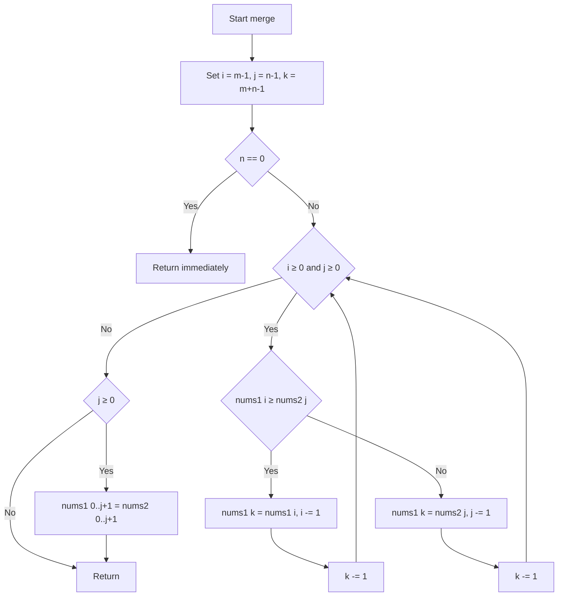
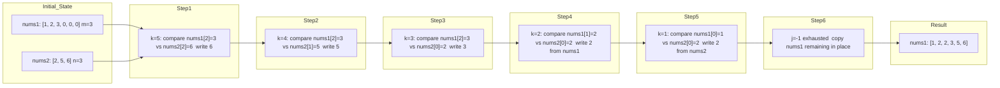

# Merge Sorted Array - In-place 3-Pointer Merge from the Right

---

## Overview

### 目次（Table of Contents）

- [Overview](#overview)
- [Algorithm](#algorithm)
- [Complexity](#complexity)
- [Implementation](#implementation)
- [Optimization](#optimization)

### 問題要約

**LeetCode 88 – Merge Sorted Array**

非減少順にソートされた 2 つの整数配列 `nums1`（有効要素数 `m`）と `nums2`（長さ `n`）を、
`nums1` の末尾 `n` 要素のゼロ領域を利用して **インプレース** にマージし、
結果を `nums1` に非減少順で格納する。

### 要件

| 項目   | 内容                                                                                                                   |
| ------ | ---------------------------------------------------------------------------------------------------------------------- |
| 戻り値 | `None`（`nums1` を破壊的に変更）                                                                                       |
| 正当性 | 全要素が非減少順に並ぶこと                                                                                             |
| 安定性 | 等値要素の相対順序は問わない（仕様上要求なし）                                                                         |
| 制約   | `nums1.length == m + n`, `nums2.length == n`, `0 ≤ m, n ≤ 200`, `1 ≤ m + n ≤ 200`, `-10^9 ≤ nums1[i], nums2[j] ≤ 10^9` |

---

## Algorithm

### アルゴリズム要点 TL;DR

- **戦略**: `nums1` の末尾から走査する **3 ポインタ法**（後ろからマージ）
- **データ構造**: 追加配列不要。`nums1` 自体をバッファとして再利用
- **時間計算量**: O(m + n) — 各要素をちょうど 1 回参照・書き込み
- **空間計算量**: O(n) — スライス代入による一時オブジェクト生成の最悪ケース
- **核心の不変条件**: 書き込みポインタ `k` は常に読み取りポインタ `i` 以上
  → 未処理の `nums1` 要素を上書きしない
- **後ろから書く理由**: 前から比較すると `nums1` の有効要素を上書きしてしまうため逆順が安全

### 図解

#### フローチャート



> 後ろから比較して大きい方を末尾（`k`）に書き込む。どちらかが尽きたら `nums2` の残余を先頭スライスへ一括コピー。

#### データフロー図（ステップ別状態遷移）



> 各ステップで大きい方の値が `k` の位置に書き込まれ、対応するポインタと `k` が 1 ずつ減少する。

### 正しさのスケッチ

#### 不変条件

書き込みポインタ `k` と `nums1` の読み取りポインタ `i` について、以下が常に成立する：

```
k - i = (m + n - 1 - step_count) - (m - 1 - i_decrements)
      = n - j_decrements ≥ 0
```

各イテレーションで `k` は必ず 1 減少し、`i` か `j` のどちらかも 1 減少する。
`i` が減少するとき `k - i` は変わらず、`j` が減少するとき `k - i` は 1 増加する。
よって `k ≥ i` が保持され、**未処理の `nums1` 要素を上書きしない**。

#### 網羅性

- `while` ループ終了後、`i < 0` または `j < 0` のどちらかが成立
- `j < 0` の場合：`nums2` は全て書き込み済み、`nums1` の残余は正しい位置にある（移動不要）
- `j ≥ 0` の場合：`nums2[:j+1]` を `nums1[:j+1]` にスライス代入して完了

#### 基底条件（エッジケース）

| 条件     | 処理                                          |
| -------- | --------------------------------------------- |
| `n == 0` | 早期リターン、`nums1` はそのまま              |
| `m == 0` | `while` の `i >= 0` が即 False → 残余コピーへ |

#### 終了性

`i` と `j` はループごとに必ず 1 以上減少し、非負整数であるため有限ステップで終了する。

---

## Complexity

| 観点       | 計算量   | 説明                                       |
| ---------- | -------- | ------------------------------------------ |
| 時間計算量 | O(m + n) | 各要素を最大 1 回比較・書き込み            |
| 空間計算量 | O(n)     | スライス代入による一時オブジェクト生成による最悪ケース |

### In-place vs Pure 比較

| 実装方針                      | 時間              | 空間     | 備考                                    |
| ----------------------------- | ----------------- | -------- | --------------------------------------- |
| 本実装（後ろから 3 ポインタ） | O(m+n)            | **O(n)** | スライス代入の空間コストを含む            |
| 前から + 一時バッファ         | O(m+n)            | O(m)     | `nums1[:m]` を `list()` でコピー        |
| `nums1 + nums2` 後 `.sort()`  | O((m+n) log(m+n)) | O(m+n)     | Timsort は C 実装で高速だが計算量は劣る |
| `heapq.merge` + スライス代入  | O(m+n)            | O(m+n)   | 一時リストが発生                        |

---

## Implementation

### Python 実装

```python
from __future__ import annotations

from typing import List


class Solution:
    def merge(self, nums1: List[int], m: int, nums2: List[int], n: int) -> None:
        """
        2 つのソート済み配列を nums1 にインプレースでマージする。

        後ろから走査する 3 ポインタ法により O(m+n) 時間・O(n) 空間（スライス代入による最悪ケース）を実現。

        不変条件: k >= i が常に成立するため nums1 の未処理要素を上書きしない。
            初期値 k - i = n >= 0 が各イテレーションで保持される。

        Args:
            nums1: マージ先リスト（長さ m+n、末尾 n 要素は 0 で埋め済み）
            m:     nums1 の有効要素数
            nums2: マージ元リスト（長さ n）
            n:     nums2 の要素数

        Returns:
            None（nums1 を破壊的に変更）

        Time Complexity:  O(m + n)
        Space Complexity: O(n)
        """
        # ── エッジケース: nums2 が空なら nums1 はそのまま ──────────────────
        if n == 0:
            return

        # ── 3 ポインタ初期化 ────────────────────────────────────────────────
        i: int = m - 1      # nums1 有効末尾ポインタ（読み取り）
        j: int = n - 1      # nums2 末尾ポインタ（読み取り）
        k: int = m + n - 1  # 書き込み位置ポインタ（後ろから前へ）

        # ── メインループ: 両配列が残っている間、大きい方を末尾へ書き込む ──
        while i >= 0 and j >= 0:
            if nums1[i] >= nums2[j]:
                # nums1 の要素が大きい（または等しい）→ nums1[i] を書き込み
                nums1[k] = nums1[i]
                i -= 1
            else:
                # nums2 の要素が大きい → nums2[j] を書き込み
                nums1[k] = nums2[j]
                j -= 1
            k -= 1

        # ── 残余処理: nums2 が残っている場合のみスライス代入で一括コピー ──
        # nums1 の残余は既に正しい位置にあるため移動不要
        if j >= 0:
            # CPython の list_ass_slice は memmove 相当で逐次代入より高速
            nums1[: j + 1] = nums2[: j + 1]
```

### エッジケースと検証観点

| ケース                                | 入力例                                      | 期待出力       | 対応箇所                               |
| ------------------------------------- | ------------------------------------------- | -------------- | -------------------------------------- |
| `nums2` が空（`n=0`）                 | `nums1=[1], m=1, nums2=[], n=0`             | `[1]`          | 早期 `return`                          |
| `nums1` が空（`m=0`）                 | `nums1=[0], m=0, nums2=[1], n=1`            | `[1]`          | `while i>=0` が即 False → 残余コピー   |
| 全要素が同値                          | `nums1=[2,2,0,0], m=2, nums2=[2,2], n=2`    | `[2,2,2,2]`    | `>=` の分岐で正しく処理                |
| `nums2` の全要素が `nums1` より大きい | `nums1=[1,2,0,0], m=2, nums2=[3,4], n=2`    | `[1,2,3,4]`    | `while` 終了後 `j < 0` → 何もしない    |
| `nums1` の全要素が `nums2` より大きい | `nums1=[3,4,0,0], m=2, nums2=[1,2], n=2`    | `[1,2,3,4]`    | `while` 終了後 `j >= 0` → スライス代入 |
| 負の数を含む                          | `nums1=[-3,-1,0,0], m=2, nums2=[-2,0], n=2` | `[-3,-2,-1,0]` | 整数比較なので問題なし                 |
| 最大制約                              | `m=n=100`                                   | 正しくマージ   | O(m+n) で余裕                          |

#### 静的解析観点（Pylance strict mode）

- `List[int]` 型ヒントにより `nums1[k]` への `int` 代入が型安全
- `-> None` 明示により暗黙的な `None` 返却が警告なし
- `from __future__ import annotations` で前方参照の問題を回避

### FAQ

**Q1. なぜ前からではなく後ろからマージするのか？**

前からマージすると、`nums1` の有効要素（インデックス `0..m-1`）を上書きしてしまう。
後ろからマージすれば書き込み位置 `k` が常に `i` 以上になるため、
未処理の要素を破壊することなくインプレース操作が成立する。

**Q2. `nums1` の残余（`i >= 0`）もコピーが必要では？**

不要。`nums1` の残余要素は既に正しい位置（`nums1[0..i]`）にあり、
後ろからマージ済みの要素と連続しているため、移動の必要がない。

**Q3. スライス代入 `nums1[:j+1] = nums2[:j+1]` で一時オブジェクトは発生しないのか？**

右辺 `nums2[:j+1]` がリストスライスとして一時的に生成される（O(j) サイズ）。
`j` は最大で `n-1` となるため、最悪ケースでは O(n) の追加空間を消費する。
厳密な O(1) が必要な場合は while ループによる各要素コピーが推奨されるが、逐次代入に比べてバイトコードのオーバーヘッドを削減できるため、Python 実用上はスライスが高速。

**Q4. `.sort()` を使う方法ではダメなのか？**

```python
# 次善策: O((m+n) log(m+n)) だが実装が最短
nums1[m:] = nums2[:n]
nums1.sort()
```

正しく動作するが、時間計算量が O((m+n) log(m+n)) に劣化する。
フォローアップ要件「O(m+n) で解け」を満たさない。
競技では時間制限に収まるケースが多いが、最適解ではない。

**Q5. `heapq.merge` を使う方法は？**

```python
import heapq
nums1[m:] = nums2  # 末尾をコピー
merged = list(heapq.merge(nums1[:m], nums2))
nums1[:] = merged
```

O(m+n) だが一時リストが O(m+n) の追加空間を消費する。
空間計算量の観点で、スライス代入 `nums1[:j+1] = nums2[:j+1]` を用いる本実装（最悪ケース O(n)）に劣る。

**Q6. 等値要素の扱いはどうなるか？**

`nums1[i] >= nums2[j]` の条件により、等値の場合は `nums1` 側が優先される。
問題仕様上、安定性（相対順序の保持）は要求されていないため、どちらでも正解。

---

## Optimization

### CPython 最適化ポイント

#### 1. スライス代入による残余コピーの高速化

```python
nums1[: j + 1] = nums2[: j + 1]
```

CPython の `list.__setitem__` スライス版は内部で `list_ass_slice` を呼び出し、
`memmove` 相当の C レイヤーのメモリコピーが走る。
逐次 `while j >= 0: nums1[k] = nums2[j]; j -= 1; k -= 1` より
**インタープリタのバイトコードディスパッチ回数を大幅に削減**できる。

#### 2. LOAD_FAST によるローカル変数の高速アクセス

| アクセス種別                                    | バイトコード  | 速度                 |
| ----------------------------------------------- | ------------- | -------------------- |
| ローカル変数（`i`, `j`, `k`, `nums1`, `nums2`） | `LOAD_FAST`   | 高速（辞書探索なし） |
| グローバル変数                                  | `LOAD_GLOBAL` | やや低速             |
| 属性アクセス（`self.xxx`）                      | `LOAD_ATTR`   | 最も低速             |

本実装では全カウンタがメソッドのローカルスコープに収まるため、
`LOAD_FAST` が全アクセスに適用される。

#### 3. 早期リターンによる不要な処理の排除

```python
if n == 0:
    return
```

`n == 0` の場合はループに入らず即リターン。
条件チェックのオーバーヘッドが極めて小さい。

#### 4. 型ヒントとランタイムの分離

`from __future__ import annotations` を使用することで、
型アノテーションの評価が **遅延評価（文字列化）** になり、
実行時のインポートオーバーヘッドを最小化する。