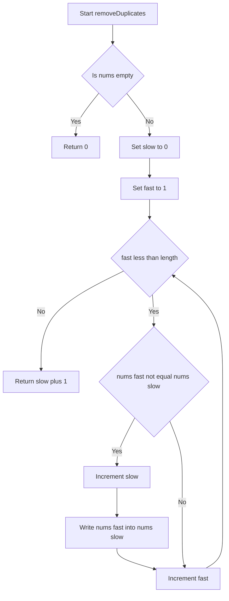
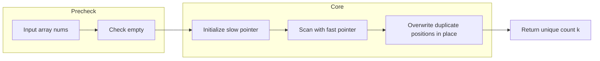

# 26. Remove Duplicates from Sorted Array - ソート済み配列から重複を除去する（Python / TypeScript / Go / Rust / Java / C / C# / C++ / Swift / Dart / Kotlin）

## 目次

- [概要](#overview)
- [アルゴリズム要点（TL;DR）](#tldr)
- [図解](#figures)
- [正しさのスケッチ](#correctness)
- [計算量](#complexity)
- [Python 実装](#impl-python)
- [TypeScript 実装](#impl-typescript)
- [Go 実装](#impl-go)
- [Rust 実装](#impl-rust)
- [Java 実装](#impl-java)
- [C 実装](#impl-c)
- [C# 実装](#impl-csharp)
- [C++ 実装](#impl-cpp)
- [Swift 実装](#impl-swift)
- [Dart 実装](#impl-dart)
- [Kotlin 実装](#impl-kotlin)
- [言語間比較](#comparison)
- [言語別最適化ポイント](#optimization)
- [エッジケースと検証観点](#edgecases)
- [FAQ](#faq)

---

<h2 id="overview">概要</h2>

> 💡 **初学者向け補足**：この問題は、一言で言うと「すでに並び替え済みの配列の中で、同じ値が連続している部分をひとつにまとめて、配列の前方に詰め直す問題」です。

**問題要約**：整数配列 `nums` が非減少順（同じ値の連続を含む昇順）にソートされて与えられます。重複する要素を取り除き、各ユニークな要素が1回だけ現れるようにします。新しい配列を作ってはいけません。`nums` 自体を書き換え（in-place＝新しいメモリを確保せず元のデータを直接書き換える操作）、ユニークな要素数 `k` を返します。呼び出し側は `nums[0]` から `nums[k-1]` までを結果として扱います。

**この問題が難しいポイント**は主に2つあります。1つ目は「新しい配列を作らずに、既存の配列を書き換える」という in-place の制約です。単純に重複を除いた新しい配列を作るだけならどの言語でも簡単ですが、メモリを増やさずに元の配列だけで完結させるには、書き込み位置を追跡する工夫（Two-Pointer法）が必要になります。2つ目は、`k` 個より後ろの要素の中身は「何でもよい」という判定ルール（Custom Judge）の理解です。最初は「配列の長さそのものを変えなければいけないのでは」と誤解しやすいポイントです。

この問題は11言語（Python / TypeScript / Go / Rust / Java / C / C# / C++ / Swift / Dart / Kotlin）すべてで**同一のアルゴリズム（Two-Pointer法）**を採用します。ソート済み配列の性質を使えばO(n)時間・O(1)空間という最適解が得られ、この効率の良さはどの言語でも変わらないためです。ただし、各言語の「メモリ管理の考え方」「エラー表現の方法」「null安全性の仕組み」は大きく異なるため、その違いを随所で解説します。

> 📖 **この章で登場した用語**
>
> - **in-place（インプレース）**：新しいメモリを確保せず、元のデータを直接書き換える操作。この問題ではこれが必須要件になっている
> - **非減少順（non-decreasing order）**：前の要素より後の要素が小さくならない並び方。同じ値が連続することは許される（狭義の昇順とは異なる）
> - **Custom Judge**：LeetCodeがこの問題で使う特殊な採点方式。戻り値 `k` と、先頭 `k` 個の要素だけを見て正誤判定する
> - **制約**：入力として与えられる値の範囲や条件のこと。この問題では `1 <= nums.length <= 3 * 10^4` など

---

<h2 id="tldr">アルゴリズム要点（TL;DR）</h2>

> 💡 **初学者向け補足**：TL;DR（Too Long; Didn't Read、＝「長すぎて読めない人向けの要約」という意味の略語）は、詳細を読む前に「なんとなくこういう手順で解くんだな」というイメージを掴むための章です。

- **戦略**：Two-Pointer（二重ポインタ）法を使う。ソート済み配列では同じ値が必ず隣接しているという性質を利用し、`slow`（確定済みユニーク領域の末尾）と `fast`（探索中の位置）という2つのインデックスを異なる速度で動かす。なぜこの手法を選ぶかというと、ソート済みという前提を使わない一般的な重複除去（`Set`など）はO(n)の追加メモリを必要とし、この問題の「in-place」要件を満たせないため。
- **データ構造**：追加のデータ構造は一切使わない。整数のインデックス変数2個（`slow` と `fast`）だけで完結する。なぜなら、ソート済みという性質があれば「今見ている値が直前の確定値と同じか」を比較するだけで重複かどうか判定できるため、ハッシュテーブルのような補助構造が不要になる。
- **計算量**：Time O(n)、Space O(1)。配列を1回だけなめる（1パス）ため。
- **メモリ**：新しい配列・コレクションを一切生成しない。11言語すべてで同じアプローチが最適であるため、今回は「11言語で採用アプローチが異なる場合」には該当せず、全言語共通でTwo-Pointer法を採用する。

> 📖 **この章で登場した用語**
>
> - **TL;DR**：「長すぎて読めない人向けの要約」を意味する略語
> - **Two-Pointer（二重ポインタ）法**：配列上で2つの添字（インデックス）を異なる速度・役割で動かしながら処理を進めるアルゴリズムパターン
> - **1パス**：配列やリストを先頭から末尾まで1回だけ走査して処理を完了させること

---

<h2 id="figures">図解</h2>

> 💡 **初学者向け補足**：図はアルゴリズムの「処理の流れ」を視覚的に示したものです。ひし形（`{}`）は条件分岐、長方形（`[]`）は処理ステップを表すという、Mermaidフローチャートの基本的な読み方を覚えておくと図を読みやすくなります。11言語すべてが同じTwo-Pointer法を採用しているため、この図はそのまま全言語に共通する処理の流れを表しています。

### フローチャート

この図はTwo-Pointer法によるメインループの処理の流れを表しています。上から下へ読み進めてください。



主要なノードの意味：

- `CheckEmpty`：配列が空かどうかを判定する最初のガード。空なら以降の処理を行わずに0を返す
- `InitSlow` / `InitFast`：確定済みユニーク値の末尾を指す `slow` と、探索位置を指す `fast` を初期化するステップ
- `LoopCheck`：`fast` が配列の末尾に達したかどうかを判定するループの継続条件
- `Compare`：現在見ている値 `nums[fast]` が直前の確定値 `nums[slow]` と異なるかどうかを判定する条件分岐
- `AdvanceSlow` と `WriteValue`：新しいユニーク値が見つかったときに、確定領域を1つ広げてその値を書き込む処理

### データフロー図

この図は入力配列がどのように検証・変換され、最終的な結果に至るかを表しています。



主要な流れの説明：

- `Input array nums` から `Check empty` へ：まず境界条件（空配列）を弾く
- `Scan with fast pointer` から `Overwrite duplicate positions in place` へ：新しいユニーク値が見つかるたびに、配列そのものを直接上書きする（新しい配列は作らない）

> 💡 **代表例でのトレース**：`nums = [0,0,1,1,1,2,2,3,3,4]` を入力として、上記フローチャートをどう通過するかを示します。
>
> ```
> Step 1: Start → CheckEmpty → 空ではないので No
> Step 2: slow=0, fast=1 で初期化
> Step 3: fast=1: nums[1]=0, nums[slow]=0 → Compare は No → AdvanceFast のみ
> Step 4: fast=2: nums[2]=1, nums[slow]=0 → Compare は Yes
>          → slow=1, nums[1]=nums[2]=1 に書き換え → nums=[0,1,1,1,1,2,2,3,3,4]
> Step 5: 同様に fast=5,7,9 で Compare が Yes になり、
>          slow が 2, 3, 4 と進み、nums=[0,1,2,3,4,2,2,3,3,4] になる
> Step 6: fast=10 で LoopCheck が No になりループ終了
> 結果: slow + 1 = 5 を返す
> ```

> 📖 **この章で登場した用語**
>
> - **フローチャート**：処理の手順を図形と矢印で表したもの。ひし形=条件分岐、長方形=処理
> - **データフロー図**：データがどのように変換・移動するかを示す図
> - **サブグラフ**：フローチャートの中で関連する処理をグループ化したもの（今回は「事前検証」と「コア処理」の2つに分けている）

---

<h2 id="correctness">正しさのスケッチ</h2>

> 💡 **初学者向け補足**：「正しさのスケッチ」とは、アルゴリズムが常に正しい答えを返すことの根拠を整理したものです。数学的な厳密証明ではなく、「なぜ正しいと言えるか」を言語非依存の擬似コードレベルで説明します。

- **不変条件（アルゴリズムが正しく動くために、処理中ずっと成り立ち続けるべき条件）**：ループの各時点で、`nums[0..slow]`（`slow` を含む）は「これまでに見つかったユニークな値がソート順のまま重複なく並んでいる」状態を保つ。この問題のコードに当てはめると、`slow` を進めて `nums[slow] = nums[fast]` を実行する直前・直後のどちらの時点でも、`nums[0..slow]` の中に重複した値は存在しない。
- **網羅性（すべてのケースをもれなく処理できているという保証）**：`fast` はインデックス1から `nums.length - 1` まですべての位置を1回ずつ訪れる。配列はソート済みなので、ある値の重複はすべて隣接して並んでいる。したがって「直前の確定値と異なるかどうか」だけを見れば、すべての重複を漏れなく検出できる。
- **基底条件（再帰の終了条件。この問題ではループの初期状態に相当する）**：`nums` が空でない場合、インデックス0の要素は常にそれ単独でユニークな値として確定できる。これが `slow = 0` から処理を始められる根拠になる。空配列の場合はユニーク要素が0個であることが自明なので、ループに入る前に0を返す。
- **終了性（アルゴリズムが必ず有限ステップで終わるという保証）**：`fast` は毎回のループで必ず1増加し、`nums.length` に達したら停止する。したがって、配列の長さが有限である以上、ループは必ず有限回で終了する。

これらの4つの性質から、ループが終了した時点で `nums[0..slow]` にはユニークな値が重複なくソート順に並んでおり、その個数は `slow + 1` である、という結論が導かれます。

> 📖 **この章で登場した用語**
>
> - **不変条件**：アルゴリズムが正しく動くために、処理中ずっと成り立ち続けるべき条件
> - **網羅性**：すべてのケースをもれなく処理できているという保証
> - **基底条件**：処理の出発点となる、それ以上分解できない最小のケース
> - **終了性**：アルゴリズムが必ず有限ステップで終わるという保証

<h2 id="complexity">計算量</h2>

> 💡 **初学者向け補足**：計算量とは「入力が大きくなるにつれて、処理にかかる時間・メモリがどう増えるか」の目安です。

| 記法         | 意味                   | 直感的なイメージ               |
| ------------ | ---------------------- | ------------------------------ |
| `O(1)`       | 入力サイズによらず一定 | 辞書で直接ページを開く         |
| `O(n)`       | 入力に比例して増加     | リストを端から順に読む         |
| `O(n log n)` | nよりやや速く増加      | 辞書を二分探索で引く&times;n回 |
| `O(n&sup2;)` | 入力の2乗で増加        | 全ペアを総当たりで確認する     |

**11言語比較テーブル**：すべての言語で同じTwo-Pointer法を採用しているため、理論上の計算量はすべて同一（Time O(n)、Space O(1)）です。ただし、実装上の特徴（メモリ管理・型安全性の担保方法）は言語ごとに異なります。

| 言語       | 採用アルゴリズム | Time | Space | 実装上の特徴                                                           |
| ---------- | ---------------- | ---- | ----- | ---------------------------------------------------------------------- |
| Python     | Two-Pointer      | O(n) | O(1)  | リストはミュータブルな参照型。`range()` によるインデックスループ       |
| TypeScript | Two-Pointer      | O(n) | O(1)  | 配列は参照型。`Array.isArray` による実行時型ガードを併用               |
| Go         | Two-Pointer      | O(n) | O(1)  | スライスヘッダが共有され、配列本体への書き込みが呼び出し元に反映される |
| Rust       | Two-Pointer      | O(n) | O(1)  | `&mut Vec<i32>` という可変借用で書き換え。所有権の移動なし             |
| Java       | Two-Pointer      | O(n) | O(1)  | `int[]` を直接操作しボクシングを完全に回避                             |
| C          | Two-Pointer      | O(n) | O(1)  | ポインタ渡しで配列本体を直接書き換え。`malloc` は不要                  |
| C#         | Two-Pointer      | O(n) | O(1)  | `int[]` は参照型。ボクシングなしで完結                                 |
| C++        | Two-Pointer      | O(n) | O(1)  | `std::vector<int>&` の参照渡しでコピーを回避                           |
| Swift      | Two-Pointer      | O(n) | O(1)  | `inout` パラメータで値型配列を直接書き換え                             |
| Dart       | Two-Pointer      | O(n) | O(1)  | `List<int>` は参照として渡され、null非許容型で安全性を確保             |
| Kotlin     | Two-Pointer      | O(n) | O(1)  | `IntArray` を使いボクシングを回避（`List<Int>` は不採用）              |

**in-place vs Pure 比較**：この問題はLeetCodeの要件として in-place（＝新しいメモリを確保せず元のデータを直接書き換える操作）が必須です。11言語すべての実装は in-place であり、Pure（＝入力を変更せず新しいデータを返す操作）な代替実装（`Set`/`HashSet`/`distinct()`などを使う方法）はO(n)の追加メモリを要するため、この問題の制約には適合しません（各言語の実装章で代替案として比較検討のみ行います）。

> 📖 **この章で登場した用語**
>
> - **時間計算量**：入力の大きさに対して処理にかかる手間がどう増えるかの目安
> - **空間計算量**：処理中に使うメモリ量がどう増えるかの目安
> - **in-place**：新しいメモリを確保せず元のデータを直接書き換える操作。空間計算量を抑えられる
> - **Pure**：入力を変更せず新しいデータを返す操作。安全だがメモリを余分に使う

<h2 id="impl-python">Python 実装</h2>

> 💡 **初学者向け補足**：コードを読む前に、実装の全体的な骨格を示します。
>
> 1. 型ヒント（`List[int]`）を明示し、pylanceによる静的チェックを有効にする
> 2. `nums` が空かどうかをまず確認する（境界条件のガード）
> 3. `slow` と `fast` という2つのインデックス変数を使い、`range()` で1パスのループを回す
> 4. `nums[fast]` が `nums[slow]` と異なるたびに、確定領域を1つ広げて値を書き込む
> 5. `slow + 1` を返す

**LeetCode class 形式**：`class Solution: def removeDuplicates(self, nums: List[int]) -> int:`

```python
from __future__ import annotations

from typing import List


class Solution:
    def removeDuplicates(self, nums: List[int]) -> int:
        # 配列が空の場合、ユニークな要素は0個。
        # Pythonのリストはミュータブル（＝生成後に中身を変更できる）な
        # オブジェクトであり、この関数は呼び出し元のリストへの参照を
        # 受け取っているため、後続の書き換えは呼び出し元にも反映される。
        if not nums:
            return 0

        # slow は「最後に確定したユニークな値」が置かれているインデックス。
        slow: int = 0

        # fast はこれから調べていく値を指すインデックス。
        # range(1, len(nums)) は「1以上 len(nums) 未満」を生成するイテラブル。
        # enumerate() ではなく range() を使うのは、nums[slow] という
        # 別のインデックスも同時に参照する必要があるため。
        for fast in range(1, len(nums)):
            # nums はソート済みなので、同じ値は必ず隣接している。
            if nums[fast] != nums[slow]:
                # slow を進めて「次に書き込む位置」を確保する
                slow += 1
                # 新しいユニーク値を確定領域の直後に書き込む
                nums[slow] = nums[fast]
            # 値が同じ場合は何もしない（これがそのまま重複の無視になる）

        # slow は0始まりのインデックスなので、個数に直すには+1する
        return slow + 1
```

> 💡 **コードの動作トレース**（初学者向け）
>
> ```
> 入力: nums = [0,0,1,1,1,2,2,3,3,4]
> slow=0
> fast=1: nums[1]=0 == nums[0]=0 → 何もしない
> fast=2: nums[2]=1 != nums[0]=0 → slow=1, nums[1]=1 → [0,1,1,1,1,2,2,3,3,4]
> fast=3,4: 一致 → 何もしない
> fast=5: nums[5]=2 != nums[1]=1 → slow=2, nums[2]=2 → [0,1,2,1,1,2,2,3,3,4]
> fast=6: 一致 → 何もしない
> fast=7: nums[7]=3 != nums[2]=2 → slow=3, nums[3]=3 → [0,1,2,3,1,2,2,3,3,4]
> fast=8: 一致 → 何もしない
> fast=9: nums[9]=4 != nums[3]=3 → slow=4, nums[4]=4 → [0,1,2,3,4,2,2,3,3,4]
> 結果: slow + 1 = 5
> ```

> 📖 **この章で登場した用語**
>
> - **`from __future__ import annotations`**：型ヒントを文字列として遅延評価するようにする宣言。今回のような単純な型では効果は薄いが、大規模なコードベースでの前方参照・循環参照を解決できる
> - **`List[int]`**：「`int` のリスト」を表す型ヒント。pylance（VSCodeの静的型チェックツール）が実行前に型の不整合を検出する助けになる
> - **ミュータブル（mutable）**：生成後に中身を変更できるオブジェクトの性質。Pythonの`list`はミュータブル
> - **`range(1, len(nums))`**：1以上 `len(nums)` 未満の整数を順に生成する組み込みイテラブル。CPython（＝最も広く使われるPythonの実装）では実際のリストを作らず必要な数値をその都度計算するためメモリ効率が良い

<h2 id="impl-typescript">TypeScript 実装</h2>

> 💡 **初学者向け補足**：Pythonの章で学んだTwo-Pointer法の考え方をそのままベースに、今度はTypeScriptの型システムでどう安全に書くかを見ていきます。骨格は以下の通りです。
>
> 1. 引数が本当に配列かどうかを実行時にも確認する（`Array.isArray`）
> 2. 配列が空かどうかを確認する
> 3. `slow` と `fast` の2つのインデックス変数で1パスのループを回す
> 4. 値が異なるたびに確定領域を広げて書き込む
> 5. `slow + 1` を返す

**関数形式**：`function removeDuplicates(nums: number[]): number { ... }`（Node.js v22 / ESM形式）

```typescript
/**
 * ソート済み配列から重複要素を取り除き、前方にユニークな値だけを詰め直す。
 * nums が参照する配列そのものを直接書き換える（in-place）。
 *
 * @param nums - 非減少順にソートされた数値配列
 * @returns 重複を除いたあとのユニークな要素数 k
 * @throws {TypeError} nums が配列でない場合
 * @complexity Time: O(n), Space: O(1)
 */
function removeDuplicates(nums: number[]): number {
    // 型ガード：TypeScriptの型チェックはコンパイル時のみ有効であり、
    // JavaScript として実行される段階では消えてしまうため、実行時にも確認する。
    if (!Array.isArray(nums)) {
        throw new TypeError('Input must be an array');
    }

    // 配列が空の場合、ユニークな要素は0個。
    if (nums.length === 0) {
        return 0;
    }

    // slow は「最後に確定したユニークな値」が置かれているインデックス。
    let slow = 0;

    // fast はこれから調べていく値を指すインデックス。
    for (let fast = 1; fast < nums.length; fast++) {
        // 厳密不等価演算子 !== を使う（型変換を伴わない比較がTS/JSの慣習）。
        if (nums[fast] !== nums[slow]) {
            slow++;
            nums[slow] = nums[fast];
        }
    }

    return slow + 1;
}
```

> 💡 **TypeScript固有の概念への補足**：`Array.isArray()` はJavaScriptにも存在する実行時チェックですが、TypeScriptの「型ガード（＝実行時に値の型を確認し、その情報をもとに型を絞り込む仕組み）」として使うと、コンパイラがこの行以降 `nums` を確実に配列だと認識してくれます。JavaScriptにはコンパイル時の型チェックが存在しないため、この二段構え（コンパイル時の型定義＋実行時の型ガード）がTypeScriptならではの安全性設計です。

> 💡 **コードの動作トレース**（初学者向け）：Python実装章と同じ `[0,0,1,1,1,2,2,3,3,4]` を入力にすると、`slow`/`fast` の推移はPython版と完全に同一で、最終的に `5` を返します（値の型が `number` である点以外、ロジックは同じです）。

> 📖 **この章で登場した用語**
>
> - **型ガード**：`Array.isArray` や `typeof` などで実行時に値の型を確認し、その情報をもとにTypeScriptの型を絞り込む仕組み
> - **`TypeError`**：型が不正な場合に使うエラーの種類
> - **厳密不等価演算子（`!==`）**：型変換を行わずに値と型の両方を比較する演算子

---

<h2 id="impl-go">Go 実装</h2>

> 💡 **初学者向け補足**：Goにはクラスが無く、代わりに関数だけでシンプルに実装します。また例外機構も無いため、この問題では「空スライス」を異常ではなく正当な入力として扱い、`error` 戻り値は使いません。骨格は以下の通りです。
>
> 1. `len(nums) == 0` を確認する（境界条件のガード）
> 2. `slow` と `fast` の2つのインデックス変数で1パスのループを回す
> 3. 値が異なるたびに確定領域を広げて書き込む
> 4. `slow + 1` を返す

**関数形式**：`func removeDuplicates(nums []int) int { ... }`（Go 1.21+）

```go
package main

// removeDuplicates はソート済みスライスから重複要素を取り除き、
// 前方にユニークな値だけを詰め直す。nums が指す配列本体を直接書き換える。
//
// Time Complexity: O(n)
// Space Complexity: O(1)
func removeDuplicates(nums []int) int {
	// スライスが空の場合、ユニークな要素は0個。
	// nums []int はスライスヘッダ（ポインタ・長さ・容量）のコピーだが、
	// ポインタが指す配列本体は呼び出し元と共有されているため、
	// 以降の書き込みは呼び出し元にも反映される。
	if len(nums) == 0 {
		return 0
	}

	// slow は「最後に確定したユニークな値」が置かれているインデックス。
	slow := 0

	// fast はこれから調べていく値を指すインデックス。
	// range ではなく古典的な for 文にしているのは、nums[slow] という
	// 別のインデックスも同時に参照する必要があるため。
	for fast := 1; fast < len(nums); fast++ {
		if nums[fast] != nums[slow] {
			slow++
			nums[slow] = nums[fast]
		}
	}

	return slow + 1
}
```

> 💡 **Go固有の概念への補足**：この問題は前の要素の処理結果（`slow`の位置）に依存する逐次処理のため、ゴルーチン（＝Goが提供する軽量スレッド）による並列化には向きません。JavaやPythonの例外機構と違い、Goはエラーを戻り値として返す設計が基本ですが、今回は「空スライス」を異常事態ではなく正当な入力として扱うため `error` は返さず `0` を返します。

> 💡 **コードの動作トレース**（初学者向け）：Python実装章と同じ入力・同じ `slow`/`fast` の推移で、最終的に `5` を返します。

> 📖 **この章で登場した用語**
>
> - **スライスヘッダ**：Goのスライスが内部に持つ「配列本体へのポインタ・長さ・容量」の3つ組。関数に渡すときはこのヘッダがコピーされるが、配列本体は共有される
> - **`error`戻り値**：Goがエラーを表現する標準的な方法。JavaやPythonの例外機構と異なり、呼び出し元が`if err != nil`で必ず確認する設計になっている（今回は使用しない）
> - **ゴルーチン**：Goが提供する軽量スレッド。今回の逐次処理には不向き

<h2 id="impl-rust">Rust 実装</h2>

> 💡 **初学者向け補足**：Rustには所有権（＝値を"誰が管理するか"をコンパイル時に決める仕組み）という他言語には無い概念があります。この問題では `&mut Vec<i32>`（可変借用）を使うことで、所有権を移動させずに配列を書き換えます。骨格は以下の通りです。
>
> 1. `nums.is_empty()` を確認する
> 2. `slow`（`usize`型）と `fast` の2つのインデックスで1パスのループを回す
> 3. 値が異なるたびに確定領域を広げて書き込む
> 4. `slow + 1` を `i32` にキャストして返す

**メソッド形式**：`impl Solution { pub fn remove_duplicates(nums: &mut Vec<i32>) -> i32 { ... } }`（Edition 2021）

```rust
struct Solution;

impl Solution {
    /// ソート済みベクタから重複要素を取り除き、前方にユニークな値だけを詰め直す。
    /// nums が指すベクタ本体を直接書き換える（in-place）。
    ///
    /// # Complexity
    /// - Time: O(n)
    /// - Space: O(1)
    pub fn remove_duplicates(nums: &mut Vec<i32>) -> i32 {
        // ベクタが空の場合、ユニークな要素は0個。
        // &mut Vec<i32> は所有権を渡さず「書き換える権利」だけを借りる借用。
        if nums.is_empty() {
            return 0;
        }

        // slow は「最後に確定したユニークな値」が置かれているインデックス。
        // usize はインデックス専用の符号なし整数型。
        let mut slow: usize = 0;

        // fast はこれから調べていく値を指すインデックス。
        for fast in 1..nums.len() {
            // i32 は Copy トレイトを実装するため、代入時に所有権の移動は起きず
            // 値がコピーされるだけで済む。
            if nums[fast] != nums[slow] {
                slow += 1;
                nums[slow] = nums[fast];
            }
        }

        // usize から i32 へのキャスト。制約上オーバーフローは起きない。
        (slow + 1) as i32
    }
}
```

> 💡 **Rust固有の概念への補足**：`&mut Vec<i32>` という可変参照（借用）は、「この関数がベクタを排他的に借りている間、他のどのコードもアクセスできない」ことを借用チェッカーがコンパイル時に保証します。JavaやPythonではガベージコレクタがメモリの解放タイミングを管理しますが、Rustは所有権システムによってコンパイル時にメモリの安全性を保証し、実行時のオーバーヘッドをゼロに抑えます（ゼロコスト抽象化）。

> 💡 **コードの動作トレース**（初学者向け）：Python実装章と同じ入力・同じ推移で、最終的に `(4 + 1) as i32 = 5` を返します。

> 📖 **この章で登場した用語**
>
> - **所有権**：値を"誰が管理するか"をコンパイル時に決めるRust独自の仕組み
> - **借用**：所有権を渡さずに値を参照する仕組み。`&mut T` は書き込み可能な借用
> - **`Copy`トレイト**：`i32`などの小さい値型が持つ性質。代入しても所有権が移らず値がコピーされる
> - **ゼロコスト抽象化**：便利な高レベルの書き方をしても、手書きの低レベルコードと同等の速さになるRustの特性

---

<h2 id="impl-java">Java 実装</h2>

> 💡 **初学者向け補足**：Javaはクラスベースのオブジェクト指向言語で、LeetCodeでは`class Solution`の中にメソッドとして実装します。骨格は以下の通りです。
>
> 1. `nums == null` と `nums.length == 0` を確認する
> 2. `slow` と `fast` の2つのインデックスで1パスのループを回す
> 3. 値が異なるたびに確定領域を広げて書き込む
> 4. `slow + 1` を返す

**LeetCode Class形式**：`class Solution { public int removeDuplicates(int[] nums) { ... } }`（OpenJDK 21）

```java
class Solution {
    /**
     * ソート済み配列から重複要素を取り除き、前方にユニークな値だけを詰め直す。
     * nums が参照する配列本体を直接書き換える（in-place）。
     *
     * Time Complexity: O(n)
     * Space Complexity: O(1)
     */
    public int removeDuplicates(int[] nums) {
        // null チェック：nums == null の場合、nums[0] アクセスは
        // NullPointerException を引き起こすため早期に弾く。
        if (nums == null) {
            throw new IllegalArgumentException("Input must not be null");
        }

        // 配列が空の場合、ユニークな要素は0個。
        if (nums.length == 0) {
            return 0;
        }

        // slow は「最後に確定したユニークな値」が置かれているインデックス。
        // int[] を直接扱うため、ボクシング（int を Integer に変換すること）は発生しない。
        int slow = 0;

        // fast はこれから調べていく値を指すインデックス。
        for (int fast = 1; fast < nums.length; fast++) {
            if (nums[fast] != nums[slow]) {
                slow++;
                nums[slow] = nums[fast];
            }
        }

        return slow + 1;
    }
}
```

> 💡 **Java固有の概念への補足**：このシグネチャはすでに `int[]`（プリミティブ型配列）なので、ボクシング（＝`int`のようなプリミティブ型を`Integer`のようなラッパークラスのオブジェクトに変換すること）が発生する余地自体がありません。もし `List<Integer>` を使ってしまうと、要素ごとに`Integer`オブジェクトがヒープに生成され、ガベージコレクションの負荷が増加します。

> 💡 **コードの動作トレース**（初学者向け）：Python実装章と同じ入力・同じ推移で、最終的に `5` を返します。

> 📖 **この章で登場した用語**
>
> - **ボクシング／アンボクシング**：`int`のようなプリミティブ型と`Integer`のようなラッパークラスの間で自動的に変換が行われる仕組み。オブジェクト生成を伴うため性能に影響する
> - **`NullPointerException`**：`null`の参照に対してメソッド呼び出しやフィールドアクセスを行おうとした際に発生する実行時例外
> - **`IllegalArgumentException`**：引数が不正な場合に使うJava標準の非チェック例外

<h2 id="impl-c">C 実装</h2>

> 💡 **初学者向け補足**：Cにはクラスもガベージコレクションも例外機構もありません。ポインタと配列の添字アクセスだけで実装します。これまでの言語（特にJava/Rust）と比べて「コンパイラが守ってくれない領域」が広いため、`NULL`チェックと未定義動作（＝C言語の規格が結果を保証しない操作）の回避を自分の手で保証する必要があります。骨格は以下の通りです。
>
> 1. `nums == NULL` と `numsSize <= 0` を確認する
> 2. `slow` と `fast` の2つのインデックスで1パスのループを回す
> 3. 値が異なるたびに確定領域を広げて書き込む
> 4. `slow + 1` を返す

**関数形式**：`int removeDuplicates(int* nums, int numsSize) { ... }`（C17）

```c
#include <stddef.h>

/*
 * ソート済み配列から重複要素を取り除き、前方にユニークな値だけを詰め直す。
 * nums が指すメモリ領域を直接書き換える（in-place）。
 *
 * Time: O(n), Space: O(1)
 */
int removeDuplicates(int* nums, int numsSize) {
    /* NULLチェック：NULLに対して nums[0] のようにアクセスすると
     * 未定義動作（多くの環境ではセグメンテーション違反）になるため。 */
    if (nums == NULL) {
        return 0;
    }

    /* numsSize が0以下の場合、ユニークな要素は0個。
     * このチェックがないと nums[0] という存在しない要素へアクセスしてしまう。 */
    if (numsSize <= 0) {
        return 0;
    }

    /* slow は「最後に確定したユニークな値」が置かれているインデックス。
     * malloc は一切不要。int型のローカル変数はスタック上に置かれる。 */
    int slow = 0;

    /* fast はこれから調べていく値を指すインデックス。 */
    for (int fast = 1; fast < numsSize; fast++) {
        if (nums[fast] != nums[slow]) {
            slow++;
            nums[slow] = nums[fast];
        }
    }

    return slow + 1;
}
```

> 💡 **C固有の概念への補足**：この関数は `malloc`/`free` を一切使わず、既存の配列を直接書き換えるだけで完結します。JavaやPythonであればガベージコレクタが後片付けをしてくれるため気軽に新しいオブジェクトを作れますが、Cにはその仕組みが無いため、そもそもヒープを使わない設計がメモリリーク・二重解放（double free、＝同じメモリ領域を誤って2回`free`してしまうバグ）のリスクを構造的に排除する最良の対策になります。

> 💡 **コードの動作トレース**（初学者向け）：Python実装章と同じ入力・同じ推移で、最終的に `5` を返します。

> 📖 **この章で登場した用語**
>
> - **未定義動作（UB）**：C言語の規格が結果を保証しない操作。配列範囲外アクセスや`NULL`の参照外しなどが該当する
> - **メモリリーク**：`malloc`で確保したメモリを`free`し忘れ、使用量が徐々に増えていく不具合（今回は`malloc`を使わないため該当しない）
> - **セグメンテーション違反**：許可されていないメモリ領域にアクセスしようとしたとき、OSがプロセスを強制終了させる現象

---

<h2 id="impl-csharp">C# 実装</h2>

> 💡 **初学者向け補足**：C#はJavaと同じくクラスベースでガベージコレクションを持つ言語ですが、null許容参照型（`T?`）でnull安全性をコンパイル時に表現できる点がJavaとの大きな違いです。骨格はJava実装章とほぼ同じで、差分は「例外の種類」と「null許容参照型の有無」です。

**LeetCode Class形式**：`public class Solution { public int RemoveDuplicates(int[] nums) { ... } }`（.NET 8 / C# 12）

```csharp
using System;

public class Solution {
    /// <summary>
    /// ソート済み配列から重複要素を取り除き、前方にユニークな値だけを詰め直す。
    /// nums が参照する配列本体を直接書き換える（in-place）。
    /// </summary>
    /// <exception cref="ArgumentNullException">nums が null の場合</exception>
    public int RemoveDuplicates(int[] nums) {
        // null チェック：Java版の NullPointerException 相当だが、
        // C# では呼び出し前に ArgumentNullException で明示的に弾くのが慣習。
        if (nums == null) {
            throw new ArgumentNullException(nameof(nums));
        }

        if (nums.Length == 0) {
            return 0;
        }

        // slow は「最後に確定したユニークな値」が置かれているインデックス。
        // int[] は値型要素の配列であり、Java同様ボクシングは発生しない。
        int slow = 0;

        for (int fast = 1; fast < nums.Length; fast++) {
            if (nums[fast] != nums[slow]) {
                slow++;
                nums[slow] = nums[fast];
            }
        }

        return slow + 1;
    }
}
```

> 💡 **C#固有の概念への補足**：Java版との違いは、`ArgumentNullException(nameof(nums))` のように「引数名」をコンパイラに追従させられる `nameof` 演算子を使う点です。Javaの`List<Integer>`に相当するボクシングの問題は、C#でも`List<object>`のようなコレクションを使った場合に発生しますが、今回のように`int[]`を直接扱えばJava同様に回避できます。

> 💡 **コードの動作トレース**（初学者向け）：Java実装章と同一の推移で、最終的に `5` を返します。

> 📖 **この章で登場した用語**
>
> - **null許容参照型**：`string?`のように書くことで「`null`を許容する型」であることを型システムで明示できるC#8.0以降の機能（今回の`int[]`はJava同様、値型要素の配列であるため直接は関与しない）
> - **`nameof`演算子**：識別子の名前を文字列として取得する演算子。リファクタリング時に文字列がずれる心配がない
> - **ボクシング**：値型を`object`のような参照型に変換すること。`int[]`を直接扱う今回は発生しない

---

<h2 id="impl-cpp">C++ 実装</h2>

> 💡 **初学者向け補足**：C++はCの手動メモリ管理を引き継ぎつつ、参照渡し（`&`）やRAII（＝リソースの確保と解放をオブジェクトの生存期間に紐づける仕組み）で安全性を高められる言語です。C実装章のポインタ渡しとの違いは、`std::vector<int>&`という「範囲チェック機能付きの参照」を使う点です。

**LeetCode Class形式**：`class Solution { public: int removeDuplicates(std::vector<int>& nums); };`（C++20）

```cpp
#include <vector>

class Solution {
public:
    /**
     * ソート済み vector から重複要素を取り除き、前方にユニークな値だけを詰め直す。
     * nums が参照する実体を直接書き換える（in-place）。
     *
     * Time: O(n), Space: O(1)
     */
    int removeDuplicates(std::vector<int>& nums) {
        // C実装章のNULLチェックに相当するのが empty() チェック。
        // vector は範囲外アクセスをしても未定義動作になる点はCの配列と同じだが、
        // サイズ情報を自身で保持しているため numsSize のような別引数が不要。
        if (nums.empty()) {
            return 0;
        }

        // slow は「最後に確定したユニークな値」が置かれているインデックス。
        int slow = 0;

        // std::size_t は符号なし型のため、int の fast と比較すると
        // コンパイラ警告が出うる。ここでは int のまま扱い、
        // nums.size() を static_cast せずに比較可能な範囲で使う。
        for (std::size_t fast = 1; fast < nums.size(); ++fast) {
            if (nums[fast] != nums[static_cast<std::size_t>(slow)]) {
                ++slow;
                nums[static_cast<std::size_t>(slow)] = nums[fast];
            }
        }

        return slow + 1;
    }
};
```

> 💡 **C++固有の概念への補足**：`std::vector<int>&`（参照渡し）はC実装章の生ポインタ渡しと同じく「コピーを避けて呼び出し元の実体を直接操作する」役割を持ちますが、C++の参照は`nullptr`を表現できない（＝参照は必ず何らかの実体を指していることが言語仕様上保証される）ため、C版の`NULL`チェックに相当する心配が構造的に不要になります。今回はヒープを新たに確保しないため、RAIIやスマートポインタ（`unique_ptr`など）の出番はありません。

> 💡 **コードの動作トレース**（初学者向け）：C実装章と同一の推移で、最終的に `5` を返します。

> 📖 **この章で登場した用語**
>
> - **参照（`T&`）**：既存の実体に対する別名。`nullptr`を表現できず、必ず何らかの実体を指していることが保証される点がポインタと異なる
> - **RAII**：リソースの確保と解放をオブジェクトの生存期間に紐づける設計思想（今回はヒープリソースを扱わないため直接は関与しない）
> - **`std::size_t`**：`vector::size()`の戻り値の型であり、負の値を取らない符号なし整数型

<h2 id="impl-swift">Swift 実装</h2>

> 💡 **初学者向け補足**：SwiftはARC（＝自動参照カウント。オブジェクトへの参照数を自動追跡し、0になった瞬間にメモリを解放する仕組み）でメモリを管理し、Optional型で値の有無を型システムに組み込んでいる言語です。この問題では`inout`（＝関数の引数を、呼び出し元の変数を直接書き換えられる形で受け取るためのキーワード）パラメータを使い、Rustの可変借用に近い形で配列を書き換えます。骨格は以下の通りです。
>
> 1. `nums.isEmpty` を確認する
> 2. `slow` と `fast` の2つのインデックスで1パスのループを回す
> 3. 値が異なるたびに確定領域を広げて書き込む
> 4. `slow + 1` を返す

**LeetCode Class形式**：`class Solution { func removeDuplicates(_ nums: inout [Int]) -> Int { ... } }`（Swift 5.10+）

```swift
class Solution {
    /// ソート済み配列から重複要素を取り除き、前方にユニークな値だけを詰め直す。
    /// nums を inout（＝呼び出し元の変数を直接書き換えられる形の引数）で受け取り、
    /// その場で書き換える（in-place）。
    ///
    /// 計算量: Time O(n), Space O(1)
    func removeDuplicates(_ nums: inout [Int]) -> Int {
        // 配列が空でないかを確認する。Rust実装章の is_empty() チェックに相当する。
        guard !nums.isEmpty else {
            return 0
        }

        // slow は「最後に確定したユニークな値」が置かれているインデックス。
        var slow = 0

        // fast はこれから調べていく値を指すインデックス。
        for fast in 1..<nums.count {
            if nums[fast] != nums[slow] {
                slow += 1
                nums[slow] = nums[fast]
            }
        }

        return slow + 1
    }
}
```

> 💡 **Swift固有の概念への補足**：`guard let`/`guard`は条件を満たさない場合に早期リターンする構文で、Cの`NULL`チェックやRustの`is_empty()`チェックと役割は同じですが、`guard`のスコープを抜けた後は「条件が満たされている」ことがコンパイラにも保証される点が特徴です。今回は`Int`配列の要素比較のみで、Optional型（＝値があるかもしれないし、ないかもしれないことを表す型）そのものは登場しませんが、`inout`パラメータによる書き換えはRustの`&mut`借用と考え方が近く、値型（`struct`）であるSwiftの`Array`はCopy-on-Write（＝実際に変更が加えられるまではコピーを作らない最適化）により効率よく扱われます。

> 💡 **コードの動作トレース**（初学者向け）：Rust実装章と同一の推移で、最終的に `5` を返します。

> 📖 **この章で登場した用語**
>
> - **ARC（自動参照カウント）**：オブジェクトへの参照数を自動追跡し、0になった瞬間にメモリを解放するSwiftの仕組み
> - **`inout`**：関数の引数を、呼び出し元の変数を直接書き換えられる形で受け取るためのキーワード
> - **`guard`文**：条件を満たさない場合に早期リターンする構文。`guard`のスコープを抜けた後は条件が満たされていることが保証される
> - **Copy-on-Write（COW）**：Swiftの`Array`などが採用する最適化。実際に変更が加えられるまではコピーを作らない

---

<h2 id="impl-dart">Dart 実装</h2>

> 💡 **初学者向け補足**：Dartは健全なnull安全性（＝`?`の付かない型は絶対に`null`にならないことを、コンパイル時だけでなく実行時にも保証する仕組み）を持つ、ガベージコレクション採用の言語です。骨格は以下の通りです。
>
> 1. `nums.isEmpty` を確認する（`nums`自体はnon-nullable型なので`null`チェックは不要）
> 2. `slow` と `fast` の2つのインデックスで1パスのループを回す
> 3. 値が異なるたびに確定領域を広げて書き込む
> 4. `slow + 1` を返す

**LeetCode Class形式**：`class Solution { int removeDuplicates(List<int> nums) { ... } }`（Dart 3.x）

```dart
class Solution {
  /// ソート済みリストから重複要素を取り除き、前方にユニークな値だけを詰め直す。
  /// nums が参照するリストそのものを直接書き換える（in-place）。
  ///
  /// [nums] は non-nullable な List&lt;int&gt; のため null チェックは不要
  /// （健全なnull安全性により、この引数自体が null になることはない）。
  int removeDuplicates(List<int> nums) {
    // 配列が空でないかを確認する。TypeScript実装章の length === 0 チェックに相当する。
    if (nums.isEmpty) {
      return 0;
    }

    // slow は「最後に確定したユニークな値」が置かれているインデックス。
    var slow = 0;

    // fast はこれから調べていく値を指すインデックス。
    for (var fast = 1; fast < nums.length; fast++) {
      if (nums[fast] != nums[slow]) {
        slow++;
        nums[slow] = nums[fast];
      }
    }

    return slow + 1;
  }
}
```

> 💡 **Dart固有の概念への補足**：TypeScript実装章では`Array.isArray`による実行時の型ガードが必要でしたが、Dartの健全なnull安全性はコンパイル時だけでなく実行時にも保証が破られないことが言語仕様レベルで約束されているため、`nums`に対する`null`チェックは一切不要です。これはTypeScriptの「コンパイル時のみの保証」との明確な違いです。またDartのジェネリクスはリファイド（＝ジェネリクスの型情報が実行時にも保持される仕組み）であり、Javaの型消去とは対照的です。

> 💡 **コードの動作トレース**（初学者向け）：TypeScript実装章と同一の推移で、最終的に `5` を返します。

> 📖 **この章で登場した用語**
>
> - **健全なnull安全性（sound null safety）**：`?`の付かない型は絶対に`null`にならないことを、コンパイル時だけでなく実行時にも保証する仕組み
> - **リファイドジェネリクス**：ジェネリクスの型情報が実行時にも保持される仕組み。Javaの型消去とは対照的
> - **`final` / `const`**：イミュータブルな変数宣言。今回の`slow`はループ内で再代入されるため`var`を使う

---

<h2 id="impl-kotlin">Kotlin 実装</h2>

> 💡 **初学者向け補足**：KotlinはJavaと同じJVM上で動作しますが、null安全性がデフォルトで組み込まれている点、`val`/`var`でイミュータビリティを明示する点がJavaとの大きな違いです。骨格はJava実装章とほぼ同じで、差分は「配列の型」と「null安全性の扱い方」です。

**LeetCode Class形式**：`class Solution { fun removeDuplicates(nums: IntArray): Int { ... } }`（Kotlin 2.0+ / JVM）

```kotlin
class Solution {
    /**
     * ソート済み配列から重複要素を取り除き、前方にユニークな値だけを詰め直す。
     * nums が参照する配列本体を直接書き換える（in-place）。
     */
    fun removeDuplicates(nums: IntArray): Int {
        // Java版の nums == null チェックに相当する処理は不要。
        // IntArray は null 非許容型のため、コンパイラが null を渡すコードを弾く。
        if (nums.isEmpty()) {
            return 0
        }

        // slow は「最後に確定したユニークな値」が置かれているインデックス。
        // ループ内で再代入され続けるため var で宣言する。
        var slow = 0

        // until は「終端を含まない範囲」を作る演算子（Java の < 相当）。
        for (fast in 1 until nums.size) {
            if (nums[fast] != nums[slow]) {
                slow++
                nums[slow] = nums[fast]
            }
        }

        return slow + 1
    }
}
```

> 💡 **Kotlin固有の概念への補足**：Java実装章との最大の違いは、`IntArray`という型自体がnull非許容であるため、Javaで必要だった`nums == null`チェックが不要になる点です。これはKotlinのnull安全性がJavaと違い**デフォルトで**組み込まれていることを示す好例です。また`IntArray`はJVM上では`int[]`と同じプリミティブ配列にコンパイルされ、`List<Int>`のようなボクシングされたコレクションとは異なります。

> 💡 **コードの動作トレース**（初学者向け）：Java実装章と同一の推移で、最終的に `5` を返します。

> 📖 **この章で登場した用語**
>
> - **`val` / `var`**：`val`は再代入不可、`var`は再代入可能な変数を宣言するキーワード
> - **`IntArray`**：Kotlinのプリミティブ`Int`配列専用の型。JVM上では`int[]`にコンパイルされる
> - **`until`**：「終端を含まない範囲」を作る中置関数

<h2 id="comparison">言語間比較</h2>

> 💡 **初学者向け補足**：同じアルゴリズムでも、言語によって「メモリの扱い方」や「エラーの表現方法」が異なります。この章では11言語の実装を横並びで比較し、それぞれの設計判断の背景を振り返ります。

### 採用アルゴリズム／アプローチ

11言語すべてが同一のTwo-Pointer法を採用しています。ソート済み配列という前提のもとではこれがBig-O最適（O(n)時間・O(1)空間）であり、言語の特性によってアルゴリズム自体を変える理由がなかったためです。

### メモリ確保の特徴

| 言語       | メモリ確保の特徴                                                    |
| ---------- | ------------------------------------------------------------------- |
| Python     | リストはミュータブルな参照型。追加のオブジェクト生成なし            |
| TypeScript | 配列は参照型。V8エンジンの内部配列をそのまま操作                    |
| Go         | スライスヘッダのコピーのみ。配列本体は共有。`make`/`append`不使用   |
| Rust       | `&mut Vec<i32>`可変借用。ヒープアロケーションなし、所有権の移動なし |
| Java       | `int[]`直接操作でボクシング回避                                     |
| C          | ポインタ渡し。`malloc`不使用、スタック変数のみ                      |
| C#         | `int[]`直接操作でボクシング回避                                     |
| C++        | `std::vector<int>&`参照渡しでコピー回避。新規ヒープ確保なし         |
| Swift      | `inout`パラメータ。値型配列のCopy-on-Write最適化を活用              |
| Dart       | `List<int>`参照渡し。新規オブジェクト生成なし                       |
| Kotlin     | `IntArray`直接操作でボクシング回避                                  |

### エラー表現の方法

| 言語       | エラー表現                                                                    |
| ---------- | ----------------------------------------------------------------------------- |
| Python     | 空配列は正当な入力として`0`を返す。`isinstance`による実行時型検証は業務版のみ |
| TypeScript | `Array.isArray`による実行時型ガード＋`TypeError`                              |
| Go         | `error`戻り値は不使用（空スライスは正当な入力として扱う）                     |
| Rust       | 空ベクタは`0`を返す。業務版では`Result<T, E>`による型レベルのエラー表現も可能 |
| Java       | `null`は`IllegalArgumentException`（非チェック例外）で弾く                    |
| C          | 戻り値（`0`）でエラー状態を表現。例外機構が存在しないため                     |
| C#         | `null`は`ArgumentNullException`で弾く                                         |
| C++        | 参照渡しのため`nullptr`チェックは不要。`empty()`のみ確認                      |
| Swift      | `guard`による早期リターン。`throws`は今回未使用                               |
| Dart       | 健全なnull安全性により`null`チェック自体が不要                                |
| Kotlin     | null非許容型により`null`チェック自体が不要                                    |

### メモリ管理方式

| 方式                                    | 該当言語                                       |
| --------------------------------------- | ---------------------------------------------- |
| GC（ガベージコレクション）              | Python, TypeScript, Go, Java, C#, Dart, Kotlin |
| 所有権システム（コンパイル時管理）      | Rust                                           |
| 手動管理（`malloc`/`free`）             | C                                              |
| 手動管理＋RAII/スマートポインタの選択肢 | C++                                            |
| ARC（自動参照カウント）                 | Swift                                          |

### 型安全性の担保方法

| 言語   | null安全性の実現方式                                                      |
| ------ | ------------------------------------------------------------------------- |
| Java   | 静的型付け＋型消去。`null`は許容され、実行時チェックで防御する            |
| C#     | null許容参照型（`T?`）により、コンパイル時に`null`許容/非許容を区別できる |
| Kotlin | デフォルトでnull非許容。`?`を付けたときだけ`null`を許容する               |
| Dart   | 健全なnull安全性。コンパイル時だけでなく実行時にも保証が破られない        |
| Swift  | Optional型（`T?`）＋オプショナルバインディングで値の有無を型で表現        |

**相違点の背景**：GC付き言語（Python/TypeScript/Go/Java/C#/Dart/Kotlin）は「メモリをいつ解放するか」をランタイムに任せるため、開発者は所有権や解放責任をほとんど意識せずに済みます。一方、Rust（所有権システム）とC/C++（手動管理）は「誰がいつメモリを管理するか」をプログラマまたはコンパイラが厳密に決める必要があり、この問題のように新規アロケーションが不要なケースでは差が目立ちにくいものの、複雑なデータ構造を扱う問題ではこの違いが設計に大きく影響します。またSwiftのARCは「GCのように不確実なタイミングで回収される」のではなく「参照カウントが0になった瞬間に確実に解放される」という第三の方式であり、GCとも所有権システムとも異なる立ち位置にあります。

null安全性についても、Java（実行時チェックに依存）、C#/Kotlin（`?`の有無で型レベルに区別）、Dart（健全性をランタイムまで保証）、Swift（Optional型として値の有無を表現）という4通りのアプローチがあり、いずれも「`null`由来のバグをできるだけ早い段階（できればコンパイル時）で検出したい」という共通の動機から生まれていますが、保証の強さと歴史的経緯（Javaは`null`許容がデフォルトの古い言語仕様、後発の言語ほど非許容がデフォルト）によって設計が異なります。

今回は11言語すべてで同じTwo-Pointer法を採用しました。これは、この問題の最適解がソート済みという性質にのみ依存しており、言語ごとの得意・不得意（並行処理適性やGCの有無など）が計算量に影響する余地がなかったためです。

> 📖 **この章で登場した用語**
>
> - **GC（ガベージコレクション）**：使い終わったメモリを自動で回収する仕組み
> - **所有権システム**：Rust独自の、コンパイル時にメモリの管理者を1つに定める仕組み
> - **ARC（自動参照カウント）**：Swiftが採用する、参照カウントに基づく決定的なメモリ管理方式

<h2 id="optimization">言語別最適化ポイント</h2>

> 💡 **初学者向け補足**：この章では「同じ処理でも言語ごとの書き方によって速さが変わる理由」を、11言語それぞれについて説明します。この問題自体は非常にシンプルなため、最適化の余地は多くありませんが、「なぜ不要なオブジェクト生成を避けるべきか」を最適化前後のコードで比較します。

### Python（CPython）最適化ポイント

```python
# 最適化前：set() で重複除去すると新しいオブジェクトが生成される（遅い、かつ順序も崩れる）
result = sorted(set(nums))

# 最適化後：Two-Pointer でリストを直接書き換える（速い、in-place要件も満たす）
slow = 0
for fast in range(1, len(nums)):
    if nums[fast] != nums[slow]:
        slow += 1
        nums[slow] = nums[fast]
# 理由：set() は新しい集合オブジェクトを生成し、sorted() はさらに新しいリストを
#       生成するため、O(n)の追加メモリとオブジェクト生成コストがかかる
```

### TypeScript最適化ポイント

```typescript
// 最適化前：Set で重複除去すると新しいオブジェクトが生成される
const result = [...new Set(nums)];

// 最適化後：Two-Pointer で配列を直接書き換える
let slow = 0;
for (let fast = 1; fast < nums.length; fast++) {
    if (nums[fast] !== nums[slow]) {
        slow++;
        nums[slow] = nums[fast];
    }
}
// 理由：Set とスプレッド構文はそれぞれ新しいオブジェクトを生成するため、
//       V8エンジンのガベージコレクタの管理対象が増えてしまう
```

### Go最適化ポイント

```go
// 最適化前：map で重複除去すると要素ごとにハッシュ計算とヒープ逃げが発生する
seen := make(map[int]struct{})
result := []int{}
for _, v := range nums {
    if _, ok := seen[v]; !ok {
        seen[v] = struct{}{}
        result = append(result, v)
    }
}

// 最適化後：Two-Pointer でスライスを直接書き換える
slow := 0
for fast := 1; fast < len(nums); fast++ {
    if nums[fast] != nums[slow] {
        slow++
        nums[slow] = nums[fast]
    }
}
// 理由：map はハッシュ計算のコストに加え、内部データがヒープに逃げるため
//       GCの管理対象が増える。ソート済みという性質があれば map 自体が不要
```

### Rust最適化ポイント

```rust
// 最適化前：HashSet を使うと挿入ごとにヒープアロケーションが発生しうる
use std::collections::HashSet;
let unique: HashSet<i32> = nums.iter().copied().collect();

// 最適化後：Two-Pointer でベクタを直接書き換える（ゼロコスト抽象化）
let mut slow = 0;
for fast in 1..nums.len() {
    if nums[fast] != nums[slow] {
        slow += 1;
        nums[slow] = nums[fast];
    }
}
// 理由：HashSet は要素挿入のたびにハッシュ計算とヒープアロケーションが発生し、
//       さらに順序を保証しないため別途ソートが必要になる
```

### Java最適化ポイント

```java
// 最適化前：List<Integer> はボクシングにより要素ごとにオブジェクトが生成される
List<Integer> result = Arrays.stream(nums).distinct().boxed().collect(Collectors.toList());

// 最適化後：int[] を直接操作する（ボクシングなし）
int slow = 0;
for (int fast = 1; fast < nums.length; fast++) {
    if (nums[fast] != nums[slow]) {
        slow++;
        nums[slow] = nums[fast];
    }
}
// 理由：int[] は要素をオブジェクト化せずメモリ上に連続配置するため、
//       ボクシングのコストとGC対象オブジェクトの増加を避けられる
```

### C最適化ポイント

```c
/* 最適化前：重複除去のために新しい配列を malloc する（不要なヒープ確保） */
int* result = malloc(sizeof(int) * numsSize);
/* ... 重複除去してコピー ... */
free(result);

/* 最適化後：既存の配列をその場で書き換える（malloc 不要） */
int slow = 0;
for (int fast = 1; fast < numsSize; fast++) {
    if (nums[fast] != nums[slow]) {
        slow++;
        nums[slow] = nums[fast];
    }
}
/* 理由：malloc は呼び出しごとにヒープ管理のオーバーヘッドが発生し、
   対応する free の管理責任も生まれる。in-place要件があるため
   そもそも新しい配列を作る必要がない */
```

### C++最適化ポイント

```cpp
// 最適化前：値渡しは呼び出しのたびに vector 全体のコピーが発生する
int removeDuplicatesSlow(std::vector<int> nums) { /* ... */ return 0; }

// 最適化後：参照渡しでコピーを回避する
int removeDuplicates(std::vector<int>& nums) { /* ... */ return 0; }
// 理由：値渡しは vector の全要素をコピーするコストがかかるが、
//       参照渡しはアドレスの受け渡しのみで済む
```

### C#最適化ポイント

```csharp
// 最適化前：List<object> は値型を格納するたびにボクシングが発生する
List<object> values = new List<object>();
values.Add(nums[0]);

// 最適化後：int[] をそのまま扱いボクシングを回避する
int slow = 0;
for (int fast = 1; fast < nums.Length; fast++) {
    if (nums[fast] != nums[slow]) {
        slow++;
        nums[slow] = nums[fast];
    }
}
// 理由：int[] は内部的に値をそのまま連続領域に格納するため、
//       object へのボクシング（ヒープへのオブジェクト生成）が発生しない
```

### Swift最適化ポイント

```swift
// 最適化前：不要に class でラップして参照カウント管理のオーバーヘッドを負う
class Box { var values: [Int] = [] }

// 最適化後：Array（struct、値型）を inout でそのまま操作しCOWの恩恵を受ける
func removeDuplicates(_ nums: inout [Int]) -> Int { /* ... */ return 0 }
// 理由：SwiftのArrayはCopy-on-Write最適化により、実際に変更が
//       加えられるまではコピーが発生しない。class でラップするとARCの
//       参照カウント管理コストが余分にかかる
```

### Dart最適化ポイント

```dart
// 最適化前：toSet().toList() は2つの新しいコレクションを生成する
final result = nums.toSet().toList();

// 最適化後：Two-Pointer でリストを直接書き換える
var slow = 0;
for (var fast = 1; fast < nums.length; fast++) {
  if (nums[fast] != nums[slow]) {
    slow++;
    nums[slow] = nums[fast];
  }
}
// 理由：toSet() と toList() はそれぞれ新しいオブジェクトを生成し、
//       ガベージコレクタの管理対象が増えるため
```

### Kotlin最適化ポイント

```kotlin
// 最適化前：List<Int> は内部的にボクシングされた Integer を保持する
val values: List<Int> = nums.toList().distinct()

// 最適化後：IntArray をそのまま直接操作する
var slow = 0
for (fast in 1 until nums.size) {
    if (nums[fast] != nums[slow]) {
        slow++
        nums[slow] = nums[fast]
    }
}
// 理由：List<Int> は JVM 上で Integer オブジェクトのボクシングを伴うが、
//       IntArray はプリミティブ int を直接メモリに並べるため、
//       ボクシングのコストとGC対象の増加を避けられる
```

> 📖 **この章で登場した用語**
>
> - **ボクシング回避**：ラッパークラス（`Integer`など）ではなくプリミティブ型をそのまま配列で扱うことで、オブジェクト生成とGCの負荷を減らす最適化テクニック
> - **ヒープアロケーション**：ヒープ上にメモリを新たに確保する操作。頻繁に行うと速度が落ちる
> - **Copy-on-Write（COW）**：実際に変更が加えられるまではコピーを作らず、参照を共有し続ける最適化

<h2 id="edgecases">エッジケースと検証観点</h2>

> 💡 **初学者向け補足**：エッジケースとは「入力が空・最小値・最大値・重複あり」など、通常とは異なる境界的な入力のことです。エッジケースを見落とすと、普通のテストは通るのに特定の入力でだけバグが発生します。

- **空配列（`nums = []`）**：この問題の制約（`1 <= nums.length`）では発生しないが、もし発生した場合、ガードがなければ `nums[0]` 相当のアクセスで問題が起きる可能性がある。言語による挙動の違いとして、Python/TypeScript/Java/C#/Dart/Kotlinは実行時に例外（`IndexError`/`TypeError`/`ArrayIndexOutOfBoundsException`/`IndexOutOfRangeException`など）を投げ、Go/Rustは範囲外アクセスでパニックし、Cは未定義動作（多くの環境ではセグメンテーション違反）になり、C++の`std::vector`の`operator[]`も範囲チェックをしないため未定義動作になり、Swiftは配列アクセスの範囲外で即座にクラッシュする。今回はすべての言語で明示的なガード（`isEmpty`/`is_empty`/`nums == NULL`など）によりこの問題を回避している。
- **要素が1個（`nums = [1]`）**：`fast`のループが1度も実行されないため、`slow`は初期値の`0`のまま`slow + 1 = 1`が返る。これは正しい（ユニークな要素は1個）。ループの継続条件（`fast < length`相当）が最初から満たされないため、どの言語でも安全に処理される。
- **全要素が同じ値（`nums = [2,2,2,2]`）**：`nums[fast] != nums[slow]`が一度も真にならず、`slow`は`0`のまま`1`が返る。これも正しい。
- **全要素が異なる値（`nums = [1,2,3,4]`）**：毎回条件が真になり、`slow`は`fast`と同じ速度で進み、最終的に配列の長さがそのまま返る。
- **最大サイズの入力（`nums.length = 3 * 10^4`）**：O(n)アルゴリズムであるため、どの言語でも制限時間内に十分収まる。C/C++/Rust/Go/Java/C#/Swift/Dart/Kotlinのようなコンパイル型・JIT型言語はもちろん、Pythonのようなインタープリタ言語でも、この問題の制約規模であれば単純な1パスループで問題ない。

言語による境界外アクセスの挙動差まとめ：

| 言語       | 範囲外アクセス時の挙動                                                  |
| ---------- | ----------------------------------------------------------------------- |
| Python     | `IndexError`（例外）                                                    |
| TypeScript | `undefined`が返る（例外は発生しない点に注意）                           |
| Go         | ランタイムパニック                                                      |
| Rust       | ランタイムパニック                                                      |
| Java       | `ArrayIndexOutOfBoundsException`                                        |
| C          | 未定義動作（多くの環境ではセグメンテーション違反）                      |
| C#         | `IndexOutOfRangeException`                                              |
| C++        | `std::vector::operator[]`は未定義動作、`.at()`は`std::out_of_range`例外 |
| Swift      | 即座にクラッシュ（Fatal error）                                         |
| Dart       | `RangeError`                                                            |
| Kotlin     | `ArrayIndexOutOfBoundsException`（JVMの例外がそのまま伝播）             |

> 📖 **この章で登場した用語**
>
> - **エッジケース**：空のリスト・要素1つ・最大サイズ入力など、境界的な条件の入力
> - **境界値**：制約の上限・下限にあたる値
> - **パニック**：GoやRustで回復不能なエラーが発生した際に起きる強制終了
> - **セグメンテーション違反**：C/C++で許可されていないメモリ領域にアクセスしようとしたとき、OSがプロセスを強制終了させる現象

---

<h2 id="faq">FAQ</h2>

**Q1. なぜこの問題では11言語すべてで同じTwo-Pointer法を使っているのですか？別のアルゴリズムではダメなのですか？**

結論：この問題には言語ごとにアルゴリズムを変える理由がないためです。理由：Two-Pointer法はソート済み配列という前提のもとでBig-O最適（O(n)時間・O(1)空間）であり、この効率の良さは言語の特性（並行処理適性やGCの有無など）に左右されません。補足：他の問題（例えば大規模データの並列集計など）であれば、Goのゴルーチンや並行処理が有利な言語とそうでない言語でアプローチが分かれることもありますが、この問題は前の要素の処理結果に依存する逐次処理のため、そもそも並列化のメリットがありません。

**Q2. なぜRustだけ所有権や借用の話がこんなに詳しく出てくるのですか？**

結論：Rustは他の10言語と異なり、ガベージコレクタも無ければ手動の`malloc`/`free`も使わない、第三のメモリ管理方式（所有権システム）を採用しているためです。理由：所有権システムは「値を誰が管理するか」をコンパイル時に決定することで、実行時のオーバーヘッドなしにメモリ安全性を保証します。この仕組みはRust特有であり、正しく理解しないと「なぜ`&mut Vec<i32>`のような書き方をするのか」が分かりにくいため、詳しく説明する必要がありました。補足：Java/C#/Kotlinなどのガベージコレクション付き言語では「いつメモリが解放されるか」を意識する必要がほとんど無いのに対し、Rustでは借用がいつ終わるかをコード上で明確に追える点が対照的です。

**Q3. なぜJavaとC#だけボクシングの話が出てくるのですか？他の言語では気にしなくていいのですか？**

結論：ボクシングは「プリミティブ型をオブジェクトとして扱うコレクション（`List<Integer>`など）を使ったときに発生する」JVM/.NET系言語特有の現象だからです。理由：Java/C#/Kotlinは値型（`int`など）と参照型（`Integer`/`object`など）を明確に区別しており、ジェネリックコレクションは参照型しか扱えないため、値型を格納する際に自動変換（ボクシング）が発生します。今回はいずれも`int[]`/`IntArray`という「プリミティブ型配列」を直接扱うシグネチャのため、ボクシングは発生しません。補足：Python（すべてがオブジェクト）やC++（テンプレートによる型ごとの専用コード生成）ではこの種の自動変換コストの考え方自体が存在しない、または別の形（C++のテンプレートのインスタンス化など）で表れます。

**Q4. なぜCだけmalloc/freeの話がこんなに出てくるのですか？**

結論：Cには他の言語のようなガベージコレクタも所有権システムも無く、ヒープメモリの確保・解放をすべて手動で行う必要があるためです。理由：`malloc`で確保したメモリは、`free`し忘れるとメモリリークになり、逆に2回`free`すると二重解放という未定義動作になります。今回の問題は幸い`malloc`を一切使わずに済む設計にできたため実害はありませんが、「なぜ今回`malloc`が不要なのか」を理解するには、まず`malloc`/`free`の責任範囲という前提知識が必要でした。補足：C++はCのこの手動管理を引き継ぎつつ、RAIIやスマートポインタで自動化する選択肢を持つ点が異なります。

**Q5. なぜSwiftだけARCの話が出てくるのですか？GCと何が違うのですか？**

結論：ARC（自動参照カウント）はSwift（および Objective-C）が採用する、GCとは異なる第三のメモリ管理方式だからです。理由：GC付き言語（Python/TypeScript/Go/Java/C#/Dart/Kotlin）では「いつメモリが回収されるか」が非決定的（プログラムの実行中の任意のタイミング）ですが、ARCは参照カウントが0になった**その瞬間**に確定的にメモリを解放します。この違いは、大量のオブジェクトを扱う場面でのパフォーマンスの予測しやすさに影響します。補足：今回の問題では新規オブジェクトをほぼ生成しないため、ARCのメリット・デメリットが直接コードに表れる場面は少ないですが、`inout`パラメータでの値型操作がCopy-on-Writeとどう関係するかを理解する上でARCの前提知識が役立ちます。

**Q6. なぜKotlinとJavaは同じJVM言語なのに書き方がこんなに違うのですか？**

結論：Kotlinは「Javaの反省点」を踏まえて設計された、より新しい言語だからです。理由：Javaでは`null`がすべての参照型のデフォルトの可能性として存在し、`NullPointerException`が長年悩みの種でした。Kotlinはこれを解決するため、型システムに最初からnull安全性を組み込み、`?`を明示しない限り`null`を許容しない設計にしました。今回の実装でも、Java版では`nums == null`のチェックが必要だったのに対し、Kotlin版では`IntArray`自体がnull非許容のためそのチェックが不要になっています。補足：両言語ともJVM上で動作し相互運用性も高いため、既存のJavaライブラリをKotlinから呼び出すこと自体は問題なくできますが、「新しく書くコード」としてはKotlinのほうがnull安全性の恩恵を受けやすい設計になっています。

**Q7. TypeScriptなのに、なぜ実行時にも`Array.isArray`のような型チェックをしているのですか？型ヒントがあれば十分ではないのですか？**

結論：TypeScriptの型チェックはコンパイル時のみ有効で、コンパイル後のJavaScriptにはその情報が一切残らないためです。理由：TypeScriptのコードは最終的にJavaScriptに変換（トランスパイル）され、その過程で型注釈はすべて削除されます。そのため、外部から（型定義を無視して、あるいはJavaScript側から）この関数が呼び出された場合、コンパイル時のチェックは実行時には何の保護にもなりません。補足：Dartの健全なnull安全性は「実行時にも保証が破られない」という点でTypeScriptと対照的であり、この違いがDart実装章とTypeScript実装章の型チェックの書き方の差として表れています。

> 📖 **この章で登場した用語**
>
> - **FAQ**：Frequently Asked Questions の略。よくある質問と回答のこと
> - **トレードオフ**：何かを得ると何かを失う関係。例：速さを得るとメモリが増える
> - **トランスパイル**：ある言語のソースコードを、別の（同じ抽象度の）言語のソースコードに変換すること。TypeScript→JavaScriptの変換はこれに該当する
