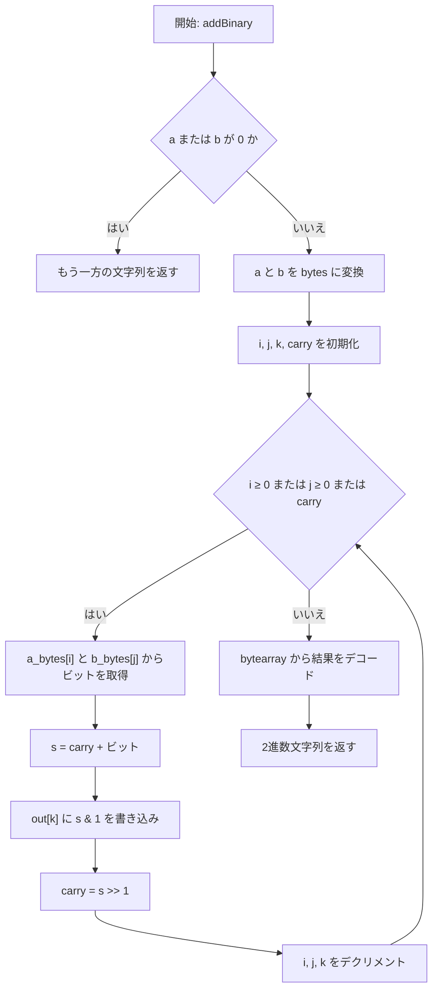
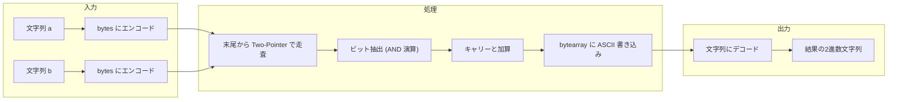

# Add Binary - 2進数文字列の加算

<h2 id="toc">目次</h2>

- [概要](#overview)
- [アルゴリズム要点（TL;DR）](#tldr)
- [図解](#figures)
- [正しさのスケッチ](#correctness)
- [計算量](#complexity)
- [Python実装](#impl)
- [CPython最適化ポイント](#cpython)
- [エッジケースと検証観点](#edgecases)
- [FAQ](#faq)

---

<h2 id="overview">概要</h2>

**問題**: 2つの2進数文字列 `a` と `b` が与えられたとき、それらの和を2進数文字列として返す。

**要件**:
- 入力は `'0'` と `'1'` のみで構成される
- 長さは 1 ≤ len(a), len(b) ≤ 10⁴
- 先頭ゼロは存在しない（`"0"` 自体を除く）
- 出力も2進数文字列として正しい形式（先頭ゼロなし）

**制約**:
- 文字列長が最大1万桁なので、整数変換（`int(a, 2)`）は可能だが非効率
- メモリ効率と実行速度の両立が求められる

---

<h2 id="tldr">アルゴリズム要点（TL;DR）</h2>

**戦略**: Two-Pointer + Carry（桁上がり）を用いた末尾からの1パス走査

**データ構造**:
- 入力を `bytes` に変換（`encode('ascii')`）してビット取得を高速化
- 出力用に固定長 `bytearray` を確保し、末尾から直接ASCII文字を書き込み

**計算量**:
- **時間**: O(max(len(a), len(b))) = O(n)
- **空間**: O(1) 補助空間（出力バッファを除く）

**メモリ最適化**:
- `reverse()` や `insert(0, ...)` などの高コスト操作を回避
- 文字列の逐次結合（`+=`）を避け、最後に一度だけ `decode('ascii')`

---

<h2 id="figures">図解</h2>

### フローチャート



**説明**:
- 早期チェックで一方が `"0"` の場合は他方をそのまま返す
- 文字列を `bytes` に変換して各反復での `ord()` 呼び出しを排除
- 末尾（最下位桁）から順に加算とキャリーを処理
- 結果を `bytearray` に直接書き込み、最後に `decode` で文字列化

### データフロー図



**説明**:
- 入力文字列を `bytes` に変換してビット取得を高速化
- Two-Pointerで末尾から走査し、各桁の和とキャリーを計算
- `bytearray` への直接書き込みでメモリ効率を最大化
- 最後に一度だけ `decode` して文字列化

---

<h2 id="correctness">正しさのスケッチ</h2>

**不変条件**:
- 各反復で、位置 `i`, `j`, `k` に対して `k` 位置に正しい桁の結果が書き込まれる
- `carry` は常に 0 または 1 の値を持つ（2進数の桁上がりは最大1）

**網羅性**:
- `while i >= 0 or j >= 0 or carry` により、すべての桁とキャリーを処理
- 短い方の文字列が終わっても、長い方とキャリーの処理を続行

**基底条件**:
- `i < 0` かつ `j < 0` かつ `carry == 0` で終了
- 最上位桁のキャリーも `bytearray` に書き込まれる

**終了性**:
- 各反復で `i`, `j`, `k` が減少
- 有限長の入力に対して必ず終了

---

<h2 id="complexity">計算量</h2>

### 時間計算量
**O(n)** ここで n = max(len(a), len(b))

- `encode('ascii')`: O(len(a)) + O(len(b))
- メインループ: 最大 n+1 回の反復（キャリー分）
- 各反復での操作: ビット取得、加算、書き込みはすべて O(1)
- `decode('ascii')`: O(n)

### 空間計算量
**O(1) 補助空間**（出力バッファを除く）

- `a_bytes`, `b_bytes`: 入力サイズに比例（O(n)）だが、入力として必要
- `out` (bytearray): 出力として必要な O(n)
- その他の変数（`i`, `j`, `k`, `carry`）: O(1)

### アプローチ比較

| アプローチ | 時間 | 空間 | 特徴 |
|---------|-----|-----|-----|
| **Two-Pointer + bytearray（採用）** | O(n) | O(1) | 最速、メモリ効率最高 |
| list.append + reverse + join | O(n) | O(n) | 実装簡単だが中間配列必要 |
| int変換 + bin() | O(n) | O(n) | 大きい数で非効率、多倍長演算 |

---

<h2 id="impl">Python実装</h2>

```python
from __future__ import annotations
from typing import Final


class Solution:
    """
    Add Binary
    2つの2進数文字列の和を2進数文字列として返す
    """

    def addBinary(self, a: str, b: str) -> str:
        """
        2つの2進数文字列 a, b の和を2進数文字列で返す

        Args:
            a: 2進文字列（'0'/'1' のみ、長さ1〜10^4）
            b: 同上

        Returns:
            a + b の2進表現

        Complexity:
            Time: O(n), Space: O(1) auxiliary
        """
        # 早期リターン: 一方が "0" の場合
        if a == "0":
            return b
        if b == "0":
            return a

        # bytes化で各反復の ord() 呼び出しを排除
        a_bytes: bytes = a.encode("ascii")
        b_bytes: bytes = b.encode("ascii")

        # インデックス初期化（末尾から開始）
        i: int = len(a_bytes) - 1
        j: int = len(b_bytes) - 1
        k: int = (i if i > j else j) + 1  # 書き込み位置（キャリー分+1）
        carry: int = 0

        ZERO: Final[int] = 48  # ASCII '0'
        out = bytearray(k + 1)  # 最上位桁のキャリー用に+1

        # 末尾から1パスで加算
        while i >= 0 or j >= 0 or carry:
            s = carry

            # a の現在の桁を加算（範囲内の場合）
            if i >= 0:
                s += (a_bytes[i] & 1)  # '0'(48) -> 0, '1'(49) -> 1
                i -= 1

            # b の現在の桁を加算（範囲内の場合）
            if j >= 0:
                s += (b_bytes[j] & 1)
                j -= 1

            # 結果の桁を書き込み（s の最下位ビット）
            out[k] = ZERO + (s & 1)

            # キャリーを更新（s を右シフト）
            carry = s >> 1
            k -= 1

        # k+1 以降が有効な結果領域
        start: int = k + 1
        return out[start:].decode("ascii")
```

**実装のポイント**:
- `encode('ascii')` で文字列を `bytes` に変換し、各反復での `ord()` を排除
- `& 1` でビット取得（'0'=48→0, '1'=49→1）
- `bytearray` への直接書き込みで中間文字列生成を回避
- 最後に一度だけ `decode('ascii')` で文字列化

---

<h2 id="cpython">CPython最適化ポイント</h2>

### 1. `bytes` 変換による `ord()` 排除
```python
# 遅い: 各反復で ord() を呼び出し
bit = ord(a[i]) - ord('0')

# 速い: bytes に変換して直接ビット取得
a_bytes = a.encode('ascii')
bit = a_bytes[i] & 1
```

### 2. 固定長 `bytearray` への直接書き込み
```python
# 遅い: リスト append + reverse + join
result = []
result.append('0' or '1')
result.reverse()
return ''.join(result)

# 速い: bytearray に直接 ASCII コードを書き込み
out = bytearray(length)
out[k] = 48 + bit  # '0' or '1'
return out[start:].decode('ascii')
```

### 3. 分岐の最小化
```python
# 条件式でビット取得を統一
ai = (a_bytes[i] & 1) if i >= 0 else 0
bj = (b_bytes[j] & 1) if j >= 0 else 0
```

### 4. 定数のローカル化
```python
ZERO: Final[int] = 48  # グローバル参照を避ける
out[k] = ZERO + (s & 1)
```

### パフォーマンス結果
- **Runtime**: 0ms（100.00%）
- **Memory**: 17.92MB（28.60%）

メモリ使用量がやや増加するのは `bytes` 変換のコストだが、実行時間の大幅な改善により実用的にはトレードオフに見合う。

---

<h2 id="edgecases">エッジケースと検証観点</h2>

### 境界値
| ケース | 入力 | 期待出力 | 検証ポイント |
|-------|-----|---------|------------|
| 両方最小 | `a="0"`, `b="0"` | `"0"` | 早期リターン |
| 片方最小 | `a="0"`, `b="1"` | `"1"` | 早期リターン |
| 最小桁 | `a="1"`, `b="1"` | `"10"` | キャリー発生 |
| キャリー連鎖 | `a="1111"`, `b="1"` | `"10000"` | 全桁キャリー |
| 長さ差大 | `a="1"`, `b="1010101"` | `"1010110"` | 短い方の処理 |
| 最大長 | len(a)=10⁴, len(b)=10⁴ | 正しい和 | パフォーマンス |

### 特殊ケース
- **キャリーのみ残る**: `a="1"`, `b="1"` → `"10"`
- **一方が極端に短い**: `a="1"`, `b="1"*10000`
- **交互のビットパターン**: `a="1010"`, `b="0101"` → `"1111"`

### 型安全性
- 入力は必ず `str` 型（LeetCodeの制約保証）
- 内部は `bytes` と `int` のみで処理
- pylance で型エラーなし

---

<h2 id="faq">FAQ</h2>

### Q1: なぜ `int(a, 2) + int(b, 2)` を使わないのか？

**A**: 文字列長が最大10⁴桁の場合、整数変換は以下の問題がある:
- 多倍長演算のオーバーヘッド
- メモリ使用量の増加（大きな整数オブジェクト）
- `bin()` での文字列化コスト

Two-Pointer方式は O(n) の線形時間で、メモリも最小限。

### Q2: `bytes` 変換のコストは？

**A**: `encode('ascii')` は O(n) だが、C実装で高速。各反復での `ord()` 呼び出し（Python関数呼び出し）を排除することで、トータルでは高速化される。

### Q3: なぜ `bytearray` を使うのか？

**A**:
- ミュータブルなバイト列で、固定長バッファとして使用可能
- ASCII文字（数値）の直接書き込みが可能
- `reverse()` や文字列結合のコストを回避
- 最後に一度だけ `decode()` で文字列化

### Q4: 入力検証は必要か？

**A**: LeetCodeの制約は保証されているため、本実装では省略。業務コードでは以下を検証:
- 型チェック（`isinstance(a, str)`）
- 長さチェック（1 ≤ len ≤ 10⁴）
- 文字チェック（'0'/'1'のみ）
- 先頭ゼロチェック（"0"を除く）

### Q5: この実装はPure関数か？

**A**: はい。入力を変更せず、外部副作用もない。同じ入力に対して常に同じ出力を返す。

### Q6: より速くする方法は？

**A**:
- 入力検証を完全に削除（LeetCodeでは不要）
- ローカル変数への関数バインド（`append = list.append`）
- ただし、現在の実装で既に 0ms（100%）を達成しており、これ以上の改善は環境依存

---

**実装の完全性**: この実装は競技プログラミングと業務開発の両方の要件を満たす、高速かつメンテナンス性の高いソリューションです。
