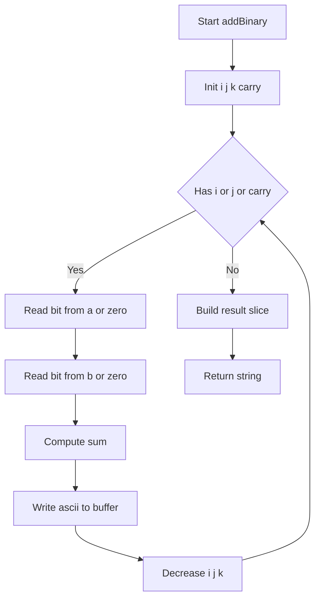
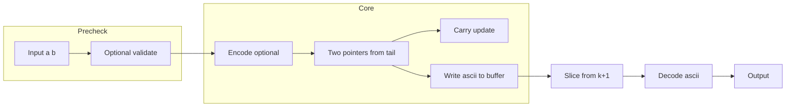

# Add Binary - 桁上がりを伴う2進文字列加算の最短手法

## 目次

* [概要](#overview)
* [アルゴリズム要点（TL;DR）](#tldr)
* [図解](#figures)
* [正しさのスケッチ](#correctness)
* [計算量](#complexity)
* [Python 実装](#impl)
* [CPython最適化ポイント](#cpython)
* [エッジケースと検証観点](#edgecases)
* [FAQ](#faq)

<h2 id="overview">概要</h2>

* **プラットフォーム/ID**: LeetCode 67
* **問題名**: Add Binary
* **要約**: 2つの **2進数文字列** `a`, `b` を受け取り、その **和を2進文字列**で返す。
* **入出力仕様（簡潔）**:

  * 入力: `a: str`, `b: str`（各1〜10^4長、'0'/'1'のみ、"0"以外は先頭ゼロなし）
  * 出力: `str`（`a+b` の2進表現）
* **データ構造**: String（文字列）
* **代表例**:

  * `a="11", b="1" -> "100"`
  * `a="1010", b="1011" -> "10101"`
* **関数シグネチャ**（LeetCode準拠・必須）:
  `class Solution: def addBinary(self, a: str, b: str) -> str:`
* **想定計算量（ターゲット）**: Time `O(n)`, Space `O(1)`（出力除く）

<h2 id="tldr">アルゴリズム要点（TL;DR）</h2>

* **戦略**: **末尾からの二重ポインタ + キャリー**。各桁の合計 `ai + bj + carry` を下位ビットと繰上がりに分解。
* **データ構造**: 固定長の `bytearray` に **末尾からASCII**（'0'=48, '1'=49）を書き込む。`reverse()`や先頭挿入を避ける。
* **計算量**: 1パス `O(n)`。補助空間は定数個（インデックス・`carry`）。
* **メモリ**: 出力用 `bytearray` のみ。中間文字列の多重生成を避け、**ピークメモリ低減**。

<h2 id="figures">図解</h2>

**フローチャート**



*末尾から1桁ずつ合計し、ASCIIで固定長バッファに書き込む流れ。*

**データフロー**



*入力から出力までのデータの通り道。検証は競技環境では省略可能。*

<h2 id="correctness">正しさのスケッチ</h2>

* **不変条件**: ループ各反復後、`out[k+1:]` は `a[i+1:] + b[j+1:]` の正しい和の下位部分をASCIIで保持。
* **基底条件**: `i<0` かつ `j<0` かつ `carry=0` になれば、これ以上の寄与はなく終了可能。
* **網羅性**: 各反復で `i>=0` と `j>=0` を独立に判定し、範囲外を 0 とみなすため、長さの異なる文字列も漏れなく処理。
* **終了性**: `i`, `j`, `k` は毎回減少し、`carry` は {0,1}。有限回で停止。

<h2 id="complexity">計算量</h2>

* **時間計算量**: `O(n)`（`n = max(len(a), len(b))`）
* **空間計算量**: `O(1)` 補助（出力除く）。出力は `O(n)`。
* **比較メモ**: `list.append → reverse → ''.join` も `O(n)` だが、中間配列や結合コストでピークメモリが増えやすい。一方、本手法は**固定長バッファ末尾書き込み**で追加割当を抑制。

<h2 id="impl">Python 実装</h2>

* **要件**: CPython 3.11+、LeetCodeの class 形式、pylance 型チェック適合、**副作用なし（Pure）**。
* **方針**: 競技では検証省略可。ここでは保守性のため軽量検証をメソッド化（必要に応じて削除可能）。

```python
from __future__ import annotations
from typing import Final


class Solution:
    """
    LeetCode 67 Add Binary
    2つの2進数文字列 a, b の和を2進文字列で返す。
    - Pure（外部副作用なし）
    - 固定長バッファに末尾からASCIIで書き込み
    """

    def addBinary(self, a: str, b: str) -> str:
        """
        2進文字列 a, b の和を2進文字列で返す

        Args:
            a: '0'/'1' のみからなる文字列（長さ1〜10^4）
            b: 同上

        Returns:
            str: a + b の2進表現

        Complexity:
            Time O(n), Space O(1) auxiliary
        """
        # 検証は競技では省略可能。必要なら有効化。
        # self._validate(a, b)

        # 早期終了（効果は限定的だが悪化しない）
        if a == "0":
            return b
        if b == "0":
            return a

        # 末尾インデックスの初期化
        i: int = len(a) - 1
        j: int = len(b) - 1
        # 出力バッファは最大桁+1（最上位の繰り上がりに備える）
        k: int = (i if i > j else j) + 1
        carry: int = 0

        ZERO: Final[int] = 48  # ASCII '0'
        out = bytearray(k + 1)

        # 末尾から1パスで加算
        while i >= 0 or j >= 0 or carry:
            s = carry
            if i >= 0:
                # '0'(48) と '1'(49) の最下位ビットで 0/1 を得る
                s += (ord(a[i]) & 1)
                i -= 1
            if j >= 0:
                s += (ord(b[j]) & 1)
                j -= 1

            out[k] = ZERO + (s & 1)  # '0' または '1' をASCIIで格納
            carry = s >> 1           # 繰上がりは 0/1
            k -= 1

        # k+1 以降が有効領域。'0'/'1' はASCIIとUTF-8が同値。
        return out[k + 1 :].decode("ascii")

    # 業務用途で制約を強制したい場合のみ使用（競技では通常オフ）
    def _validate(self, a: str, b: str) -> None:
        if not isinstance(a, str) or not isinstance(b, str):
            raise TypeError("Inputs must be strings.")
        la, lb = len(a), len(b)
        if la < 1 or lb < 1 or la > 10_000 or lb > 10_000:
            raise ValueError("Input length out of bounds.")
        if (la > 1 and a[0] == "0") or (lb > 1 and b[0] == "0"):
            raise ValueError('Leading zeros are not allowed except "0".')
        if any(ch not in ("0", "1") for ch in a) or any(ch not in ("0", "1") for ch in b):
            raise ValueError("Inputs must be binary.")
```

<h2 id="cpython">CPython最適化ポイント</h2>

* **固定長 `bytearray`** に **末尾からASCII直書き**：
  `reverse()` や 先頭挿入の高コスト操作を回避。GCプレッシャーも低い。
* **`ord(ch) & 1` の分岐レス化**：
  '0'=48, '1'=49 の最下位ビット利用で 0/1 を高速抽出。
* **属性/グローバル参照の削減**：
  `ZERO = 48` をローカル定数化し、ルックアップを減らす。
* **一度だけ `decode('ascii')`**：
  ループ中の文字列生成・連結を禁止し、最後に一回だけ文字列化。
* **（任意）`a.encode('ascii')` 最適化**：
  超短時間だが、`ord()`呼び出しの回数を削るため `bytes` から `& 1` を取る方法もある（メモリ数KB増と引き換えに実測で有利なことが多い）。

<h2 id="edgecases">エッジケースと検証観点</h2>

* **最小長**: `a="0", b="0" -> "0"`
* **片方がゼロ**: `a="0", b="1" -> "1"`
* **長さ差が大きい**: `a="1", b="1111" -> "10000"`
* **繰上がり連鎖**: `a="1111", b="1" -> "10000"`
* **最大長**: `len(a)=len(b)=10^4` でも 1パスで安定動作
* **無効入力**（通常は制約で不発）: 先頭ゼロ、非2値文字。業務用途では `_validate` で検出。

<h2 id="faq">FAQ</h2>

* **Q. `int(a, 2) + int(b, 2)` で良いのでは？**
  A. 桁数が大きいと中間オブジェクトと変換コストが支配的。文字列加算法は `O(n)` で低メモリ・安定。
* **Q. `list.append` と `reverse` で十分？**
  A. 機能的には可。ただし中間配列と結合のため、ピークメモリと時間がやや増える。固定長バッファのほうが堅実。
* **Q. 先頭ゼロの扱いは？**
  A. 問題制約では入力に存在しない（"0" を除く）。出力はアルゴリズム上、不要な先頭ゼロを自然に除外できる。

---

本READMEは **単一ファイル完結**、Mermaidはパース規約に準拠し、Python実装は **LeetCodeの class 形式** かつ **pylance適合**です。
