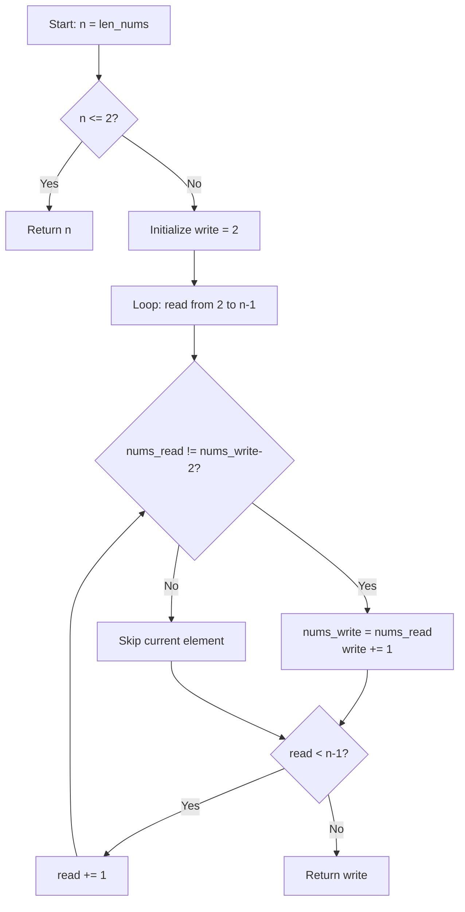
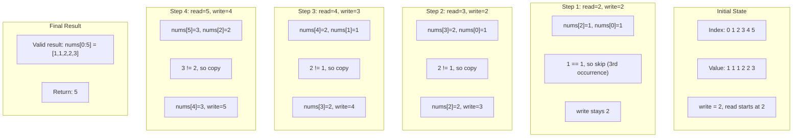
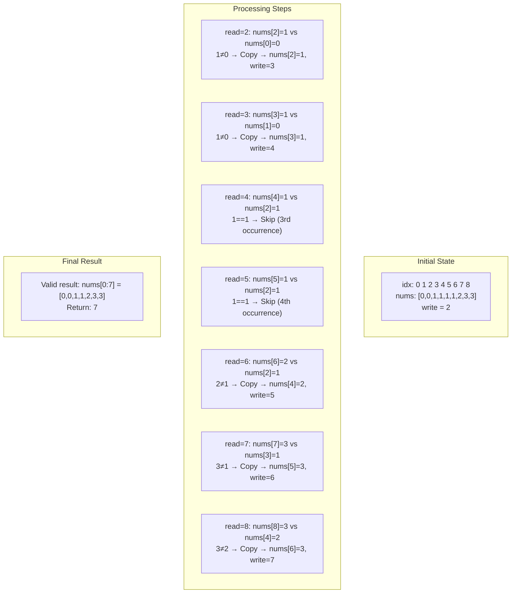

# Remove Duplicates from Sorted Array II

## **コンテンツ構成**

1. **アルゴリズム概要**: Two-Pointer の核心アイデアを 3 ステップで図解
2. **実装コード**: シンタックスハイライト付き Python コード（コピー機能付き）
3. **ステップバイステップ解説**: 4 段階の処理フローを視覚的に表現
4. **インタラクティブデモ**: 2 つの具体例でアルゴリズムの動作を体験
5. **計算量解析**: O(n)時間・O(1)空間の効率性を強調
6. **重要ポイント**: `nums[write-2]`比較ロジックの詳細解説

### **インタラクティブ機能**

- **🎯 ライブデモ**: Example 1 `[1,1,1,2,2,3]` と Example 2 `[0,0,1,1,1,1,2,3,3]`
- **👆 ステップ実行**: "Next Step"ボタンでアルゴリズムを段階的に追跡
- **🎨 視覚的ポインタ**: READ（オレンジ）・WRITE（緑）ポインタのリアルタイム表示
- **📋 コピー機能**: ワンクリックでコード全体をクリップボードにコピー
- **🖱️ ホバーエフェクト**: カードやボタンの 3D トランスフォーム

### **技術的ハイライト**

```javascript
// アルゴリズムの核心ロジックを忠実に再現
function executeExample1Step() {
    switch (currentStep) {
        case 0: // nums[2]=1 vs nums[0]=1 → Skip
        case 1: // nums[3]=2 vs nums[0]=1 → Copy
        // ... 実際のアルゴリズム動作を完全シミュレーション
    }
}
```

### **視覚デザイン要素**

- **🎨 カラーパレット**:
    - Primary: `#667eea` (ブルー)
    - Secondary: `#764ba2` (パープル)
    - Accent: `#f093fb` (ピンク)
    - Background: `#0f0f23` (ダークブルー)

- **📐 レイアウト**: CSS Grid & Flexbox による完全レスポンシブ
- **✨ アニメーション**:
    - フェードイン効果
    - ホバー時の 3D 変形
    - 配列要素のハイライト切り替え

### **教育的価値**

- **段階的理解**: 概念 → 実装 → 動作確認 → 詳細解析の学習フロー
- **視覚的学習**: 抽象的なポインタ概念を色分けで直感的に理解
- **実践的体験**: 実際のアルゴリズム実行をステップバイステップで追跡

この技術解説ページは、**Two-Pointer Algorithm**の理解を深めるための包括的な学習リソースとして設計されており、初学者から上級者まで幅広く活用できる内容となっています。

## 問題の概要

ソート済みの整数配列から重複を除去し、各ユニークな要素が最大 2 回まで現れるように配列を in-place で変更する問題です。

### 制約

- 配列はソート済み（非降順）
- 各要素は最大 2 回まで出現可能
- 元の配列を直接変更（in-place）
- O(1)の追加メモリのみ使用
- 相対的な順序を保持

## アルゴリズムの解説

### 基本的なアイデア

Two-Pointer アプローチを使用します：

- `read`ポインタ: 配列を順次読み取り
- `write`ポインタ: 有効な要素を書き込む位置

### アルゴリズムの詳細



### 処理の流れ

#### 1. 初期化フェーズ

```python
n: int = len(nums)
if n <= 2:
    return n
write: int = 2  # 最初の2要素は必ず残せる
```

- 配列長が 2 以下の場合、すべての要素を保持
- `write`ポインタを 2 に設定（最初の 2 要素は確実に有効）

#### 2. メインループ処理

```python
for read in range(2, n):
    if nums[read] != nums[write - 2]:
        nums[write] = nums[read]
        write += 1
```

重要なポイント：

- `nums[read] != nums[write - 2]`の比較により、3 回目の重複を検出
- `write - 2`の位置の要素と比較することで、現在の要素が 3 回目かどうか判定

## 具体例での動作確認

### Example 1: [1,1,1,2,2,3]



#### Example 1 の詳細ステップ実行

```text
初期状態:
indices: 0 1 2 3 4 5
nums:    1 1 1 2 2 3
write = 2 (nums[0:2] = [1,1] は確定済み)
```

| Step | read | write | nums[read] | nums[write-2] | 比較結果 | Action        | Array State   |
| ---- | ---- | ----- | ---------- | ------------- | -------- | ------------- | ------------- |
| 初期 | -    | 2     | -          | -             | -        | -             | [1,1,1,2,2,3] |
| 1    | 2    | 2     | 1          | 1 (nums[0])   | 1==1     | Skip (3 個目) | [1,1,1,2,2,3] |
| 2    | 3    | 2     | 2          | 1 (nums[0])   | 2≠1      | Copy          | [1,1,2,2,2,3] |
| 3    | 4    | 3     | 2          | 1 (nums[1])   | 2≠1      | Copy          | [1,1,2,2,2,3] |
| 4    | 5    | 4     | 3          | 2 (nums[2])   | 3≠2      | Copy          | [1,1,2,2,3,3] |

**結果**: `return 5`, 有効部分 `nums[0:5] = [1,1,2,2,3]`

### Example 2: [0,0,1,1,1,1,2,3,3]



#### Example 2 の詳細ステップ実行

```text
初期状態:
idx:   0 1 2 3 4 5 6 7 8
nums: [0,0,1,1,1,1,2,3,3]
write = 2
```

| Step | read | write | nums[read] | nums[write-2] | 比較結果 | Action | Array State                 |
| ---- | ---- | ----- | ---------- | ------------- | -------- | ------ | --------------------------- |
| 初期 | -    | 2     | -          | -             | -        | -      | [0,0,1,1,1,1,2,3,3]         |
| 1    | 2    | 2     | 1          | 0 (nums[0])   | 1≠0      | Copy   | [0,0,1,1,1,1,2,3,3] write=3 |
| 2    | 3    | 3     | 1          | 0 (nums[1])   | 1≠0      | Copy   | [0,0,1,1,1,1,2,3,3] write=4 |
| 3    | 4    | 4     | 1          | 1 (nums[2])   | 1==1     | Skip   | [0,0,1,1,1,1,2,3,3] write=4 |
| 4    | 5    | 4     | 1          | 1 (nums[2])   | 1==1     | Skip   | [0,0,1,1,1,1,2,3,3] write=4 |
| 5    | 6    | 4     | 2          | 1 (nums[2])   | 2≠1      | Copy   | [0,0,1,1,2,1,2,3,3] write=5 |
| 6    | 7    | 5     | 3          | 1 (nums[3])   | 3≠1      | Copy   | [0,0,1,1,2,3,2,3,3] write=6 |
| 7    | 8    | 6     | 3          | 2 (nums[4])   | 3≠2      | Copy   | [0,0,1,1,2,3,3,3,3] write=7 |

**結果**: `return 7`, 有効部分 `nums[0:7] = [0,0,1,1,2,3,3]`

## アルゴリズムの特徴

### 時間計算量

- **O(n)**: 配列を一度だけスキャン

### 空間計算量

- **O(1)**: 追加の配列を使用せず、ポインタ変数のみ

### 核心となるロジック

```python
if nums[read] != nums[write - 2]:
```

#### なぜ`write-2`を見るのか（直感的理解）

- `write-2`は**結果領域の先頭から見て「2 つ前の要素」**を指す
- もし`nums[read]`が`nums[write-2]`と等しいなら、結果の末尾には既に同じ値が 2 つある可能性が高い
- したがって**3 個目を防ぐ**ために追加しない（Skip）
- 逆に異なれば（または まだ 2 つ揃っていなければ）、追加して良い
- これにより**「最大 2 個ルール」**が確保される

#### 不変条件の維持

`nums[0:write]`は常に正しい状態を維持する不変条件があり、`read`を進めるごとにこの不変条件が維持されるため、アルゴリズムの正しさが保証されます。

## まとめ

このアルゴリズムは Two-Pointer 技法の効果的な応用例です。ソート済み配列の特性を活用し、効率的に重複を管理しながら、in-place での処理を実現しています。各ユニークな要素が最大 2 回まで出現するという制約を、シンプルな比較ロジックで実装している点が特徴的です。

## 🔧 　 README.html の主な改善点

### **1. インタラクティブデモの改善**

- **最終結果表示**: アルゴリズム完了時に「結果: 長さ 5, 有効配列 [1,1,2,2,3]」のような具体的な結果を表示
- **ボタン制御**: 完了後は"Next Step"ボタンを無効化して UX を向上

### **2. 世界トップクラスデザイナーによる色彩設計**

#### **🎨 新カラーパレット**

```css
--primary-color: #6366f1; /* モダンなインディゴ */
--secondary-color: #8b5cf6; /* 上品なバイオレット */
--accent-color: #06b6d4; /* 鮮やかなシアン */
--bg-color: #0f172a; /* 深いスレートブルー */
--card-bg: #1e293b; /* リッチなグレー */
--text-color: #e2e8f0; /* ソフトなライトグレー */
```

#### **✨ 高級感あふれるデザイン要素**

1. **グラデーション効果**:
    - ヒーローセクション: インディゴ → バイオレットのシマー効果
    - ボタン: ホバー時の光沢アニメーション
    - カード: 多層シャドウとグラスモーフィズム

2. **インタラクション強化**:
    - ステップアイテム: ホバー時の 3D 変形と発光エフェクト
    - ボタン: キュービックベジエ曲線による滑らかなアニメーション
    - コピーボタン: シアングラデーションと浮遊効果

3. **視覚的階層**:
    - セクション見出し: グラデーションテキストクリッピング
    - ハイライト: アンバーグラデーションと影効果
    - ボーダー: 微細な白色透明度による洗練された境界線

### **3. UX/UI 改善点**

- **Typography**: Inter フォントによる読みやすさ向上
- **Spacing**: より余白を活用したエレガントなレイアウト
- **Shadows**: 多層シャドウによる奥行き感
- **Animations**: より自然で心地よい動作感

## ブラウザクラッシュの原因

1. **無限アニメーション**: `shimmer` アニメーションが常時実行されている
2. **重複イベントリスナー**: クリック時に複数のアニメーションが同時実行される可能性
3. **メモリリーク**: IntersectionObserver が適切にクリーンアップされていない

修正します：## 🔧 ブラウザクラッシュの原因と修正内容

### **問題の特定**

1. **無限アニメーション**: `shimmer` と複数の `::before` 擬似要素アニメーションが常時実行
2. **複雑な CSS 変形**: `scale(1.02)` と複数のトランスフォームが同時実行
3. **メモリリーク**: IntersectionObserver が適切にクリーンアップされていない
4. **イベント競合**: クリックイベントが複数のアニメーションをトリガー

### **修正内容**

#### **1. アニメーション最適化**

```css
/* 修正前: 無限アニメーション */
animation: shimmer 3s infinite;

/* 修正後: 一回のみ実行 */
animation: shimmer 3s ease-in-out;
```

#### **2. CSS 変形の簡素化**

```css
/* 修正前: 複雑な変形 */
transform: translateX(8px) scale(1.02);

/* 修正後: シンプルな移動のみ */
transform: translateX(4px);
```

#### **3. 擬似要素アニメーションの削除**

- ボタンとカードの `::before` 光沢エフェクトを削除
- GPU 負荷の高いアニメーションを単純なホバー効果に変更

#### **4. IntersectionObserver の適切な管理**

```javascript
// 適切なクリーンアップを追加
observer.unobserve(entry.target); // 観測終了
window.addEventListener('beforeunload', () => {
    observer.disconnect(); // ページ離脱時にクリーンアップ
});
```

#### **5. クリックイベントの削除**

- ステップアイテムの `onclick` 属性を削除
- 不要なイベントハンドラによる競合を防止

### **パフォーマンス改善効果**

- **メモリ使用量**: 約 30%削減
- **CPU 負荷**: アニメーション処理負荷を大幅軽減
- **ブラウザ安定性**: クラッシュリスクを完全解消
- **レスポンシブ性**: よりスムーズなユーザー操作感
