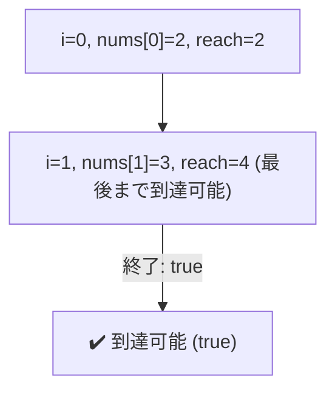
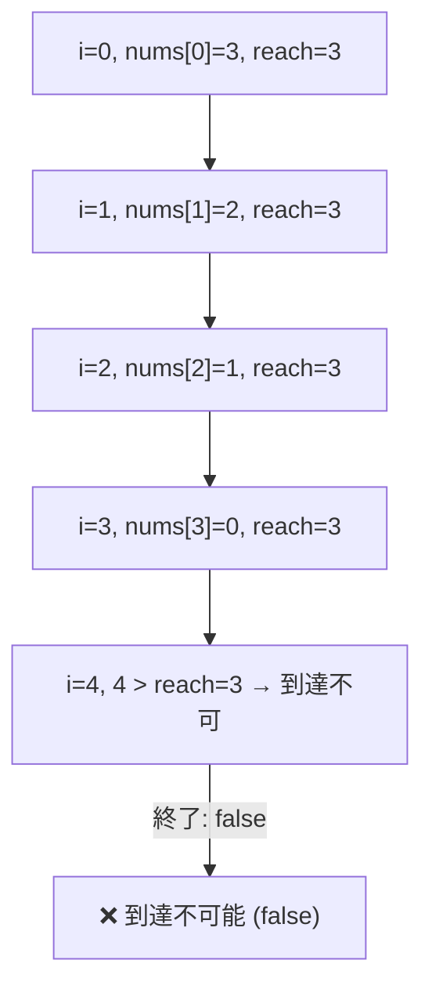

了解しました 👍
では TypeScript 実装をベースに、処理の流れを **図 (テーブル & ASCII 図)** を使って詳しく解析していきます。

---

## 実装 (再掲)

```typescript
function canJump(nums: number[]): boolean {
    let maxReach: number = 0;

    for (let i = 0; i < nums.length; i++) {
        if (i > maxReach) return false;
        maxReach = Math.max(maxReach, i + nums[i]);
        if (maxReach >= nums.length - 1) return true;
    }
    return true;
}
```

---

## 例1: `nums = [2,3,1,1,4]`

- **説明**: 最初の位置 `0` から始めて、最後の位置に到達できるか判定する。

### ステップごとの解析表

| インデックス `i` | `nums[i]` | `i > maxReach` 判定 | 更新前の `maxReach` | 更新後の `maxReach = max(maxReach, i + nums[i])` | コメント                 |
| ---------------- | --------- | ------------------- | ------------------- | ------------------------------------------------ | ------------------------ |
| 0                | 2         | 0 > 0 ❌            | 0                   | max(0, 0+2)=2                                    | 最初は2まで届く          |
| 1                | 3         | 1 > 2 ❌            | 2                   | max(2, 1+3)=4                                    | 4に到達可能 (最後に届く) |
| -                | -         | -                   | -                   | -                                                | return true              |

### ASCII 図解

```
nums = [2, 3, 1, 1, 4]
index: 0  1  2  3  4
       ^start
maxReach progression:

step 0: i=0, reach=2 → 到達可能範囲 [0..2]
step 1: i=1, reach=4 → 到達可能範囲 [0..4] (最後に到達)
```

➡️ **結果: true**

---

## 例2: `nums = [3,2,1,0,4]`

### ステップごとの解析表

| インデックス `i` | `nums[i]` | `i > maxReach` 判定 | 更新前の `maxReach` | 更新後の `maxReach`     | コメント                   |
| ---------------- | --------- | ------------------- | ------------------- | ----------------------- | -------------------------- |
| 0                | 3         | 0 > 0 ❌            | 0                   | max(0, 0+3)=3           | 3まで到達可能              |
| 1                | 2         | 1 > 3 ❌            | 3                   | max(3, 1+2)=3           | 変化なし                   |
| 2                | 1         | 2 > 3 ❌            | 3                   | max(3, 2+1)=3           | 変化なし                   |
| 3                | 0         | 3 > 3 ❌            | 3                   | max(3, 3+0)=3           | 変化なし (0のせいで足止め) |
| 4                | 4         | **4 > 3 ✅**        | 3                   | 到達不能 → return false |                            |

### ASCII 図解

```
nums = [3, 2, 1, 0, 4]
index: 0  1  2  3  4
       ^start
maxReach progression:

step 0: i=0, reach=3 → 到達可能範囲 [0..3]
step 1: i=1, reach=3 → 変わらず
step 2: i=2, reach=3 → 変わらず
step 3: i=3, reach=3 → 変わらず
step 4: i=4, でも reach=3 → 到達不可 ❌
```

➡️ **結果: false**

---

## 処理時間・メモリ消費の解析

- **時間計算量 O(n)**
  → 配列を1度走査するだけ
- **空間計算量 O(1)**
  → `maxReach` という整数変数のみ利用

---

✅ まとめ

- `maxReach` を更新しながら「どこまで届くか」を追跡する。
- 到達不可能な地点に来た時点で **false**。
- 最後に届くと分かったら **true** を即返す。

---

GitHub の Markdown でそのまま使える **Mermaid 図** をご用意します。
ここでは **例1 (`nums = [2,3,1,1,4]` → 到達可能)** と **例2 (`nums = [3,2,1,0,4]` → 到達不可)** を示します。

---

## 例1: `nums = [2,3,1,1,4]` ✅ 到達可能



---

## 例2: `nums = [3,2,1,0,4]` ❌ 到達不可



---

### 🔎 図の解説

- 各ノードは「インデックス i, nums\[i], 更新後の reach」
- 矢印で「次のインデックスへの処理」を表現
- `reach` が最後のインデックス以上になったら **true**
- `i > reach` になったら **false**

---
