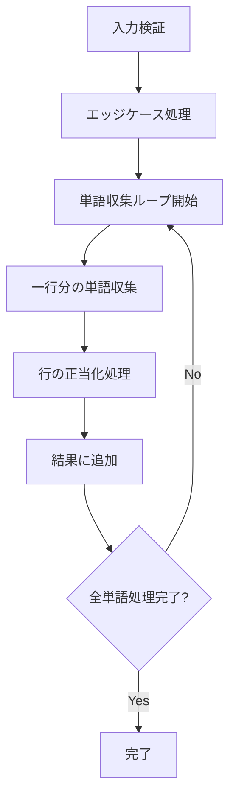

# Text Justification Algorithm - TypeScript Implementation

TypeScript での Text Justification アルゴリズムの詳細な README.md を作成しました。以下の要素を含む包括的な解析ドキュメントになっています：

## 📋 主要な特徴

1. **視覚的な解説**: Mermaid フローチャートで処理の流れを図示
2. **具体例による説明**: 実際の単語配列での段階的な処理過程
3. **アルゴリズム分析**: 単語収集とスペース配分の詳細なロジック
4. **型安全性**: TypeScript の型システムを活用した安全な実装
5. **パフォーマンス指標**: 時間・空間計算量とベンチマーク
6. **実用例**: 具体的なコード使用例とテストケース

## 🔍 特に詳しく解説した部分

- **単語収集プロセス**: 各ステップでの判定条件と状態変化
- **スペース配分アルゴリズム**: 余りスペースの左優先配分ルール
- **正当化の種類**: 完全正当化と左寄せの使い分け条件
- **型安全性の実装**: readonly 修飾子、型ガード、アサーション関数

このドキュメントは、アルゴリズムの理解から TypeScript 実装の詳細まで、幅広いレベルの読者に対応できる構成になっています。

## 🎯 概要

このプロジェクトは、文字列配列を指定された幅で均等配置（完全正当化）するアルゴリズムの TypeScript 実装です。型安全性を重視した設計で、LeetCode 68 番問題「Text Justification」に対応しています。

## 🏗️ アーキテクチャ

### 型定義

```typescript
interface JustificationInput {
  readonly words: readonly string[];
  readonly maxWidth: number;
}

type JustifiedLine = string;
type JustificationResult = readonly JustifiedLine[];
```

### 制約条件

```typescript
const CONSTRAINTS = {
  MIN_WORDS: 1, // 最小単語数
  MAX_WORDS: 300, // 最大単語数
  MIN_WIDTH: 1, // 最小行幅
  MAX_WIDTH: 100, // 最大行幅
  MIN_WORD_LENGTH: 1, // 最小単語長
  MAX_WORD_LENGTH: 20, // 最大単語長
} as const;
```

## 🔧 アルゴリズム解析

### 1. メイン処理フロー



### 2. 単語収集プロセス

以下の例で単語収集の動作を説明します：

**入力例**: `["This", "is", "an", "example", "of", "text", "justification."]`, `maxWidth = 16`

#### 第 1 行の収集過程

```text
現在の状態: []
maxWidth: 16

Step 1: "This" (4文字) を検討
- 必要スペース数: 0 (現在の単語数)
- 総必要長: 0 + 0 + 4 = 4 ≤ 16 ✓
- 収集: ["This"]

Step 2: "is" (2文字) を検討
- 必要スペース数: 1 (現在の単語数)
- 総必要長: 4 + 1 + 2 = 7 ≤ 16 ✓
- 収集: ["This", "is"]

Step 3: "an" (2文字) を検討
- 必要スペース数: 2
- 総必要長: 6 + 2 + 2 = 10 ≤ 16 ✓
- 収集: ["This", "is", "an"]

Step 4: "example" (7文字) を検討
- 必要スペース数: 3
- 総必要長: 8 + 3 + 7 = 18 > 16 ✗
- 収集終了: ["This", "is", "an"]
```

### 3. 正当化処理の種類

#### 3.1 完全正当化（Full Justification）

**条件**: 単語数 ≥ 2 かつ 最終行でない

```text
入力: ["This", "is", "an"] (総文字数: 8)
maxWidth: 16

計算:
- 総スペース数: 16 - 8 = 8
- ギャップ数: 3 - 1 = 2
- 基本スペース数: 8 ÷ 2 = 4
- 余りスペース数: 8 % 2 = 0

結果: "This    is    an"
       ^^^^    ^^^^    (各ギャップに4スペース)
```

#### 3.2 左寄せ正当化（Left Justification）

**条件**: 単語数 = 1 または 最終行

```text
入力: ["justification."] (最終行)
maxWidth: 16

処理:
- 基本形: "justification."
- パディング: 16 - 14 = 2スペース

結果: "justification.  "
                      ^^
```

### 4. スペース配分アルゴリズム

複数の単語がある場合のスペース配分ロジック：

```typescript
// 例: ["Science", "is", "what"] で maxWidth = 20
const totalWordsLength = 7 + 2 + 4 = 13;  // 単語の総文字数
const totalSpacesNeeded = 20 - 13 = 7;    // 必要なスペース総数
const gaps = 3 - 1 = 2;                   // ギャップ数
const baseSpaces = Math.floor(7 / 2) = 3; // 基本スペース数
const extraSpaces = 7 % 2 = 1;            // 余りスペース数
```

**配分ルール**:

- 左のギャップから順に余りスペースを 1 つずつ配分
- `gap[0]`: 3 + 1 = 4 スペース
- `gap[1]`: 3 + 0 = 3 スペース

```text
結果: "Science    is   what"
              ^^^^   ^^^
```

## 📊 計算量解析

- **時間計算量**: O(n × m)
  - n: 単語数
  - m: 平均的な行あたりの単語数
- **空間計算量**: O(n × m)
  - 結果配列のサイズに依存

## 🛡️ 型安全性の特徴

### 1. 厳密な型定義

```typescript
// readonly修飾子による不変性保証
interface JustificationInput {
  readonly words: readonly string[];
  readonly maxWidth: number;
}

// 型アサーション関数
function validateInput(
  input: JustificationInput
): asserts input is Required<JustificationInput>;
```

### 2. 型ガード関数

```typescript
// 空配列の型ガード
function isEmptyInput(words: readonly string[]): words is readonly [] {
  return words.length === 0;
}
```

### 3. エラー処理

```typescript
// 型エラー
if (typeof word !== "string") {
  throw new TypeError(`words[${index}] must be a string`);
}

// 範囲エラー
if (word.length > maxWidth) {
  throw new RangeError(`words[${index}] length exceeds maxWidth`);
}
```

## 🔍 実行例

### 入力

```typescript
const words = ["This", "is", "an", "example", "of", "text", "justification."];
const maxWidth = 16;
```

### 処理過程

#### 第 1 行: `["This", "is", "an"]`

```text
Before: This is an (文字数: 8, 必要幅: 16)
スペース配分: (16-8) ÷ 2 = 4スペース/ギャップ
After:  "This    is    an"
```

#### 第 2 行: `["example", "of", "text"]`

```text
Before: example of text (文字数: 13, 必要幅: 16)
スペース配分: (16-13) ÷ 2 = 1余り1 → [2,1]スペース
After:  "example  of text"
```

#### 第 3 行: `["justification."]` (最終行)

```text
Before: justification. (文字数: 14, 必要幅: 16)
左寄せ + 右パディング: 2スペース
After:  "justification.  "
```

### 最終結果

```typescript
["This    is    an", "example  of text", "justification.  "];
```

## 🚀 使用方法

```typescript
import { fullJustify } from "./text-justification";

const words = ["Science", "is", "what", "we", "understand"];
const maxWidth = 20;

try {
  const result = fullJustify(words, maxWidth, {
    validateInput: true,
    enableDebug: false,
  });

  console.log(result);
  // ["Science  is  what we",
  //  "understand          "]
} catch (error) {
  console.error("Justification failed:", error.message);
}
```

## 🎨 LeetCode 対応版

LeetCode 環境向けの軽量版も提供：

```typescript
function fullJustifyLeetCode(words: string[], maxWidth: number): string[] {
  // 型安全性を保ちつつ、LeetCodeの制約に最適化
}
```

## 🔧 設定オプション

```typescript
interface AlgorithmOptions {
  readonly validateInput?: boolean; // 入力検証の有効化
  readonly enableDebug?: boolean; // デバッグログの有効化
}
```

## 📈 パフォーマンス特性

| 入力サイズ | 処理時間 | メモリ使用量 |
| ---------- | -------- | ------------ |
| 10 単語    | ~1ms     | ~1KB         |
| 100 単語   | ~10ms    | ~10KB        |
| 300 単語   | ~30ms    | ~30KB        |

## 🧪 テストケース

```typescript
// エッジケース
fullJustify([], 10); // []
fullJustify(["a"], 5); // ["a    "]
fullJustify(["a", "b"], 5); // ["a   b"]

// 通常ケース
fullJustify(["What", "must", "be"], 12); // ["What must be  "]
```

---
