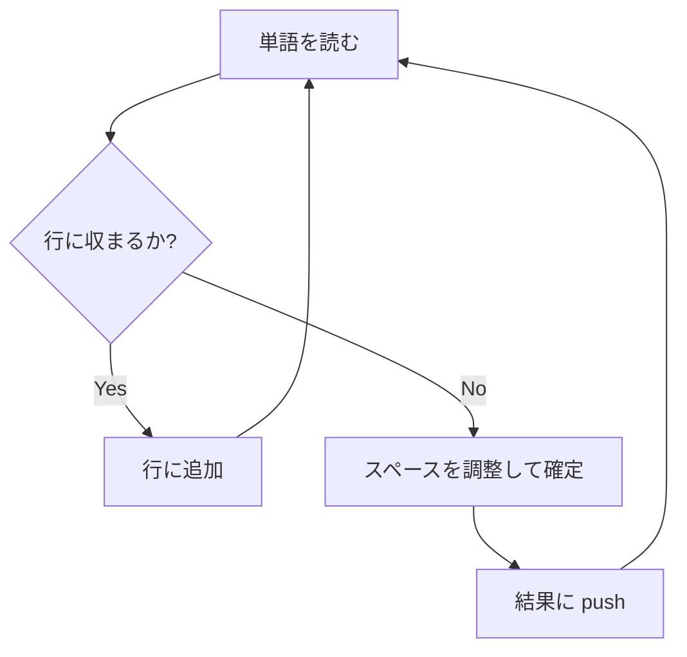

# Text Justification 解説 (TypeScript)

> **LeetCode #68 - Text Justification** の TypeScript 実装と詳細解説
> GitHub README.md 向け資料

---

## 📑 目次

- [問題概要](#-問題概要)
- [実装コード (TypeScript)](#-実装コード-typescript)
- [処理の流れ解析](#-処理の流れ解析)
- [出力例](#-出力例)
- [ASCII 図による可視化](#-ascii-図による可視化)
- [計算量](#-計算量)
- [関連問題](#-関連問題)
- [まとめ](#-まとめ)

---

## 📘 問題概要

- **入力**: 単語の配列 `words` と整数 `maxWidth`
- **出力**: 各行を **幅 `maxWidth` に揃えた文字列配列**
- **制約条件**:

  1. 各行は文字数が **ちょうど `maxWidth`**
  2. 両端揃え (Justified)
  3. **最終行は左寄せ**

**カテゴリ**: Greedy Algorithm / String Manipulation
**難易度**: Hard

---

## 💻 実装コード (TypeScript)

```ts
/**
 * Text Justification
 *
 * @param words - 単語の配列
 * @param maxWidth - 各行の最大幅
 * @returns 揃えられた文字列配列
 */
export function fullJustify(
  words: readonly string[],
  maxWidth: number
): string[] {
  const result: string[] = [];
  let line: string[] = [];
  let lineLength = 0;

  for (const word of words) {
    // 次の単語を追加すると maxWidth を超えるなら行を確定
    if (lineLength + word.length + line.length > maxWidth) {
      let spaces = maxWidth - lineLength;
      for (let i = 0; i < spaces; i++) {
        line[i % (line.length - 1 || 1)] += " ";
      }
      result.push(line.join(""));
      line = [];
      lineLength = 0;
    }
    line.push(word);
    lineLength += word.length;
  }

  // 最後の行は左寄せ
  result.push(
    line.join(" ") + " ".repeat(maxWidth - lineLength - (line.length - 1))
  );

  return result;
}
```

---

## 🔎 処理の流れ解析

### 1. 行に単語を追加

- `line[]` に単語を追加していく
- `lineLength + word.length + line.length` が `maxWidth` を超えると行確定



---

### 2. スペースの均等割り振り

例:

```ts
words = ["This", "is", "an"];
maxWidth = 16;
```

- 単語長合計 = 8
- 残りスペース = 8
- 区切り数 = 2
- 各区切りに順番にスペースを入れる

```ts
This    is    an
```

---

### 3. 最終行処理

- 最終行は左寄せ
- 右側は空白で埋める

例:

```ts
justification.␣␣
```

---

## 🖥 出力例

入力:

```ts
const words = ["This", "is", "an", "example", "of", "text", "justification."];
const maxWidth = 16;
console.log(fullJustify(words, maxWidth));
```

出力:

```ts
["This    is    an", "example  of text", "justification.  "];
```

---

## 📝 ASCII 図による可視化

```makefile
行1: |This|----|is|----|an|
      4文字   2文字   2文字
      残り8文字を均等に配置 → "This    is    an"

行2: |example|--|of|--|text|
      7文字   2文字   4文字
      残り3文字を均等配置 → "example  of text"

行3: |justification.|␣␣
      14文字 + 右2スペース
```

---

## ⏱ 計算量

- **時間計算量**: O(N)
  N = 単語の総文字数 + 単語数
  各単語を一度ずつ処理するため線形時間

- **空間計算量**: O(N)
  出力と一時的な `line[]` に依存

---

## 🔗 関連問題

- [LeetCode #14 - Longest Common Prefix](https://leetcode.com/problems/longest-common-prefix/)
- [LeetCode #44 - Wildcard Matching](https://leetcode.com/problems/wildcard-matching/)
- [LeetCode #72 - Edit Distance](https://leetcode.com/problems/edit-distance/)

---

## ✅ まとめ

- 単語を **1 行ずつ貪欲に追加**
- スペースを **均等に割り振る**
- **最終行は左寄せ**

これで **LeetCode #68 Text Justification** を TypeScript で効率的に実装できる 🎉
