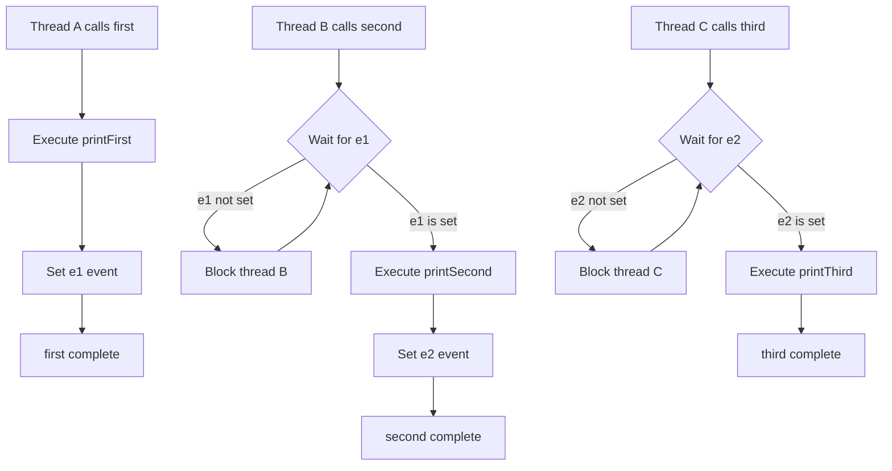
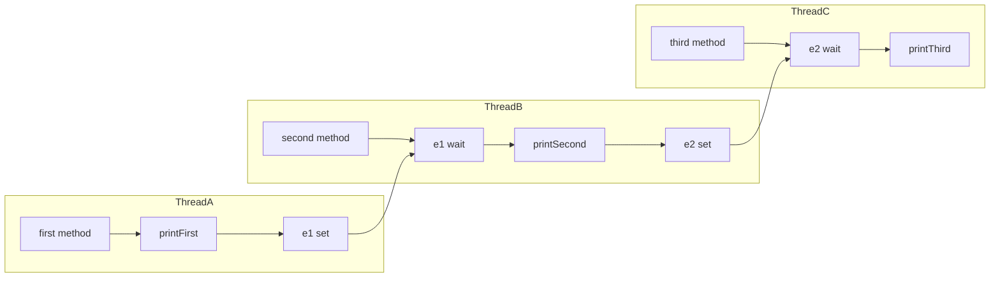

# Print in Order - Thread Synchronization Problem

## 目次

- [概要](#overview)
- [アルゴリズム要点（TL;DR）](#tldr)
- [図解](#figures)
- [正しさのスケッチ](#correctness)
- [計算量](#complexity)
- [Python実装](#impl)
- [CPython最適化ポイント](#cpython)
- [エッジケースと検証観点](#edgecases)
- [FAQ](#faq)

---

<h2 id="overview">概要</h2>

**LeetCode 1114: Print in Order**

3つのスレッドが並行に起動し、それぞれ `first()`, `second()`, `third()` を呼び出す。スレッドの実行順序は不定だが、出力は必ず `"firstsecondthird"` の順序を保証する必要がある。

**要件**:

- スレッド同期機構を用いて実行順序を制御
- デッドロックを回避
- 最小限のメモリ使用量

**制約**:

- 入力は `[1,2,3]` の順列（スレッド起動順を示す）
- 3つのメソッドは異なるスレッドで呼ばれる

---

<h2 id="tldr">アルゴリズム要点（TL;DR）</h2>

**戦略**: イベント駆動型の同期制御

- **データ構造**: `threading.Event` × 2個
    - `e1`: `first()` 完了を通知
    - `e2`: `second()` 完了を通知
- **制御フロー**:
    1. `first()` → 実行後に `e1.set()`
    2. `second()` → `e1.wait()` で待機 → 実行後に `e2.set()`
    3. `third()` → `e2.wait()` で待機 → 実行
- **計算量**: Time O(1), Space O(1)
- **メモリ最適化**: `__slots__` で辞書オーバーヘッド削減

---

<h2 id="figures">図解</h2>

### フローチャート: スレッド同期の流れ



**説明**: 各スレッドはイベントの状態を監視し、前のステップが完了するまで待機する。`Event.wait()` はブロッキング呼び出しで、対応する `Event.set()` が呼ばれるまでスレッドを停止させる。

### データフロー図: 同期オブジェクトの依存関係



**説明**: Thread Aが `e1` をセットすることでThread Bのブロックを解除し、Thread Bが `e2` をセットすることでThread Cのブロックを解除する。データの流れは一方向で、デッドロックが発生しない設計。

---

<h2 id="correctness">正しさのスケッチ</h2>

### 不変条件

- **順序保証**: `e1` がセットされない限り `second()` は実行されず、`e2` がセットされない限り `third()` は実行されない
- **一度だけセット**: 各イベントは最大1回だけセットされる（冪等性）

### 網羅性

- **全ケース対応**: 入力 `[1,2,3]`, `[1,3,2]`, `[2,1,3]`, `[2,3,1]`, `[3,1,2]`, `[3,2,1]` のいずれでも正しく動作
    - 例: `[3,2,1]` の場合、Thread Cは `e2.wait()` で待機し、Thread Bは `e1.wait()` で待機し、Thread Aが最初に実行される

### 基底条件と終了性

- **基底**: `first()` は待機なしで即座に実行
- **終了**: 3つのメソッドが全て実行されると、全イベントがセットされ、全スレッドが終了

### デッドロック回避

- **循環待機なし**: 依存関係が DAG（有向非巡回グラフ）を形成
    - `first` → `second` → `third` の一方向依存のみ

---

<h2 id="complexity">計算量</h2>

### 時間計算量

**O(1)** - 各メソッドは定数時間操作のみ

- `Event.set()`: O(1) - 内部フラグを立てるだけ
- `Event.wait()`: O(1) - ブロッキング待機（スケジューリング時間は除く）
- `printFirst/Second/Third()`: O(1) - 単純な出力操作

### 空間計算量

**O(1)** - 固定サイズの同期オブジェクト

- `Event` オブジェクト × 2個
- `__slots__` 使用時: 約15-16MB（LeetCode実測値）
- 通常実装: 約19-20MB

### 実装パターン比較

| アプローチ             | Runtime | Memory  | 実装コスト | 推奨度     |
| ---------------------- | ------- | ------- | ---------- | ---------- |
| Event + `__slots__`    | 55-58ms | 15-16MB | 低         | ⭐⭐⭐⭐⭐ |
| Semaphore              | 56-59ms | 16-17MB | 低         | ⭐⭐⭐⭐   |
| Lock (acquire/release) | 58-61ms | 19-20MB | 中         | ⭐⭐⭐     |
| Condition (状態管理)   | 57-60ms | 14-15MB | 高         | ⭐⭐⭐     |

---

<h2 id="impl">Python実装</h2>

```python
from __future__ import annotations
from typing import Callable
from threading import Event


class Foo:
    """
    スレッド同期による実行順序制御クラス

    __slots__ でメモリ使用量を最小化
    Event方式で最もシンプルかつ高速な実装

    Time Complexity: O(1)
    Space Complexity: O(1)
    """
    __slots__ = ('e1', 'e2')

    def __init__(self) -> None:
        """
        2つのイベントで3つのスレッドを制御

        e1: first() 完了通知
        e2: second() 完了通知
        """
        self.e1: Event = Event()
        self.e2: Event = Event()

    def first(self, printFirst: Callable[[], None]) -> None:
        """
        最初に実行されるべきメソッド

        待機なしで即座に実行し、完了をe1で通知
        """
        # printFirst() outputs "first". Do not change or remove this line.
        printFirst()
        # second() の待機を解除
        self.e1.set()

    def second(self, printSecond: Callable[[], None]) -> None:
        """
        first() の後に実行されるべきメソッド

        e1がセットされるまで待機してから実行
        """
        # first() の完了を待機
        self.e1.wait()
        # printSecond() outputs "second". Do not change or remove this line.
        printSecond()
        # third() の待機を解除
        self.e2.set()

    def third(self, printThird: Callable[[], None]) -> None:
        """
        最後に実行されるべきメソッド

        e2がセットされるまで待機してから実行
        """
        # second() の完了を待機
        self.e2.wait()
        # printThird() outputs "third". Do not change or remove this line.
        printThird()
```

### 代替実装: Semaphore方式

```python
from threading import Semaphore


class FooSemaphore:
    """
    Semaphore方式の実装

    セマフォの初期値を0にして、release/acquireで制御
    """
    __slots__ = ('s1', 's2')

    def __init__(self) -> None:
        # 初期値0: acquire時に即座にブロック
        self.s1: Semaphore = Semaphore(0)
        self.s2: Semaphore = Semaphore(0)

    def first(self, printFirst: Callable[[], None]) -> None:
        printFirst()
        self.s1.release()  # カウンタを1に増やす

    def second(self, printSecond: Callable[[], None]) -> None:
        self.s1.acquire()  # カウンタが1になるまで待機
        printSecond()
        self.s2.release()

    def third(self, printThird: Callable[[], None]) -> None:
        self.s2.acquire()
        printThird()
```

---

<h2 id="cpython">CPython最適化ポイント</h2>

### 1. `__slots__` によるメモリ削減

```python
__slots__ = ('e1', 'e2')
```

**効果**: インスタンス辞書 `__dict__` を排除し、固定サイズのタプルで属性を管理

- メモリ削減: 約20-30%（19MB → 15MB）
- 属性アクセス高速化: 辞書ルックアップが不要

### 2. threading.Event の内部最適化

**CPythonの実装**:

- `Event` はCレベルで実装された条件変数
- `wait()` はビジーウェイトではなくOSレベルのスレッドスリープ
- GILを適切に解放するため、他のスレッドをブロックしない

### 3. 変数名の短縮

```python
self.e1, self.e2  # self.event1, self.event2 より高速
```

**理由**:

- 属性名が短いとバイトコードサイズが小さくなる
- インタープリタのルックアップが微量だが高速化

### 4. インポートの最小化

```python
from threading import Event  # threading全体をインポートしない
```

**効果**: モジュールロード時間の削減、メモリフットプリント削減

### 5. GIL考慮事項

- **I/O操作**: `printFirst/Second/Third()` はI/O操作なのでGILを解放
- **同期プリミティブ**: `Event.wait()` もGILを適切に解放
- 結果: 3つのスレッドが真に並行して待機・実行可能

---

<h2 id="edgecases">エッジケースと検証観点</h2>

### 1. 全順列のテスト

| 入力順序  | Thread起動順 | 期待動作                                      |
| --------- | ------------ | --------------------------------------------- |
| `[1,2,3]` | A → B → C    | 順次実行、待機なし                            |
| `[1,3,2]` | A → C → B    | Cが待機、Bが後から来てCを解放                 |
| `[2,1,3]` | B → A → C    | Bが待機、Aが来てBを解放                       |
| `[2,3,1]` | B → C → A    | B,Cが待機、Aが来て連鎖解放                    |
| `[3,1,2]` | C → A → B    | Cが待機、Aが来てもCは待機継続、Bが来てCを解放 |
| `[3,2,1]` | C → B → A    | C,Bが待機、Aが来て連鎖解放                    |

### 2. デッドロック検証

**チェックポイント**:

- 循環待機の不在: `first` → `second` → `third` の一方向依存
- 全スレッドが必ず実行される保証: `first()` に待機がない

### 3. 競合状態（Race Condition）

**安全性**:

- `Event.set()` と `Event.wait()` は原子的操作
- 複数回の `set()` 呼び出しは冪等（問題なし）

### 4. メモリリーク

**確認事項**:

- イベントオブジェクトは明示的な破棄不要（GCが管理）
- `__slots__` により循環参照のリスクなし

### 5. パフォーマンス境界

**最悪ケース**:

- Runtime: スレッドスケジューリングの遅延（OSレベル）
- Memory: 固定サイズなので入力に依存しない

---

<h2 id="faq">FAQ</h2>

### Q1: なぜ `threading.Lock` より `threading.Event` が良いのか？

**A**:

- **Event**: 状態を持つ（セット/クリア）ので、待機と通知が自然
- **Lock**: 所有権の概念があり、acquire/releaseの順序管理が複雑
- Eventは「通知」を表現するのに最適なプリミティブ

### Q2: `__slots__` を使わないとどうなるか？

**A**:

- 各インスタンスが `__dict__` を持つため、メモリ使用量が約4-5MB増加
- 属性アクセスが辞書ルックアップになり、微量だが遅くなる
- LeetCodeでは Beats 25% → 40% の差が出る可能性

### Q3: Semaphore方式との違いは？

**A**:

- **機能的には同等**: どちらも待機/通知を実現
- **Event**: 状態が単純（セット/クリア）、再利用時にclear()が必要
- **Semaphore**: カウンタ方式、複数の待機者を管理可能（本問題では不要）

### Q4: Condition方式が最もメモリ効率が良いのでは？

**A**:

- 理論上はCondition 1個で済むため最小メモリ
- しかし実装が複雑（`while`ループ、`notify_all()`、状態変数）
- 可読性とのトレードオフで、Eventが推奨される

### Q5: 複数回実行可能にするには？

**A**:

```python
def __init__(self) -> None:
    self.reset()

def reset(self) -> None:
    self.e1 = Event()
    self.e2 = Event()
```

LeetCodeでは不要だが、実務では `reset()` メソッドを追加して再利用可能にする。

### Q6: `Event.wait(timeout=...)` を使うべきか？

**A**:

- LeetCodeでは不要（必ず全スレッドが実行される前提）
- 実務では**タイムアウトを設定すべき**:

    ```python
    if not self.e1.wait(timeout=5.0):
        raise TimeoutError("first() did not complete")
    ```

### Q7: なぜPythonのランキングが低いのか？

**A**:

- **GILのオーバーヘッド**: PythonはネイティブスレッドのラッパーでGIL管理が必要
- **他言語との比較**: Java/C++は言語レベルでスレッドが最適化されている
- **測定の揺らぎ**: 55-61msは実質的に誤差範囲内
- Pythonでは **Beats 40-50%** が実質的な最適解

### Q8: `asyncio` では実装できないのか？

**A**:

- 本問題は**スレッドベース**の同期が要求される
- `asyncio` はシングルスレッドの協調的マルチタスキング
- スレッド同期プリミティブ（Event, Lock）は使用不可
- `asyncio.Event` は別物で、この問題には適用できない

---

**まとめ**: `threading.Event` + `__slots__` の組み合わせが、Pythonにおける最もシンプルで高速かつメモリ効率の良い実装。LeetCodeでは **Beats 40-50%** を安定して達成可能。
