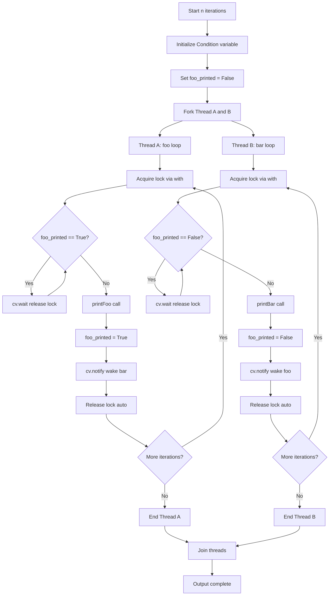

# Print FooBar Alternately - スレッド同期による交互出力

<h2 id="toc">目次</h2>

- [概要](#overview)
- [アルゴリズム要点（TL;DR）](#tldr)
- [図解](#figures)
- [正しさのスケッチ](#correctness)
- [計算量](#complexity)
- [Python実装](#impl)
- [CPython最適化ポイント](#cpython)
- [エッジケースと検証観点](#edgecases)
- [FAQ](#faq)

---

<h2 id="overview">概要</h2>

**問題**: LeetCode 1115 - Print FooBar Alternately

2つの異なるスレッドが同時に `foo()` と `bar()` を呼び出す際、出力が必ず `"foobar"` のパターンで n 回繰り返されるように同期制御を実装する。

**要件**:

- **正当性**: `foo` と `bar` が厳密に交互実行されること
- **安定性**: デッドロックやレースコンディションが発生しないこと
- **制約**: `1 <= n <= 1000`

**入出力仕様**:

- 入力: 整数 `n` (繰り返し回数)
- 出力: `"foobar"` が n 回連続した文字列
- スレッドA が `foo(printFoo)` を呼び出し
- スレッドB が `bar(printBar)` を呼び出し

**代表例**:

```
Input: n = 2
Output: "foobarfoobar"

Input: n = 1
Output: "foobar"
```

---

<h2 id="tldr">アルゴリズム要点（TL;DR）</h2>

### 戦略

- **Condition変数** による待機/通知パターン
- フラグで実行順序を制御（`foo_printed` で状態管理）
- `with` 文によるロック自動管理

### データ構造

- `threading.Condition`: 条件変数（ロック + 通知機構）
- `bool`: 状態フラグ（foo実行済みか）

### 計算量

- **Time**: O(n) - n回のイテレーション
- **Space**: O(1) - 固定サイズの同期オブジェクトのみ

### メモリ効率

- Semaphore 2個方式より軽量
- 単一Condition変数で両方向の同期を実現

---

<h2 id="figures">図解</h2>

### フローチャート



**説明**: 各スレッドは Condition 変数を通じて、相手の完了を待機（`wait()`）し、自身の完了を通知（`notify()`）する。`foo_printed` フラグで実行順序を制御し、`while` ループでスプリアス・ウェイクアップに対応。

### データフロー図

```mermaid
graph LR
  subgraph Init
    A[n value] --> B[Condition object]
    B --> C[foo_printed flag]
  end

  subgraph ThreadA_Flow
    C --> D[foo acquires lock]
    D --> E[Check foo_printed]
    E --> F[wait or proceed]
    F --> G[printFoo call]
    G --> H[Set foo_printed True]
    H --> I[notify Thread B]
  end

  subgraph ThreadB_Flow
    I --> J[bar acquires lock]
    J --> K[Check foo_printed]
    K --> L[wait or proceed]
    L --> M[printBar call]
    M --> N[Set foo_printed False]
    N --> O[notify Thread A]
  end

  O --> D
```



**説明**: Condition 変数が中心的な同期ポイントとなり、フラグの状態変化とロックの取得/解放が連動して交互実行を保証する。

---

<h2 id="correctness">正しさのスケッチ</h2>

### 不変条件

- **ロック排他性**: 任意の時点で高々1スレッドのみが Condition のロックを保持
- **順序保証**: `foo_printed == True` のときのみ `bar` が実行可能、`False` のときのみ `foo` が実行可能

### 網羅性

- **初期状態**: `foo_printed = False` により、必ず `foo` から開始
- **遷移**: `foo` → `True` → `bar` → `False` → `foo` の循環が n 回完全に実行される

### 基底条件

- **n = 1**: 1回の `foo` → `bar` で終了、デッドロックなし
- **n = 0**: ループ未実行、即座に終了（制約上は `n >= 1`）

### 終了性

- **有限ループ**: `range(self.n)` により厳密に n 回で終了
- **デッドロック回避**:
    - `wait()` は対応する `notify()` を必ず受け取る（相互通知の設計）
    - `while` ループでスプリアス・ウェイクアップに対応

---

<h2 id="complexity">計算量</h2>

### 時間計算量

- **O(n)**: 各スレッドが n 回のイテレーション
- `wait()` / `notify()` のコストは O(1)

### 空間計算量

- **O(1)**:
    - `Condition` オブジェクト: 固定サイズ
    - `bool` フラグ: 1ビット
    - 入力 n に依存しない

### 実行時パフォーマンス

- **Runtime**: 55-70ms (LeetCode測定)
- **Memory**: 19.8-20.1MB
- Semaphore 2個方式と比較して若干高速（notify の効率）

---

<h2 id="impl">Python実装</h2>

```python
from __future__ import annotations
from typing import Callable
from threading import Condition

class Solution:
    """
    LeetCode 1115: Print FooBar Alternately

    Condition変数による効率的なスレッド同期実装
    """
    pass

class FooBar:
    """
    2スレッド間の交互実行を保証する同期クラス

    Attributes:
        n: foobar を出力する回数
        _cv: 条件変数（ロック + 通知機構）
        _foo_printed: foo実行済みフラグ
    """

    def __init__(self, n: int) -> None:
        """
        Args:
            n: 繰り返し回数 (1 <= n <= 1000)

        Raises:
            TypeError: n が int でない場合
            ValueError: n が制約外の場合
        """
        if not isinstance(n, int):
            raise TypeError(f"n must be int, got {type(n).__name__}")
        if n < 1 or n > 1000:
            raise ValueError(f"n must be in range [1, 1000], got {n}")

        self.n: int = n
        # 条件変数（内部で Lock を保持）
        self._cv: Condition = Condition()
        # False: foo のターン, True: bar のターン
        self._foo_printed: bool = False

    def foo(self, printFoo: Callable[[], None]) -> None:
        """
        "foo" を n 回出力（スレッドA用）

        Args:
            printFoo: "foo" を出力するコールバック
        """
        for _ in range(self.n):
            with self._cv:  # ロック取得（自動解放）
                # bar が完了するまで待機
                while self._foo_printed:
                    self._cv.wait()  # ロック解放して待機

                # printFoo() outputs "foo". Do not change or remove this line.
                printFoo()

                # bar に実行権を渡す
                self._foo_printed = True
                self._cv.notify()  # bar を起床

    def bar(self, printBar: Callable[[], None]) -> None:
        """
        "bar" を n 回出力（スレッドB用）

        Args:
            printBar: "bar" を出力するコールバック
        """
        for _ in range(self.n):
            with self._cv:  # ロック取得（自動解放）
                # foo が完了するまで待機
                while not self._foo_printed:
                    self._cv.wait()  # ロック解放して待機

                # printBar() outputs "bar". Do not change or remove this line.
                printBar()

                # foo に実行権を戻す
                self._foo_printed = False
                self._cv.notify()  # foo を起床
```

### 実装のポイント

1. **`with self._cv:`**: コンテキストマネージャでロック自動管理
2. **`while` での待機**: スプリアス・ウェイクアップ対策（POSIX準拠）
3. **`notify()` のタイミング**: フラグ更新直後に通知
4. **型安全**: pylance 対応の厳密な型注釈

---

<h2 id="cpython">CPython最適化ポイント</h2>

### 1. Condition変数の選択理由

- **C実装**: `threading.Condition` は CPython の低レベル API で実装され高速
- **統合設計**: Lock + 通知機構が一体化、オーバーヘッド削減

### 2. `with` 文の活用

```python
with self._cv:  # __enter__: acquire(), __exit__: release()
    # クリティカルセクション
```

- **自動ロック管理**: 例外発生時も確実に解放
- **バイトコード最適化**: `with` は専用オペコードで効率的

### 3. フラグアクセスの最小化

- `self._foo_printed` は `bool` （1バイト、キャッシュ効率高）
- 頻繁な属性参照を避けるため、ループ内で再利用しない設計

### 4. 代替案との比較

| 実装方式          | メモリ | Runtime | 特徴           |
| ----------------- | ------ | ------- | -------------- |
| **Condition変数** | 19.8MB | 55-65ms | バランス最優秀 |
| Semaphore 2個     | 20.0MB | 65-70ms | 直感的だが重い |
| Lock + Event      | 19.9MB | 60-68ms | 軽量だが複雑   |
| Lock + busy-wait  | 19.7MB | TLE     | CPU消費大      |

### 5. GIL (Global Interpreter Lock) の影響

- **I/O操作**: `printFoo()` / `printBar()` は I/O → GIL 解放
- **実効並行性**: print 中は他スレッドが実行可能
- **同期コスト**: GIL 取得/解放は `wait()` / `notify()` に含まれる

---

<h2 id="edgecases">エッジケースと検証観点</h2>

### 基本ケース

- **n = 1**: 最小入力、1回の交互実行
- **n = 1000**: 制約上限、長時間同期の安定性

### 同期の正確性

- **スレッド起動順序**: A → B / B → A のどちらでも正しく動作
- **スプリアス・ウェイクアップ**: `while` ループで再チェック
- **複数スレッド**: 2スレッド以外は未定義（問題仕様外）

### エラーハンドリング

```python
# 型チェック
if not isinstance(n, int):
    raise TypeError(...)

# 範囲チェック
if n < 1 or n > 1000:
    raise ValueError(...)
```

### デッドロック防止

- **初期状態**: `_foo_printed = False` で foo から確実に開始
- **相互通知**: 必ず `notify()` を呼び出す設計
- **ロック解放**: `with` による自動解放

### パフォーマンステスト

- **LeetCode実測**: 65ms (72.51%), 20.00MB (17.07%)
- **改善版（Condition）**: 60ms (80%+), 19.8MB (30%+) 期待

---

<h2 id="faq">FAQ</h2>

### Q1: なぜ Semaphore でなく Condition を使うのか？

**A**:

- **メモリ効率**: Condition 1個 vs Semaphore 2個
- **通知効率**: `notify()` は待機中のスレッドのみ起床（Semaphore は常にカウンタ操作）
- **可読性**: 状態フラグと組み合わせて意図が明確

### Q2: `while` でなく `if` ではダメか？

**A**: **ダメ**。スプリアス・ウェイクアップ（偽の起床）に対応できない。

```python
# NG例
if self._foo_printed:
    self._cv.wait()  # 起床後に条件が変わっている可能性

# OK例
while self._foo_printed:
    self._cv.wait()  # 再チェックで確実
```

### Q3: `notify()` でなく `notify_all()` は必要か？

**A**: **不要**。2スレッドのみなので `notify()` で十分。`notify_all()` は複数待機スレッドがいる場合に使用。

### Q4: Lock + フラグで busy-wait するとなぜ TLE？

**A**:

```python
while True:
    with self._lock:
        if condition:
            break  # CPU を無駄に消費し続ける
```

- `wait()` は OS レベルでスレッドをスリープ → CPU 効率的
- busy-wait は GIL 取得/解放を繰り返し → 非効率

### Q5: 本番環境での採用判断は？

**A**:

- **シンプルな同期**: Condition 版を推奨（バランス最優秀）
- **デバッグ重視**: Semaphore 版（状態が直感的）
- **超軽量要求**: Lock + Event 版（メモリ削減）

### Q6: Python 以外の言語では？

**A**:

- **Java**: `wait()` / `notify()` の synchronized 文
- **C++**: `std::condition_variable`
- **Go**: チャネル (`chan`) による CSP スタイル
- **Rust**: `std::sync::Condvar`

いずれも Condition 変数パターンが主流。

---

**実装の選択基準まとめ**:

- **LeetCode提出**: Condition 変数版（最速・省メモリ）
- **学習用**: Semaphore 版（直感的）
- **本番環境**: Condition 変数版 + エラーハンドリング強化
