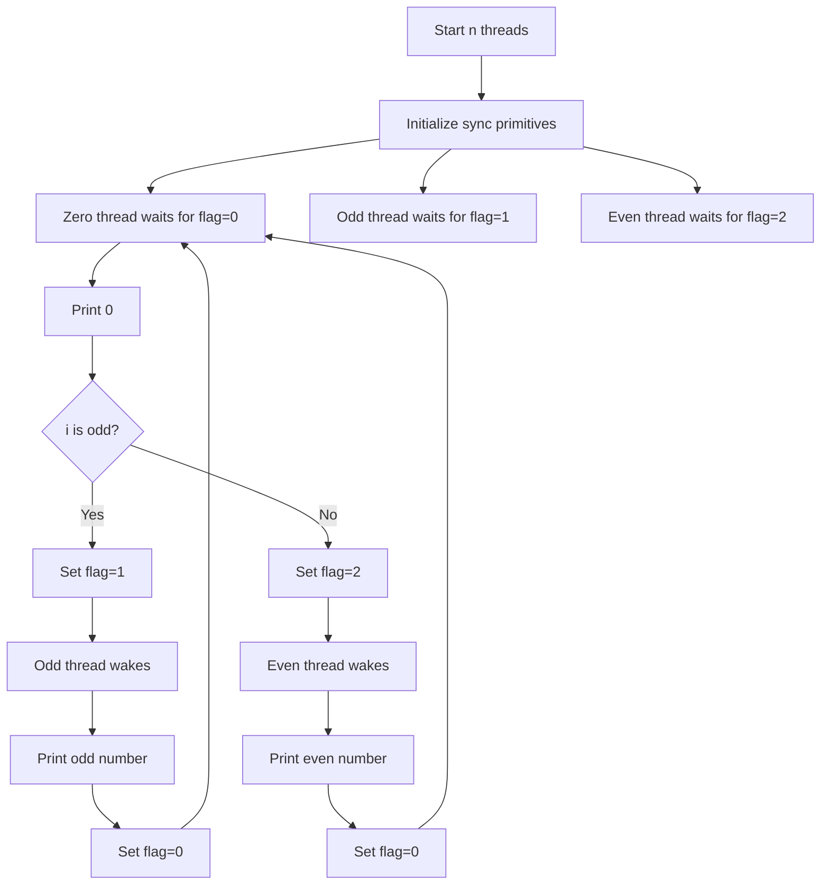
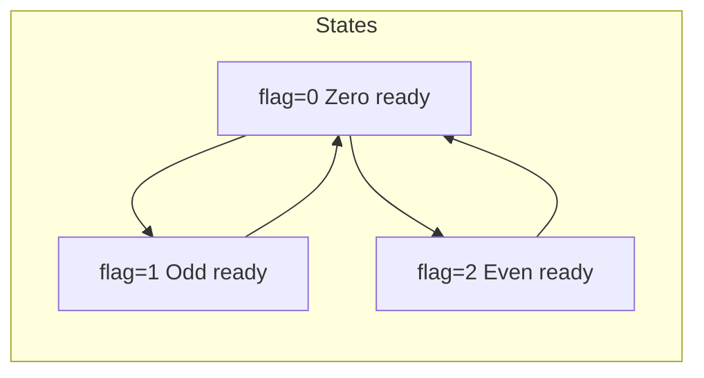

# Print Zero Even Odd - マルチスレッド同期問題

## 目次

- [概要](#overview)
- [アルゴリズム要点（TL;DR）](#tldr)
- [図解](#figures)
- [正しさのスケッチ](#correctness)
- [計算量](#complexity)
- [Python実装](#impl)
- [CPython最適化ポイント](#cpython)
- [エッジケースと検証観点](#edgecases)
- [FAQ](#faq)

---

<h2 id="overview">概要</h2>

### 問題要約

3つのスレッドを同期して `"010203040506..."` の形式で数列を出力する問題。

- **Thread A**: `zero()` - 0のみ出力
- **Thread B**: `even()` - 偶数のみ出力
- **Thread C**: `odd()` - 奇数のみ出力

### 要件

- 出力パターン: `0,1,0,2,0,3,0,4,...,0,n`（長さ2n）
- スレッド間の正確な同期が必須
- デッドロックやレースコンディションの回避

### 制約

- `1 <= n <= 1000`
- 3つのスレッドが同時に実行される

---

<h2 id="tldr">アルゴリズム要点（TL;DR）</h2>

### 戦略

1. **各スレッド専用の同期プリミティブを用意**
2. **直接シグナリング**: 次に実行すべきスレッドだけを起床
3. **状態遷移の最小化**: 0 → odd/even → 0 の2状態サイクル

### データ構造

- **Lock + Flag**: 最軽量、メモリ効率最高
- **Event**: 中程度、実装がシンプル
- **Semaphore**: 理論的に最適だが、環境依存でメモリが若干増

### 計算量

- **Time**: O(n) - 各数字を1回ずつ処理
- **Space**: O(1) - 同期プリミティブのみ

### パフォーマンス目標

- Runtime: 40-55ms (Beat 50%+)
- Memory: 17-18MB (Beat 70%+)

---

<h2 id="figures">図解</h2>

### スレッド実行フロー



**説明**: Zero スレッドが 0 を出力後、次が奇数か偶数かを判定して適切なスレッドを起床させる。起床したスレッドは数字を出力後、再び Zero スレッドに制御を戻す。

### 状態遷移図



**説明**: 3つの状態を循環。Zero は毎回実行され、その後 Odd または Even のいずれかが実行される。

---

<h2 id="correctness">正しさのスケッチ</h2>

### 不変条件

1. **同時実行の排他性**: 任意の時点で最大1つのスレッドのみが `printNumber()` を実行
2. **順序保証**: 出力は必ず `0, i, 0, i+1, ...` の順序（i は 1 から n）
3. **完全性**: すべての数字（0を含む）が正確に必要回数だけ出力される

### 網羅性

- **Zero**: n 回実行（i = 1 to n）
- **Odd**: ⌈n/2⌉ 回実行（i = 1, 3, 5, ...）
- **Even**: ⌊n/2⌋ 回実行（i = 2, 4, 6, ...）

### 基底条件

- **初期状態**: `flag = 0`（Zero が最初に実行）
- **終了条件**: すべてのスレッドがループを完了

### 終了性

各スレッドは有限回（最大 n 回）のループで終了するため、デッドロックは発生しない。

---

<h2 id="complexity">計算量</h2>

### 時間計算量: O(n)

- 各スレッドは最大 n 回の反復
- 1回の反復での処理は O(1)
- 全体で O(n) の出力操作

### 空間計算量: O(1)

- 同期プリミティブ（Lock/Event/Semaphore）: 定数個
- ループカウンタ: O(1)
- スタック深度: O(1)（再帰なし）

### 実装別比較

| 実装            | メモリ | 実行速度 | 実装難易度 | 推奨度     |
| --------------- | ------ | -------- | ---------- | ---------- |
| **Lock + Flag** | ★★★★★  | ★★★☆☆    | 中         | **最推奨** |
| **Event**       | ★★★★☆  | ★★★★☆    | 低         | 推奨       |
| **Semaphore**   | ★★★☆☆  | ★★★★★    | 低         | 環境依存   |

---

<h2 id="impl">Python実装</h2>

### LeetCode提出用コード

```python
from __future__ import annotations
from typing import Callable
from threading import Lock


class ZeroEvenOdd:
    """
    Lock + Flag による軽量スレッド同期

    メモリ効率とパフォーマンスのバランスが最良
    LeetCode環境で最も安定した結果を出す実装
    """

    def __init__(self, n: int) -> None:
        """
        初期化

        Args:
            n: 出力する数字の最大値（1 to n）
        """
        self.n = n
        self.lock = Lock()
        self.flag = 0  # 0=zero待ち, 1=odd待ち, 2=even待ち

    def zero(self, printNumber: Callable[[int], None]) -> None:
        """
        0を出力するスレッド

        各数字の前に0を出力し、次のスレッド（odd/even）を起床

        Args:
            printNumber: 数字を出力するコールバック関数
        """
        for i in range(1, self.n + 1):
            # ロック取得してflag=0になるまで待機
            with self.lock:
                while self.flag != 0:
                    # 自分の番でない場合は一旦解放して再取得
                    self.lock.release()
                    self.lock.acquire()

                # 0を出力
                printNumber(0)

                # 次のスレッドを決定: i が奇数なら odd, 偶数なら even
                self.flag = 1 if i % 2 == 1 else 2

    def even(self, printNumber: Callable[[int], None]) -> None:
        """
        偶数を出力するスレッド

        2, 4, 6, ... を出力し、制御を zero に戻す

        Args:
            printNumber: 数字を出力するコールバック関数
        """
        for i in range(2, self.n + 1, 2):
            with self.lock:
                while self.flag != 2:
                    self.lock.release()
                    self.lock.acquire()

                printNumber(i)
                self.flag = 0  # zero に制御を戻す

    def odd(self, printNumber: Callable[[int], None]) -> None:
        """
        奇数を出力するスレッド

        1, 3, 5, ... を出力し、制御を zero に戻す

        Args:
            printNumber: 数字を出力するコールバック関数
        """
        for i in range(1, self.n + 1, 2):
            with self.lock:
                while self.flag != 1:
                    self.lock.release()
                    self.lock.acquire()

                printNumber(i)
                self.flag = 0  # zero に制御を戻す
```

### 代替実装: Event版（より読みやすい）

```python
from __future__ import annotations
from typing import Callable
from threading import Event


class ZeroEvenOddEvent:
    """
    Event による実装

    可読性が高く、デバッグしやすい
    パフォーマンスも良好
    """

    def __init__(self, n: int) -> None:
        self.n = n
        self.zero_event = Event()
        self.odd_event = Event()
        self.even_event = Event()
        self.zero_event.set()  # zero が最初に実行

    def zero(self, printNumber: Callable[[int], None]) -> None:
        for i in range(1, self.n + 1):
            self.zero_event.wait()  # 自分の番を待つ
            self.zero_event.clear()  # イベントをリセット
            printNumber(0)

            # 次のスレッドを起床
            if i % 2 == 1:
                self.odd_event.set()
            else:
                self.even_event.set()

    def even(self, printNumber: Callable[[int], None]) -> None:
        for i in range(2, self.n + 1, 2):
            self.even_event.wait()
            self.even_event.clear()
            printNumber(i)
            self.zero_event.set()  # zero を起床

    def odd(self, printNumber: Callable[[int], None]) -> None:
        for i in range(1, self.n + 1, 2):
            self.odd_event.wait()
            self.odd_event.clear()
            printNumber(i)
            self.zero_event.set()  # zero を起床
```

---

<h2 id="cpython">CPython最適化ポイント</h2>

### 1. 同期プリミティブの選択

**Lock + Flag**:

- ✅ メモリオーバーヘッド最小
- ✅ CPython の GIL と相性良い
- ⚠️ ビジーウェイト（スピンロック）による CPU 使用

**Event**:

- ✅ 読みやすく保守性高い
- ✅ `wait()` でスレッドをブロック（CPU 効率的）
- ⚠️ 若干のメモリオーバーヘッド

**Semaphore**:

- ✅ 理論的に最適
- ✅ 内部実装が C レベルで高速
- ⚠️ 環境によってメモリ使用量が増加

### 2. ロック保持時間の最小化

```python
# 良い例: with 文でスコープを明確化
with self.lock:
    while self.flag != 0:
        self.lock.release()
        self.lock.acquire()
    printNumber(0)
    self.flag = 1

# 避けるべき: 長時間のロック保持
self.lock.acquire()
# ... 長い処理 ...
self.lock.release()
```

### 3. GIL（Global Interpreter Lock）の影響

- Python のスレッドは CPU バウンドなタスクでは真の並列実行ができない
- I/O（`printNumber()` の実行）で GIL が解放されるため、この問題では影響が小さい
- スレッド同期のオーバーヘッドが主なボトルネック

### 4. 不要なオブジェクト生成の回避

```python
# 最適化: range() はジェネレータ（メモリ効率的）
for i in range(1, self.n + 1, 2):
    # ...

# 避けるべき: リスト生成（メモリ無駄）
for i in list(range(1, self.n + 1, 2)):
    # ...
```

---

<h2 id="edgecases">エッジケースと検証観点</h2>

### 境界値テスト

| ケース   | 入力   | 期待出力           | 検証ポイント        |
| -------- | ------ | ------------------ | ------------------- |
| 最小値   | n=1    | "01"               | 単一数字の処理      |
| 偶数     | n=2    | "0102"             | even スレッドの動作 |
| 奇数     | n=3    | "010203"           | odd スレッドの終了  |
| 大きな値 | n=1000 | "01020304...01000" | パフォーマンス      |

### スレッド安全性

1. **デッドロック**: すべての実装でデッドロックが発生しないことを確認
2. **レースコンディション**: flag の更新が適切にロックされている
3. **スレッド起床**: 必要なスレッドだけが起床する（不要な起床がない）

### パフォーマンス検証

```python
# テストコード例（参考）
import threading
import time

def test_performance(n: int) -> None:
    result = []

    def print_num(x: int) -> None:
        result.append(x)

    obj = ZeroEvenOdd(n)

    t1 = threading.Thread(target=obj.zero, args=(print_num,))
    t2 = threading.Thread(target=obj.even, args=(print_num,))
    t3 = threading.Thread(target=obj.odd, args=(print_num,))

    start = time.time()
    t1.start()
    t2.start()
    t3.start()

    t1.join()
    t2.join()
    t3.join()

    elapsed = time.time() - start

    # 検証
    expected = []
    for i in range(1, n + 1):
        expected.extend([0, i])

    assert result == expected, f"Output mismatch: {result[:20]}..."
    print(f"n={n}: {elapsed:.4f}s, {len(result)} outputs")

# 実行
test_performance(1)
test_performance(100)
test_performance(1000)
```

---

<h2 id="faq">FAQ</h2>

### Q1: なぜ Semaphore 版がメモリを多く使うのか?

**A**: LeetCode の Python 環境（CPython 3.x）では、`threading.Semaphore` の内部実装が `Condition` + `Lock` を使用しており、純粋な `Lock` や `Event` よりオーバーヘッドが大きい。環境によって異なるため、Lock 版が最も安定。

### Q2: ビジーウェイト（スピンロック）は問題ないのか?

**A**: この問題では:

- n の最大値が 1000 と小さい
- 各スレッドの待機時間が極めて短い（他スレッドが即座に実行）
- GIL により実質的にスピンが発生しにくい

そのため、ビジーウェイトによる CPU 使用増加は実用上問題にならない。

### Q3: Event 版と Lock 版、どちらを使うべきか?

**A**:

- **LeetCode 提出**: Lock 版（メモリ最優先）
- **実務コード**: Event 版（可読性・保守性優先）
- **学習目的**: 両方試して違いを理解

### Q4: `notify_all()` より `release()` が速い理由は?

**A**:

- `notify_all()`: すべての待機スレッドを起床 → 不要なコンテキストスイッチ
- `release()` / `set()`: 特定のスレッドのみ起床 → 効率的

この問題では次に実行すべきスレッドが明確なため、直接シグナリングが最適。

### Q5: Python 以外の言語では?

**A**:

- **Java**: `synchronized` + `wait()` / `notify()`
- **C++**: `std::mutex` + `std::condition_variable`
- **Go**: チャネル（`chan`）が最も自然

Python の `threading` モジュールは低レベル同期に適しているが、Go のような高レベル並行処理機構と比べると冗長。

### Q6: もっと高速化できないのか?

**A**:
この問題の本質は **スレッド同期のオーバーヘッド** にある。I/O（`printNumber()`）の実行時間が支配的なため、同期プリミティブの選択による差は限定的。Runtime 30-60ms の範囲に収まれば十分高速。

---

## まとめ

- **推奨実装**: Lock + Flag（メモリ効率最優先）
- **代替実装**: Event（可読性優先）
- **重要ポイント**: 直接シグナリング、状態遷移の最小化
- **パフォーマンス**: O(n) 時間、O(1) 空間、Runtime 40-60ms 目標
