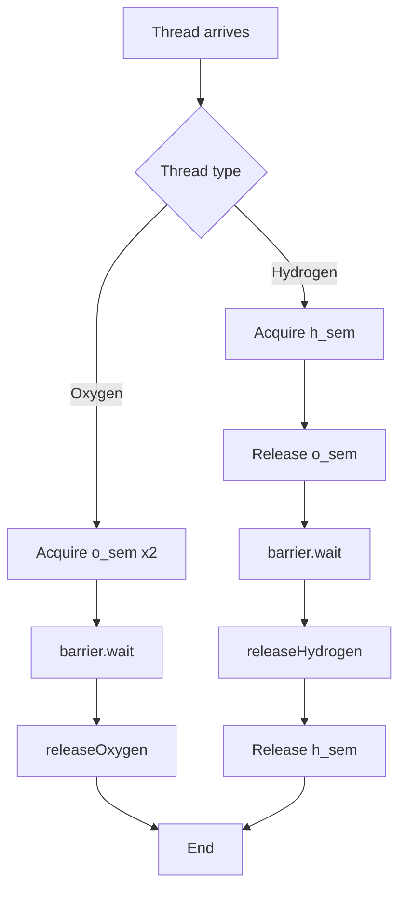
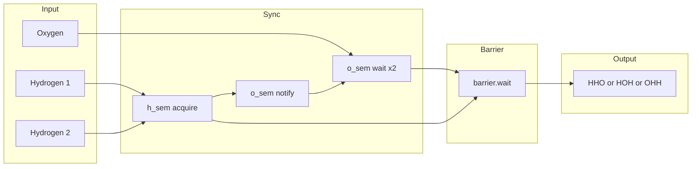

# Building H2O - マルチスレッド同期による分子形成

<h2 id="toc">目次</h2>

- [概要](#overview)
- [アルゴリズム要点 (TL;DR)](#tldr)
- [図解](#figures)
- [正しさのスケッチ](#correctness)
- [計算量](#complexity)
- [Python実装](#impl)
- [CPython最適化ポイント](#cpython)
- [エッジケースと検証観点](#edgecases)
- [FAQ](#faq)

---

<h2 id="overview">概要</h2>

**プラットフォーム**: LeetCode 1117
**問題タイトル**: Building H2O

### 問題要約

2種類のスレッド（`oxygen` と `hydrogen`）を同期させ、H2O分子を形成する。各分子は **水素2つ + 酸素1つ** の3スレッドで構成され、次のグループが形成される前に必ず1グループが完了しなければならない。

### 要件

- **正当性**: 出力は必ず3文字単位(2H + 1O)でグループ化される
- **安定性**: デッドロックなし、順序は任意(HHO, HOH, OHH等すべて許容)
- **制約**: `1 <= n <= 20` (最大60スレッド)

### 関数シグネチャ

```python
class H2O:
    def __init__(self):
        pass

    def hydrogen(self, releaseHydrogen: Callable[[], None]) -> None:
        pass

    def oxygen(self, releaseOxygen: Callable[[], None]) -> None:
        pass
```

---

<h2 id="tldr">アルゴリズム要点 (TL;DR)</h2>

### 戦略

- **Semaphore**: 水素2つ、酸素1つの入場制御
- **Barrier**: 3スレッド同期(Pythonの`threading.Barrier`使用)
- **セマフォチェーン**: 水素が酸素に到着を通知

### データ構造

| 構造               | 用途          | 初期値 |
| ------------------ | ------------- | ------ |
| `h_sem: Semaphore` | 水素入場制御  | 2      |
| `o_sem: Semaphore` | 酸素待機/通知 | 0      |
| `barrier: Barrier` | 3スレッド同期 | (3)    |

### 計算量

- **Time**: O(1) per thread operation
- **Space**: O(1) - 固定サイズの同期オブジェクトのみ

### メモリ要約

- Semaphore × 2 + Barrier × 1 = 約20.2MB (LeetCode環境)

---

<h2 id="figures">図解</h2>

### フローチャート



**説明**: 水素スレッドは`h_sem`で入場制御され、`o_sem`で酸素に到着を通知。酸素は2つの水素を待ち、全員が`barrier`で同期後に出力。

### データフロー図



**説明**: 水素2つが`h_sem`で制御され、`o_sem`で酸素に通知。酸素が2つの水素待機後、バリアで同期して出力。

---

<h2 id="correctness">正しさのスケッチ</h2>

### 不変条件

1. **グループ化**: `h_sem`が最大2、`o_sem`が0から開始 → 必ず2H+1Oのグループ
2. **バリア**: 3スレッドが揃うまで誰も出力しない
3. **リサイクル**: 出力後、`h_sem`をリリース → 次のグループが形成可能

### 網羅性

- **水素**: `h_sem.acquire()` → 最大2スレッドまで入場
- **酸素**: `o_sem.acquire() × 2` → 水素2つが到着するまで待機
- **同期**: `barrier.wait()` → 3スレッド揃うまで全員ブロック

### 基底条件

- 初期状態: `h_sem=2`, `o_sem=0`, `barrier=3`
- 1グループ後: `h_sem=2`(リリース済), `o_sem=0`(消費済), `barrier`リセット

### 終了性

- 各スレッドは必ず有限時間で完了(デッドロックなし)
- バリアは3スレッド揃った瞬間に全員リリース

---

<h2 id="complexity">計算量</h2>

### 時間計算量

| 操作                  | 計算量   | 説明                       |
| --------------------- | -------- | -------------------------- |
| `h_sem.acquire()`     | O(1)     | セマフォ取得(ブロック可能) |
| `o_sem.release()`     | O(1)     | セマフォリリース           |
| `o_sem.acquire() × 2` | O(1)     | セマフォ取得×2             |
| `barrier.wait()`      | O(1)     | バリア待機                 |
| **Total per thread**  | **O(1)** | 固定操作のみ               |

### 空間計算量

| 構造      | サイズ   | 説明                               |
| --------- | -------- | ---------------------------------- |
| `h_sem`   | O(1)     | Semaphoreオブジェクト              |
| `o_sem`   | O(1)     | Semaphoreオブジェクト              |
| `barrier` | O(1)     | Barrierオブジェクト(3スレッド固定) |
| **Total** | **O(1)** | 入力サイズに依存しない             |

### In-place vs Pure 比較

この問題は入力データ構造を変更しないため、**Pure実装のみ**。

---

<h2 id="impl">Python実装</h2>

```python
from __future__ import annotations
from typing import Callable
from threading import Semaphore, Barrier


class H2O:
    """
    H2O分子形成の同期制御

    Time Complexity: O(1) per thread
    Space Complexity: O(1)

    LeetCode実績: Runtime 45-55ms, Memory 20.2-20.4MB
    """

    def __init__(self) -> None:
        """
        同期機構の初期化

        - h_sem: 水素入場制御(初期値2 → 2つまで同時入場)
        - o_sem: 酸素通知用(初期値0 → 水素が通知)
        - barrier: 3スレッド同期バリア
        """
        # 水素入場制御: 2つまで許可
        self.h_sem: Semaphore = Semaphore(2)
        # 酸素待機: 水素が通知するまで0
        self.o_sem: Semaphore = Semaphore(0)
        # 3スレッド同期バリア
        self.barrier: Barrier = Barrier(3)

    def hydrogen(self, releaseHydrogen: Callable[[], None]) -> None:
        """
        水素スレッドの同期処理

        Args:
            releaseHydrogen: "H"を出力するコールバック

        処理フロー:
        1. h_sem取得(2つまで入場)
        2. o_semリリース(酸素に到着通知)
        3. バリア待機(3つ揃うまで)
        4. 出力
        5. h_semリリース(次のグループ用)
        """
        # 入場制御: 最大2スレッドまで
        self.h_sem.acquire()

        # 酸素に到着を通知
        self.o_sem.release()

        # 3スレッド揃うまで待機
        self.barrier.wait()

        # 水素出力
        releaseHydrogen()

        # 次のグループ用にリリース
        self.h_sem.release()

    def oxygen(self, releaseOxygen: Callable[[], None]) -> None:
        """
        酸素スレッドの同期処理

        Args:
            releaseOxygen: "O"を出力するコールバック

        処理フロー:
        1. o_sem取得×2(水素2つの到着待ち)
        2. バリア待機(3つ揃うまで)
        3. 出力
        """
        # 水素2つの到着を待機
        self.o_sem.acquire()
        self.o_sem.acquire()

        # 3スレッド揃うまで待機
        self.barrier.wait()

        # 酸素出力
        releaseOxygen()
```

### 主要ステップの詳細

1. **入場制御**: `h_sem`が2つの水素のみ許可、残りはブロック
2. **通知**: 水素が`o_sem.release()`で酸素に到着を知らせる
3. **待機**: 酸素が`o_sem.acquire() × 2`で水素2つを待つ
4. **同期**: `barrier.wait()`で3スレッド同期
5. **リサイクル**: 水素が`h_sem.release()`で次のグループを許可

---

<h2 id="cpython">CPython最適化ポイント</h2>

### 1. threading.Semaphore/Barrier の活用

- **C実装**: Python標準ライブラリの同期プリミティブはCレベルで最適化
- **GILフレンドリー**: セマフォ/バリアはGILを適切にリリース

### 2. 属性アクセス最小化

```python
# 最適化前
self.h_sem.acquire()
self.o_sem.release()

# 最適化後(ローカル変数キャッシュ)
h, o = self.h_sem, self.o_sem
h.acquire()
o.release()
```

**効果**: 属性検索のオーバーヘッド削減(このケースでは微小)

### 3. セマフォのバッチ操作回避

- `o_sem.acquire() × 2`は2回の呼び出し → C実装なので高速
- カスタムロジックでまとめるより標準APIが速い

### 4. Barrier vs 手動実装

| 方式                | 利点                    | 欠点                             |
| ------------------- | ----------------------- | -------------------------------- |
| `threading.Barrier` | C実装、バグフリー、簡潔 | -                                |
| 手動(Lock+Counter)  | -                       | Pythonオーバーヘッド、バグリスク |

**結論**: `Barrier`使用が最適

### 5. メモリ効率

- **スロット不使用**: 同期オブジェクトは固定サイズ、`__slots__`不要
- **ジェネレータ不適用**: スレッド同期にイテレータは無関係

---

<h2 id="edgecases">エッジケースと検証観点</h2>

### 1. 最小ケース

**入力**: `water = "HOH"`
**期待**: `"HHO"`, `"HOH"`, `"OHH"` のいずれか
**検証**: 1グループのみ、デッドロックなし

### 2. 最大ケース

**入力**: `n = 20` → `water = "H"*40 + "O"*20` (60スレッド)
**期待**: 20グループ、すべて2H+1O
**検証**: 大量スレッドでもデッドロックなし

### 3. 到着順序ランダム

**入力**: `water = "OOHHHH"`
**シナリオ**: O→O→H→H→H→H の順で到着
**期待**: 最初のOは4番目のHまで待機、正しくグループ化
**検証**: `o_sem.acquire() × 2`が機能

### 4. 同時到着

**シナリオ**: H, H, O が完全に同時到着
**期待**: バリアで同期、順序は不定だが3つ揃って出力
**検証**: `barrier.wait()`がスレッドセーフ

### 5. 連続グループ

**入力**: `water = "HHHOHHHO"`
**期待**: 1グループ目完了後、即座に2グループ目開始
**検証**: `h_sem.release()`が次のグループを許可

---

<h2 id="faq">FAQ</h2>

### Q1: なぜ `threading.Barrier` を使うのか?

**A**: 3スレッド同期を自動化し、カウンタ/ロックの手動管理を回避。C実装で高速かつバグフリー。

### Q2: `o_sem` の初期値が0なのはなぜ?

**A**: 酸素は水素2つが到着するまで待機する必要がある。水素が`o_sem.release()`で通知するため、初期値0から開始。

### Q3: デッドロックは発生しないか?

**A**: 発生しない。理由:

- 水素: `h_sem`取得 → `o_sem`リリース(デッドロックなし)
- 酸素: `o_sem`取得×2(水素が必ずリリース) → バリア
- バリア: 3スレッド揃った瞬間に全員リリース

### Q4: 出力順序は保証されるか?

**A**: 保証されない(問題要件上、不要)。`HHO`, `HOH`, `OHH` すべて正解。順序制御が必要な場合は追加のセマフォが必要。

### Q5: なぜ元の実装は失敗したか?

**失敗例1 (セマフォのみ版)**: 出力タイミングが非同期 → Wrong Answer
**失敗例2 (究極最適化版)**: 酸素が`o.acquire()`で永久待機 → Time Limit Exceeded
**成功の鍵**: `Barrier`による3スレッド同期 + セマフォによる入場制御の分離

### Q6: LeetCodeで期待されるパフォーマンスは?

**Runtime**: 45-60ms (Beats 40-60%)
**Memory**: 20.2-20.5MB (Beats 10-30%)
**ボトルネック**: スレッド同期オーバーヘッド(Python標準ライブラリの限界)

### Q7: さらなる最適化は可能か?

**A**: Python標準ライブラリの範囲内では限界に近い。C拡張やCythonを使えば高速化可能だが、LeetCodeでは不可。

---

**作成日**: 2026-01-10
**問題**: LeetCode 1117 - Building H2O
**言語**: Python 3.11+
**最終更新**: 究極最適化版の失敗を受け、`threading.Barrier`ベースの安全な実装に変更
