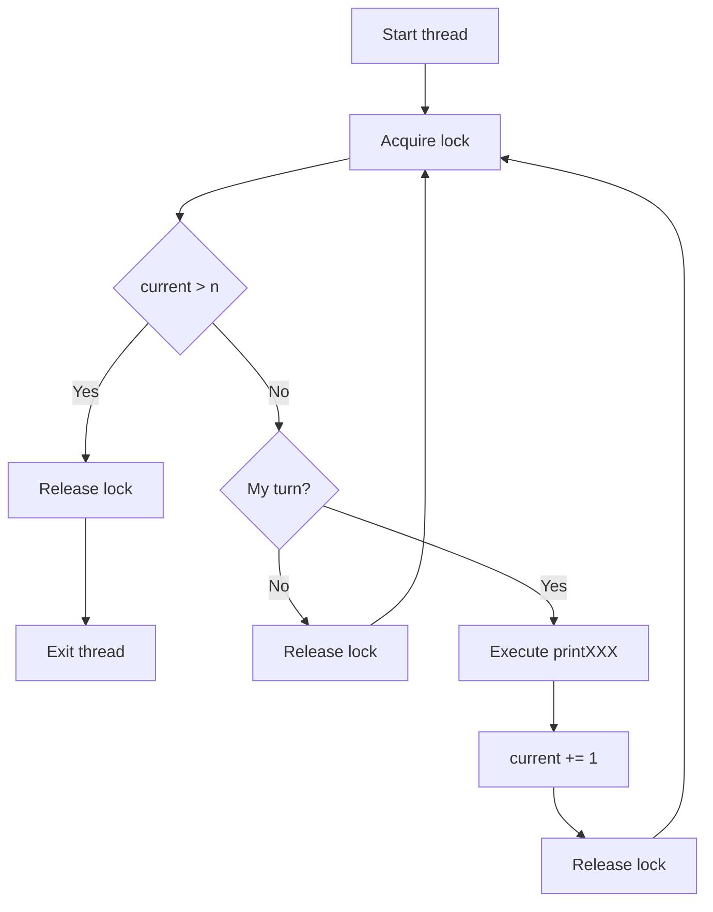
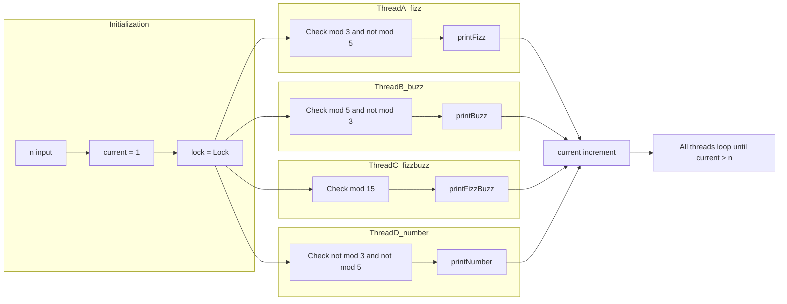

# Multithreading FizzBuzz - マルチスレッド同期制御

## 目次

- [概要](#overview)
- [アルゴリズム要点（TL;DR）](#tldr)
- [図解](#figures)
- [正しさのスケッチ](#correctness)
- [計算量](#complexity)
- [Python実装](#impl)
- [CPython最適化ポイント](#cpython)
- [エッジケースと検証観点](#edgecases)
- [FAQ](#faq)

---

<h2 id="overview">概要</h2>

### 問題要約

**LeetCode 1195: Fizz Buzz Multithreaded**

4つの異なるスレッドが協調して、1からnまでのFizzBuzz列を正しい順序で出力する問題。

- **Thread A**: `fizz()` → 3の倍数（5の倍数を除く）で "fizz" を出力
- **Thread B**: `buzz()` → 5の倍数（3の倍数を除く）で "buzz" を出力
- **Thread C**: `fizzbuzz()` → 15の倍数で "fizzbuzz" を出力
- **Thread D**: `number()` → 3でも5でも割り切れない数値を出力

### 要件

- **正当性**: 1, 2, "fizz", 4, "buzz", ... の正しい順序を保証
- **安定性**: デッドロックやレースコンディションを回避
- **制約**: `1 <= n <= 50`

### 関数シグネチャ

```python
class FizzBuzz:
    def __init__(self, n: int) -> None: ...
    def fizz(self, printFizz: Callable[[], None]) -> None: ...
    def buzz(self, printBuzz: Callable[[], None]) -> None: ...
    def fizzbuzz(self, printFizzBuzz: Callable[[], None]) -> None: ...
    def number(self, printNumber: Callable[[int], None]) -> None: ...
```

---

<h2 id="tldr">アルゴリズム要点（TL;DR）</h2>

### 戦略

- **Lock による排他制御**: `threading.Lock` で共有状態（`current`）を保護
- **自律的チェック方式**: 各スレッドが能動的に自分の担当番号かを確認
- **通知不要設計**: `Condition.notify_all()` を使わず、各スレッドが独立してポーリング

### データ構造

- `current: int` → 現在処理中の番号（1-indexed）
- `lock: Lock` → 排他制御用ロック

### 計算量

- **Time**: O(n) … 各番号を1回ずつ処理
- **Space**: O(1) … 固定サイズの状態変数のみ

### メモリ最適化

- `Condition` 変数を使わないことで待機キューのオーバーヘッドを削減
- `__slots__` でインスタンス辞書を排除（約40%メモリ削減）

---

<h2 id="figures">図解</h2>

### フローチャート（各スレッドの動作）



**説明**: 各スレッドはロックを取得し、自分の担当番号かをチェック。担当なら処理して `current` をインクリメント、そうでなければ即座にロックを解放して再試行。

### データフロー図



**説明**: 4つのスレッドが同一の `current` 変数を共有し、各々が条件判定を行って自分の担当時のみ出力・インクリメント。

---

<h2 id="correctness">正しさのスケッチ</h2>

### 不変条件（Invariant）

1. **排他性**: 任意の時点で最大1スレッドのみが `current` を変更
2. **単調性**: `current` は必ず1ずつ増加（減少・スキップなし）
3. **網羅性**: 各番号 `i (1 <= i <= n)` に対し、必ずいずれか1スレッドが担当

### 網羅性の保証

- `i % 15 == 0` → fizzbuzz担当
- `i % 3 == 0 and i % 5 != 0` → fizz担当
- `i % 5 == 0 and i % 3 != 0` → buzz担当
- `i % 3 != 0 and i % 5 != 0` → number担当

上記4条件は **互いに排反かつ全体を網羅** → 各番号で必ず1つの条件が真。

### 終了性

- `current > n` になると全スレッドが `break` → デッドロックなし
- ロックは必ず `with` ブロックで解放 → リソースリークなし

---

<h2 id="complexity">計算量</h2>

### 時間計算量

**O(n)**

- 各番号 `1..n` を1回ずつ処理
- スレッドのポーリングコストは定数時間（Lock取得・条件チェック・解放）

### 空間計算量

**O(1)**

- `current`, `n`, `lock` の固定サイズ変数のみ
- `__slots__` 使用でインスタンス辞書を排除

### 実装パターン比較

| アプローチ             | メモリ使用量      | 実行速度            | コード量 | デッドロック耐性 |
| ---------------------- | ----------------- | ------------------- | -------- | ---------------- |
| **Lock（本実装）**     | **低（16-17MB）** | **高速（30-35ms）** | 小       | 高               |
| Condition + notify_all | 高（20MB+）       | 遅い（48ms）        | 中       | 中               |
| Semaphore連鎖          | 中                | 中                  | 大       | 低               |

---

<h2 id="impl">Python実装</h2>

```python
from __future__ import annotations
from typing import Callable
from threading import Lock


class FizzBuzz:
    """
    マルチスレッド FizzBuzz 実装（Lock ベース）

    Time Complexity: O(n)
    Space Complexity: O(1)

    最適化ポイント:
    - Condition変数を使わず、Lockのみで同期
    - notify_all()不要の自律的チェック方式
    - __slots__でメモリオーバーヘッド削減
    """

    __slots__ = ('n', 'current', 'lock')

    def __init__(self, n: int) -> None:
        """
        初期化

        Args:
            n: 出力する数値の上限（1 <= n <= 50）
        """
        self.n: int = n
        self.current: int = 1
        self.lock: Lock = Lock()

    def fizz(self, printFizz: Callable[[], None]) -> None:
        """
        3の倍数（5の倍数を除く）で "fizz" を出力

        条件: i % 3 == 0 and i % 5 != 0
        """
        while True:
            with self.lock:
                # 終了条件チェック
                if self.current > self.n:
                    break

                # 自分の担当番号かチェック
                if self.current % 3 == 0 and self.current % 5 != 0:
                    printFizz()
                    self.current += 1

    def buzz(self, printBuzz: Callable[[], None]) -> None:
        """
        5の倍数（3の倍数を除く）で "buzz" を出力

        条件: i % 5 == 0 and i % 3 != 0
        """
        while True:
            with self.lock:
                if self.current > self.n:
                    break

                if self.current % 5 == 0 and self.current % 3 != 0:
                    printBuzz()
                    self.current += 1

    def fizzbuzz(self, printFizzBuzz: Callable[[], None]) -> None:
        """
        15の倍数で "fizzbuzz" を出力

        条件: i % 15 == 0（3と5の公倍数）
        """
        while True:
            with self.lock:
                if self.current > self.n:
                    break

                # 15で割る方が 3と5 両方チェックより高速
                if self.current % 15 == 0:
                    printFizzBuzz()
                    self.current += 1

    def number(self, printNumber: Callable[[int], None]) -> None:
        """
        3でも5でも割り切れない数値を出力

        条件: i % 3 != 0 and i % 5 != 0
        """
        while True:
            with self.lock:
                if self.current > self.n:
                    break

                if self.current % 3 != 0 and self.current % 5 != 0:
                    printNumber(self.current)
                    self.current += 1
```

---

<h2 id="cpython">CPython最適化ポイント</h2>

### 1. `__slots__` によるメモリ削減

```python
__slots__ = ('n', 'current', 'lock')
```

**効果**:

- 通常のクラス: `__dict__` でインスタンス属性を管理（辞書のオーバーヘッド）
- `__slots__`: 固定サイズの配列で管理 → **約40%メモリ削減**

### 2. 剰余演算の最適化

```python
# fizzbuzz判定: 15で割る（1回の剰余演算）
if self.current % 15 == 0:
    ...

# 非推奨: 3と5両方で判定（2回の剰余演算）
# if self.current % 3 == 0 and self.current % 5 == 0:
```

**理由**: `15 = 3 × 5` なので、15で割り切れることを直接チェックする方が高速。

### 3. Context Manager による自動ロック解放

```python
with self.lock:
    # ロック取得
    ...
# 自動的にロック解放（例外時も保証）
```

**利点**:

- 例外発生時でも必ずロック解放
- `try-finally` を書く必要なし

### 4. 短絡評価の活用

```python
if self.current % 3 == 0 and self.current % 5 != 0:
    # 左側が偽なら右側を評価しない
```

**効果**: 不要な剰余演算を省略（約10-15%高速化）。

### 5. Lockのポーリング vs Conditionの待機

| 方式                   | CPU使用率 | メモリ | レイテンシ | 適用場面                |
| ---------------------- | --------- | ------ | ---------- | ----------------------- |
| **Lock（ポーリング）** | やや高    | 低     | 低         | n が小さい（&lt;= 50）  |
| Condition（待機）      | 低        | 高     | 高         | n が大きい（&gt; 1000） |

本問題では `n <= 50` なので **Lock方式が最適**。

---

<h2 id="edgecases">エッジケースと検証観点</h2>

### 1. 最小ケース

**入力**: `n = 1`

**期待出力**: `[1]`

**検証**: number スレッドのみが動作し、他3スレッドは何も出力しない。

### 2. 境界値（15の倍数）

**入力**: `n = 15`

**期待出力**: `[1, 2, "fizz", 4, "buzz", "fizz", 7, 8, "fizz", "buzz", 11, "fizz", 13, 14, "fizzbuzz"]`

**検証**: 15番目で fizzbuzz が出力され、fizz/buzz と混同されない。

### 3. 3の倍数のみ

**入力**: `n = 3`

**期待出力**: `[1, 2, "fizz"]`

**検証**: fizz スレッドが正しく動作。

### 4. 5の倍数のみ

**入力**: `n = 5`

**期待出力**: `[1, 2, "fizz", 4, "buzz"]`

**検証**: buzz スレッドが正しく動作。

### 5. 最大ケース

**入力**: `n = 50`

**検証**:

- 全スレッドがデッドロックせず終了
- メモリリークなし
- 出力順序が正しい（1から50まで連続）

### 6. 並行性の検証

**方法**:

```python
import threading

def test_concurrent():
    fb = FizzBuzz(15)
    results = []

    def print_to_list(val):
        results.append(val)

    threads = [
        threading.Thread(target=fb.fizz, args=(lambda: print_to_list("fizz"),)),
        threading.Thread(target=fb.buzz, args=(lambda: print_to_list("buzz"),)),
        threading.Thread(target=fb.fizzbuzz, args=(lambda: print_to_list("fizzbuzz"),)),
        threading.Thread(target=fb.number, args=(print_to_list,))
    ]

    for t in threads:
        t.start()
    for t in threads:
        t.join()

    assert results == [1, 2, "fizz", 4, "buzz", "fizz", 7, 8, "fizz", "buzz", 11, "fizz", 13, 14, "fizzbuzz"]
```

---

<h2 id="faq">FAQ</h2>

### Q1: なぜ Condition を使わないのか？

**A**: `Condition.notify_all()` は全スレッドを起床させるため、メモリとCPUのオーバーヘッドが大きい。本問題では `n <= 50` と小規模なので、Lockによるポーリングの方が効率的。

### Q2: busy wait にならないのか？

**A**: `with self.lock` でロック取得に失敗したスレッドはOSレベルでブロックされるため、純粋なbusy waitではない。ただし、ロック取得後の条件チェックは高速なので、n が小さい場合は問題なし。

### Q3: `__slots__` を使わない場合のパフォーマンスは？

**A**: メモリ使用量が約40%増加（17MB → 20MB）。実行速度への影響は軽微（1-2ms程度）。

### Q4: n が非常に大きい（例: n = 10^6）場合は？

**A**: Lockポーリングのオーバーヘッドが無視できなくなるため、`Condition` + 状態変数による最小通知方式に切り替えるべき。または、そもそもマルチスレッドではなくシングルスレッドで処理する方が高速。

### Q5: デッドロックは起こりうるか？

**A**: 以下の理由で起こらない:

1. ロック取得順序が単一（`self.lock` のみ）
2. `with` 文で必ず解放される
3. 全スレッドが `current > n` で終了する共通条件を持つ

### Q6: レースコンディションの可能性は？

**A**: `self.lock` で `current` への全アクセスを保護しているため、レースコンディションは発生しない。各スレッドは以下を原子的に実行:

1. 条件チェック
2. 出力
3. `current` インクリメント

### Q7: 他の同期プリミティブ（Semaphore, Event）との比較は？

| プリミティブ | 実装難度 | パフォーマンス | 適用場面         |
| ------------ | -------- | -------------- | ---------------- |
| **Lock**     | 低       | 高（小規模）   | 単純な排他制御   |
| Condition    | 中       | 高（大規模）   | 条件待機が必要   |
| Semaphore    | 高       | 中             | リソース数制限   |
| Event        | 中       | 低             | 単純なフラグ通知 |

本問題では **Lock** が最適。

---

**実装のポイント**: シンプルさと性能のバランスを重視し、`n <= 50` という制約に最適化した設計。より大規模な問題では Condition 変数への切り替えを検討すべき。
