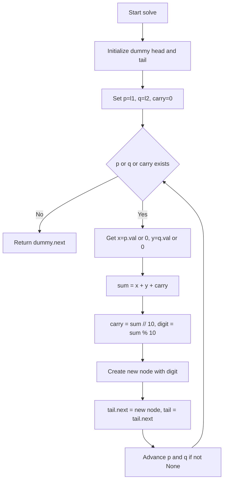
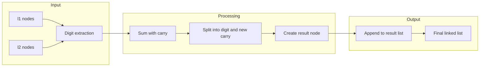

# Add Two Numbers - 逆順連結リスト加算

<a id="top"></a>

## 目次

- [概要](#overview)
- [アルゴリズム要点（TL;DR）](#tldr)
- [図解](#figures)
- [正しさのスケッチ](#correctness)
- [計算量](#complexity)
- [Python 実装](#impl)
- [CPython 最適化ポイント](#cpython)
- [エッジケースと検証観点](#edgecases)
- [FAQ](#faq)

---

<h2 id="overview">概要</h2>

**問題タイトル**: Add Two Numbers
**プラットフォーム/ID**: LeetCode 2

### 問題要約

2 つの **非空** 連結リスト（各ノードは単一の桁を保持）で表された非負整数が与えられる。桁は **逆順** で格納されている（例: `342` → `[2,4,3]`）。2 つの数を加算し、結果を同じく逆順の連結リストとして返す。

### 要件

- **正当性**: 各桁の加算と繰り上がり（carry）を正確に処理し、最終的な桁数が正しいこと
- **安定性**: 入力リストを破壊しない（非破壊的操作）
- **制約**:
    - 各リストのノード数: `[1, 100]`
    - 各ノードの値: `0 <= Node.val <= 9`
    - 先頭ゼロは数値 0 以外では存在しない

---

<h2 id="tldr">アルゴリズム要点（TL;DR）</h2>

- **戦略**: 2 つのリストを **同時走査** し、各桁の和 + 繰り上がり（carry）を計算。新しいノードを逐次生成して結果リストを構築
- **データ構造**:
    - **番兵（ダミー）ノード**: 先頭ノードの特別処理を排除し、コードを簡潔化
    - **テールポインタ**: O(1)で末尾追加を実現
- **計算量**:
    - **時間**: O(n)（n = max(len(l1), len(l2))）
    - **空間**: O(1)（出力ノードを除く補助空間）
- **メモリ要約**: 新規ノードは結果リスト用のみ。追加の配列やスタックは不要

---

<h2 id="figures">図解</h2>

### フローチャート



**説明**: ダミーヘッドを用意し、両リストと carry が全て処理されるまでループ。各ステップで桁の和を計算し、新ノードを末尾に追加。ポインタを前進させて次の桁へ。

### データフロー図



**説明**: 各リストから桁を取り出し、carry と合算。結果を新ノードとして出力リストに逐次追加。最終的に逆順のまま完全な和を表すリストが得られる。

---

<h2 id="correctness">正しさのスケッチ</h2>

### 不変条件

- **ループ不変条件**: 各反復の開始時、`tail` は結果リストの最後のノードを指し、`carry` は前の桁からの繰り上がりを保持する
- `p` と `q` はそれぞれ未処理の最初のノード、または None を指す

### 網羅性

- **ケース 1**: `p` と `q` が両方とも存在 → 両方の値と carry を加算
- **ケース 2**: 一方のみ存在 → 存在する方の値 + carry（他方は 0 として扱う）
- **ケース 3**: 両方 None、carry のみ残存 → carry を最終桁として追加
- ループ条件 `while p or q or carry` により、全てのケースが網羅される

### 基底条件

- 両リストが空かつ carry が 0 になった時点でループ終了
- 最小ケース（例: `l1=[0], l2=[0]`）でも正しく `[0]` を返す

### 終了性

- 各反復で `p` と `q` を前進させるため、有限回（最大 `max(len(l1), len(l2)) + 1` 回）で必ず終了
- 最悪でも繰り上がりが 1 桁追加される程度で収束

---

<h2 id="complexity">計算量</h2>

### 時間計算量

- **O(n)**: n = max(len(l1), len(l2))
- 各ノードを 1 回ずつ訪問し、定数時間の演算（加算、除算、剰余）のみ実行

### 空間計算量

- **O(1)**: 出力ノードを除く補助空間
- 番兵ノード 1 個、ポインタ変数（`p`, `q`, `tail`, `carry`）のみ使用
- 出力リストのノード数は O(n)だが、これは問題の性質上必須

### 方式比較

| アプローチ                   | 時間 | 空間（補助） | 備考                               |
| ---------------------------- | ---- | ------------ | ---------------------------------- |
| **同時走査+carry（本実装）** | O(n) | O(1)         | 最もシンプルで効率的               |
| 配列展開 → 数値化 → 再構築   | O(n) | O(n)         | 桁数が多い場合に BigInt 対応が冗長 |
| 再帰による桁加算             | O(n) | O(n)         | 再帰深度により非効率               |

---

<h2 id="impl">Python 実装</h2>

```python
from __future__ import annotations
from typing import Optional, TYPE_CHECKING

# LeetCode環境ではListNodeが提供されるが、単独実行用にフォールバック定義
if TYPE_CHECKING:
    # 型チェック時はこちらを参照（Pylance用）
    class ListNode:
        val: int
        next: Optional[ListNode]
        def __init__(self, val: int = 0, next: Optional[ListNode] = None) -> None: ...
else:
    # 実行時はLeetCodeの定義を優先、なければ軽量実装
    try:
        from leetcode_structures import ListNode  # type: ignore
    except (ImportError, ModuleNotFoundError):
        class ListNode:
            __slots__ = ("val", "next")
            def __init__(self, val: int = 0, next: Optional[ListNode] = None) -> None:
                self.val = val
                self.next = next


class Solution:
    """
    LeetCode 2: Add Two Numbers

    2つの逆順連結リストで表された非負整数を加算し、
    結果を逆順連結リストで返す。

    時間計算量: O(n) - n = max(len(l1), len(l2))
    空間計算量: O(1) - 出力ノードを除く補助空間
    """

    def addTwoNumbers(
        self,
        l1: Optional[ListNode],
        l2: Optional[ListNode]
    ) -> Optional[ListNode]:
        """
        2つの逆順リストの和を逆順リストで返す。

        Args:
            l1: 第1の数の逆順連結リスト（最下位桁が先頭）
            l2: 第2の数の逆順連結リスト（最下位桁が先頭）

        Returns:
            和を表す逆順連結リスト

        Examples:
            >>> # l1=[2,4,3], l2=[5,6,4] -> [7,0,8] (342+465=807)
            >>> # l1=[9,9,9,9,9,9,9], l2=[9,9,9,9] -> [8,9,9,9,0,0,0,1]
        """
        # 番兵ノード: 先頭ノードの特別処理を排除
        dummy: ListNode = ListNode(0)
        tail: ListNode = dummy

        # 走査ポインタと繰り上がり
        p: Optional[ListNode] = l1
        q: Optional[ListNode] = l2
        carry: int = 0

        # いずれかのリストが残るか、繰り上がりが残る限り処理
        while p is not None or q is not None or carry != 0:
            # 現在の桁の値を取得（リストが終了していれば0）
            x: int = p.val if p is not None else 0
            y: int = q.val if q is not None else 0

            # 桁の和 + 繰り上がりを計算
            sum_: int = x + y + carry
            carry = sum_ // 10  # 新しい繰り上がり
            digit: int = sum_ % 10  # 現在の桁の値

            # 結果ノードを生成して末尾に追加
            tail.next = ListNode(digit)
            tail = tail.next

            # ポインタを前進（存在する場合のみ）
            if p is not None:
                p = p.next
            if q is not None:
                q = q.next

        # 番兵の次が実際の結果の先頭
        return dummy.next
```

### 実装のポイント

1. **番兵ノード**: `dummy` により先頭ノードの特別処理が不要になり、コードが簡潔化
2. **テールポインタ**: `tail` で常に最後のノードを追跡し、O(1)追加を実現
3. **Null 安全**: `p is not None` チェックで None ポインタ参照を回避
4. **型注釈**: `Optional[ListNode]` で静的解析ツール（Pylance）に対応
5. **非破壊**: 入力リストは変更せず、新しいノードのみ生成

---

<h2 id="cpython">CPython最適化ポイント</h2>

### 実装済みの最適化

1. **ループの最小化**
    - 単一の `while` ループで全処理を完結
    - 分岐は最小限（`is not None` チェックのみ）

2. **属性アクセスの削減**
    - ループ内で `p.val`, `q.val` を一度だけ読み取り、ローカル変数に格納
    - 繰り返しの属性参照を回避

3. **オブジェクト生成の抑制**
    - 各反復で `ListNode` を 1 個のみ生成
    - 中間リスト、タプル、辞書などは使用しない

4. **整数演算の効率化**
    - `//` と `%` による除算・剰余は、CPython で高度に最適化済み
    - `divmod()` も選択肢だが、可読性重視で個別演算を使用

### さらなる最適化の余地（状況依存）

- **数値変換アプローチ**: リストを整数に変換して加算し、再度リストに戻す方法もあるが、桁数が多い場合（100 桁）は `int` から `ListNode` への変換コストが高い
- **再帰の回避**: 本実装は既に反復的であり、スタックオーバーフローのリスクがない

### メモリ効率

- `__slots__` を `ListNode` に追加すれば、ノードあたりのメモリを削減可能（ただし LeetCode 環境では通常不要）

---

<h2 id="edgecases">エッジケースと検証観点</h2>

### 主要なエッジケース

1. **両方ともゼロ**
    - 入力: `l1=[0], l2=[0]`
    - 出力: `[0]`
    - 確認: 最小ケースで正常動作

2. **桁あふれ（繰り上がりが最終桁を超える）**
    - 入力: `l1=[9,9,9,9,9,9,9], l2=[9,9,9,9]`
    - 出力: `[8,9,9,9,0,0,0,1]`
    - 確認: 最終的な繰り上がりが新しいノードとして追加される

3. **長さが大きく異なる**
    - 入力: `l1=[2,4,3], l2=[5,6,4,9,9]`
    - 出力: `[7,0,8,9,9]`
    - 確認: 短い方が終了してもループが継続し、長い方を正しく処理

4. **片方が単一ノード**
    - 入力: `l1=[5], l2=[5]`
    - 出力: `[0,1]`
    - 確認: 繰り上がりが発生するケース

5. **最大長（制約の境界）**
    - 入力: 100 ノードずつ
    - 確認: パフォーマンスが線形であること、メモリが安定していること

### 検証観点

- **正当性**: 全ての桁が正しく加算され、繰り上がりが正確に伝搬されているか
- **安定性**: 入力リストが変更されていないか（非破壊性）
- **境界値**: 最小（1 ノード）から最大（100 ノード）まで動作するか
- **型安全性**: Pylance で警告が出ないか（`Optional` の適切な処理）

---

<h2 id="faq">FAQ</h2>

### Q1: なぜ番兵（ダミー）ノードを使うのか?

**A**: 先頭ノードの特別処理を避けるため。番兵がないと、最初のノードを作成する際に `if` 文が必要になり、コードが複雑化する。番兵により全ノードを統一的に処理できる。

### Q2: `divmod()` を使わない理由は?

**A**: `carry, digit = divmod(sum_, 10)` も有効だが、`//` と `%` の方が意図が明確で読みやすい。パフォーマンス差はほぼない。

### Q3: 入力が `None` の場合は考慮する必要があるか?

**A**: LeetCode の制約では「非空リスト」が保証されているため、`l1` や `l2` が `None` になることはない。ただし、型注釈は `Optional[ListNode]` にして LeetCode のシグネチャに合わせている。

### Q4: 再帰的な実装の方がシンプルではないか?

**A**: 再帰も可能だが、以下の理由で反復的実装を推奨:

- **スタック効率**: 100 ノードの深さでもスタックを消費しない
- **CPython 最適化**: ループの方が最適化されやすい
- **可読性**: 初学者にも理解しやすい

### Q5: 出力リストを逆順にするのではなく、順序を反転させる必要はないか?

**A**: 問題の要件では、出力も **逆順**（最下位桁が先頭）で返すため、反転は不要。入力と同じ順序規則で出力する。

### Q6: より大きな桁数（例: 1000 桁）でも動作するか?

**A**: アルゴリズム自体はスケーラブルだが、LeetCode の制約は最大 100 ノード。1000 桁でも理論的には動作するが、数値変換アプローチの方が効率的になる可能性がある（ただし、本実装は依然として O(n)で動作する）。

---

[トップに戻る](#top)
