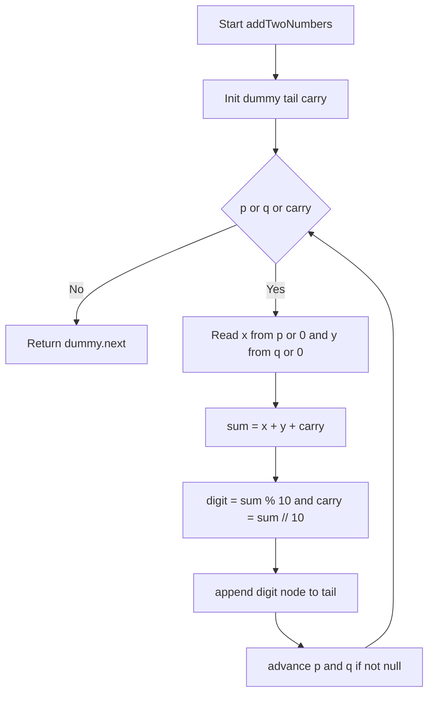
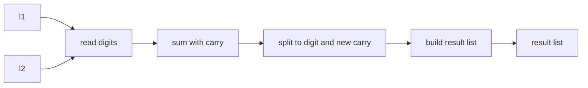

# Add Two Numbers - 桁ごとの同時走査で O(n) 合成

## Table of Contents

- [概要](#overview)
- [アルゴリズム要点（TL;DR）](#tldr)
- [図解](#figures)
- [正しさのスケッチ](#correctness)
- [計算量](#complexity)
- [Python 実装](#impl)
- [CPython 最適化ポイント](#cpython)
- [エッジケースと検証観点](#edgecases)
- [FAQ](#faq)

---

<h2 id="overview">概要</h2>

- **問題**: 2 つの非空単方向連結リスト `l1`, `l2` は、**各ノードが 1 桁の非負整数**を持ち、**逆順**に並ぶ数を表す。これらの**和**を同じ形式の連結リストで返す。
- **制約**: 各ノード `0 ≤ val ≤ 9`、先頭の不要な 0 は存在しない（数 0 自体を除く）。リスト長は最大 100 程度。
- **目標**: 1 パスで走査し、**繰り上がり**を管理して結果リストを構築する。安定した実装で**可読性・保守性・型安全性**を担保。

---

<h2 id="tldr">アルゴリズム要点（TL;DR）</h2>

- **戦略**: `l1` と `l2` を**同時走査**し、各桁の和 `x + y + carry` を計算。`digit = sum % 10`, `carry = sum // 10`。
- **データ構造**: **番兵（ダミー）ノード＋テールポインタ**で末尾追加を O(1) に簡素化。
- **イミュータブル方針**: 入力は**非破壊**、新しいリストを生成。
- **計算量**: **Time O(n)**（n は長い方の長さ）、**Space O(1)**（出力ノード除く）。
- **実装の肝**: `while p or q or carry:` で**終了条件を一元化**し、先頭分岐や末尾処理の特例を排除。

---

<h2 id="figures">図解</h2>

## **フローチャート（処理の流れ）**



_説明_: `p` と `q` を順に進め、各ステップで `digit` を生成して末尾に接続する。`carry` が 0 になるまで継続。

## **データフロー（入力から出力まで）**



_説明_: 各ステップで桁の和を算出し、`digit` と `carry` を更新しながら結果リストを構築。

---

<h2 id="correctness">正しさのスケッチ</h2>

- **不変条件**
    - ループ各反復後、`dummy.next` から `tail` までのリストは**下位桁から現在処理済みの桁まで**の正しい和を表す。
    - `carry` は常に 0〜1（`0 ≤ carry ≤ 1`）であり、未処理の繰り上がりを正しく保持。

- **網羅性**
    - `while p or q or carry` により、どちらかのリストが長い場合や**最終繰り上がり**が残る場合も確実に処理。

- **基底条件**
    - 両リストが空で `carry = 0` のときに終了し、結果を返す。

- **終了性**
    - 各反復で `p` または `q` が先に進むか `carry` が 0 に近づくため、**高々 max(len(l1), len(l2)) + 1** 反復で停止。

---

<h2 id="complexity">計算量</h2>

- **時間計算量**: **O(n)**（`n = max(len(l1), len(l2))`）
- **空間計算量**: **O(1)**（出力ノードを除く追加メモリは定数）

| 観点       | Pure 生成（本実装） | 破壊的結合                 |
| ---------- | ------------------- | -------------------------- |
| 入力破壊   | なし                | あり得る                   |
| 実装複雑性 | 低                  | 中（先頭分岐・所有権）     |
| メモリ     | 新規ノード数 = 桁数 | 一部節約可能だが保守性低下 |

---

<h2 id="impl">Python 実装</h2>

> **要件**: CPython 3.11+、LeetCode の class 形式、pylance でエラーが出ない型注釈。
> **方針**: 入力は非破壊、番兵＋テールで O(1) 連結、`Optional` を明示して null 安全。

```python
from __future__ import annotations
from typing import Optional, TYPE_CHECKING

# LeetCode 環境では ListNode が事前定義されるが、
# 単独ファイルでも型解決できるよう軽量フォールバックを用意する。
if TYPE_CHECKING:
    # 型チェック用スタブ（実行時には評価されない）
    class ListNode:
        val: int
        next: Optional["ListNode"]
else:
    try:
        ListNode  # type: ignore[name-defined]
    except NameError:
        class ListNode:  # minimal runtime fallback
            __slots__ = ("val", "next")
            def __init__(self, val: int = 0, next: Optional["ListNode"] = None) -> None:
                self.val = val
                self.next = next


class Solution:
    """
    Add Two Numbers
    - 2 つの逆順連結リストが表す非負整数の和を、逆順連結リストで返す。
    - 入力は非破壊、番兵＋テールで O(1) 連結。
    - Time O(n), Space O(1)（出力ノードを除く）
    """

    def addTwoNumbers(
        self,
        l1: Optional[ListNode],
        l2: Optional[ListNode],
    ) -> Optional[ListNode]:
        """
        Args:
            l1: 第1引数のリスト先頭（None の可能性は型上許容）
            l2: 第2引数のリスト先頭（同上）

        Returns:
            和を表す新しい連結リストの先頭ノード

        Complexity:
            Time: O(n)
            Space: O(1)  ※出力ノードを除く
        """
        # 番兵（ダミー）ノードで先頭分岐を排除
        dummy: ListNode = ListNode(0)
        tail: ListNode = dummy

        p: Optional[ListNode] = l1
        q: Optional[ListNode] = l2
        carry: int = 0

        # どちらかにノードが残るか、繰り上がりが残る限り継続
        while p is not None or q is not None or carry != 0:
            x: int = p.val if p is not None else 0
            y: int = q.val if q is not None else 0

            total: int = x + y + carry
            carry = total // 10
            digit: int = total % 10

            # 生成ノードは毎回1個のみ
            tail.next = ListNode(digit)
            # tail.next は None ではないため、type: ignore を避ける代入形にする
            tail = tail.next  # type: ignore[assignment]

            # ポインタ前進
            if p is not None:
                p = p.next
            if q is not None:
                q = q.next

        return dummy.next
```

## **主要コメント**

- **基底条件**: `p`, `q` が尽き、`carry = 0` の時に終了。
- **枝刈り**: 不要な分岐を番兵で削減。
- **不変条件**: `dummy.next` から `tail` までが常に「これまでの正しい下位桁の和」を保持。
- **終了処理**: 余り `carry` が 1 の場合もループで 1 桁を付加して完結。

---

<h2 id="cpython">CPython最適化ポイント</h2>

- **属性アクセス削減**: `p.val`, `q.val` は 1 回だけ読み取り、ローカル変数 `x`, `y` に束縛。
- **関数呼び出し最小化**: `divmod` ではなく `//` と `%` を用い、意図を明確化。
- **オブジェクト生成の抑制**: 毎反復で新ノード 1 個のみ。補助リスト・タプルを作らない。
- **分岐一元化**: `while p or q or carry` により終了条件と処理本体を簡潔化。
- **`__slots__`**（フォールバック）: 低オーバーヘッドの簡易 ListNode でメモリ節約。

---

<h2 id="edgecases">エッジケースと検証観点</h2>

- **両方ゼロ**: `l1=[0], l2=[0] → [0]`
- **繰り上がりのみで桁数増加**: `l1=[9,9,9], l2=[1] → [0,0,0,1]`
- **長さ不一致**: `l1` と `l2` の長さが大きく異なる（短い側は 0 として扱う）
- **片方が単一ノード**: `l1=[0], l2=[9,9]` など
- **最大長付近**: 100 桁同士でも 1 パスで安全に処理
- **入力の前提破り**（理論上）: `val` が 0–9 外や負値（LeetCode では発生しない）

---

<h2 id="faq">FAQ</h2>

- **Q. 破壊的に再利用すればメモリが減りますか？**
  A. 一部削減は可能ですが、**先頭分岐や所有権の複雑化**で保守性が低下します。本問題では**非破壊生成が最適**です。

- **Q. 文字列や配列にしてから加算しては？**
  A. 追加メモリと変換コストが増え、桁数が大きい場合に不利です。連結リストを**直接 1 パス**で処理するのが最短です。

- **Q. `divmod` を使う方が Pythonic？**
  A. 可読性は高いですが、ここでは `//` と `%` で意図を明示しました。いずれでも正解です。

---

## **メタ情報**

- **プラットフォーム/ID**: LeetCode 2
- **関数シグネチャ**
  `class Solution: def addTwoNumbers(self, l1: Optional[ListNode], l2: Optional[ListNode]) -> Optional[ListNode]:`
- **想定データ構造**: `ListNode`（単方向連結リスト）
- **ターゲット計算量**: **Time O(n)** / **Space O(1)**（出力除く）

本 README は単一ファイルで完結し、図は Mermaid の厳格な記法要件に準拠しています。
