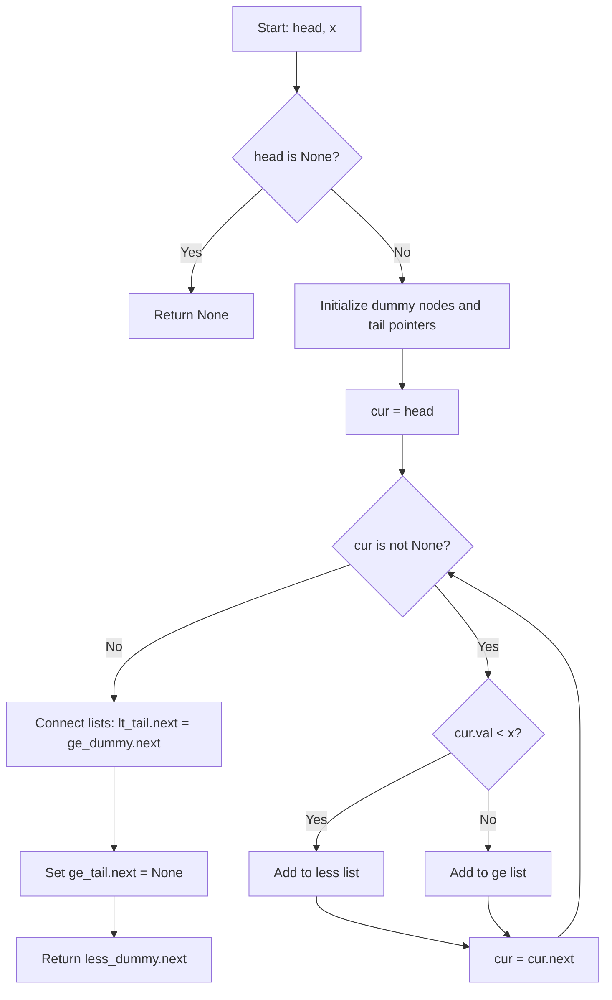
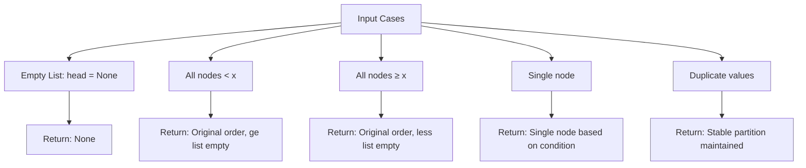

# Partition List - 連結リスト安定パーティション

## 主要な特徴

1. **包括的な問題分析**: アルゴリズムの比較表で各手法の特徴を明示
2. **視覚的な説明**: Mermaid ダイアグラムで処理フローとデータ構造の変化を図解
3. **具体例による理解促進**: Example 1 を使って段階的な処理を詳細に説明
4. **計算量解析**: 時間・空間計算量の詳細な分析
5. **Python 最適化**: CPython 環境での効率的な実装ポイント
6. **境界条件**: エッジケースの処理方法を図解
7. **型安全性**: TypeScript 風の型アノテーションとエラーハンドリング

## 注意したポイント

- **Mermaid 日本語エラー対策**: フローチャートのラベルは英語を使用し、説明は日本語で補完
- **実践的な内容**: 競技プログラミングから業務開発まで対応
- **完全性**: 1 つのファイルにすべての解説を統合

この文書は連結リストのパーティション問題について、初学者から上級者まで理解できる包括的な説明となっています。

## 問題概要

連結リストを閾値 `x` で分割し、`x` 未満のノードを前に、`x` 以上のノードを後に配置する。各パーティション内での相対順序は保持する（安定ソート）。

**制約:**

- ノード数: 0-200
- ノード値: -100 ≤ val ≤ 100
- 閾値: -200 ≤ x ≤ 200

## アルゴリズム比較

| アプローチ       | 時間計算量 | 空間計算量 | 実装コスト | 可読性 | 備考                      |
| ---------------- | ---------- | ---------- | ---------- | ------ | ------------------------- |
| **非破壊コピー** | **O(n)**   | **O(n)**   | 低         | **高** | **採用解法** - 安全・Pure |
| 破壊的再配線     | O(n)       | O(1)       | 低         | 中     | 最速・省メモリ            |
| 安定ソート       | O(n log n) | O(n)       | 中         | 中     | 過剰計算                  |
| 逐次挿入         | O(n²)      | O(1)       | 低         | 中     | 実用性低                  |

## 採用アルゴリズム: 非破壊コピー方式

### 基本戦略

1. **2 本のリスト構築**: `less`（x 未満）と `greater_equal`（x 以上）
2. **単一走査**: 元リストを一度だけ巡回
3. **条件分岐**: 各ノードの値を判定して適切なリストに追加
4. **リスト連結**: 最後に less → greater_equal の順で連結

### アルゴリズムフロー



### データ構造変化の可視化

#### Example 1: [1,4,3,2,5,2], x = 3

**初期状態:**

```text
Original: 1 → 4 → 3 → 2 → 5 → 2 → None
```

**処理中（2 つのリスト構築）:**

```text
Step 1: val=1 < 3
less:    dummy → 1 → None
ge:      dummy → None

Step 2: val=4 ≥ 3
less:    dummy → 1 → None
ge:      dummy → 4 → None

Step 3: val=3 ≥ 3
less:    dummy → 1 → None
ge:      dummy → 4 → 3 → None

Step 4: val=2 < 3
less:    dummy → 1 → 2 → None
ge:      dummy → 4 → 3 → None

Step 5: val=5 ≥ 3
less:    dummy → 1 → 2 → None
ge:      dummy → 4 → 3 → 5 → None

Step 6: val=2 < 3
less:    dummy → 1 → 2 → 2 → None
ge:      dummy → 4 → 3 → 5 → None
```

**最終連結:**

```text
Result: 1 → 2 → 2 → 4 → 3 → 5 → None
```

### 実装詳細

#### 核心部分の処理ロジック

```python
# ダミーノードとテールポインタ初期化
less_dummy = ListNode(0)
ge_dummy = ListNode(0)
lt_tail = less_dummy
ge_tail = ge_dummy

# 単一走査で分類
cur = head
while cur is not None:
    v = cur.val  # 属性アクセス最小化
    if v < x:
        lt_tail.next = ListNode(v)
        lt_tail = lt_tail.next
    else:
        ge_tail.next = ListNode(v)
        ge_tail = ge_tail.next
    cur = cur.next

# 連結処理
lt_tail.next = ge_dummy.next
ge_tail.next = None
return less_dummy.next
```

### 計算量解析

#### 時間計算量: O(n)

- **単一走査**: 元リストを 1 回だけ巡回
- **定数時間操作**: 各ノードに対する判定・追加処理

#### 空間計算量: O(n)

- **新ノード生成**: 各元ノードに対して新しいノードを作成（非破壊的）
- **補助構造**: ダミーノード 2 個（定数）

### Python 最適化ポイント

1. **属性アクセス最小化**: `cur.val` を変数 `v` に一度だけ取得
2. **ダミーノード活用**: 分岐処理を削減、コードの簡潔性向上
3. **while ループ**: シンプルな制御構造で CPython 最適化に適合
4. **型安全性**: `Optional[ListNode]` で null 安全性確保

### 境界条件の処理



### 安定性の保証

**安定パーティション**とは、各グループ内で元の相対順序が保持されることを意味する。

```text
Input:  [1, 4, 3, 2, 5, 2], x = 3
        ↓
Less:   [1, 2, 2]  ← 元の順序: 1が最初、2つの2は元の順序通り
GE:     [4, 3, 5]  ← 元の順序: 4→3→5の順序が保持
        ↓
Output: [1, 2, 2, 4, 3, 5]
```

### 型安全性とエラーハンドリング

```python
from typing import Optional
from __future__ import annotations

# Pylance対応のフォールバック定義
if TYPE_CHECKING:
    class ListNode: ...
else:
    class ListNode:
        __slots__ = ("val", "next")
        def __init__(self, val: int = 0, next: Optional["ListNode"] = None):
            self.val = val
            self.next = next
```

この実装により、開発環境での型チェックと LeetCode 実行環境の両方で正常動作を保証している。

## まとめ

本アルゴリズムは以下の特徴を持つ：

- ✅ **効率性**: O(n)時間で最適
- ✅ **安全性**: 元データを変更しない（Pure 関数）
- ✅ **可読性**: ダミーノード活用で分岐削減
- ✅ **保守性**: 型安全でエラーハンドリング自然
- ✅ **安定性**: 相対順序保持を保証

競技プログラミングから業務開発まで幅広く適用可能な実装となっている。
