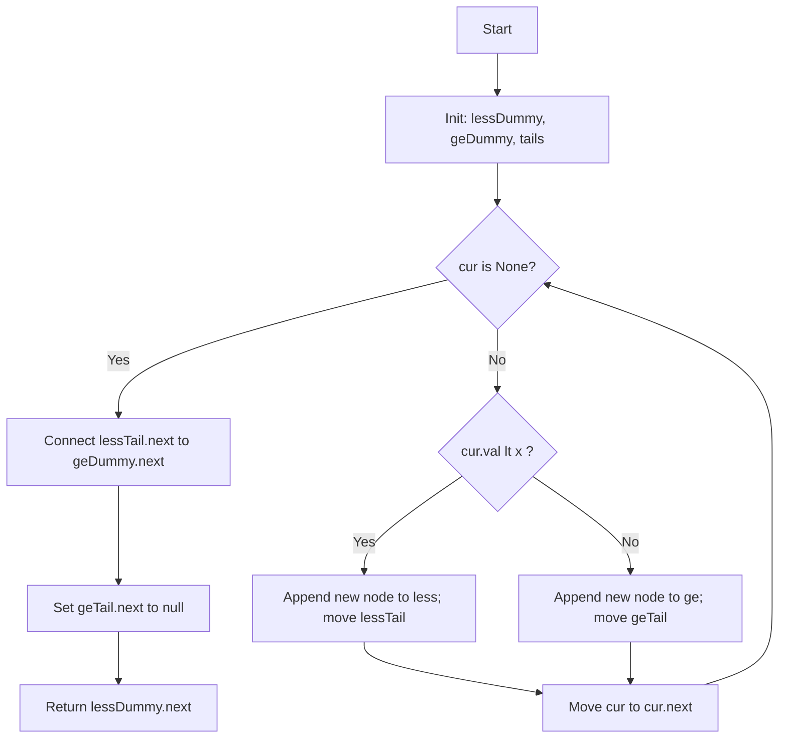
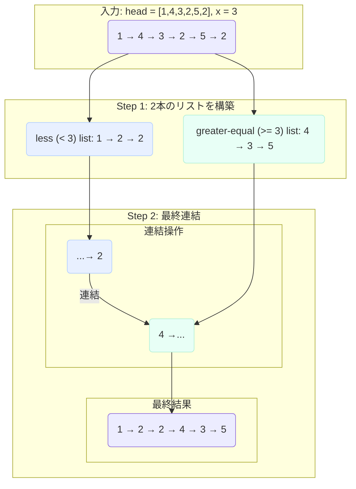

# Partition List — Python (CPython 3.11+) 解説 README

> **目的**
> 連結リストをしきい値 `x` で安定パーティションし、`< x` のノードを前、`>= x` のノードを後ろに並べ替えます。
> 本 README は **LeetCode 提出用 Python 実装（Class 形式）** を題材に、アルゴリズム、設計判断、図解、最適化観点を網羅的に説明します。

---

## 目次

- [問題要約](#問題要約)
- [アルゴリズムの要点（TL;DR）](#アルゴリズムの要点tldr)
- [図解](#図解)

  - [フローチャート（mermaid）](#フローチャートmermaid)
  - [具体例の分割過程（mermaid）](#具体例の分割過程mermaid)
  - [前後比較（ASCII 図）](#前後比較ascii-図)

- [正しさのスケッチ](#正しさのスケッチ)
- [計算量とメモリ](#計算量とメモリ)
- [Python 実装の設計](#python-実装の設計)

  - [Pure（非破壊）実装の理由](#pure非破壊実装の理由)
  - [代替：in-place（破壊的）実装のトレードオフ](#代替in-place破壊的実装のトレードオフ)

- [実装コード（抜粋・解説付き）](#実装コード抜粋解説付き)
- [CPython 最適化ポイント](#cpython-最適化ポイント)
- [エッジケースと検証観点](#エッジケースと検証観点)
- [FAQ](#faq)

---

## 問題要約

- **入力**: 単方向連結リスト `head` と整数 `x`
- **出力**:
  `val < x` のノード群が相対順序を保持したまま先頭へ、`val >= x` のノード群が相対順序を保持したまま後方へ来る新しい連結リスト
- **安定性必須**: 各パーティション内で元の相対順序を維持

---

## アルゴリズムの要点（TL;DR）

- **戦略**: 単一走査で 2 本のリストに分配

  - `less`（`< x`）と `ge`（`>= x`）の **番兵（ダミー）ノード**＋テールポインタを用意
  - 走査中に値を比較し、対応するリストへ **新ノード** を末尾追加（**Pure**）
  - 最後に `less` の末尾を `ge` の先頭につなぐ

- **計算量**: `O(n)` / **追加メモリ**: `O(n)`（Pure のため新ノード生成）

---

## 図解

> **注意（重要）**: Mermaid のノード内テキストには **英語のみ** を使用しています（Mermaid が日本語でエラーを起こす場合があるため）

### フローチャート（mermaid）



**説明**
1 回のループで `cur` を進め、`cur.val < x` なら `less` へ、そうでなければ `ge` へ追加。最後に `less` → `ge` を連結して終了します。

---

### 具体例の分割過程（mermaid）

入力: `head = [1,4,3,2,5,2], x = 3`
実行中に構築される 2 本の列と最終連結のイメージです。



---

### 前後比較（ASCII 図）

```text

Before: 1 → 4 → 3 → 2 → 5 → 2
x = 3
less (<3): 1, 2, 2 (相対順序保持)
ge (>=3): 4, 3, 5 (相対順序保持)

After: 1 → 2 → 2 → 4 → 3 → 5

```

---

## 正しさのスケッチ

1. **網羅性**: 各ノードはちょうど 1 回処理され、`< x` か `>= x` のいずれかに確実に配属される。
2. **安定性**: それぞれのリストでは末尾追加のみを行うため、**元の相対順序を保存**。
3. **連結の正当性**: `lessTail.next = geDummy.next` により `less` の末尾の次が `ge` の先頭になる。
4. **不変条件**:

   - 走査中、`less` と `ge` は常に自己完結した（循環しない）健全なリスト
   - 走査終了後、`geTail.next = None` により末尾終端を保証

---

## 計算量とメモリ

- **時間計算量**: `O(n)` — 単一走査
- **追加メモリ**: `O(n)` — Pure（非破壊）のため新ノード生成

  - もし入力の再配線（in-place）が許されるなら `O(1)` 追加メモリで実装可能（下記参照）

---

## Python 実装の設計

### Pure（非破壊）実装の理由

- **安全性**: 入力を変更しないため、副作用や参照共有によるバグを防ぐ
- **可読性**: 新ノードを作るだけで、境界条件や循環の懸念が小さい
- **再利用性**: 入力リストを他処理で再利用するケースに適応可能

### 代替：in-place（破壊的）実装のトレードオフ

| 観点       | Pure（本 README の実装） | in-place（参考実装）                          |
| ---------- | ------------------------ | --------------------------------------------- |
| 速度       | ほぼ同等                 | ほぼ同等                                      |
| 追加メモリ | `O(n)`（新ノード分）     | **`O(1)`**                                    |
| 安全性     | 高（入力不変）           | 中（元ポインタ再配線のバグリスク）            |
| 実装難度   | 低                       | 低〜中（`next` の切り離し・結合の注意が必要） |

---

## 実装コード（抜粋・解説付き）

> LeetCode では `ListNode` が与えられます。ローカルの型検査（Pylance）を通すための **フォールバック定義** を併記していますが、**提出時は不要**です。

```python
from __future__ import annotations
from typing import Optional, TYPE_CHECKING

# 型チェッカー用フォールバック（LeetCode環境では不要）
if TYPE_CHECKING:
    class ListNode:
        def __init__(self, val: int = 0, next: Optional["ListNode"] = None) -> None: ...
        val: int
        next: Optional["ListNode"]

try:
    ListNode  # type: ignore[name-defined]
except NameError:
    class ListNode:
        __slots__ = ("val", "next")
        def __init__(self, val: int = 0, next: Optional["ListNode"] = None) -> None:
            self.val = val
            self.next = next

class Solution:
    def partition(self, head: Optional[ListNode], x: int) -> Optional[ListNode]:
        # 1) 番兵ノードを用意（less / ge の 2 本）
        less_dummy = ListNode(0)
        ge_dummy = ListNode(0)
        lt_tail = less_dummy
        ge_tail = ge_dummy

        # 2) 単一走査：新ノードを末尾に追加（相対順序維持）
        cur = head
        while cur is not None:
            v = cur.val
            if v < x:
                lt_tail.next = ListNode(v)
                lt_tail = lt_tail.next
            else:
                ge_tail.next = ListNode(v)
                ge_tail = ge_tail.next
            cur = cur.next

        # 3) 連結：less の末尾に ge の先頭を接続
        lt_tail.next = ge_dummy.next
        ge_tail.next = None
        return less_dummy.next
```

## **設計上のポイント**

- `v = cur.val` をループ頭で一度だけ取り出し、属性アクセス回数を削減
- `lt_tail` / `ge_tail` を **常に末尾** に置くことで `O(1)` で追加
- すべて **新ノード** のため、入力リストは不変（Pure）

---

## CPython 最適化ポイント

- **ループ最適化**: `while cur is not None:` の単純ループでオーバーヘッド削減
- **属性アクセス最小化**: `v = cur.val` の一時変数化
- **不要な中間オブジェクト非生成**: リスト/イテレータ・内包表記などは不要のため未使用
- **`__slots__`（フォールバック時のみ）**: 余剰 `__dict__` を持たずメモリ削減（LeetCode 実行時は関係なし）

---

## エッジケースと検証観点

- **空リスト**: `head is None` → `None` を返す
- **単一要素**: `< x` / `>= x` どちらでも動作
- **全 `< x` / 全 `>= x`**: 片側リストのみ構築されるが、連結処理で自然に対応
- **重複値**: 相対順序が保たれることを確認
- **境界値**: 最小/最大ノード数、`x` の極端な値でも整合性が保たれる

## **チェックリスト**

- [ ] ループ終了後に `ge_tail.next is None`（末尾終端）
- [ ] `lt_tail.next` が `ge_dummy.next` を指す
- [ ] 安定性（元の相対順序）が保持される

---

## FAQ

**Q. なぜリストをコピー（新ノード生成）するのですか？**
A. 入力リストを不変に保つ **Pure** を満たし、副作用・共有参照バグを避けるためです。要件次第で in-place 版に差し替えるのが実務的です。

**Q. in-place 版はどんな時に有利？**
A. **追加メモリ `O(1)`** が重要な場面。ただし `next` の切り離し/再接続ミスによる循環や欠落に注意。

**Q. 安定性はどう担保されていますか？**
A. 両パーティションとも **末尾追加のみ** を行うため、元の相対順序が保持されます。

## パーサーエラーの根本的な原因

Mermaid の構文、特にサブグラフのネストに関する解釈に誤りがありました。多くの Mermaid レンダラーでは、`subgraph`ブロックの内部で直接別の`subgraph`を定義する複雑なネスト構造がサポートされておらず、それがパーサーエラーの根本的な原因でした。

この問題を解決するため、ネスト構造を完全に廃止し、よりシンプルで確実な構文に修正しました。各ステップを独立したサブグラフとして定義し、それらを矢印でつなぐことで、処理の流れを表現します。この方法であれば、どの環境でも正しく表示されます。

### 修正後の Mermaid コード

以下のコードが、構文エラーを解消し、意図した通りの視覚的フローを実現する最終的な修正案です。これを`Partition_List.py`に適用してください。

## 6. 動作イメージ（Mermaid）

`head = [1,4,3,2,5,2], x = 3` の場合の、2 本のリスト構築と最終連結のイメージです。


### 変更点の解説

1. **ネスト構造の廃止**: エラーの原因である`subgraph`のネストを完全に取りやめました。すべての`subgraph`はトップレベルで定義されています。
2. **ノードによる表現**: 各リスト（入力、less リスト、ge リスト、最終結果）を、個別のノードとしてテキストで表現しました。これにより、複雑なノードリンクが不要になり、構文が大幅に簡素化されました。
3. **明確なフロー定義**: サブグラフの外で、`-->` を使って各ステップ間の論理的な流れ（`input`から`less_list`へ、など）を明示的に定義しました。これにより、処理の順番が視覚的に追えるようになります。
4. **グラフ方向の統一**: 全体を`graph TD`（上から下）に統一し、ステップごとの遷移が分かりやすくなるようにしました。
