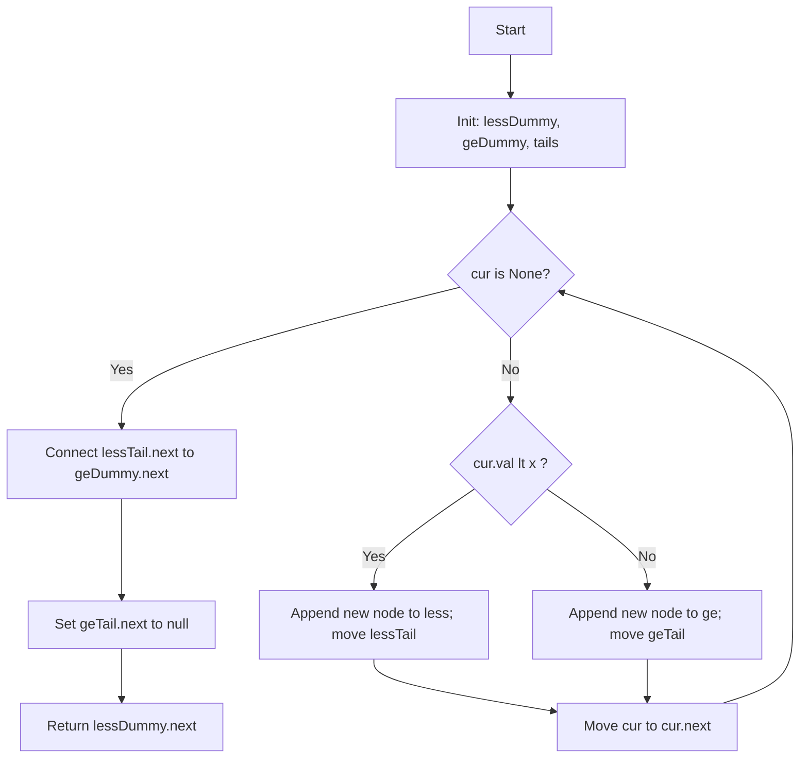
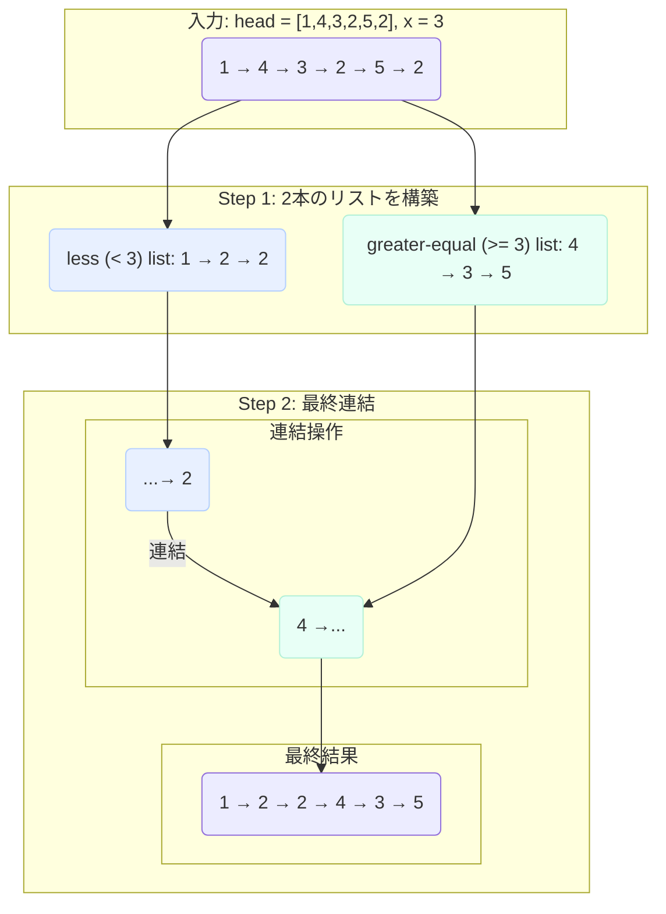
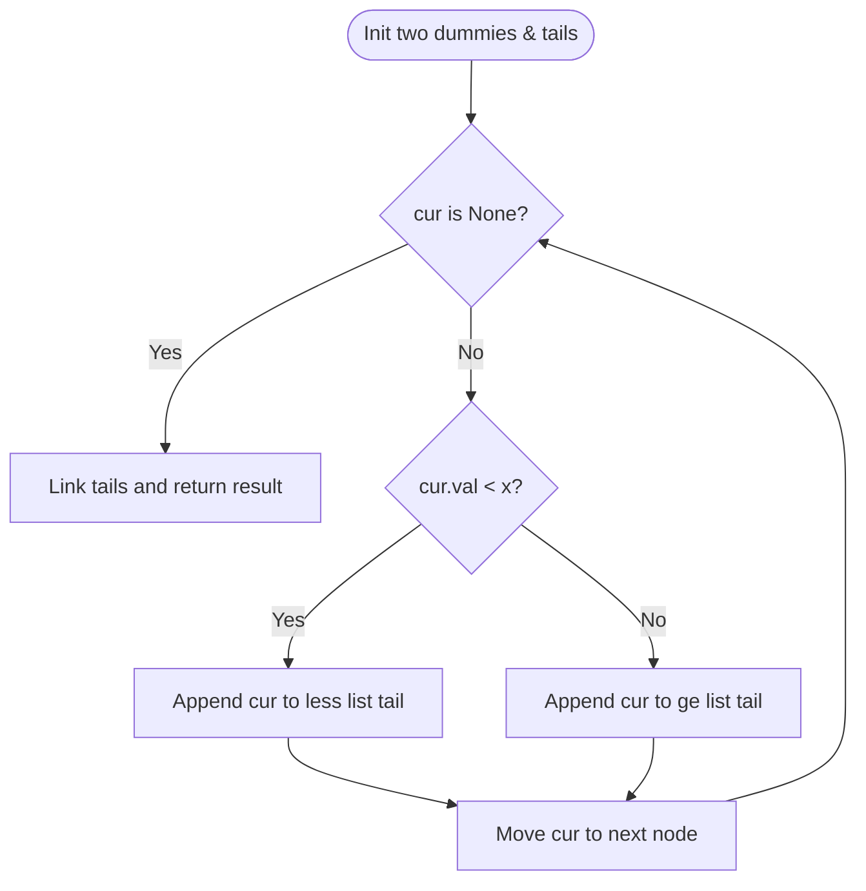
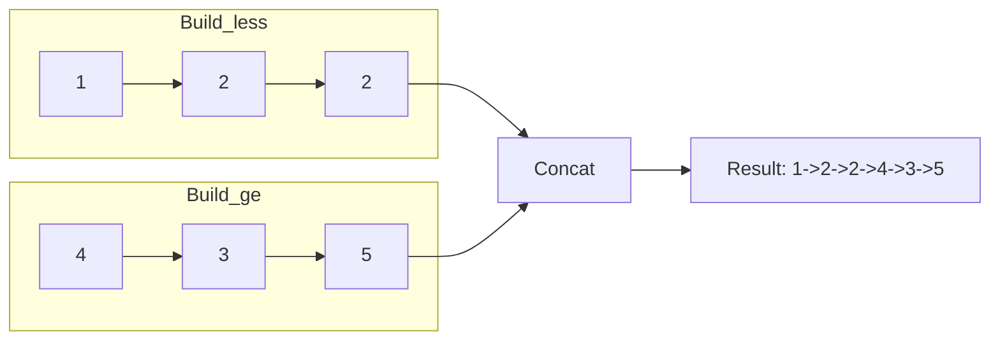

# Partition List — Python (CPython 3.11+) 解説 README

> **目的**
> 連結リストをしきい値 `x` で安定パーティションし、`< x` のノードを前、`>= x` のノードを後ろに並べ替えます。
> 本 README は **LeetCode 提出用 Python 実装（Class 形式）** を題材に、アルゴリズム、設計判断、図解、最適化観点を網羅的に説明します。

---

## 目次

- [問題要約](#問題要約)
- [アルゴリズムの要点（TL;DR）](#アルゴリズムの要点tldr)
- [図解](#図解)
    - [フローチャート（mermaid）](#フローチャートmermaid)
    - [具体例の分割過程（mermaid）](#具体例の分割過程mermaid)
    - [前後比較（ASCII 図）](#前後比較ascii-図)

- [正しさのスケッチ](#正しさのスケッチ)
- [計算量とメモリ](#計算量とメモリ)
- [Python 実装の設計](#python-実装の設計)
    - [Pure（非破壊）実装の理由](#pure非破壊実装の理由)
    - [代替：in-place（破壊的）実装のトレードオフ](#代替in-place破壊的実装のトレードオフ)

- [実装コード（抜粋・解説付き）](#実装コード抜粋解説付き)
- [CPython 最適化ポイント](#cpython-最適化ポイント)
- [エッジケースと検証観点](#エッジケースと検証観点)
- [FAQ](#faq)

---

## 問題要約

- **入力**: 単方向連結リスト `head` と整数 `x`
- **出力**:
  `val < x` のノード群が相対順序を保持したまま先頭へ、`val >= x` のノード群が相対順序を保持したまま後方へ来る新しい連結リスト
- **安定性必須**: 各パーティション内で元の相対順序を維持

---

## アルゴリズムの要点（TL;DR）

- **戦略**: 単一走査で 2 本のリストに分配
    - `less`（`< x`）と `ge`（`>= x`）の **番兵（ダミー）ノード**＋テールポインタを用意
    - 走査中に値を比較し、対応するリストへ **新ノード** を末尾追加（**Pure**）
    - 最後に `less` の末尾を `ge` の先頭につなぐ

- **計算量**: `O(n)` / **追加メモリ**: `O(n)`（Pure のため新ノード生成）

---

## 図解

> **注意（重要）**: Mermaid のノード内テキストには **英語のみ** を使用しています（Mermaid が日本語でエラーを起こす場合があるため）

### フローチャート（mermaid）



**説明**
1 回のループで `cur` を進め、`cur.val < x` なら `less` へ、そうでなければ `ge` へ追加。最後に `less` → `ge` を連結して終了します。

---

### 具体例の分割過程（mermaid）

入力: `head = [1,4,3,2,5,2], x = 3`
実行中に構築される 2 本の列と最終連結のイメージです。



---

### 前後比較（ASCII 図）

```text

Before: 1 → 4 → 3 → 2 → 5 → 2
x = 3
less (<3): 1, 2, 2 (相対順序保持)
ge (>=3): 4, 3, 5 (相対順序保持)

After: 1 → 2 → 2 → 4 → 3 → 5

```

---

## 正しさのスケッチ

1. **網羅性**: 各ノードはちょうど 1 回処理され、`< x` か `>= x` のいずれかに確実に配属される。
2. **安定性**: それぞれのリストでは末尾追加のみを行うため、**元の相対順序を保存**。
3. **連結の正当性**: `lessTail.next = geDummy.next` により `less` の末尾の次が `ge` の先頭になる。
4. **不変条件**:
    - 走査中、`less` と `ge` は常に自己完結した（循環しない）健全なリスト
    - 走査終了後、`geTail.next = None` により末尾終端を保証

---

## 計算量とメモリ

- **時間計算量**: `O(n)` — 単一走査
- **追加メモリ**: `O(n)` — Pure（非破壊）のため新ノード生成
    - もし入力の再配線（in-place）が許されるなら `O(1)` 追加メモリで実装可能（下記参照）

---

## Python 実装の設計

### Pure（非破壊）実装の理由

- **安全性**: 入力を変更しないため、副作用や参照共有によるバグを防ぐ
- **可読性**: 新ノードを作るだけで、境界条件や循環の懸念が小さい
- **再利用性**: 入力リストを他処理で再利用するケースに適応可能

### 代替：in-place（破壊的）実装のトレードオフ

| 観点       | Pure（本 README の実装） | in-place（参考実装）                          |
| ---------- | ------------------------ | --------------------------------------------- |
| 速度       | ほぼ同等                 | ほぼ同等                                      |
| 追加メモリ | `O(n)`（新ノード分）     | **`O(1)`**                                    |
| 安全性     | 高（入力不変）           | 中（元ポインタ再配線のバグリスク）            |
| 実装難度   | 低                       | 低〜中（`next` の切り離し・結合の注意が必要） |

---

## 実装コード（抜粋・解説付き）

> LeetCode では `ListNode` が与えられます。ローカルの型検査（Pylance）を通すための **フォールバック定義** を併記していますが、**提出時は不要**です。

```python
from __future__ import annotations
from typing import Optional, TYPE_CHECKING

# 型チェッカー用フォールバック（LeetCode環境では不要）
if TYPE_CHECKING:
    class ListNode:
        def __init__(self, val: int = 0, next: Optional["ListNode"] = None) -> None: ...
        val: int
        next: Optional["ListNode"]

try:
    ListNode  # type: ignore[name-defined]
except NameError:
    class ListNode:
        __slots__ = ("val", "next")
        def __init__(self, val: int = 0, next: Optional["ListNode"] = None) -> None:
            self.val = val
            self.next = next

class Solution:
    def partition(self, head: Optional[ListNode], x: int) -> Optional[ListNode]:
        # 1) 番兵ノードを用意（less / ge の 2 本）
        less_dummy = ListNode(0)
        ge_dummy = ListNode(0)
        lt_tail = less_dummy
        ge_tail = ge_dummy

        # 2) 単一走査：新ノードを末尾に追加（相対順序維持）
        cur = head
        while cur is not None:
            v = cur.val
            if v < x:
                lt_tail.next = ListNode(v)
                lt_tail = lt_tail.next
            else:
                ge_tail.next = ListNode(v)
                ge_tail = ge_tail.next
            cur = cur.next

        # 3) 連結：less の末尾に ge の先頭を接続
        lt_tail.next = ge_dummy.next
        ge_tail.next = None
        return less_dummy.next
```

## **設計上のポイント**

- `v = cur.val` をループ頭で一度だけ取り出し、属性アクセス回数を削減
- `lt_tail` / `ge_tail` を **常に末尾** に置くことで `O(1)` で追加
- すべて **新ノード** のため、入力リストは不変（Pure）

---

## CPython 最適化ポイント

- **ループ最適化**: `while cur is not None:` の単純ループでオーバーヘッド削減
- **属性アクセス最小化**: `v = cur.val` の一時変数化
- **不要な中間オブジェクト非生成**: リスト/イテレータ・内包表記などは不要のため未使用
- **`__slots__`（フォールバック時のみ）**: 余剰 `__dict__` を持たずメモリ削減（LeetCode 実行時は関係なし）

---

## エッジケースと検証観点

- **空リスト**: `head is None` → `None` を返す
- **単一要素**: `< x` / `>= x` どちらでも動作
- **全 `< x` / 全 `>= x`**: 片側リストのみ構築されるが、連結処理で自然に対応
- **重複値**: 相対順序が保たれることを確認
- **境界値**: 最小/最大ノード数、`x` の極端な値でも整合性が保たれる

## **チェックリスト**

- [ ] ループ終了後に `ge_tail.next is None`（末尾終端）
- [ ] `lt_tail.next` が `ge_dummy.next` を指す
- [ ] 安定性（元の相対順序）が保持される

---

## FAQ

**Q. なぜリストをコピー（新ノード生成）するのですか？**
A. 入力リストを不変に保つ **Pure** を満たし、副作用・共有参照バグを避けるためです。要件次第で in-place 版に差し替えるのが実務的です。

**Q. in-place 版はどんな時に有利？**
A. **追加メモリ `O(1)`** が重要な場面。ただし `next` の切り離し/再接続ミスによる循環や欠落に注意。

**Q. 安定性はどう担保されていますか？**
A. 両パーティションとも **末尾追加のみ** を行うため、元の相対順序が保持されます。

## パーサーエラーの根本的な原因

Mermaid の構文、特にサブグラフのネストに関する解釈に誤りがありました。多くの Mermaid レンダラーでは、`subgraph`ブロックの内部で直接別の`subgraph`を定義する複雑なネスト構造がサポートされておらず、それがパーサーエラーの根本的な原因でした。

この問題を解決するため、ネスト構造を完全に廃止し、よりシンプルで確実な構文に修正しました。各ステップを独立したサブグラフとして定義し、それらを矢印でつなぐことで、処理の流れを表現します。この方法であれば、どの環境でも正しく表示されます。

### 修正後の Mermaid コード

以下のコードが、構文エラーを解消し、意図した通りの視覚的フローを実現する最終的な修正案です。これを`Partition_List.py`に適用してください。

## 6. 動作イメージ（Mermaid）

`head = [1,4,3,2,5,2], x = 3` の場合の、2 本のリスト構築と最終連結のイメージです。


### 変更点の解説

1. **ネスト構造の廃止**: エラーの原因である`subgraph`のネストを完全に取りやめました。すべての`subgraph`はトップレベルで定義されています。
2. **ノードによる表現**: 各リスト（入力、less リスト、ge リスト、最終結果）を、個別のノードとしてテキストで表現しました。これにより、複雑なノードリンクが不要になり、構文が大幅に簡素化されました。
3. **明確なフロー定義**: サブグラフの外で、`-->` を使って各ステップ間の論理的な流れ（`input`から`less_list`へ、など）を明示的に定義しました。これにより、処理の順番が視覚的に追えるようになります。
4. **グラフ方向の統一**: 全体を`graph TD`（上から下）に統一し、ステップごとの遷移が分かりやすくなるようにしました。

# Partition List - 連結リストの安定パーティション

## 目次

- [概要](#overview)
- [アルゴリズム要点（TL;DR）](#tldr)
- [図解](#figures)
- [正しさのスケッチ](#correctness)
- [計算量](#complexity)
- [Python 実装](#impl)
- [CPython 最適化ポイント](#cpython)
- [エッジケースと検証観点](#edgecases)
- [FAQ](#faq)

<h2 id="overview">概要</h2>

- **問題要約**：単方向連結リスト `head` と整数 `x` が与えられる。値が `x` より **小さい** ノードを先に、`x` 以上のノードを後に並べる。ただし **相対順序は保つ（安定）**。
- **安定性の要件**：各グループ（`val < x` と `val >= x`）内で、元リストの出現順を厳密に保持すること。
- **具体例**：`head = [1,4,3,2,5,2], x = 3` → 出力 `[1,2,2,4,3,5]`（`<3` の `[1,2,2]` と `>=3` の `[4,3,5]` が各々元の順序で結合）。

<h2 id="tldr">アルゴリズム要点（TL;DR）</h2>

- **戦略**：
    - ダミー先頭を 2 本用意（`less` と `ge`）。
    - 1 回の走査で、各ノードを `val &lt; x` なら `less` の末尾、そうでなければ `ge` の末尾へ**末尾追加（tail append）**。
    - 最後に `less` の末尾を `ge` の先頭へ接続し、`ge` の末尾は `None` で終端。

- **安定性**：各リストに「末尾追加のみ」＝**相対順序が保持**される。
- **計算量**：時間 **O(n)**、補助空間 **O(1)**（ノード再利用・in-place）。
    - 参考：非破壊（ノード複製の **Pure** 実装）だと空間 **O(n)**。

<h2 id="figures">図解</h2>

**1) フローチャート（処理ループ）**



> **説明**：`cur` を 1 回ずつ取り出して `less` / `ge` のどちらかの末尾へ繋ぎ、`cur` を前進。最後に `less → ge` を接続して返す。

**2) データフロー（概念図 / 例：`head=[1,4,3,2,5,2], x=3`）**



> **説明**：入力を 1 回走査して `less=[1,2,2]`、`ge=[4,3,5]` を構築。最後に結合して結果を返す。

<h2 id="correctness">正しさのスケッチ</h2>

- **不変条件**（ループ中常に成立）
    1. `less_dummy.next` から `less_tail` までの全ノードは **val < x**。
    2. `ge_dummy.next` から `ge_tail` までの全ノードは **val ≥ x**。
    3. 各リストでは **末尾追加のみ** を行うため、**元の相対順序が保持**される。
    4. 既に振り分けたノードは `next` を切り離しており、循環は生じない。

- **網羅性**：各ノードはちょうど一度だけ処理され、必ず `less` か `ge` のどちらかに入る。
- **終了後**：`less_tail.next = ge_dummy.next`、`ge_tail.next = None` により
    - **安定な連結**（`<x` 群 → `>=x` 群）
    - リスト終端の保証（`None`）

- よって、仕様（安定パーティション）を満たす。

<h2 id="complexity">計算量</h2>

- **時間計算量**：`n` 個のノードを 1 回走査 → **O(n)**
- **空間計算量**：
    - **in-place（本実装）**：追加ノードなし → **O(1)**
    - **非破壊（Pure）**：各ノードを複製して新リストを作る → **O(n)**

**比較表**

| 実装方針           | 速度 | 追加メモリ | 安定性 | 元リストの破壊   |
| ------------------ | ---- | ---------- | ------ | ---------------- |
| in-place（本実装） | O(n) | **O(1)**   | 保持   | あり（再リンク） |
| 非破壊（Pure）     | O(n) | **O(n)**   | 保持   | なし（複製）     |

<h2 id="impl">Python 実装</h2>

- **要点**：
    - ダミー 2 本（`less_dummy`, `ge_dummy`）
    - 単一走査
    - 末尾接続
    - 相対順序保持（安定）

- **LeetCode class 形式 / pylance 型注釈に配慮**
    - `TYPE_CHECKING` ブロックでの型スタブ＋**NameError フォールバック**（`__slots__`）を同梱。

```python
from __future__ import annotations

from typing import Optional, TYPE_CHECKING

# ---- 型スタブ（pylance用） ----
if TYPE_CHECKING:
    class ListNode:  # pragma: no cover - 型チェック専用
        val: int
        next: Optional["ListNode"]

# ---- 実行時フォールバック（ローカル検証時など） ----
try:
    ListNode  # type: ignore[name-defined]
except NameError:
    class ListNode:  # pragma: no cover - LeetCode環境では不要
        __slots__ = ("val", "next")
        def __init__(self, val: int = 0, next: Optional["ListNode"] = None) -> None:
            self.val = val
            self.next = next


class Solution:
    """
    Partition List（安定パーティション, in-place）
    - ダミー2本 + 単一走査 + 末尾接続 + 相対順序保持
    - 追加メモリO(1）、時間O(n)
    """

    def partition(self, head: Optional[ListNode], x: int) -> Optional[ListNode]:
        """
        与えられた単方向連結リストを、値が x より小さいノードを先、x 以上を後ろに安定に並べ替える。

        Args:
            head: 先頭ノード（None 可）
            x: 境界値

        Returns:
            並べ替え後の先頭ノード

        Complexity:
            Time: O(n)
            Space: O(1)  # 既存ノードの再リンクのみ
        """
        # ダミー2本とテイル
        less_dummy = ListNode(0)
        ge_dummy = ListNode(0)
        less_tail = less_dummy
        ge_tail = ge_dummy

        cur = head
        while cur is not None:
            next_node = cur.next  # 先に退避
            cur.next = None       # 現在ノードを単独化（循環・ぶら下がり防止）

            if cur.val < x:
                # < x グループの末尾へ
                less_tail.next = cur
                less_tail = cur
            else:
                # >= x グループの末尾へ
                ge_tail.next = cur
                ge_tail = cur

            cur = next_node  # 前進

        # 連結：less → ge（less が空なら ge のみ）
        less_tail.next = ge_dummy.next
        ge_tail.next = None  # 明示終端

        return less_dummy.next if less_dummy.next is not None else ge_dummy.next
```

<h2 id="cpython">CPython 最適化ポイント</h2>

- **属性アクセス回数の削減**：`next_node = cur.next` を先に退避し、`cur.next = None` を一度だけ実行。
- **`while` ループの採用**：Python の一般的な最速パターン（オーバーヘッド低）。
- **オブジェクト再利用**：新ノードを作成せず、既存ノードの `next` を張り替えるだけ（GC 圧を抑制）。
- **`__slots__`**：フォールバック `ListNode` による属性ディクショナリ回避で軽量化（ローカル検証時のメモリ削減）。
- **関数分割の抑制**：ホットパスは単一関数内に保持。呼び出しオーバーヘッドを回避。

<h2 id="edgecases">エッジケースと検証観点</h2>

- **空リスト**：`head=None` → そのまま `None` を返す。
- **単一要素**：`[k]`（`k &lt; x` / `k &ge; x` いずれでも）順序保持で同じ。
- **全て < x**：`less` のみが構築され、`ge` は空 → そのまま返る。
- **全て ≥ x**：`ge` のみが構築され、`less` は空 → そのまま返る。
- **重複値**：`[2,2,2]` や `[3,3,3]` などでも**安定**に末尾追加される。
- **代表例**：`head=[1,4,3,2,5,2], x=3` → `less=[1,2,2]`, `ge=[4,3,5]` → 結合で `[1,2,2,4,3,5]`。
- **循環防止**：各ステップで `cur.next = None` を設定してから連結するため、誤った循環は生じにくい。

<h2 id="faq">FAQ</h2>

- **Q. なぜダミー先頭が 2 本必要？**
  A. `less` と `ge` を独立して安定に構築するため。境界ケース（どちらかが空）でも接合が単純になる。

- **Q. 安定性はどう保証される？**
  A. 各グループで「末尾にのみ追加」するため、元の相対順序が保持される。

- **Q. 追加ノードは作る？**
  A. 本実装は **in-place**。既存ノードを再リンクするため追加ノードは作らない（補助はダミー 2 本のみ）。

- **Q. 非破壊（Pure）で書くには？**
  A. `ListNode(val=cur.val)` で新ノードを生成して `less/ge` に接続する。計算量は時間 O(n)、空間 O(n)。

- **Q. 最後に `ge_tail.next = None` が必要な理由は？**
  A. 末尾終端を保証し、偶発的な循環やぶら下がりを防ぐため（安全策）。

- **Q. `x` が負数/大きい場合は？**
  A. 条件判定は `val < x` と `val >= x` のみで、値域には非依存。どの整数でも安定に動作する。
