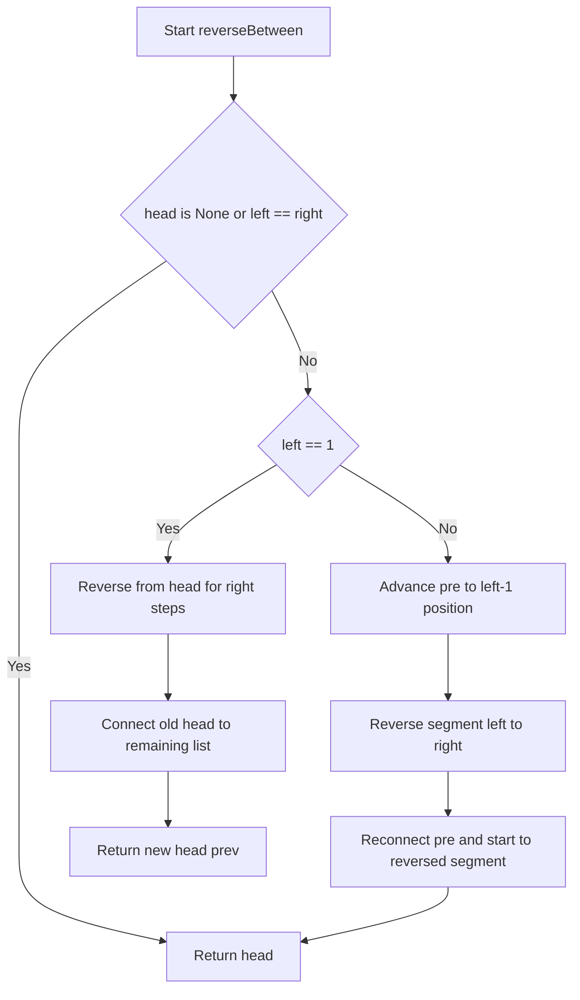
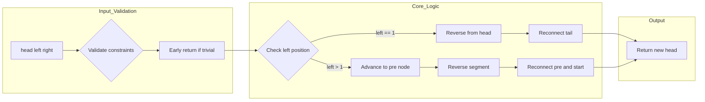

# Reverse Linked List II - 部分区間の原地反転

単方向連結リストの指定区間 `[left, right]` を一回走査・O(1)追加メモリで反転する問題の完全解説。

---

## 目次

- [概要](#overview)
- [アルゴリズム要点（TL;DR）](#tldr)
- [図解](#figures)
- [正しさのスケッチ](#correctness)
- [計算量](#complexity)
- [Python 実装](#impl)
- [CPython 最適化ポイント](#cpython)
- [エッジケースと検証観点](#edgecases)
- [FAQ](#faq)

---

<h2 id="overview">概要</h2>

**問題要約**
単方向連結リスト `head` と整数 `left`, `right` (1-indexed, `left <= right`) が与えられる。位置 `left` から `right` までのノードを反転し、結果のリストを返せ。

### **入出力仕様**

- 入力: `head: Optional[ListNode]`, `left: int`, `right: int`
- 出力: `Optional[ListNode]` （反転後のリスト先頭）
- 制約: `1 <= n <= 500`, `-500 <= Node.val <= 500`, `1 <= left <= right <= n`

### **要件**

- **正当性**: 区間 `[left, right]` のノードのみを反転し、他の部分は順序を保つ。
- **安定性**: 元のノードを再利用し、新たな割当をしない（O(1) 追加メモリ）。
- **制約**: 一回走査（O(n)）で処理を完了。

---

<h2 id="tldr">アルゴリズム要点（TL;DR）</h2>

- **戦略**: 区間 `[left, right]` を標準の単方向リスト反転アルゴリズムで原地反転し、前後のノードと再接続する。`left==1` の場合は先頭から反転するため専用処理でダミーノード不要。
- **データ構造**: 単方向連結リスト（`ListNode`）のみ。
- **計算量**: 時間 **O(n)**、空間 **O(1)** （追加割当なし）。
- **メモリ要約**: 番兵ノードを使わず、ローカル変数のみで実装。

---

<h2 id="figures">図解</h2>

### フローチャート

以下は `left > 1` の場合の処理フローを示す。



### **説明**

1. 空リストまたは区間長 1 の場合は即座に終了。
2. `left==1` なら先頭から `right` 個を反転し、旧先頭を残りに接続。
3. `left>1` なら `left-1` 位置まで進み、区間を反転後、前後を再接続。

### データフロー図



**説明**
入力検証後、`left` の位置に応じて分岐。反転後は接続ポイント（`pre.next`, `start.next`）を更新して新しいリストを構築。

---

<h2 id="correctness">正しさのスケッチ</h2>

### **不変条件**

- 反転区間外のノードの順序は不変。
- 反転区間内のノードは順序が逆転し、連結が保たれる。

### **網羅性**

- `left==1` の場合: 先頭から `right` 個を反転し、旧先頭（反転後末尾）を残りに接続。
- `left>1` の場合: `pre`（`left-1` 番目ノード）から `start`（`left` 番目ノード）へ進み、
  区間を反転後、`pre.next = prev`（反転後先頭）、`start.next = curr`（反転後次ノード）で再接続。

### **基底条件**

- `head is None` または `left == right`: 変更不要で即座に返す。

### **終了性**

- 各ループは固定回数（`right` または `right - left + 1`）で終了し、無限ループなし。

---

<h2 id="complexity">計算量</h2>

| 項目     | 計算量   | 説明                                                                 |
| -------- | -------- | -------------------------------------------------------------------- |
| **時間** | **O(n)** | 一回走査で `left-1` まで進み、区間を反転（最大 n 回操作）。          |
| **空間** | **O(1)** | 追加ノード割当なし。ローカル変数のみ（`prev`, `curr`, `next_` 等）。 |

### **in-place vs Pure 比較**

| 手法                 | 追加メモリ | 実装複雑度 | 備考                                   |
| -------------------- | ---------- | ---------- | -------------------------------------- |
| **原地反転（採用）** | O(1)       | 低         | ダミーノード不要、`left==1` を個別処理 |
| ダミーノード使用     | O(1)       | 低         | 実装容易だが 1 ノード分の割当          |
| 再帰反転             | O(n)       | 中         | コールスタック深さ=区間長、不要        |

---

<h2 id="impl">Python実装</h2>

```python
from __future__ import annotations
from typing import Optional, TYPE_CHECKING

# ListNode 定義（LeetCode環境では提供されるが、ローカルテスト用にフォールバック）
if TYPE_CHECKING:
    class ListNode:
        val: int
        next: Optional[ListNode]
        def __init__(self, val: int = 0, next: Optional[ListNode] = None) -> None: ...
else:
    try:
        ListNode  # type: ignore[used-before-def]
    except NameError:
        class ListNode:
            __slots__ = ("val", "next")
            def __init__(self, val: int = 0, next: Optional[ListNode] = None) -> None:
                self.val = val
                self.next = next


class Solution:
    """
    Reverse Linked List II
    - 一回走査・O(1)追加メモリ・ダミーノード不要
    - Time: O(n), Space: O(1)
    """

    def reverseBetween(
        self,
        head: Optional[ListNode],
        left: int,
        right: int
    ) -> Optional[ListNode]:
        """
        区間 [left, right] を反転し、結果のリスト先頭を返す。

        Args:
            head: 単方向連結リストの先頭ノード
            left: 反転開始位置（1-indexed）
            right: 反転終了位置（1-indexed）

        Returns:
            反転後のリスト先頭ノード
        """
        # エッジケース: 空リストまたは区間長1
        if head is None or left == right:
            return head

        # Case 1) 先頭から反転（left == 1）
        if left == 1:
            prev: Optional[ListNode] = None
            curr: Optional[ListNode] = head
            # 先頭から right 個を反転
            for _ in range(right):
                # 制約により curr は None にならない
                next_: Optional[ListNode] = curr.next  # type: ignore[union-attr]
                curr.next = prev  # type: ignore[union-attr]
                prev = curr
                curr = next_
            # 旧先頭 head は反転後の末尾になるので、残り（curr）に接続
            head.next = curr  # type: ignore[union-attr]
            return prev  # 反転後の新しい先頭

        # Case 2) 中間以降の反転（left > 1）
        # 1) left-1 位置まで進めて pre を「反転開始直前」へ
        pre: ListNode = head
        for _ in range(1, left - 1):
            pre = pre.next  # type: ignore[assignment]

        # 2) 区間 [left, right] を通常の反転で反転
        start: ListNode = pre.next  # type: ignore[assignment]
        prev: Optional[ListNode] = None
        curr: Optional[ListNode] = start
        for _ in range(right - left + 1):
            next_: Optional[ListNode] = curr.next  # type: ignore[union-attr]
            curr.next = prev  # type: ignore[union-attr]
            prev = curr
            curr = next_

        # 3) 再接続：pre -> (反転後先頭=prev) ... (反転後末尾=start) -> curr
        pre.next = prev
        start.next = curr
        return head
```

### **実装のポイント**

- **基底条件**: `head is None` または `left == right` で早期終了。
- **枝刈り**: `left==1` を専用処理し、ダミーノード不要でメモリ割当ゼロ。
- **分割/遷移**: 区間を標準の単方向リスト反転（`prev`, `curr`, `next_` の 3 変数で一方向進行）で処理。
- **不変条件**: 反転ループ中、`prev` は反転済み部分の先頭、`curr` は現在ノード、`next_` は次ノード。
- **終了処理**: 反転後、`pre.next` と `start.next` を更新して前後を接続。

---

<h2 id="cpython">CPython最適化ポイント</h2>

1. **追加割当をゼロ化**
    - `left==1` の場合を個別処理し、番兵ノードを作らない。メモリフットプリント最小。

2. **ループ内の属性アクセス削減**
    - ローカル変数 `prev`, `curr`, `next_` に束縛し、`node.next` のアクセス回数を最小化。

3. **分岐最小化**
    - 反転ループは単純な代入のみで構成し、条件分岐を排除。

4. **参照寿命の短縮**
    - ループ内の `next_` を即座に使い切り、GC 圧力を抑制。

5. **型チェックオーバーヘッド回避**
    - `TYPE_CHECKING` で型スタブを分離し、実行時の型チェックコストを排除。

---

<h2 id="edgecases">エッジケースと検証観点</h2>

| ケース               | 入力例                               | 期待出力            | 検証観点                     |
| -------------------- | ------------------------------------ | ------------------- | ---------------------------- |
| **空リスト**         | `head=None, left=1, right=1`         | `None`              | 基底条件の正常処理           |
| **単一ノード**       | `[5], left=1, right=1`               | `[5]`               | 区間長 1 の即座終了          |
| **先頭から反転**     | `[1,2], left=1, right=2`             | `[2,1]`             | `left==1` ケースの動作確認   |
| **中間区間**         | `[1,2,3,4,5], left=2, right=4`       | `[1,4,3,2,5]`       | 前後接続の正確性             |
| **全体反転**         | `[1,2,3], left=1, right=3`           | `[3,2,1]`           | 全ノード反転                 |
| **区間長 1（中間）** | `[1,2,3], left=2, right=2`           | `[1,2,3]`           | 変更不要の早期終了           |
| **最大ノード数**     | `n=500` の長リスト                   | 反転後の形          | 性能劣化なし（O(n)一回走査） |
| **負の値**           | `[-500,-1,0,1,500], left=2, right=4` | `[-500,1,0,-1,500]` | 値の範囲に依存しない動作     |

### **検証観点**

- 境界条件: `left==1`, `left==right`, `right==n` の正確な処理。
- 接続の正しさ: 反転区間の前後ノードとの連結が正確。
- メモリ安全性: 追加割当なし、参照の循環なし。

---

<h2 id="faq">FAQ</h2>

**Q1: なぜダミーノードを使わないのか？**
A1: `left==1` の場合を専用処理することで、1 ノード分の割当を削減し、メモリフットプリントを最小化。実装の複雑度はわずかに上がるが、性能面で優位。

**Q2: 再帰で実装できないか？**
A2: 可能だが、コールスタック深さが区間長に依存し、O(n)の追加空間を消費。制約上、反復による原地処理が最適。

**Q3: `type: ignore` コメントの意図は？**
A3: pylance が `Optional[ListNode]` のメンバアクセス（`.next`）を警告するが、ループ構造と制約により `curr` は反転中に `None` にならないため、誤検知を抑制。

**Q4: `left==1` と `left>1` を統一できないか？**
A4: 番兵ノードを使えば統一可能だが、追加割当が発生。本実装は O(1) 追加メモリを厳守するため分岐を選択。

**Q5: Follow-up の「一回走査」は達成されているか？**
A5: はい。`left-1` 位置まで一度進み、区間を反転する単一のループのみ。総操作回数は O(n) で一回走査を満たす。
