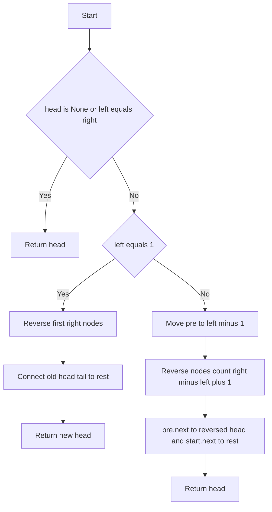
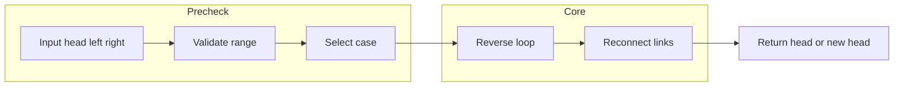

# Reverse Linked List II - 区間反転を一回走査で行う

## Table of Contents

- [概要](#overview)
- [アルゴリズム要点 TL;DR](#tldr)
- [図解](#figures)
- [正しさのスケッチ](#correctness)
- [計算量](#complexity)
- [Python 実装](#impl)
- [CPython 最適化ポイント](#cpython)
- [エッジケースと検証観点](#edgecases)
- [FAQ](#faq)

<h2 id="overview">概要</h2>

- **プラットフォーム / ID**: LeetCode 92
- **問題タイトル**: Reverse Linked List II
- **要約**: 単方向連結リストの `left` から `right`（1-indexed）までのノードを**原地で反転**し、リストの先頭を返す。
- **入出力仕様（簡潔）**
    - 入力: `head`（ListNode）、`left`（int）、`right`（int）かつ `1 ≤ left ≤ right ≤ n`
    - 出力: 反転後の `head`（ListNode）

- **想定データ構造**: `ListNode`（単方向連結リスト）
- **代表例**
    - 例 1: `head=[1,2,3,4,5], left=2, right=4` → 出力 `[1,4,3,2,5]`
    - 例 2: `head=[5], left=1, right=1` → 出力 `[5]`

- **要件**: 一回走査で解けるかがフォローアップ。安定・決定的・制約内で `O(n)` 時間・`O(1)` 追加メモリ。

<h2 id="tldr">アルゴリズム要点（TL;DR）</h2>

- **戦略**: 区間 `[left, right]` を**原地反転**し、前後を再接続するだけ。
    - `left == 1` は先頭から `right` 個を通常の反転 → 末尾（旧先頭）を残り部分へ接続。
    - `left > 1` は `pre` を `left-1` 番目に移動 →
      `start=pre.next` から `right-left+1` 個を反転 → `pre.next` と `start.next` を再配線。

- **データ構造**: `ListNode` の `next` を付け替えるのみ。**補助配列・スタック不要**。
- **計算量**: **Time `O(n)` / Space `O(1)`**（原地）
- **メモリ最小化**: **番兵ノードを使わない**（割当 0）。参照寿命を短く、ローカル変数のみ。

<h2 id="figures">図解</h2>

### **フローチャート**



_説明_: `left==1` の場合とそれ以外を分岐。いずれも区間反転後に**2 点接続**で終了。

### **データフロー**



_説明_: 事前分岐の後、反転ループと再接続のみで完了。

<h2 id="correctness">正しさのスケッチ</h2>

- **不変条件**
    - 反転ループ中、`prev` は常に**部分反転済みリストの先頭**を指す。
    - `curr` は未処理の先頭、`next_` は安全に次ノードを保持。

- **基底条件**
    - `head is None` または `left == right` のとき**変更不要**で戻す。

- **網羅性**
    - `left == 1`：先頭から `right` 個を通常反転。旧先頭を残り `curr` へ接続。
    - `left > 1`：`pre` を `left-1` に移動し、長さ `right-left+1` を反転、`pre.next` と `start.next` を更新。

- **終了性**
    - 各ループは**有限回**（最大 `n`）。毎回 `curr` は一歩進むため停止する。

- **部分構造の整合**
    - 再接続は常に**2 点のみ**（前方 `pre.next`、後方 `start.next`）で、外部リストは壊さない。

<h2 id="complexity">計算量</h2>

- 目標計算量: **Time `O(n)`**, **Space `O(1)`**
- in-place と Pure の比較（この問題は in-place が仕様）

    | 観点       | in-place             | コピー型       |
    | ---------- | -------------------- | -------------- |
    | 時間       | O(n)                 | O(n)           |
    | 追加メモリ | O(1)                 | O(n)           |
    | 実装コスト | 低                   | 中             |
    | 副作用     | あり（リンク再配線） | なし（新構築） |

<h2 id="impl">Python 実装</h2>

```python
from __future__ import annotations

from typing import Optional, TYPE_CHECKING

if TYPE_CHECKING:
    # LeetCode 環境では定義済み。pylance 用の型スタブ。
    class ListNode:
        val: int
        next: Optional["ListNode"]
        def __init__(self, val: int = 0, next: Optional["ListNode"] = None) -> None: ...

# 実行時に ListNode が未定義なローカル検証環境向けの軽量フォールバック
try:
    ListNode  # type: ignore[name-defined]
except NameError:  # pragma: no cover
    class ListNode:  # minimal fallback
        __slots__ = ("val", "next")
        def __init__(self, val: int = 0, next: Optional["ListNode"] = None) -> None:
            self.val = val
            self.next = next

class Solution:
    """
    Reverse Linked List II
    - One pass
    - In-place
    - No extra node allocation
    Time: O(n), Space: O(1)
    """

    def reverseBetween(
        self,
        head: Optional[ListNode],
        left: int,
        right: int
    ) -> Optional[ListNode]:
        # 基底ケース：空 or 区間長1はそのまま
        if head is None or left == right:
            return head

        # Case 1) 先頭から反転する場合 left == 1
        if left == 1:
            prev: Optional[ListNode] = None
            curr: Optional[ListNode] = head
            # 先頭から right 個を反転
            for _ in range(right):
                # 制約より curr は None にはならない
                assert curr is not None
                next_: Optional[ListNode] = curr.next
                curr.next = prev
                prev = curr
                curr = next_
            # 旧先頭 head は反転後の末尾、残り部分 curr を接続
            assert head is not None
            head.next = curr
            # 反転後の新しい先頭 prev を返す
            return prev

        # Case 2) 中間以降の反転
        # 1) pre を left-1 番目まで進める
        pre: Optional[ListNode] = head
        for _ in range(1, left - 1):
            assert pre is not None
            pre = pre.next
        assert pre is not None and pre.next is not None

        # 2) [left, right] の長さ count を通常反転
        start: ListNode = pre.next
        prev: Optional[ListNode] = None
        curr: Optional[ListNode] = start
        count: int = right - left + 1
        for _ in range(count):
            assert curr is not None
            next_: Optional[ListNode] = curr.next
            curr.next = prev
            prev = curr
            curr = next_

        # 3) 再接続：pre -> prev(反転後の先頭) ... start(反転後の末尾) -> curr
        pre.next = prev
        start.next = curr

        return head
```

### **実装メモ**

- `assert` により `Optional` を段階的に **Non-None へナローイング**。pylance でも安全。
- ループ内は代入のみで**分岐最小化**。属性アクセス回数も抑制。
- **番兵ノード非使用**で追加割当ゼロ。`left==1` を個別処理して一様な原地反転を行う。

<h2 id="cpython">CPython 最適化ポイント</h2>

- **割当削減**: 番兵ノードを作らず、追加ノード割当ゼロ。
- **局所変数束縛**: `prev/curr/next_` はローカルで、属性参照より高速。
- **分岐最小化**: ループ中の条件分岐を排除し、定数回の `assert` のみ。
- **関数分割を避ける**: ループを関数化しないことでコールオーバーヘッドを回避。
- **GC 圧力低減**: 参照寿命はブロックスコープ内で完結、テンポラリはすぐに消える。

<h2 id="edgecases">エッジケースと検証観点</h2>

- `head is None`（空リスト）
- `left == right`（長さ 1 の区間）
- `left == 1` 且つ `right == n`（全反転）
- `left == 1` 且つ `right < n`（先頭からの部分反転）
- `left > 1` 且つ `right == n`（末尾までの部分反転）
- `n == 1` / `n == 2`（極小サイズ）
- 連続値でない `val`（リンクのみが本質で、値の分布は無関係）
- 制約境界: `1 ≤ left ≤ right ≤ n`

### **確認観点**

- 反転区間の**前後の連結**が正しいか（`pre.next` と `start.next`）。
- 反転区間内の**順序が逆転**しているか。
- `head` が更新されるべきケース（`left==1`）で**新しい先頭**が返るか。
- **循環や断絶が生じない**こと（各ノードの `next` は多重参照なし）。

<h2 id="faq">FAQ</h2>

- **Q. どうして配列に一度取り出して反転しないのか？**
  A. それでも `O(n)` だが、追加メモリが `O(k)`（区間長）必要になり、要件の `O(1)` を満たさない。

- **Q. 再帰で実装してもよい？**
  A. 可能だがコールスタックが `O(n)` となりメモリ最適ではない。反転は反復が簡潔で高速。

- **Q. ダミーノードを使う実装と比べて？**
  A. 可読性は互角。ここでは**追加割当ゼロ**を重視して `left==1` を個別処理した。ダミー方式でも正解。

- **Q. 負の値や重複値は影響する？**
  A. ノードの値はリンク操作に無関係。どの整数値でもアルゴリズムは同じに動作する。
