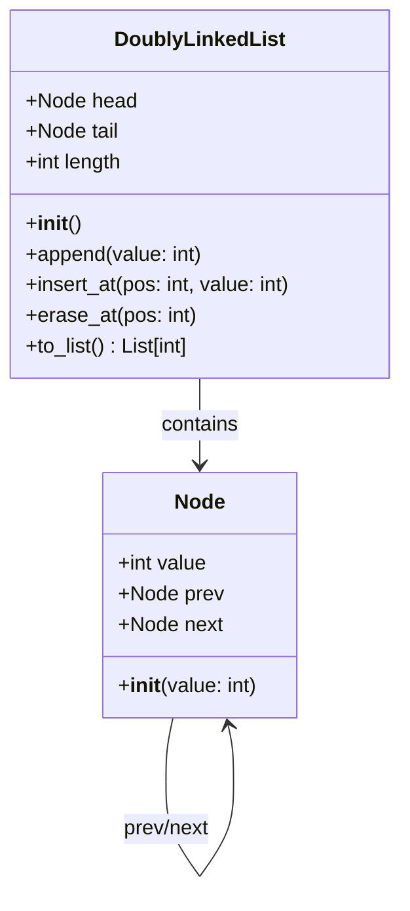
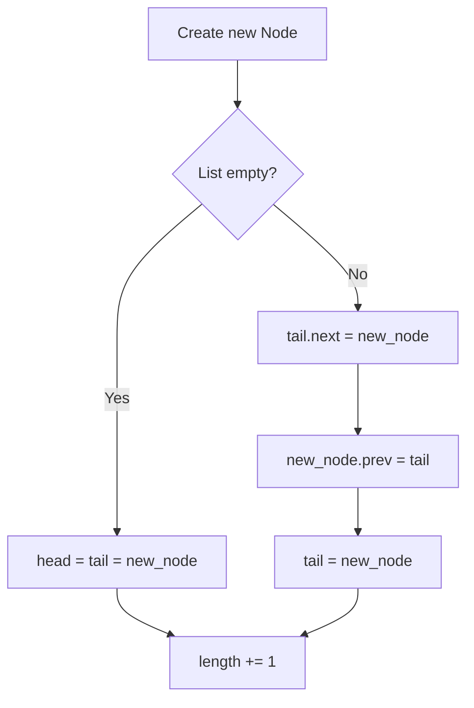
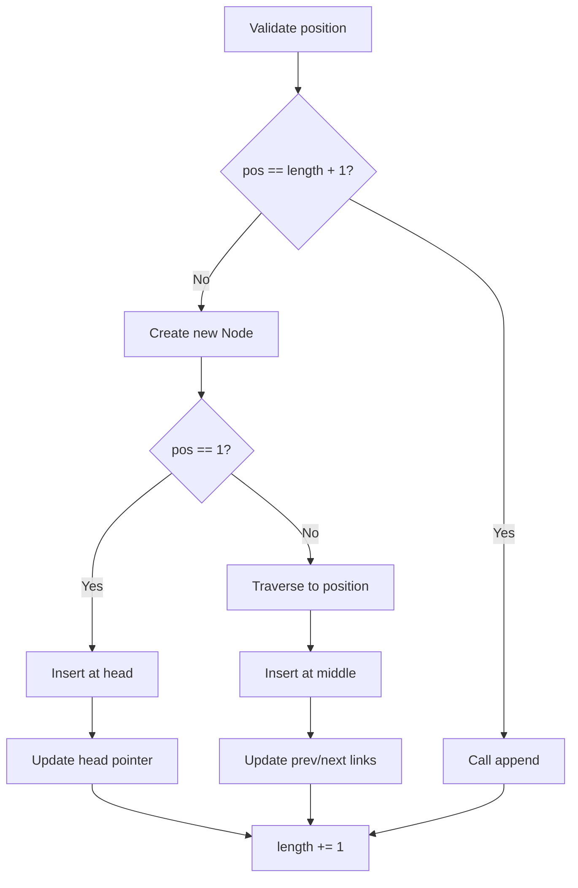
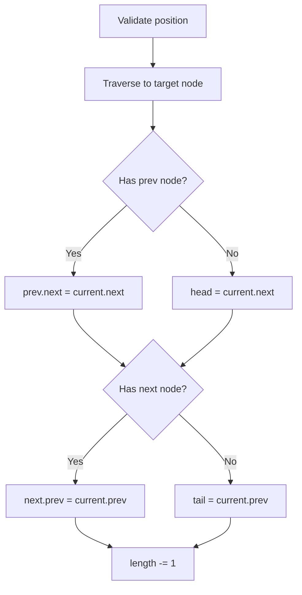
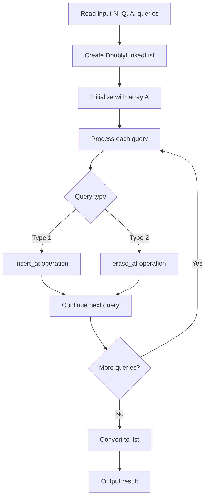
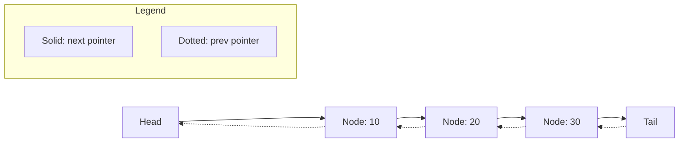

# 双方向連結リスト（Doubly Linked List）実装

このプログラムは双方向連結リストを実装し、指定された位置への挿入・削除操作を効率的に行います。

## アーキテクチャ概要

## データ構造の詳細



### Node クラス

```python
class Node:
    __slots__ = ("value", "prev", "next")
```

- **`__slots__`**: メモリ効率化のため、属性を制限
- **`value`**: ノードが保持する整数値
- **`prev`**: 前のノードへの参照
- **`next`**: 次のノードへの参照

### DoublyLinkedList クラス

双方向連結リストの管理クラスで、以下の属性を持ちます：

- **`head`**: リストの先頭ノード
- **`tail`**: リストの末尾ノード
- **`length`**: リストの要素数

## 主要操作の詳細解析

### 1. append 操作 - 末尾追加



**時間計算量**: O(1) - 常に一定時間で実行

**処理の流れ**:

1. 新しい Node を作成
2. リストが空の場合、head と tail を新ノードに設定
3. リストに要素がある場合、現在の tail の次に新ノードを接続
4. 双方向リンクを確立（prev/next ポインタの設定）

### 2. insert_at 操作 - 指定位置挿入



**時間計算量**: O(n) - 最悪の場合、指定位置まで線形探索

**処理パターン**:

- **位置 1（先頭）**: head ポインタの更新のみ
- **位置 length+1（末尾）**: append 操作に委譲
- **中間位置**: 指定位置まで移動後、前後のリンクを再構成

### 3. erase_at 操作 - 指定位置削除



**時間計算量**: O(n) - 削除対象位置まで線形探索

**削除パターンの処理**:

- **先頭ノード削除**: head ポインタを次のノードに更新
- **末尾ノード削除**: tail ポインタを前のノードに更新
- **中間ノード削除**: 前後のノードを直接接続

## データフロー全体



## 双方向連結リストの構造例



## 計算量まとめ

| 操作      | 時間計算量 | 空間計算量 | 備考                    |
| --------- | ---------- | ---------- | ----------------------- |
| append    | O(1)       | O(1)       | tail ポインタにより高速 |
| insert_at | O(n)       | O(1)       | 位置まで線形探索が必要  |
| erase_at  | O(n)       | O(1)       | 位置まで線形探索が必要  |
| to_list   | O(n)       | O(n)       | 全要素を配列にコピー    |

## 使用例とクエリ処理

**入力例**:

```text
N=3, Q=2
A = [10, 20, 30]
Query 1: 1 2 15  # position 2 に値 15 を挿入
Query 2: 2 1     # position 1 を削除
```

**_処理過程_**

1. 初期状態: [10, 20, 30]
2. insert_at(2, 15): [10, 15, 20, 30]
3. erase_at(1): [15, 20, 30]

この実装では 1-based インデックスを使用しており、実際の競技プログラミング問題でよく見られる仕様に対応しています。双方向リンクにより、削除操作時の前後ノードの接続処理が効率的に行えます。
