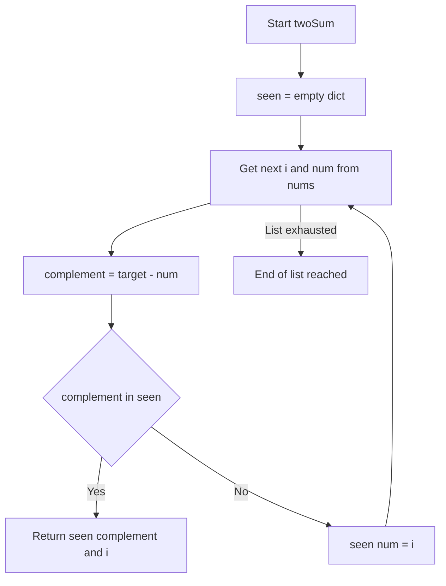
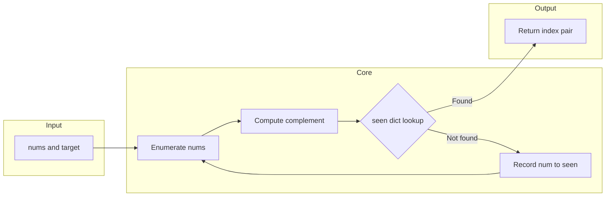

# Two Sum — ハッシュマップで O(n) を実現する

> **LeetCode #1 · Python (CPython 3.11+) 完全解説**

---

## 目次

- [概要](#overview)
- [アルゴリズム要点 TL;DR](#tldr)
- [図解](#figures)
- [正しさのスケッチ](#correctness)
- [計算量](#complexity)
- [Python 実装](#impl)
- [CPython 最適化ポイント](#cpython)
- [エッジケースと検証観点](#edgecases)
- [FAQ](#faq)

---

<h2 id="overview">1. 概要</h2>

> 💡 **この問題は一言で言うと**、「整数のリストの中から **足すと `target` になる 2 つの数のインデックス（位置番号）を探す問題**」です。

### 問題が難しい理由・ポイント

一番シンプルな解法は「全ての組み合わせを総当たりで試す」二重ループです。しかしこれは時間計算量（＝処理にかかる手間の目安）が **O(n²)**（＝入力が 2 倍になると処理が 4 倍になること）になり、入力が最大 10,000 件のとき最悪 **1 億回** の比較が発生します。

本解説では、**ハッシュマップ（＝キーから値を一瞬で取り出せる辞書型データ構造）** を使って **O(n)**（＝1 度だけ全要素を走査する）に削減する手法を説明します。「今見ている数の補数（＝`target` から今の数を引いた値）を **前に見たか？**」を辞書で O(1) に確認することがこの問題の核心です。

### 要件まとめ

| 項目       | 内容                                                               |
| ---------- | ------------------------------------------------------------------ |
| 入力       | 整数リスト `nums`（長さ 2 以上 10,000 以下）と整数 `target`        |
| 出力       | 足すと `target` になる 2 要素の **インデックスのリスト**           |
| 制約       | 答えは **必ず 1 つだけ** 存在する。同一要素を 2 度使ってはいけない |
| 目標計算量 | Time: O(n)、Space: O(n)                                            |

> 📖 **この章で登場した用語**
>
> - **インデックス**：リストの何番目にあるかを表す番号。先頭が 0 から始まる
> - **補数（complement）**：`target - num` のこと。今の数とペアになる数値
> - **O(n²)**：入力が 2 倍になると処理が約 4 倍になること。二重ループに多い
> - **ハッシュマップ**：キーを特殊な数値に変換し、値の格納場所を一瞬（O(1)）で特定できるデータ構造。Pythonの `dict` がこれにあたる

---

<h2 id="tldr">2. アルゴリズム要点 TL;DR</h2>

> 💡 **TL;DR**（Too Long; Didn't Read）とは「長くて読めない人向けの要約」という意味です。
> ここではアルゴリズム全体の戦略をまとめます。詳細は後の章で説明するので、「なんとなくこういう手順で解くんだな」というイメージをつかむ章として位置づけてください。

- **戦略**：リストを先頭から 1 度だけ走査（＝端から端まで順に見ること）し、各要素の補数が **すでに辞書に記録されているか** を確認する
- **データ構造**：`dict`（辞書）を使う。なぜなら `in` 演算子による検索が O(1) で完了するため。リストの `in` 演算は O(n) なので遅い
- **時間計算量**：O(n) — リストを 1 度だけ走査する
- **空間計算量**：O(n) — 最悪で n 個の数値を辞書に記録する
- **メモリ**：辞書に `{数値: インデックス}` の形でメモを残しながら進める。「前に見た数値の記録帳」として機能する

### アルゴリズムの手順（概要）

```
1. seen = {} という空の辞書（メモ帳）を用意する
2. リストを先頭から 1 つずつ取り出す（インデックス i、値 num）
3. 補数 = target - num を計算する
4. 補数が seen の中にあるか確認する
   → あれば: [seen[補数], i] を返す（答え発見）
   → なければ: seen[num] = i としてメモして次へ
```

> 📖 **この章で登場した用語**
>
> - **走査（さうさ）**：リストや配列を端から端まで順番に見ていくこと
> - **`dict`（辞書）**：Python の組み込みデータ型。`{キー: 値}` の形でデータを格納し、キーから値を O(1) で取り出せる
> - **O(1)**：入力の大きさに関わらず常に一定時間で完了すること。辞書の検索がこれにあたる

---

<h2 id="figures">3. 図解</h2>

> 💡 **Mermaid フローチャートの読み方**：長方形（`[]`）は処理ステップ、ひし形（`{}`）は条件分岐を表します。矢印の向きに沿って処理が進みます。`Yes` / `No` のラベルは条件が「成立した/しなかった」場合の分岐先を示しています。

### フローチャート

この図は `twoSum` メソッド全体の処理の流れを表しています。上から下へ読み進めてください。`seen` 辞書への記録と補数確認が中心的な処理です。



各ノードの意味：

- `Start[Start twoSum]`：メソッドの入り口。`nums` と `target` を受け取る
- `Init[seen = empty dict]`：「前に見た数値のメモ帳」を空の状態で用意する
- `Loop[Get next i and num from nums]`：`enumerate()` でインデックスと値を同時に取り出す
- `Calc[complement = target - num]`：今の数とペアになるべき補数を計算する
- `Check{complement in seen}`：補数が **すでに記録されているか** を O(1) で確認するひし形（条件分岐）
- `Return[Return seen complement and i]`：補数のインデックスと現在のインデックスを返す（答え）
- `Record[seen num = i]`：補数が見つからなかったので今の数をメモして次へ
- `Done[End of list reached]`：問題の制約上ここには到達しない

---

### データフロー図

この図は入力データがどのように変換され、最終的な答えに至るかのデータの流れを表しています。



データの流れの説明：

- `Input → Core`：`nums` と `target` を受け取り、ループ処理に入る
- `D -- Found --> F`：補数が辞書に見つかった瞬間に答えを返す（即時終了）
- `D -- Not found --> E --> B`：見つからなければ記録して次の要素へ戻る（ループ継続）

---

> 💡 **代表例でのトレース**：`nums = [2, 7, 11, 15]`、`target = 9` を入力として、フローチャートの各ノードをどのように通過するか示します。

```
初期状態: seen = {}

--- ループ i=0, num=2 ---
  Calc: complement = 9 - 2 = 7
  Check: 7 in {}  → No
  Record: seen = {2: 0}

--- ループ i=1, num=7 ---
  Calc: complement = 9 - 7 = 2
  Check: 2 in {2: 0}  → Yes ✅
  Return: [seen[2], 1] = [0, 1]

答え: [0, 1]
  → nums[0]=2 と nums[1]=7 の和が 9 になる
```

> 📖 **この章で登場した用語**
>
> - **フローチャート**：処理の手順を図形と矢印で表したもの。ひし形=条件分岐、長方形=処理
> - **データフロー図**：データがどのように変換・移動するかを示す図
> - **`enumerate()`**：リストを回しながら「何番目か（インデックス）」と「値」を同時に取り出す Python 組み込み関数

---

<h2 id="correctness">4. 正しさのスケッチ</h2>

> 💡 **「正しさのスケッチ」** とは、アルゴリズムが **常に正しい答えを返すことの根拠** を整理したものです。数学的な厳密な証明ではなく「なぜ正しいと言えるか」の説明です。

### 不変条件（＝アルゴリズムが正しく動くために、処理中ずっと成り立ち続けるべき条件）

> **「`seen` 辞書には、インデックス 0 から i-1 までに登場した全ての `{数値: インデックス}` が記録されている」**

- ループ開始時：`seen = {}` で、まだ 0 個の要素を見た状態。条件は成立している
- ループ中：各イテレーション（＝ループの 1 回の繰り返し）の末尾で `seen[num] = i` を実行する。これにより「インデックス i までの全要素が記録される」という条件が次のイテレーションでも維持される

### 網羅性（＝すべてのケースをもれなく処理できているという保証）

- **補数が `seen` にある場合**：`return [seen[complement], i]` で答えを返す。`seen[complement]` は **補数の出現インデックス** であり、`i` は **現在のインデックス**。両者は異なるため「同一要素を 2 度使う」制約違反も発生しない
- **補数が `seen` にない場合**：`seen[num] = i` で現在の数を記録し、次の要素に進む。将来のイテレーションで補数が来たときに参照できる

### 基底条件（＝再帰の終了条件。今回は「答えが見つかったとき」）

- 答えが見つかった瞬間に `return` で即時終了する
- 問題の制約「**必ず 1 つだけ答えが存在する**」により、ループ終了前に必ず `return` が実行される

### 終了性（＝アルゴリズムが必ず有限ステップで終わるという保証）

- `nums` は有限長（最大 10,000 件）であり、ループは各イテレーションで必ず 1 要素を消費する
- 答えが存在する保証があるため、最悪でも `len(nums)` 回のイテレーションで終了する

> 📖 **この章で登場した用語**
>
> - **不変条件**：アルゴリズムが正しく動くために、処理中ずっと成り立ち続けるべき条件
> - **網羅性**：すべてのケースをもれなく処理できているという保証
> - **終了性**：アルゴリズムが必ず有限ステップで終わるという保証
> - **イテレーション**：ループの 1 回の繰り返しのこと

---

<h2 id="complexity">5. 計算量</h2>

> 💡 **計算量とは** 「入力が大きくなるにつれて、処理にかかる時間・メモリがどう増えるか」の目安です。

| 記法         | 意味                   | 直感的なイメージ            |
| ------------ | ---------------------- | --------------------------- |
| `O(1)`       | 入力サイズによらず一定 | 辞書で直接ページを開く      |
| `O(n)`       | 入力に比例して増加     | リストを端から順に読む      |
| `O(n log n)` | n よりやや速く増加     | 辞書を二分探索で引く × n 回 |
| `O(n²)`      | 入力の 2 乗で増加      | 全ペアを総当たりで確認する  |

### 本解法の計算量

| 種別           | 計算量   | 理由                                                                                      |
| -------------- | -------- | ----------------------------------------------------------------------------------------- |
| **時間計算量** | **O(n)** | `nums` を 1 度だけ走査する。各イテレーションで辞書の検索・記録が O(1) なので、全体で O(n) |
| **空間計算量** | **O(n)** | 最悪の場合（答えが末尾 2 要素のとき）、n-1 個の数値を `seen` 辞書に記録する               |

### 各アプローチの比較

| アプローチ                | 時間計算量 | 空間計算量 | 実装コスト | 可読性  | 備考                         |
| ------------------------- | ---------- | ---------- | ---------- | ------- | ---------------------------- |
| 二重ループ（全探索）      | O(n²)      | O(1)       | 低         | ★★★     | Follow-up の制約を満たさない |
| **ハッシュマップ 1 パス** | **O(n)**   | **O(n)**   | **低**     | **★★★** | **推奨。最速かつシンプル**   |

> 💡 **なぜ空間計算量が O(n) になるのか**
>
> 最悪のケース例：`nums = [1, 2, 3, ..., 9999, 5000]`、`target = 14999`
> この場合、答えは末尾 2 要素（`9999` と `5000`）ですが、それが判明するまでに 9,998 個の数値が `seen` に記録されます。これが O(n) の空間を消費する理由です。

> 📖 **この章で登場した用語**
>
> - **時間計算量**：入力の大きさに対して処理にかかる手間がどう増えるかの目安
> - **空間計算量**：処理中に使うメモリ量がどう増えるかの目安
> - **O(1) の検索**：辞書の `in` 演算子による検索。入力サイズに関わらず一定時間で完了する

---

<h2 id="impl">6. Python 実装</h2>

> 💡 **コードの全体的な骨格**（読む前に把握しておくと理解しやすくなります）：
>
> 1. `from __future__ import annotations` で型ヒントの前方参照を有効にする
> 2. 空の `seen` 辞書（`dict[int, int]`）を用意する
> 3. `enumerate()` でインデックスと値を同時に取り出しながらループする
> 4. 補数（`target - num`）が `seen` にあれば答えを返す
> 5. なければ今の数を `seen` に記録して次へ

---

### 業務開発版（型安全・エラーハンドリング重視）

チームで長期間メンテナンスするプロダクションコードに向きます。型ヒント・docstring・エラーハンドリングを充実させることで、後から読んだ人がコードの意図をすぐに理解できます。

```python
from __future__ import annotations

# typing モジュールから型ヒント用のクラスをインポートする。
# List[int] は「int のリスト」を表す型ヒント。
# Python 3.9 以降は list[int] と書けるが、3.8 以前との互換性のために List を使う場合もある。
from typing import List


class Solution:
    """
    LeetCode #1 Two Sum 解決クラス（業務開発版）

    「足すと target になる 2 つの数のインデックスを返す問題」を
    ハッシュマップ（辞書）を使って O(n) で解く。
    """

    def twoSum(self, nums: List[int], target: int) -> List[int]:
        """
        ハッシュマップ 1 パス解法（業務開発版）

        Args:
            nums   : 整数のリスト（長さ 2 以上 10^4 以下）
            target : 合計値の目標

        Returns:
            足すと target になる 2 要素のインデックスのリスト

        Raises:
            TypeError : nums が list でない、または target が int でない場合
            ValueError: 有効な答えが存在しない場合（問題の制約上は発生しないが念のため）
        """

        # ---- 入力検証 ----
        # Python は動的型付け言語なので、呼び出し元が誤った型を渡しても
        # 実行時まで気づかない。isinstance() で型を明示的にチェックすることで
        # 分かりやすいエラーメッセージを早期に返せる。
        if not isinstance(nums, list) or not isinstance(target, int):
            raise TypeError("nums must be a list and target must be an int")

        # ---- メインアルゴリズム ----
        # {数値: そのインデックス} を記録する「メモ帳」となる辞書を用意する。
        # dict は CPython（＝最も広く使われるPythonの実装）内部でハッシュテーブルを
        # 使っているため、「この数値はあるか？」の検索が O(1) で完了する。
        # リストの `in` 演算（O(n)）ではなく辞書を使う理由がここにある。
        seen: dict[int, int] = {}

        # enumerate()（＝インデックスと値を同時に取り出す組み込み関数）を使う。
        # C 実装なので `for i in range(len(nums)): num = nums[i]` より高速で可読性も高い。
        for i, num in enumerate(nums):

            # 補数（complement）＝「今の数とペアになるべき数値」を計算する。
            # もしこの値が seen に記録されていれば、答えが見つかったことになる。
            complement: int = target - num

            if complement in seen:
                # `in` で辞書のキーを検索するのは O(1)。
                # リストに対して `if complement in nums` とすると O(n) になるため、
                # 辞書を使うことが今回の最適化の核心。
                #
                # seen[complement] → 補数が見つかったインデックス（先に記録しておいた）
                # i               → 現在のインデックス
                return [seen[complement], i]

            # まだペアが見つかっていない場合は、今の数とインデックスをメモ帳に記録する。
            # 後のイテレーションで「今の数が誰かの補数」として参照される可能性がある。
            seen[num] = i

        # 問題の制約上「必ず 1 つだけ答えが存在する」ので、
        # ここに到達することは理論的にはないが、
        # pylance の「返り値がない場合」の型警告を抑制するために明示する。
        raise ValueError("No valid pair found. Input may violate constraints.")
```

---

### 競技プログラミング版（速度・簡潔さ優先）

LeetCode や AtCoder など、制限時間内に正解を出すことが目的のコードに向きます。エラーハンドリングを省略し、最小限のコードで最速を狙います。ウォルラス演算子（`:=`）（＝変数への代入と条件判定を 1 行で同時に行う Python 3.8 以降の構文）を活用しています。

```python
from __future__ import annotations


class Solution:
    def twoSum(self, nums: list[int], target: int) -> list[int]:
        """
        競技プログラミング版: 型安全・エラーハンドリング省略、速度最優先

        Time Complexity : O(n)  ── リストを 1 度だけ走査する
        Space Complexity: O(n)  ── 最悪で n 個の数値を辞書に記録する
        """

        # seen 辞書を空で初期化。{数値: インデックス} の形で記録する。
        seen: dict[int, int] = {}

        for i, num in enumerate(nums):
            # ウォルラス演算子 := を使って「補数の計算」と「辞書の検索」を 1 行で書く。
            # `complement := target - num` で complement に代入しつつ、
            # `if complement in seen` で辞書を検索する。
            # 業務版での `complement = ...; if complement in seen:` の 2 行を 1 行に圧縮。
            if (complement := target - num) in seen:
                return [seen[complement], i]

            # 補数が見つからなければ今の数を記録して次へ。
            seen[num] = i

        # pylance の型警告抑制のため。問題の制約上ここには到達しない。
        return []
```

---

> 💡 **コードの動作トレース**：`nums = [3, 2, 4]`、`target = 6` を入力として各ステップを追います。

```
初期状態: seen = {}

--- i=0, num=3 ---
  complement = 6 - 3 = 3
  3 in {}  → No（seen はまだ空）
  seen = {3: 0}
  ※ 同じ値 3 でも「seen に記録する前に補数を確認」しているため
    同一要素を 2 度使う誤りは発生しない

--- i=1, num=2 ---
  complement = 6 - 2 = 4
  4 in {3: 0}  → No
  seen = {3: 0, 2: 1}

--- i=2, num=4 ---
  complement = 6 - 4 = 2
  2 in {3: 0, 2: 1}  → Yes ✅
  return [seen[2], 2] = [1, 2]

答え: [1, 2]
  → nums[1]=2 と nums[2]=4 の和が 6 になる
```

> 📖 **この章で登場した用語**
>
> - **型ヒント**：`nums: list[int]` のように引数・戻り値に型を注釈する仕組み。pylance が実行前に型の不一致を検出できる
> - **`from __future__ import annotations`**：型ヒントを文字列として扱うようにする宣言。Python 3.10 未満での前方参照を解決できる
> - **`enumerate()`**：リストを回しながらインデックスと値を同時に取り出す C 実装の組み込み関数
> - **ウォルラス演算子 `:=`**：変数への代入と条件判定を同時に行う Python 3.8 以降の構文
> - **pylance**：VS Code で使える Python の静的型チェックツール。実行前に型の不一致を検出できる
> - **docstring**：関数やクラスの先頭に書く説明文。`"""三重クォート"""` で囲む

---

<h2 id="cpython">7. CPython 最適化ポイント</h2>

> 💡 この章では「同じ処理でも Python の書き方によって速さが変わる理由」を説明します。最適化テクニックを紹介する際は、**最適化前 → 最適化後 → なぜ速くなるか** の 3 点セットで説明します。

### ポイント 1：リストの `in` ではなく辞書の `in` を使う

```python
# 最適化前：リストで補数を検索する（O(n)）
# リストの in は「先頭から末尾まで 1 つずつ比較」するため遅い
prev = []  # type: ignore
if complement in prev:   # O(n) の線形探索
    pass

# 最適化後：辞書で補数を検索する（O(1)）
seen: dict[int, int] = {}
if complement in seen:   # O(1) のハッシュ検索
    pass

# なぜ速いか：
# CPython の dict はハッシュテーブルを使っており、
# キーをハッシュ関数（＝数値を別の数値に変換する計算）で変換し、
# 格納場所を直接計算する。リストのような「先頭から順に比較」が発生しない。
```

### ポイント 2：`enumerate()` で手書きインデックス管理を避ける

```python
# 最適化前：手書きでインデックスを管理する（可読性が低く、バグが混入しやすい）
i = 0
while i < len(nums):
    num = nums[i]
    i += 1

# 最適化後：enumerate() を使う（C 実装で高速、可読性が高い）
for i, num in enumerate(nums):
    pass

# なぜ速いか：
# enumerate() は CPython の C 実装であり、Pythonのインタープリタを介さずに
# インデックスのインクリメント（＝1 ずつ増やす操作）を C レベルで行う。
# 手書きの while ループより高速で、バグも発生しにくい。
```

### ポイント 3：ウォルラス演算子で中間変数を最小化する

```python
# 最適化前：補数の計算と辞書検索を 2 行で書く
complement = target - num
if complement in seen:
    return [seen[complement], i]

# 最適化後：ウォルラス演算子で 1 行にまとめる
if (complement := target - num) in seen:
    return [seen[complement], i]

# なぜ速いか（厳密には可読性向上が主な目的）：
# バイトコード（＝Python が実行する中間命令）レベルでは
# ローカル変数への代入命令が若干削減される。
# 主な利点は「補数の定義と使用が 1 行に凝縮される」可読性の向上。
```

> 📖 **この章で登場した用語**
>
> - **ハッシュ関数**：キーを別の数値（ハッシュ値）に変換する計算。辞書がキーの格納場所を一瞬で特定するために使う
> - **CPython**：最も広く使われる Python の実装。C 言語で書かれており、組み込み関数の多くが C 実装のため高速
> - **バイトコード**：Python コードを実行するために変換される中間命令。CPython はこれを解釈して実行する
> - **インクリメント**：変数の値を 1 だけ増やす操作

---

<h2 id="edgecases">8. エッジケースと検証観点</h2>

> 💡 **エッジケース**（＝空・最小値・最大値・重複ありなど、境界的な入力）を見落とすと、普通のテストは通るのに特定の入力でだけバグが発生します。各ケースで「なぜ問題になりうるか」を確認してください。

| ケース                    | 入力例                                     | 期待出力      | なぜ注意が必要か                                                                                                                                   |
| ------------------------- | ------------------------------------------ | ------------- | -------------------------------------------------------------------------------------------------------------------------------------------------- |
| **最小入力（要素 2 つ）** | `nums=[1,2], target=3`                     | `[0,1]`       | リスト長さ 2 が制約の下限。空チェック不要だが、最小ケースの動作確認が重要                                                                          |
| **重複値あり**            | `nums=[3,3], target=6`                     | `[0,1]`       | 同じ値が 2 つある場合。「補数を先にチェックしてから記録する」順序が重要。逆にすると同一要素を 2 度使う誤りが発生する                               |
| **負の数を含む**          | `nums=[-3,4,7], target=1`                  | `[0,1]`       | 負の数でもハッシュマップは正しく動く。補数 `1 - (-3) = 4` が辞書に記録されるかを確認                                                               |
| **target が負**           | `nums=[-2,-3], target=-5`                  | `[0,1]`       | target が負の場合でも補数計算 `(-5) - (-2) = -3` は正しく動く                                                                                      |
| **大きな値**              | `nums=[10**9, -10**9+1], target=1`         | `[0,1]`       | 制約内の最大絶対値（10⁹）でも Python の int は任意精度（＝桁数に上限がない）なのでオーバーフロー（＝数値が表現できる範囲を超えること）は発生しない |
| **答えが末尾 2 要素**     | `nums=[1,2,3,...,9999,5000], target=14999` | `[9998,9999]` | 最悪ケース。`seen` が最大サイズになるまでループが続く（空間計算量 O(n) の理由）                                                                    |

### 重複値ケースの詳細トレース

```
入力: nums=[3, 3], target=6

--- i=0, num=3 ---
  complement = 6 - 3 = 3
  3 in {}  → No（重要: seen に記録する前に確認しているので同一要素を使わない）
  seen = {3: 0}

--- i=1, num=3 ---
  complement = 6 - 3 = 3
  3 in {3: 0}  → Yes ✅（インデックス 0 の 3 が見つかった）
  return [seen[3], 1] = [0, 1]

答え: [0, 1]  ← 異なるインデックスの同じ値 3 を 2 つ使っている ✅
```

> 📖 **この章で登場した用語**
>
> - **エッジケース**：空のリスト・要素 1 つ・最大サイズ入力など、境界的な条件の入力
> - **オーバーフロー**：数値が表現できる範囲を超えること。Python の `int` は任意精度なので発生しない（C や Java では発生する）
> - **任意精度整数**：桁数に上限がない整数型。Python の `int` はこれにあたる

---

<h2 id="faq">9. FAQ</h2>

> 💡 **FAQ**（Frequently Asked Questions）とは「よくある質問と回答」のことです。初学者がつまずきやすいポイントを「結論 → 理由 → 補足」の順で説明します。

---

**Q1. なぜリストではなく辞書（`dict`）を使うのですか？**

**結論**：辞書のキー検索は O(1) で、リストの `in` 演算の O(n) より大幅に速いからです。

**理由**：辞書はハッシュテーブルを内部で使っており、キーをハッシュ関数で数値に変換して格納場所を直接計算します。リストは先頭から末尾まで 1 つずつ比較するため、要素数が増えるほど遅くなります。

**補足**：n = 10,000 のとき、リストの検索は最悪 10,000 回の比較が必要ですが、辞書は（理論上）1 回の計算で済みます。この差が O(n²) と O(n) の違いとして現れます。

---

**Q2. 「補数を先にチェックしてから記録する」順序はなぜ重要ですか？**

**結論**：逆の順序にすると、同じ要素を 2 度使う誤りが発生するからです。

**理由**：`nums = [3, 3]`、`target = 6` の例で考えます。もし先に `seen[3] = 0` を記録してから `3 in seen` を確認すると、インデックス 0 の `3` だけで `return [seen[3], 0]` = `[0, 0]` を返してしまいます（同一要素を 2 度使う誤り）。先にチェック・後に記録の順にすることで、「**今見ている要素 i と過去の要素 j（j &lt; i）のペア**」だけを返せます。

**補足**：`i=0` のとき `seen` はまだ空なので、`seen` に今見ている要素は記録されていません。このため「補数チェック → 記録」の順で必ず **異なるインデックスのペア** になります。

---

**Q3. 同じ数値が 3 つ以上ある場合はどうなりますか？**

**結論**：最初に見つかったペア（最も小さいインデックスのペア）を返します。

**理由**：`nums = [3, 3, 3]`、`target = 6` の場合、`i=1` の時点で `complement = 3` が `seen = {3: 0}` に見つかり、即座に `[0, 1]` を返します。問題の制約上「答えは 1 つだけ」なので、これで正しい動作です。

---

**Q4. `from __future__ import annotations` は必須ですか？**

**結論**：Python 3.11 のみを使う場合は省略可能ですが、書いておく方が安全です。

**理由**：この宣言は型ヒントを「文字列として評価を遅延させる」ものです。Python 3.10 以前では `list[int]` のような小文字の型ヒントが実行時エラーになる場合があります。`from __future__ import annotations` を書くと 3.9 以前でも問題なく動きます。

**補足**：LeetCode のジャッジ環境が Python 3.10 以前の場合もあるため、互換性のために書いておくのが無難です。

---

**Q5. 二重ループ（全探索）ではダメなのですか？**

**結論**：動作はしますが、Follow-up の「O(n²) より速い解法」要件を満たせません。

**理由**：二重ループは全ての組み合わせを試すため O(n²) になります。n = 10,000 のとき最悪 1 億回の比較が必要で、LeetCode の実行時間制限（通常 2〜3 秒）に引っかかる可能性があります。

**補足**：二重ループは「空間計算量が O(1)（辞書不要）」というメリットがあります。メモリが極端に制限される環境では選択肢になりますが、本問題の制約では辞書のハッシュマップ解法が最適です。

> 📖 **この章で登場した用語**
>
> - **トレードオフ**：何かを得ると何かを失う関係。例：ハッシュマップ解法は時間を得る代わりにメモリを使う
> - **ジャッジ環境**：LeetCode や AtCoder などが問題の正誤を判定するために使うサーバー環境
> - **全探索**：すべての組み合わせや可能性を試す方法。確実に答えを見つけられるが、計算量が大きくなりやすい
