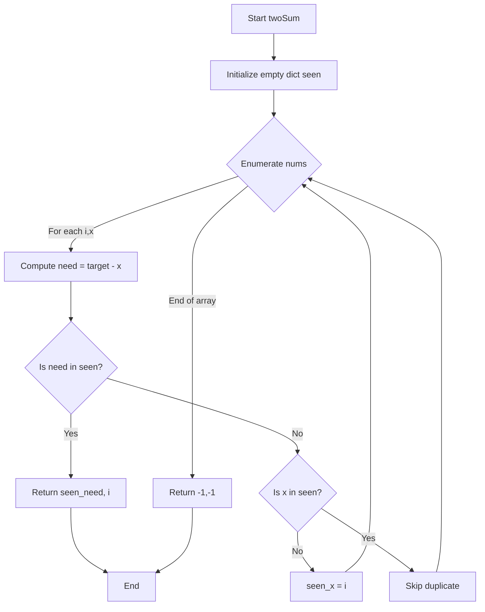
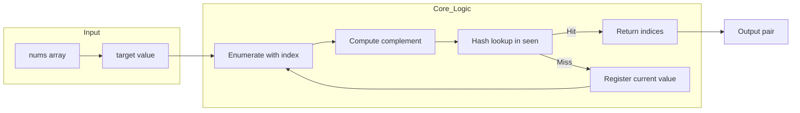

# Two Sum - ハッシュテーブル1パス探索

<h2 id="toc">目次</h2>

- [概要](#overview)
- [アルゴリズム要点（TL;DR）](#tldr)
- [図解](#figures)
- [正しさのスケッチ](#correctness)
- [計算量](#complexity)
- [Python実装](#impl)
- [CPython最適化ポイント](#cpython)
- [エッジケースと検証観点](#edgecases)
- [FAQ](#faq)

---

<h2 id="overview">概要</h2>

**問題**: 整数配列 `nums` と整数 `target` が与えられたとき、和が `target` になる2要素の**添字ペア**を返す。

**要件**:

- 解は必ず1つ存在する（一意性保証）
- 同じ要素を2回使用してはならない
- 添字の順序は任意

**制約**:

- `2 <= len(nums) <= 10^4`
- `-10^9 <= nums[i], target <= 10^9`

**Follow-up**: O(n²)未満の時間計算量で解けるか？

---

<h2 id="tldr">アルゴリズム要点（TL;DR）</h2>

- **戦略**: ハッシュテーブル（`dict`）を用いた**1パス探索**
- **データ構造**: `dict[int, int]` で 値→添字 を管理
- **時間計算量**: **O(n)** （配列を1回走査、各要素で平均O(1)のハッシュ操作）
- **空間計算量**: **O(n)** （最悪ケースで n-1 個のエントリを保持）
- **最適化**: 補数（`target - x`）の事前照会により、見つかった瞬間に即座に返却

---

<h2 id="figures">図解</h2>

## フローチャート



**説明**: 配列を左から1回走査し、各要素 `x` に対して補数 `need = target - x` がハッシュに既存か確認。存在すれば即座にペアを返却。存在しなければ `x` を辞書に登録して次へ進む。

### データフロー図



**説明**: 入力配列を走査しながら、各要素の補数をハッシュテーブルで照会。ヒット時は添字ペアを出力、ミス時は現在値を登録して次の要素へ遷移。

---

<h2 id="correctness">正しさのスケッチ</h2>

**不変条件**:

- ループの各ステップで、辞書 `seen` は「現在位置より左側の要素のうち、初出のもの」の値→添字マッピングを保持

**網羅性**:

- 解が必ず1つ存在するため、ペア `(i, j)` (i < j) のうち `j` に到達した時点で `nums[i]` は辞書に登録済み
- 補数 `need = target - nums[j]` が `nums[i]` に一致するため、`need in seen` で検出される

**基底条件**:

- 配列長 >= 2、解の一意性保証により、ループ終了前に必ず `return` が実行される

**終了性**:

- 配列を1回走査するため、最悪でも O(n) ステップで終了

---

<h2 id="complexity">計算量</h2>

| 指標         | 計算量     | 理由                                      |
|------------|---------|------------------------------------------|
| **時間**     | **O(n)** | 配列を1パス、各要素でハッシュ操作（平均O(1)）                |
| **空間**     | **O(n)** | 最悪ケースで n-1 個の要素を辞書に格納                   |

**比較**: 二重ループ（O(n²)）やソート+2ポインタ（O(n log n)）より高速。

---

<h2 id="impl">Python実装</h2>

```python
from __future__ import annotations
from typing import List


class Solution:
    def twoSum(self, nums: List[int], target: int) -> List[int]:
        """
        ハッシュテーブル1パスでTwo Sumを解く

        Args:
            nums: 整数配列（長さ >= 2）
            target: 目標和

        Returns:
            和が target になる2要素の添字リスト [i, j]

        Time Complexity: O(n)
        Space Complexity: O(n)
        """
        seen: dict[int, int] = {}  # value -> first occurrence index

        for i, x in enumerate(nums):
            need = target - x

            # 補数が既出か確認
            if need in seen:
                return [seen[need], i]

            # 現在値を初出のみ登録（重複時は最左を保持）
            if x not in seen:
                seen[x] = i

        # 問題前提（解が必ず存在）により到達しないが型整合のため
        return [-1, -1]
```

**主要ステップ**:

1. **初期化**: 空の辞書 `seen` を用意
2. **走査**: `enumerate` でインデックスと値を同時取得
3. **補数計算**: `need = target - x`
4. **照会**: `need in seen` で既出チェック → ヒット時は即返却
5. **登録**: ミス時は `x` を辞書に追加（初出のみ）

---

<h2 id="cpython">CPython最適化ポイント</h2>

### 標準実装の最適化

1. **`enumerate` の活用**
   - Pythonレベルでのインデックス管理を回避
   - Cレベルのイテレータで高速化

2. **辞書のC実装**
   - CPythonの `dict` はハッシュテーブルのC実装で平均O(1)
   - `in` 演算子による存在確認も高速

3. **ローカル変数束縛**
   - ループ内で `target` や `seen` を参照するがグローバル/属性アクセスは不要

### マイクロ最適化版（上級者向け）

```python
from typing import List


class Solution:
    def twoSum(self, nums: List[int], target: int) -> List[int]:
        """
        メソッド束縛による属性解決削減版
        Time: O(n), Space: O(n)
        """
        seen: dict[int, int] = {}
        # 辞書メソッドをローカル束縛（属性解決オーバーヘッド削減）
        contains = seen.__contains__
        getitem = seen.__getitem__
        setitem = seen.__setitem__

        for i, x in enumerate(nums):
            if contains(x):
                return [getitem(x), i]
            setitem(target - x, i)

        return [-1, -1]
```

**改善点**:

- `__contains__` / `__getitem__` / `__setitem__` をローカルで保持
- 属性解決（`.` 演算子）のバイトコードを削減
- 補数を辞書のキーとして登録する方式で `need` 変数を削減

**注意**: 効果は数%程度。LeetCode実行環境のノイズも大きいため、複数回実行して判断。

---

<h2 id="edgecases">エッジケースと検証観点</h2>

| ケース                | 入力例                          | 期待出力      | 検証観点                  |
|--------------------|-----------------------------|-----------|------------------------|
| **最小長（2要素）**       | `[3, 3], 6`                 | `[0, 1]`  | 同値ペアで正常動作            |
| **負数混在**           | `[-1, -2, -3, -4, -5], -8`  | `[2, 4]`  | 負数でもハッシュ探索が成立        |
| **大きな値**           | `[10^9, 10^9-1], 2*10^9-1`  | `[0, 1]`  | 整数オーバーフローなし          |
| **重複値が複数**         | `[2, 5, 5, 11], 10`         | `[1, 2]`  | 最左のペアを優先（初出保持）       |
| **解が配列末尾**         | `[1, 2, 3, 4], 7`           | `[2, 3]`  | 全走査で最後まで正しく動作        |
| **0を含む**           | `[0, 4, 3, 0], 0`           | `[0, 3]`  | 0の扱いでバグらない           |

**境界値**:

- `len(nums) = 2` （最小長）
- `nums[i] = -10^9, 10^9` （範囲端）
- `target = -10^9, 10^9`

**型チェック（pylance互換）**:

- `nums: List[int]` 明示
- 戻り値も `List[int]` 固定

---

<h2 id="faq">FAQ</h2>

### Q1: なぜソート+2ポインタではなくハッシュなのか？

**A**: ソートは O(n log n) で、さらに元の添字を保持するため `(値, 添字)` ペアを生成する必要がある。ハッシュは O(n) で、添字管理も自然に行える。

### Q2: 同じ要素を2回使ってしまう心配は？

**A**: ループで「先に照会→後で登録」の順序を守るため、現在の `x` は辞書に未登録。補数が `x` 自身でも、別の位置の `x` のみがヒットする。

### Q3: 重複値が複数ある場合の挙動は？

**A**: `if x not in seen` により、最初の出現のみ辞書に保持。後続の同値は登録しないため、最左の添字が優先される。

### Q4: LeetCodeで実行時間にばらつきがあるのはなぜ？

**A**: サーバー負荷やキャッシュ状態の影響。数回提出して中央値で判断するのが妥当。マイクロ最適化の効果は数%程度。

### Q5: 業務で使う場合の改良点は？

**A**: 入力検証（型チェック、長さチェック）を追加し、`TypeError` / `ValueError` を明示的に送出。ドキュメント文字列も詳細化。

---

**まとめ**: Two Sum は**ハッシュテーブル1パス**が最適解。CPythonの `dict` のC実装を活かし、O(n)時間・O(n)空間で安定動作。Follow-upの O(n²) 未満も満たし、型安全性・可読性も両立。
