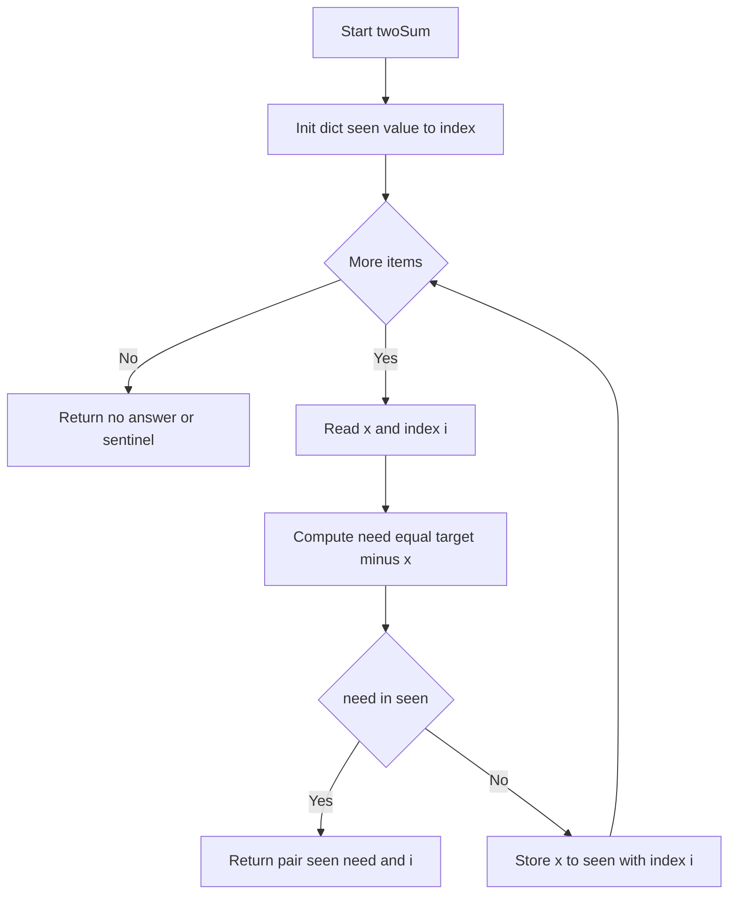
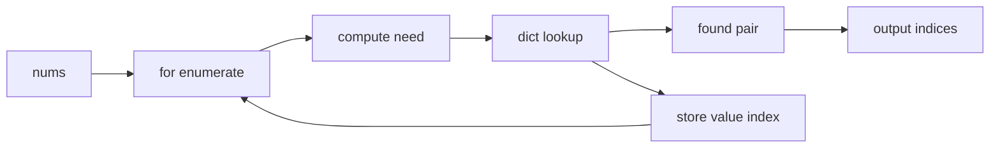

# Two Sum - 一発探索の定番ハッシュ

## Table of Contents

* [概要](#overview)
* [アルゴリズム要点（TL;DR）](#tldr)
* [図解](#figures)
* [正しさのスケッチ](#correctness)
* [計算量](#complexity)
* [Python 実装](#impl)
* [CPython 最適化ポイント](#cpython)
* [エッジケースと検証観点](#edgecases)
* [FAQ](#faq)

<h2 id="overview">概要</h2>

* **プラットフォーム/ID**: LeetCode 1
* **問題タイトル**: Two Sum
* **要約**: 整数配列 `nums` と整数 `target` が与えられる。**和が `target` になる 2 要素のインデックス**を任意順で返す。
**各入力には解が一意に存在**し、**同じ要素を 2 度使えない**。
* **入出力仕様（簡潔）**

  * 入力: `nums: List[int]`, `target: int`
  * 出力: `List[int]`（長さ 2 のインデックス配列）
* **想定データ構造**: Array（Python の `list`）
* **代表例**

  * `nums=[2,7,11,15], target=9 -> [0,1]`
  * `nums=[3,2,4], target=6 -> [1,2]`
  * `nums=[3,3], target=6 -> [0,1]`
* **関数シグネチャ（LeetCode準拠）**

  * `class Solution: def twoSum(self, nums: List[int], target: int) -> List[int]:`
* **制約要点**

  * `2 <= len(nums) <= 10^4`
  * `-10^9 <= nums[i], target <= 10^9`
  * **解は必ず存在し一意**

<h2 id="tldr">アルゴリズム要点（TL;DR）</h2>

* **戦略**: 1 パスで走査し、**値→最初の添字**を `dict` に記録。各要素 `x` で **補数 `target-x` が既出か**を O(1) 期待値で照会。
* **データ構造**: `dict[int, int]`（ハッシュテーブル、C 実装で高速）。
* **計算量**: **Time O(n)** / **Space O(n)**。
* **実装の肝**: 「先に照会 → 後で登録」。これで同じ要素を 2 回使うことを防ぎ、二重カウントを避ける。
* **安定性**: 一意解前提のため、見つかり次第即 return でよい。

<h2 id="figures">図解</h2>

### **フローチャート**



*説明*: 配列を 1 回走査し、補数が辞書にあればペアを返す。なければ現在値を辞書へ保存。

### **データフロー図**



*説明*: `need` 計算 → ハッシュ照会 → 見つかれば出力、無ければ記録して次へ。

<h2 id="correctness">正しさのスケッチ</h2>

* **不変条件**: ループ時点までに見た全要素 `nums[0..i-1]` の**最初の添字**が `seen[value]` に保存されている。
* **網羅性**: 任意の解 `(p, q)`（`p < q`）について、`q` に到達した時点で `p` は既に `seen[nums[p]] = p` として保存済み。
よって `need = target - nums[q] = nums[p]` が `seen` に存在し、返却される。
* **一意性**: 問題が一意解を保証。最初に見つかったペアを返せばよい。
* **終了性**: 配列は有限長。各ステップは O(1) で進み、最大 `n` ステップで終了。
* **同一要素を二度使わない**: 「先に照会 → 後で保存」の順序により、`need == x` の場合でも現在の `i` は辞書未登録。つまり常に異なるインデックスのペアを生成。

<h2 id="complexity">計算量</h2>

* **時間計算量**: **O(n)**（各要素につき定数回のハッシュ照会・代入）。
* **空間計算量**: **O(n)**（最悪で `n-1` 個の値を保存）。

| 実装方針      | 時間         | 空間       | 備考             |
| --------- | ---------- | -------- | -------------- |
| ハッシュ1パス   | **O(n)**   | **O(n)** | 最適。辞書は C 実装で高速 |
| ソート＋二ポインタ | O(n log n) | O(n)     | 元インデックス復元が必要   |
| 二重ループ     | O(n²)      | O(1)     | 小規模のみ妥当        |

<h2 id="impl">Python 実装</h2>

> LeetCode 用の **class 形式**。`pylance` で型エラーが出ないよう型注釈を付与。実装は **Pure**（外部副作用なし）。

```python
from __future__ import annotations
from typing import List


class Solution:
    """
    Two Sum - value to index dict, single pass.

    方針:
      - ループ中は「補数が既出か」を先に確認し、なければ現在値を記録。
      - seen は「値 -> 最初の添字」を保持する。
    """

    def twoSum(self, nums: List[int], target: int) -> List[int]:
        """
        ハッシュ1パス実装
        Args:
            nums: 整数配列
            target: 目標和
        Returns:
            条件を満たす 2 つのインデックス（任意順）
        Time:
            O(n)
        Space:
            O(n)
        """
        seen: dict[int, int] = {}  # value -> first index
        # enumerate で Python レベルのインデックス管理コストを削減
        for i, x in enumerate(nums):
            need = target - x
            j = seen.get(need)
            if j is not None:
                # 一意解保証のため見つかり次第返す
                return [j, i]
            # 先に照会してから保存。重複値は最初の位置を固定化
            if x not in seen:
                seen[x] = i
        # 問題の前提では到達しないが、型整合のため固定値を返す
        return [-1, -1]
```

<h2 id="cpython">CPython 最適化ポイント</h2>

* **ハッシュ活用**: `dict` は C 実装のオープンアドレッシングで **平均 O(1)**。
* **属性アクセス削減**: さらに突き詰めるなら `contains = seen.__contains__` など**ローカル束縛**で属性解決コストを削減（マイクロ最適化）。
* **ループ形**: `for i, x in enumerate(nums)` は Python レベルのインクリメントと添字取得をまとめて実行、可読性と性能のバランスが良い。
* **一時オブジェクトの抑制**: 補助コンテナやスライスを作らない。タプル生成などの無駄を避ける。
* **例外ベース回避**: `try/except KeyError` ではなく `get` や `in` を使用し、**例外の高コストパス**を避ける。

<h2 id="edgecases">エッジケースと検証観点</h2>

* **最小長**: `len(nums) == 2`（直ちに 2 要素で判定）。
* **重複値**: `nums = [3,3], target=6`（同じ値の 2 つを正しく扱う）。
* **負数・ゼロ**: `nums = [-1, -2, -3, -4, -5], target=-8`、`nums=[0,4,3,0], target=0`。
* **大きい値**: `±10^9` 付近でもオーバーフローを起こさない（Python は任意精度 int）。
* **解が配列の後半で確定**: `p < q` の形で `q` 到達時に `p` が辞書にあることを確認。
* **解なし入力**: 問題前提では発生しないが、堅牢実装では例外送出・番兵値返却の方針を決める。

<h2 id="faq">FAQ</h2>

* **Q. なぜ二ポインタではなくハッシュなのか？**
  A. 二ポインタはソートが必要で **O(n log n)**。元インデックスの復元も必要。一方ハッシュは **O(n)** で一意解を即返せる。

* **Q. 辞書に保存する値は「現在値」か「補数」か？**
  A. どちらでも正しく実装できる。ここでは **値→最初の添字** を保存し、`need in seen` を照会する形を採用（読みやすく定番）。
  マイクロ最適化として「**補数→添字** を保存して `x in seen` を照会」する等価手もある。

* **Q. 同じ要素を二度使うバグは起きない？**
  A. 先に照会してから保存する順序により、`need == x` のケースでも**現在の i は未登録**であり、常に **異なるインデックス**のペアを返す。

* **Q. 早期終了は常に正しい？**
  A. 解は一意で必ず存在するため、最初に見つかった時点で終了して正しい。

* **Q. Python の int でオーバーフローは？**
  A. Python の `int` は任意精度。範囲制約は問題側のみで、計算上のオーバーフローは起きない。
