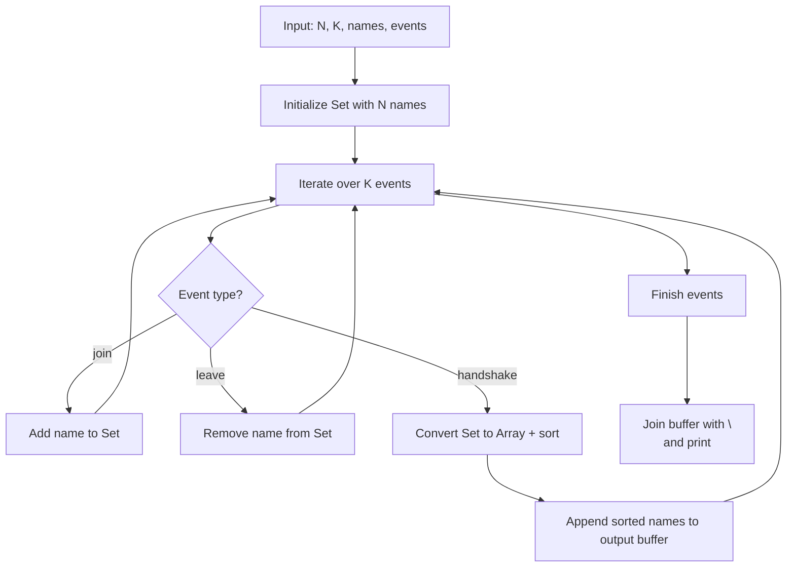
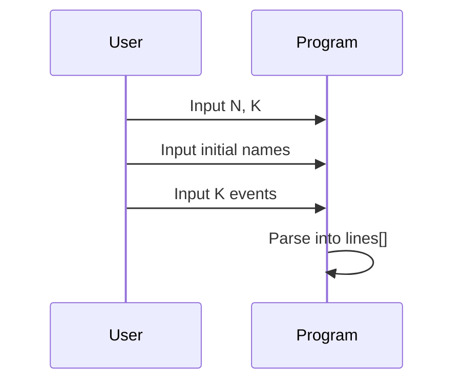
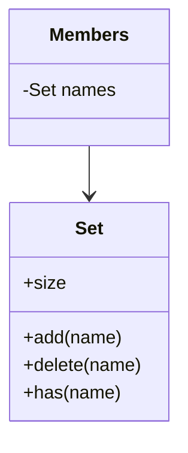

# README.md (解説用)

## アイドルグループ管理プログラム

このプログラムは、初期メンバーの一覧と一連のイベント（加入、脱退、握手会）を処理して、握手会時点の全メンバーを辞書順に出力します。

---

## 処理フロー全体



---

## 1. 入力処理

標準入力から以下のデータを読み込みます。

- `N`: 初期メンバー数
- `K`: イベント数
- 続く `N` 行: メンバー名
- 続く `K` 行: イベント



---

## 2. データ構造（Set）

メンバー管理には `Set` を使用します。

- **join** → `Set.add(name)`
- **leave** → `Set.delete(name)`
- **handshake** → `Array.from(Set).sort()`



---

## 3. イベント処理

### join イベント

新しいメンバーを追加します。

```mermaid
flowchart LR
    A[join name] --> B[Set.add(name)]
    B --> C[Member added if not exists]
```

---

### leave イベント

既存メンバーを削除します。

```mermaid
flowchart LR
    A[leave name] --> B[Set.delete(name)]
    B --> C[Member removed]
```

---

### handshake イベント

現在のメンバーを辞書順に出力します。

```mermaid
flowchart LR
    A[handshake] --> B[Array.from(Set)]
    B --> C[sort()]
    C --> D[Push names to output buffer]
```

---

## 4. 出力処理

全イベントを処理した後、バッファに溜めた結果を改行区切りで出力します。

```mermaid
flowchart TD
    A[Output buffer] --> B[join with \\n]
    B --> C[console.log(result)]
```

---

## 5. 計算量

- **join/leave**: O(1)
- **handshake**: O(M log M) （M = 現在のメンバー数）
  → ただし handshake ≤ 10 回のため全体では O(N + K log N) で十分高速。

---

## 6. 実行例

### 入力例

```text
2 7
nene
ao
handshake
leave nene
join neko
join koko
handshake
leave neko
handshake
```

### 出力例

```text
ao
nene
ao
koko
neko
ao
koko
```

---
