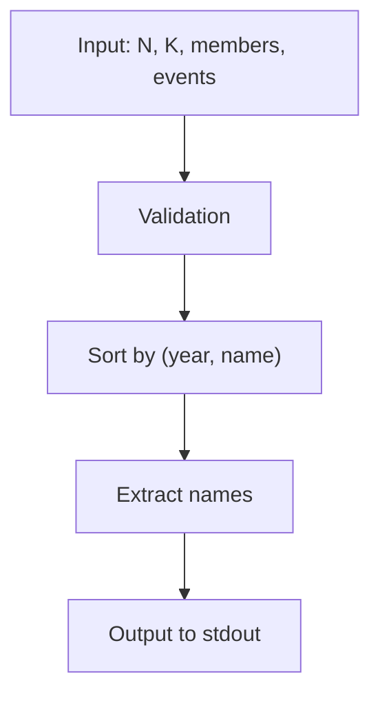
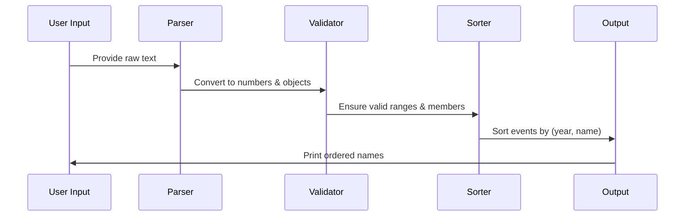
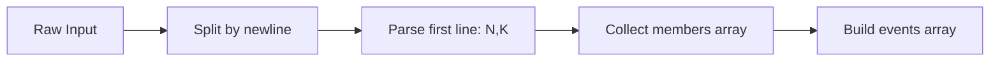
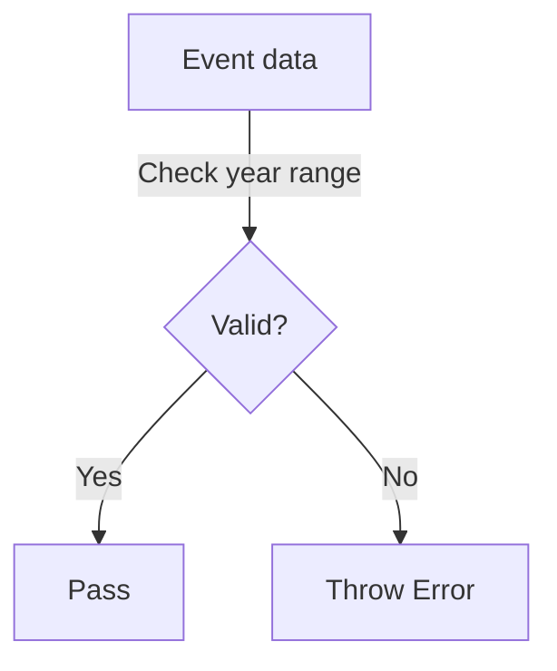
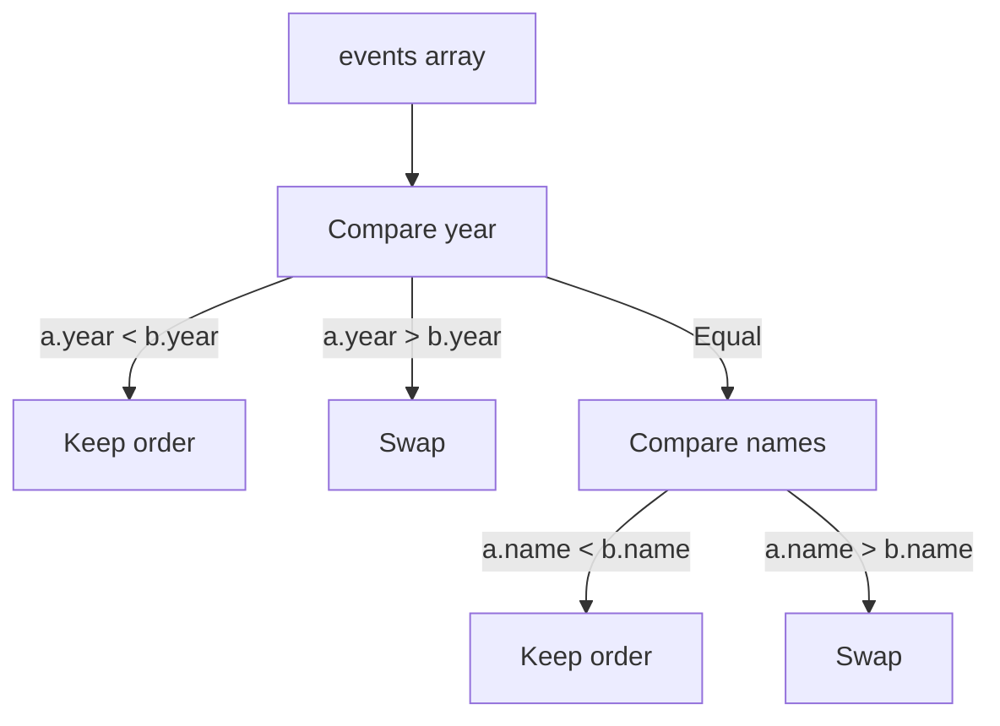
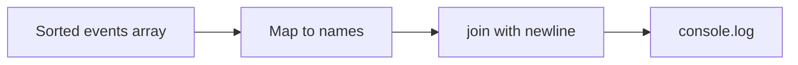

# README.md (解説 & 図解)

## 1. Problem Description

We need to create a **historical timeline** sorted by events.
Each event has:

- `year` (integer)
- `student name` (string, member of the group)

**Requirements:**

- Sort by year (ascending).
- If years are equal → sort by name (lexicographical).
- Output only the student names in the correct order.

---

## 2. Data Flow Overview



---

## 3. Input / Output Example

**_Input_**

```test
3 5
nao
hiro
yuki
645 nao
593 hiro
2058 yuki
29484 nao
374759 nao
```

**_Process_**

1. Read members → `[nao, hiro, yuki]`
2. Read events → `[{593, hiro}, {645, nao}, {2058, yuki}, ...]`
3. Sort by year → `593 < 645 < 2058 < ...`
4. Extract names → `[hiro, nao, yuki, nao, nao]`

**_Output_**

```text
hiro
nao
yuki
nao
nao
```

---

## 4. Algorithm Explanation



---

## 5. Detailed Processing Steps

### Step 1. Parsing Input

- Read first line → `N` (members), `K` (events).
- Read `N` names into `members[]`.
- Read `K` lines into objects `{year, name}`.



---

### Step 2. Validation

- Check ranges:

  - `1 ≤ N ≤ 1000`, `1 ≤ K ≤ 100000`
  - `1 ≤ year ≤ 1e9`

- Ensure `name ∈ members`.



---

### Step 3. Sorting

- Use `Array.sort` with comparator:
  `(a, b) => a.year - b.year || a.name.localeCompare(b.name)`



---

### Step 4. Output

- Extract names → `events.map(ev => ev.name)`
- Join with newline → `join("\n")`
- Print.



---

## 6. Complexity Analysis

- **Time Complexity**:

  - Parsing: `O(N + K)`
  - Sorting: `O(K log K)`
  - Output: `O(K)`
    → **Total: O(K log K)**

- **Space Complexity**:

  - Members: `O(N)`
  - Events: `O(K)`
    → **Total: O(K)**

---

## 7. Implementation (solution.js)

```javascript
"use strict";

/**
 * @typedef {Object} Event
 * @property {number} year - Year of the event
 * @property {string} name - Student responsible
 */

function buildTimeline(n, k, members, events) {
  if (!Number.isInteger(n) || !Number.isInteger(k)) {
    throw new TypeError("n and k must be integers");
  }
  if (n < 1 || n > 1000) throw new RangeError("n out of range");
  if (k < 1 || k > 100000) throw new RangeError("k out of range");
  if (!Array.isArray(members) || members.length !== n) {
    throw new TypeError("members must be an array of length n");
  }
  if (!Array.isArray(events) || events.length !== k) {
    throw new TypeError("events must be an array of length k");
  }

  const memberSet = new Set(members);
  for (const ev of events) {
    if (typeof ev.year !== "number" || !Number.isFinite(ev.year)) {
      throw new TypeError("year must be finite");
    }
    if (ev.year < 1 || ev.year > 1_000_000_000) {
      throw new RangeError("year out of range");
    }
    if (!memberSet.has(ev.name)) {
      throw new TypeError(`Invalid member: ${ev.name}`);
    }
  }

  events.sort((a, b) => a.year - b.year || a.name.localeCompare(b.name));
  return events.map((ev) => ev.name);
}

// Main execution
if (require.main === module) {
  const input = require("fs").readFileSync(0, "utf8").trim().split("\n");
  let idx = 0;
  const [nStr, kStr] = input[idx++].split(" ");
  const n = Number(nStr),
    k = Number(kStr);

  const members = [];
  for (let i = 0; i < n; i++) members.push(input[idx++].trim());

  const events = [];
  for (let i = 0; i < k; i++) {
    const [yStr, name] = input[idx++].split(" ");
    events.push({ year: Number(yStr), name });
  }

  const result = buildTimeline(n, k, members, events);
  console.log(result.join("\n"));
}

module.exports = { buildTimeline };
```

---
