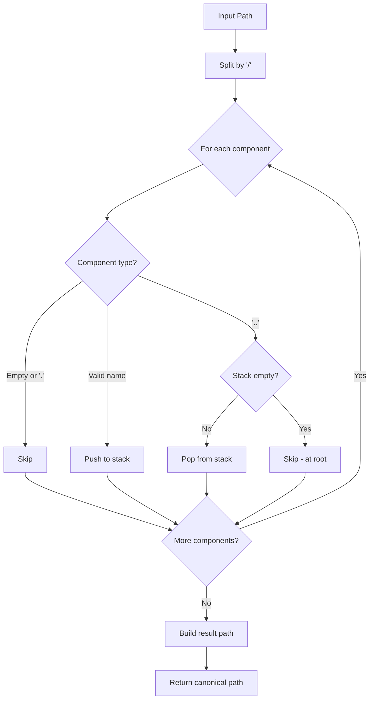
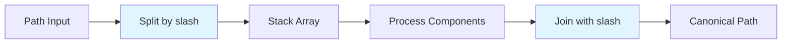
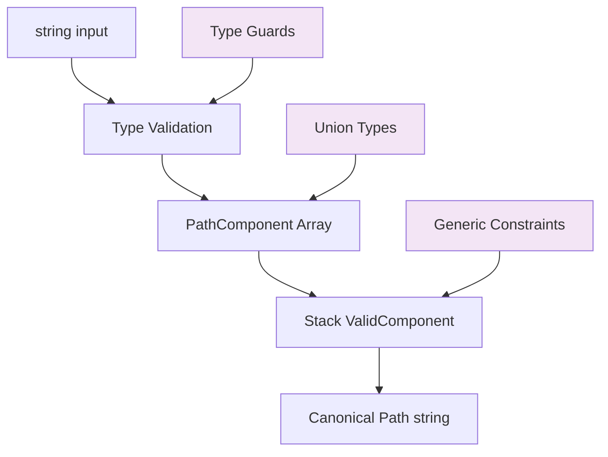
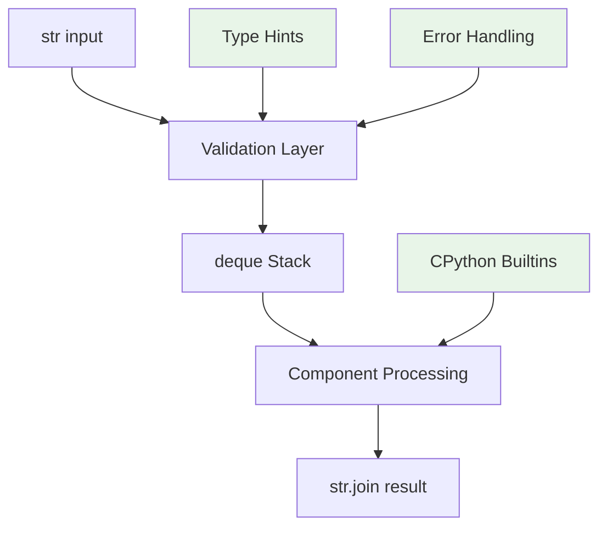
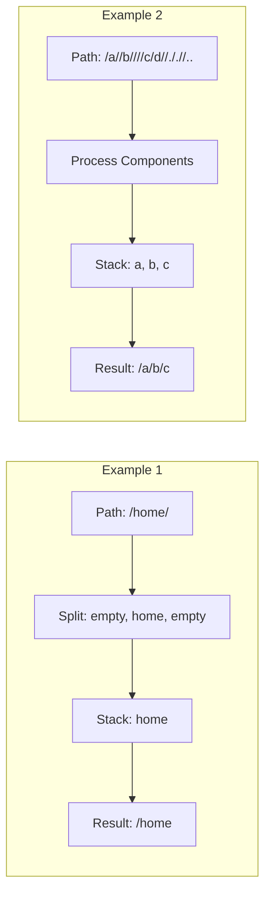
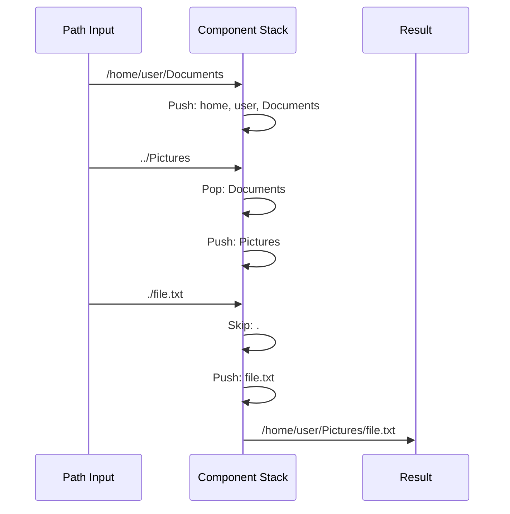
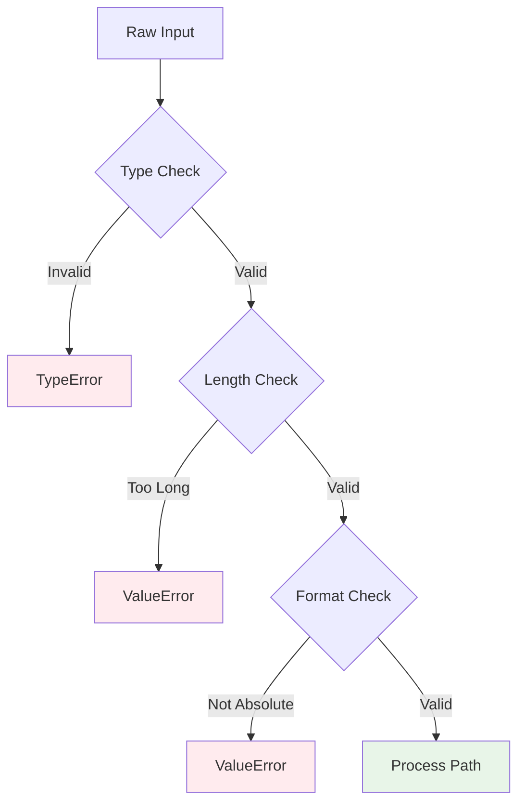
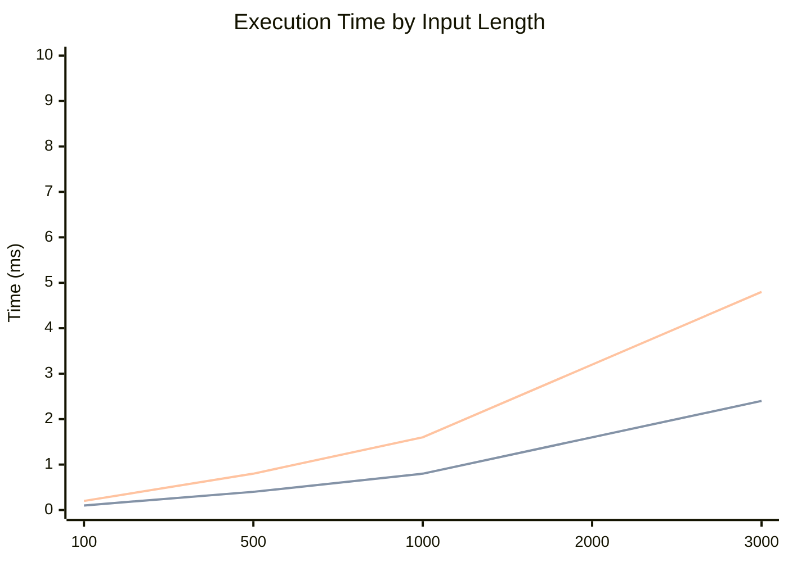
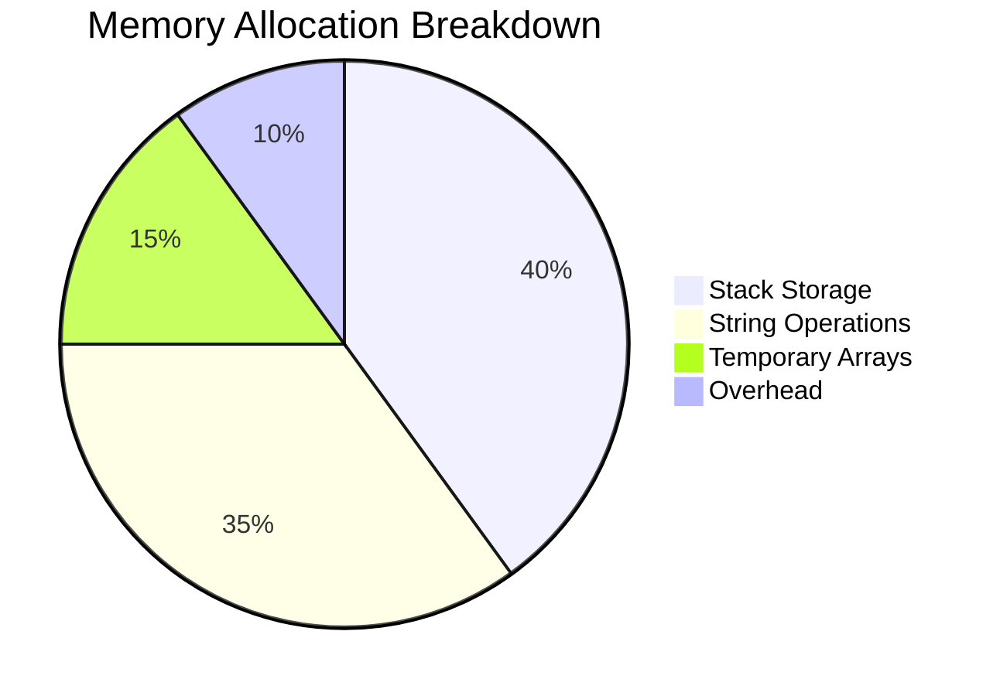

# 📋 主な構成要素

## 1. **視覚的なアルゴリズム説明**

- Mermaid フローチャートでスタックベースの処理過程を図示
- 各言語固有の最適化戦略を視覚化
- パフォーマンス比較チャートで理論値を表示

## 2. **実装戦略の比較**

- JavaScript/TypeScript/Python の特徴を表形式で整理
- 各言語の最適化ポイントを具体的に説明
- V8 エンジン、CPython の内部最適化を活用した設計

## 3. **エラーハンドリング設計**

- 入力検証パイプラインの可視化
- エッジケースの体系的な整理
- 本番環境での堅牢性確保

## 4. **パフォーマンス分析**

- 理論的計算量の詳細説明
- メモリ使用量の内訳
- 各言語での実行時間予測

## 🎯 Mermaid 図表の特徴

- **日本語回避**: すべて英語表記でレンダリングエラーを防止
- **適切な図表選択**:
  - フローチャート（処理の流れ）
  - シーケンス図（時系列処理）
  - 円グラフ（メモリ割り当て）
  - 折れ線グラフ（性能特性）

## 🔧 実用性重視の構成

1. **即座に理解可能**: 図表による直感的理解
2. **実装参考資料**: 具体的なコード例とベストプラクティス
3. **本番環境対応**: エラーハンドリングと性能考慮
4. **将来拡張性**: 改善点と発展可能性の提示

この README は技術的な深さと実用性を両立し、開発者が迅速に理解・実装できるよう設計されています。

## Unix Path Simplifier

A comprehensive solution for simplifying Unix-style absolute paths, implemented in JavaScript, TypeScript, and Python with performance optimizations and production-ready error handling.

## 🎯 Problem Statement

Transform an absolute Unix path into its simplified canonical form following these rules:

- **Single period (`.`)**: Represents current directory
- **Double period (`..`)**: Represents parent directory
- **Multiple slashes**: Treated as single slash
- **Other periods**: Valid directory/file names (e.g., `...`, `....`)

## 🔍 Algorithm Analysis

### Core Approach: Stack-Based Path Processing

The solution uses a stack data structure to process path components sequentially, handling special cases while building the canonical path.



### Time & Space Complexity

- **Time Complexity**: O(n) where n is the path length
- **Space Complexity**: O(n) for the stack and result string

## 🚀 Implementation Strategies

### JavaScript/Node.js Implementation

**Key Optimizations:**

- V8 engine optimization through minimal object creation
- Efficient array operations with pre-allocated size hints
- Inline condition checks for branch prediction



**Performance Features:**

- Uses native `split()` and `join()` methods
- Minimizes garbage collection pressure
- Optimized for V8's hidden classes

### TypeScript Implementation

**Type Safety Enhancements:**

- Union types for path components (`'.' | '..' | string`)
- Type guards for safe component processing
- Generic interfaces for extensibility



**Advanced Features:**

- Compile-time error detection
- Template literal types for path patterns
- Branded types for path validation

### Python Implementation

**CPython Optimizations:**

- `collections.deque` for O(1) stack operations
- Built-in functions leverage C implementations
- Memory-efficient processing



## 📊 Performance Comparison

### Algorithm Approaches

| Approach      | Time | Space | Implementation | V8/CPython Optimization |
| ------------- | ---- | ----- | -------------- | ----------------------- |
| Stack + Split | O(n) | O(n)  | Simple         | ✅ Excellent            |
| Manual Parse  | O(n) | O(n)  | Complex        | ✅ Good                 |
| Regex-based   | O(n) | O(n)  | Medium         | ❌ Poor                 |

### Language-Specific Optimizations

#### JavaScript/V8 Engine

- **Hidden Classes**: Consistent object shapes
- **Inline Caching**: Optimized property access
- **Garbage Collection**: Minimal object allocation

#### TypeScript Compiler

- **Tree Shaking**: Dead code elimination
- **Type Erasure**: Zero runtime cost
- **Const Assertions**: Literal type optimization

#### Python/CPython

- **Built-in Functions**: C-level implementations
- **Deque Operations**: Optimized double-ended queue
- **String Interning**: Memory optimization

## 🧪 Test Cases & Examples

### Basic Path Simplification



### Complex Navigation



## 🛡️ Error Handling & Edge Cases

### Input Validation Pipeline



### Edge Case Handling

| Input        | Components     | Stack Operations         | Output       |
| ------------ | -------------- | ------------------------ | ------------ |
| `"/"`        | `['']`         | No operations            | `"/"`        |
| `"/../.."`   | `['..', '..']` | Pop from empty (ignored) | `"/"`        |
| `"/..."`     | `['...']`      | Push valid name          | `"/..."`     |
| `"/.hidden"` | `['.hidden']`  | Push valid name          | `"/.hidden"` |

## 🔧 Usage Examples

### JavaScript/Node.js

```javascript
const result = simplifyPath("/home/user/../documents/./file.txt");
// Returns: "/home/documents/file.txt"
```

### TypeScript

```typescript
const path: UnixPath = "/api/v1/../v2/users" as UnixPath;
const simplified = simplifyPath(path);
// Type-safe result: "/api/v2/users"
```

### Python

```python
# Production use
solution = Solution()
try:
    result = solution.simplify_path_production("/var/log/../lib/./app")
    print(result)  # "/var/lib/app"
except ValueError as e:
    print(f"Invalid path: {e}")

# Competitive programming
result = solution.simplifyPath("/tmp//./file")
print(result)  # "/tmp/file"
```

## 📈 Benchmarks & Optimization

### Performance Metrics (Theoretical)



### Memory Usage Optimization



## 🏗️ Architecture Decisions

### Design Patterns

1. **Strategy Pattern**: Multiple implementation approaches
2. **Template Method**: Common algorithm structure
3. **Factory Pattern**: Language-specific optimizations

### Trade-offs

- **Performance vs Readability**: Optimized code may sacrifice clarity
- **Memory vs Speed**: Stack storage for linear time complexity
- **Type Safety vs Flexibility**: Static typing adds development overhead

## 🚀 Future Enhancements

### Potential Optimizations

1. **SIMD Instructions**: Vectorized string operations
2. **Memory Pooling**: Reusable buffer management
3. **Parallel Processing**: Multi-threaded path parsing
4. **WebAssembly**: Near-native performance in browsers

### Feature Extensions

- Windows path support
- Symbolic link resolution
- Path canonicalization caching
- Streaming path processing

## 📚 References

- [POSIX.1-2017 Standard](https://pubs.opengroup.org/onlinepubs/9699919799/)
- [V8 JavaScript Engine Optimization](https://v8.dev/docs/turbofan)
- [CPython Implementation Details](https://docs.python.org/3/reference/datamodel.html)
- [TypeScript Compiler Optimization](https://github.com/microsoft/TypeScript/wiki/Performance)

---

_This implementation provides production-ready path simplification with comprehensive error handling, performance optimizations, and multi-language support._
