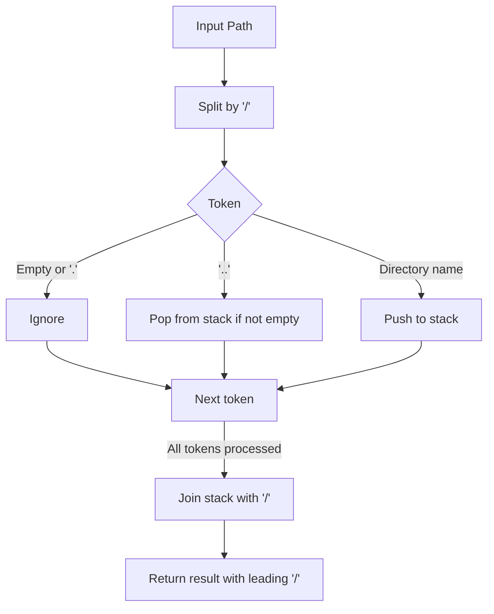
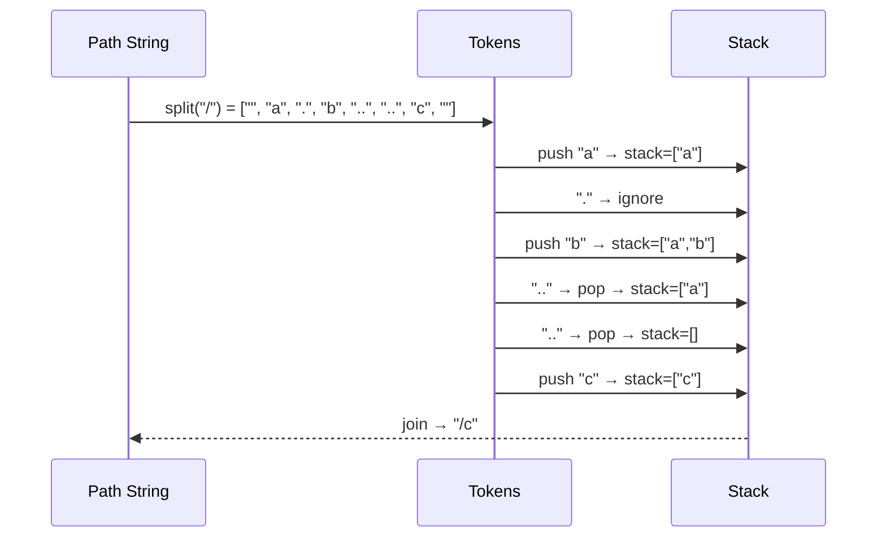

# Simplify Path - Python Implementation

## 1. Problem Overview

入力として与えられた **UNIX 形式の絶対パス** を、正規化（canonical form）する問題。

例:

- Input:

  ```text
  "/a/./b/../../c/"
  ```

- Output:

  ```text
  "/c"
  ```

---

## 2. Approach

### Key Rules

- `.` → 現在のディレクトリ → 無視
- `..` → 親ディレクトリへ戻る（root `/` 以上には行かない）
- 連続する `/` は 1 個にまとめる
- その他は通常のディレクトリ名として保持する

---

## 3. Algorithm Flow



---

## 4. Data Flow Example

Input:

```text
/a/./b/../../c/
```

Processing steps:



---

## 5. Python Implementation

```python
from typing import List

class Solution:
    def simplifyPath(self, path: str) -> str:
        """
        Simplify a Unix-style absolute path to its canonical form.
        """
        # --- Input validation ---
        if not isinstance(path, str):
            raise TypeError("path must be a string")
        n = len(path)
        if n < 1 or n > 3000:
            raise ValueError("path length out of bounds (1..3000)")
        if path[0] != '/':
            raise ValueError("path must be absolute and start with '/'")

        # --- Tokenize ---
        parts: List[str] = path.split('/')
        stack: List[str] = []

        # --- Main loop ---
        for token in parts:
            if token == '' or token == '.':
                continue
            if token == '..':
                if stack:
                    stack.pop()
            else:
                stack.append(token)

        # --- Build result ---
        return '/' + '/'.join(stack) if stack else '/'
```

### Optimized version for contests

```python
class SolutionFast:
    def simplifyPath(self, path: str) -> str:
        parts = path.split('/')
        stack: List[str] = []
        for token in parts:
            if token == '' or token == '.':
                continue
            if token == '..':
                if stack:
                    stack.pop()
            else:
                stack.append(token)
        return '/' + '/'.join(stack) if stack else '/'
```

---

## 6. Complexity

- **Time**: `O(n)` （n = 文字列長。分割 & 走査一回）
- **Space**: `O(n)` （スタックに保持するディレクトリ数の最大値）

---

## 7. Python-Specific Optimization

- **Built-in split** (`str.split`) は C 実装 → 高速
- **Stack operations** (`append`, `pop`) は amortized O(1)
- **Join** (`str.join`) も C 実装 → 高速

---
