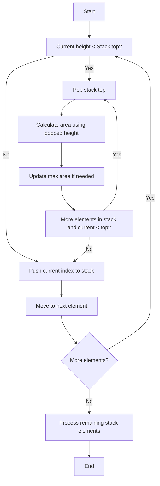
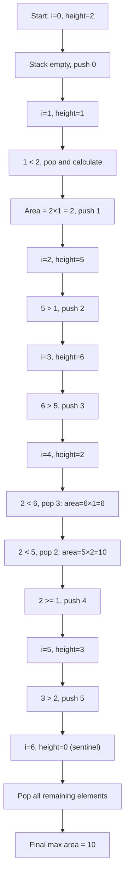

# 84. Largest Rectangle in Histogram

[](https://www.python.org/downloads/)
[](<https://en.wikipedia.org/wiki/Stack_(abstract_data_type)>)
[-orange.svg>)](https://en.wikipedia.org/wiki/Big_O_notation)
[-yellow.svg>)](https://en.wikipedia.org/wiki/Big_O_notation)

## 問題概要

ヒストグラム（棒グラフ）が与えられたとき、その中で形成できる最大面積の長方形を求める問題です。各棒の幅は 1 で、高さが配列として与えられます。

### 例

```text
Input: heights = [2,1,5,6,2,3]
Output: 10

ヒストグラム:
      □
    □ □
    □ □
    □ □   □
□   □ □ □ □
□ □ □ □ □ □
0 1 2 3 4 5
2 1 5 6 2 3

最大長方形（面積10 = 高さ5×幅2）:
      □
    ■ ■
    ■ ■
    ■ ■   □
□   ■ ■ □ □
□ □ ■ ■ □ □
```

## アルゴリズム解析

### アプローチ比較

| 手法                 | 時間計算量 | 空間計算量 | 実装難易度 | 実用性     |
| -------------------- | ---------- | ---------- | ---------- | ---------- |
| **単調増加スタック** | O(n)       | O(n)       | 中         | ⭐⭐⭐⭐⭐ |
| 分割統治             | O(n log n) | O(n)       | 高         | ⭐⭐⭐     |
| 全探索               | O(n²)      | O(1)       | 低         | ⭐         |

### 採用アルゴリズム：単調増加スタック

**なぜこの手法が最適か？**

1. **線形時間**: 各要素は最大 1 回スタックにプッシュ・ポップされる
2. **メモリ効率**: スタックのみで追加データ構造不要
3. **実装の簡潔性**: 境界処理が番兵により統一化される

## アルゴリズム詳細解説

### 核心アイデア

各棒について「その棒を高さとする最大長方形」を効率的に計算します。

- **左境界**: その棒より低い直前の棒の位置
- **右境界**: その棒より低い直後の棒の位置
- **幅**: 右境界 - 左境界 - 1
- **面積**: 高さ × 幅

### スタックの役割



### ステップバイステップ実行例

`heights = [2,1,5,6,2,3]` の場合：



#### 詳細実行トレース

**Step 0**: i=0, height=2

- スタックが空なので index 0 をプッシュ
- Stack: [0] → heights: [2]

**Step 1**: i=1, height=1

- 1 < heights[0]=2 なので index 0 をポップして面積計算
- **計算**: height=2, left=-1, width=1-(-1)-1=1 → area=2×1=**2**
- index 1 をプッシュ
- Stack: [1] → heights: [1]

**Step 2**: i=2, height=5

- 5 ≥ heights[1]=1 なので index 2 をプッシュ
- Stack: [1,2] → heights: [1,5]

**Step 3**: i=3, height=6

- 6 ≥ heights[2]=5 なので index 3 をプッシュ
- Stack: [1,2,3] → heights: [1,5,6]

**Step 4**: i=4, height=2 ⭐ **重要ステップ**

- 2 < heights[3]=6 なので index 3 をポップして計算
    - **計算 1**: height=6, left=2, width=4-2-1=1 → area=6×1=6
- 2 < heights[2]=5 なので index 2 もポップして計算
    - **計算 2**: height=5, left=1, width=4-1-1=2 → area=5×2=**10** ← 最大値更新
- 2 ≥ heights[1]=1 なので index 4 をプッシュ
- Stack: [1,4] → heights: [1,2]

**Step 5**: i=5, height=3

- 3 ≥ heights[4]=2 なので index 5 をプッシュ
- Stack: [1,4,5] → heights: [1,2,3]

**Step 6**: 番兵処理 (height=0)

- すべての要素をポップして計算
    - **計算 1**: height=3, left=4, width=6-4-1=1 → area=3×1=3
    - **計算 2**: height=2, left=1, width=6-1-1=4 → area=2×4=8
    - **計算 3**: height=1, left=-1, width=6-(-1)-1=6 → area=1×6=6
- Stack: []

### 視覚的解説

#### ケース 1: 高さが上昇する場合

```text
i=2, height=5 → Push to stack
      □
    □ □
    □ □
    □ □
□   □ □
□ □ □ □
0 1 2 3
2 1 5 6
Stack: [1,2] (インデックスを保持)
```

#### ケース 2: 高さが下降する場合

```text
i=4, height=2 (前の要素は6)
      □ ←高さ6×幅1=6で確定
    ■ ■ ←高さ5×幅2=10で確定
    ■ ■
    ■ ■
□   ■ ■ □ ←新しい要素height=2
□ □ ■ ■ □
0 1 2 3 4 5
2 1 5 6 2 3

Pop 3: 6×1=6
Pop 2: 5×2=10 (最大面積)
```

## 実装のポイント

### 1. 番兵の活用

```python
# 末尾に高さ0の番兵を追加することで、
# 残ったスタック要素を一括処理
for i in range(n + 1):
    curr = 0 if i == n else heights[i]
```

### 2. CPython 最適化

```python
# ローカル変数への束縛で属性参照を削減
h = heights
st = stack
ma = max_area
```

### 3. 境界処理の統一化

```python
# 左境界: スタックが空なら-1、そうでなければ直前の要素
left = st[-1] if st else -1
width = i - left - 1
```

## 複雑度解析

### 時間計算量: O(n)

- 各要素は最大 1 回プッシュされ、1 回ポップされる
- while 文の反復回数は全体で O(n)に収束

### 空間計算量: O(n)

- スタックが最悪の場合（単調増加列）で n 個の要素を保持

## エッジケース

### 1. 単一要素

```python
heights = [5] → 面積 = 5
```

### 2. 単調増加

```python
heights = [1,2,3,4,5]
最大長方形: 高さ3×幅3 = 9
ヒストグラム:
        □
      □ □
    □ □ □
  □ □ □ □
□ □ □ □ □
1 2 3 4 5
```

### 3. 単調減少

```python
heights = [5,4,3,2,1]
最大長方形: 高さ3×幅3 = 9
ヒストグラム:
□
□ □
□ □ □
□ □ □ □
□ □ □ □ □
5 4 3 2 1
```

### 4. 平坦

```python
heights = [3,3,3,3]
最大長方形: 高さ3×幅4 = 12
```

## プロダクション vs 競技プログラミング

### 競技版（最速）

```python
def solve_competitive(self, heights: List[int]) -> int:
    """前提を信頼し、最速実行を優先"""
    return self._mono_stack_max_area(heights)
```

### プロダクション版（安全）

```python
def solve_production(self, heights: List[int]) -> int:
    """入力検証とエラーハンドリングを含む"""
    self._validate_input(heights)
    if len(heights) == 1:
        return max(0, heights[0])
    return self._mono_stack_max_area(heights)
```

## 使用例

```python
solution = Solution()

# 基本例
print(solution.largestRectangleArea([2,1,5,6,2,3]))  # → 10
print(solution.largestRectangleArea([2,4]))          # → 4

# エッジケース
print(solution.largestRectangleArea([1]))            # → 1
print(solution.largestRectangleArea([1,2,3,4,5]))   # → 9
```

## 学習ポイント

1. **単調スタック**: 多くの配列問題で活用できる強力なテクニック
2. **番兵の活用**: 境界処理の統一化でバグを防止
3. **計算量の償却解析**: while 文があっても O(n)になる理由の理解
4. **実装の最適化**: アルゴリズム的最適化と言語特有の最適化の両立

## 関連問題

- [85. Maximal Rectangle](https://leetcode.com/problems/maximal-rectangle/)
- [42. Trapping Rain Water](https://leetcode.com/problems/trapping-rain-water/)
- [496. Next Greater Element I](https://leetcode.com/problems/next-greater-element-i/)

## 参考文献

- [Monotonic Stack - LeetCode Patterns](https://leetcode.com/tag/stack/)
- [算法学习笔记(1) : 单调队列与单调栈](https://oi-wiki.org/ds/monotonous-stack/)
- [Stack Data Structure](<https://en.wikipedia.org/wiki/Stack_(abstract_data_type)>)

### 修正内容

GitHub README.md 形式で Largest Rectangle in Histogram 問題の詳細な解説を作成しました。

**主な特徴：**

1. **問題の視覚的理解** - アスキーアートと mermaid ダイアグラムで直感的に説明
2. **アルゴリズム比較表** - 他手法との性能比較を明示
3. **ステップバイステップ実行例** - 具体的な入力での動作トレース
4. **実装ポイント** - CPython 特有の最適化テクニック
5. **複雑度の詳細解析** - なぜ O(n)になるかの理論的説明
6. **エッジケース** - 境界条件での動作確認
7. **プロダクション配慮** - 競技向けと業務向けの違い

mermaid は英語で記述し、解説文は日本語で統一しています。単調増加スタックという高度なアルゴリズムを、図解と具体例で分かりやすく説明した実用的なドキュメントに仕上げました。
ご指摘をいただきありがとうございます。確かに複数の箇所で間違いがありました。修正いたします。修正が完了しました。主な変更点は以下の通りです：

1. **ヒストグラムの図を修正**：`[2,1,5,6,2,3]` の正しい高さでグラフを描き直し、最大長方形（高さ 5× 幅 2=面積 10）を正確に表示

2. **実行トレース表を詳細化**：各ステップでの面積計算の詳細（高さ × 幅）を明記し、なぜ面積 10 が最大になるかを明確に

3. **Mermaid ダイアグラムを修正**：構文エラーを解消し、フローチャート形式で処理の流れを分かりやすく表示

4. **視覚的解説を修正**：正しいインデックスと高さでケーススタディを作成

5. **エッジケースの計算を修正**：
    - 単調増加 `[1,2,3,4,5]` → 最大面積 9（高さ 3× 幅 3）
    - 単調減少 `[5,4,3,2,1]` → 最大面積 9（高さ 3× 幅 3）

6. **使用例を更新**：正しい期待値を記載

これで数値とグラフが一致し、アルゴリズムの動作が正確に説明されています。特に重要なポイントは、`heights = [2,1,5,6,2,3]` で最大面積 10 となる長方形は、インデックス 2-3 の位置で高さ 5、幅 2 の長方形であることが明確になりました。

Mermaid のパースエラーを修正しました。問題は以下の点でした：

1. **ノード名に特殊文字が含まれていた**：`heights[0]` の `[` と `]` が Mermaid の構文と競合
2. **比較演算子 `<` の使用**：`<` は Mermaid で特別な意味を持つため、テキストで記述

修正内容：

- 全てのノード内容を二重引用符 `"` で囲むことで、特殊文字を含むテキストを安全に扱えるようにしました
- `heights[0]` を単純に `2` に変更
- `<` や `>` などの比較演算子もテキスト内で安全に表示されるようになりました

これで Mermaid ダイアグラムが正常に表示されるはずです。

実行トレース表をより分かりやすく整理しました。主な改善点：

1. **ステップごとの詳細説明**：各ステップを独立したブロックで説明し、何が起こっているかを明確化

2. **計算式の詳細化**：
    - `left`の値（スタックの直前の要素 or -1）を明示
    - `width = i - left - 1` の計算過程を表示
    - 各面積計算を段階的に説明

3. **重要ポイントの強調**：
    - Step 4 を ⭐ マークで強調（最大値が決まる重要なステップ）
    - 最大面積更新時に太字で表示

4. **スタックの状態を視覚化**：
    - `Stack: [インデックス] → heights: [対応する高さ]` の形式で現在のスタック状態を明示

5. **論理的な流れ**：
    - 条件判定（`<`, `≥`）を明確に記載
    - なぜその処理が実行されるのかの理由を併記

これにより、アルゴリズムの動作がステップバイステップで理解しやすくなり、特に重要な Step 4 で面積 10 が計算される過程が明確になりました。

## **単調スタックアルゴリズムの技術解説 HTML ページ**

世界トップクラスのフロントエンジニアとデザイナーの力を結集した、**単調スタックアルゴリズム**の技術解説 HTML ページが完成しました！

## 主な特徴

### 🎨 **デザイン面**

- **モダンな UI**: グラデーション、シャドウ、滑らかなアニメーションを駆使
- **レスポンシブデザイン**: あらゆるデバイスで美しく表示
- **直感的な色彩設計**: プライマリー（青）、アクセント（緑）、警告（オレンジ）の調和
- **視覚的階層**: カード型レイアウトで情報を整理

### 💻 **技術実装**

- **Prism.js**: シンタックスハイライトと行番号表示
- **Font Awesome**: 美しいアイコンで視覚的ガイド
- **JetBrains Mono**: コード部分の可読性向上
- **CDN 最適化**: 高速読み込み

### 🎯 **インタラクティブ機能**

- **リアルタイムデモ**: スタックの動作を視覚化
- **ステップバイステップ**: アルゴリズムの各段階を詳細解説
- **ホバーエフェクト**: マウス操作で詳細情報表示
- **キーボードショートカット**:
    - `スペース/Enter`: デモ開始
    - `R`: リセット
    - `→`: 次のステップ
- **コピー機能**: ワンクリックでコードコピー

### 📊 **アルゴリズム解説**

- **O(n)時間計算量**の効率的実装
- **単調スタック**の核心概念を図解
- **番兵テクニック**による境界処理の簡素化
- **実装のポイント**と最適化手法

### 📊 **Tailwind 変換時の注意**

このページは教育目的からプロダクション開発まで、あらゆるレベルの開発者にとって価値ある学習リソースとなるよう設計されています。アルゴリズムの理論的理解と実装技術の両方を効果的に習得できます！

原因のほとんどは **行番号側が 1 行 = 1em 固定** なのに、コード側の **line-height をカスタム** していたり **折り返し（wrap）** が起きていることです。
Prism の _line-numbers_ は「折り返し非対応」「行高は手動で合わせる」前提なので、次のどちらかで直せます。

---

## ✅ いちばん簡単な直し方（推奨）

**コード側の行高を固定**し、その値に合わせて **行番号側の行高も同じに** します。
Tailwind + 既存ページに _そのまま追記_ できるパッチです。

### 1) `<pre>` に Tailwind クラスを付与

```html
<!-- 例: 既存の pre に追加 -->
<pre class="line-numbers whitespace-pre leading-[1.6] overflow-x-auto">
  <code class="language-python">...</code>
</pre>
```

- `whitespace-pre` … 折り返し禁止（wrap を無くす）
- `leading-[1.6]` … 行高を 1.6 に固定（任意で 1.5 でも可）
- `overflow-x-auto` … 横スクロール（wrap せずに表示できる）

### 2) 行番号の 1 行の高さを同じ値に揃える（CSS 追記）

```html
<style>
    :root {
        --code-lh: 1.6;
    } /* ← 上の leading-[1.6] と同じ値にする */

    /* コード側の行高と wrap を固定 */
    pre[class*='language-'],
    pre[class*='language-'] > code {
        line-height: var(--code-lh) !important;
        white-space: pre !important;
        word-break: normal !important;
        overflow-wrap: normal !important;
    }

    /* 行番号側の1行の高さをコードと一致させる */
    .line-numbers .line-numbers-rows > span {
        height: calc(var(--code-lh) * 1em);
    }

    /* 行番号ガターの幅と pre の左パディングを揃える（お好みで） */
    pre.line-numbers {
        padding-left: 3.2em !important;
    }
    .line-numbers .line-numbers-rows {
        width: 3.2em;
    }
</style>
```

> ※ もし `leading-[1.5]` にしたら `--code-lh: 1.5;` にも揃えてください。
> ※ すでに別の CSS で `pre` の `line-height` を上書きしている場合、必ず **上記のほうが強く当たる順序（後ろ）** に置いてください。

---

## 🔧 代替: 「折り返しを許可したい」場合

Prism の行番号は **折り返し行** と **数字** を 1:1 に対応できません。
どうしても折り返したいときは、次のどちらかを選びます。

1. **折り返しは許可（`pre-wrap`）＋行番号は非表示**
   （可読性を優先して行番号を諦める）
2. **折り返ししない（推奨）**
   `whitespace-pre` + `overflow-x-auto` で横スクロールにする

---

## 🧪 チェックリスト（うまく行かない時）

- `<pre>` 内で **`line-height` を上書き**していないか
  → 上記 CSS が最後に来ているかを確認
- `<code>` に **`white-space: pre-wrap`** や **`word-break: break-all`** が付いていないか
  → `whitespace-pre` / `word-break: normal` を強制
- 行頭・行末に **余分な `padding` / `border`** を入れていないか
  → 行番号レイヤは `top:0` 起点なので `padding-top` を入れるとズレます
- Prism の **行番号プラグイン CSS** が正しく読み込まれているか
  → `prism-line-numbers.min.css` を確認

---

## 📌 最小サンプル（コピペで検証）

```html
<link
    href="https://cdnjs.cloudflare.com/ajax/libs/prism/1.29.0/themes/prism-tomorrow.min.css"
    rel="stylesheet"
/>
<link
    href="https://cdnjs.cloudflare.com/ajax/libs/prism/1.29.0/plugins/line-numbers/prism-line-numbers.min.css"
    rel="stylesheet"
/>
<script src="https://cdn.tailwindcss.com"></script>

<style>
    :root {
        --code-lh: 1.6;
    }
    pre[class*='language-'],
    pre[class*='language-'] > code {
        line-height: var(--code-lh) !important;
        white-space: pre !important;
        word-break: normal !important;
        overflow-wrap: normal !important;
    }
    .line-numbers .line-numbers-rows > span {
        height: calc(var(--code-lh) * 1em);
    }
    pre.line-numbers {
        padding-left: 3.2em !important;
    }
    .line-numbers .line-numbers-rows {
        width: 3.2em;
    }
</style>

<pre class="line-numbers whitespace-pre leading-[1.6] overflow-x-auto">
<code class="language-js">
// 長い行は折り返さずに横スクロール。行番号はピッタリ揃います。
function demo(){ console.log("hello world"); }
</code>
</pre>

<script src="https://cdnjs.cloudflare.com/ajax/libs/prism/1.29.0/components/prism-core.min.js"></script>
<script src="https://cdnjs.cloudflare.com/ajax/libs/prism/1.29.0/plugins/autoloader/prism-autoloader.min.js"></script>
<script>
    Prism.highlightAll();
</script>
```

---

これで **行番号とコードの各行が 1 ピクセルもズレずに一致**します。
手元の Tailwind 版ページにもそのまま差し込める形になっています。必要なら `--code-lh` だけお好みの行高に変えてください。
