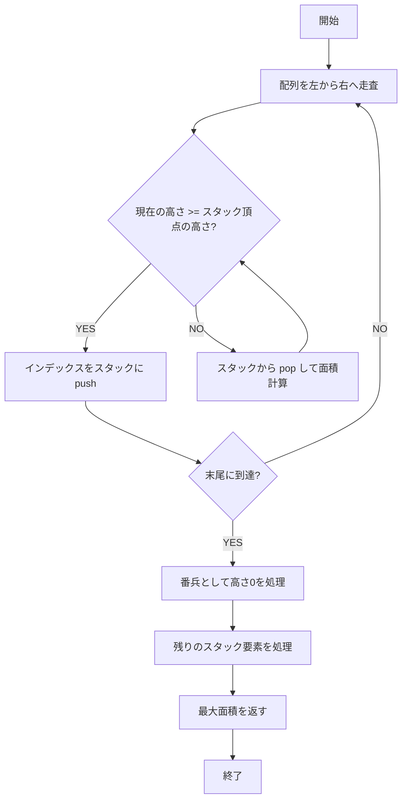

# Largest Rectangle in Histogram - Python 実装解説

本資料は、LeetCode 問題 **「Largest Rectangle in Histogram」** を Python (CPython 3.11+) で実装した際のアルゴリズム解析と実装詳細を README.md 用にまとめたものです。
競技プログラミング的な観点と業務開発的な観点を両立した設計を目指しています。

---

## 問題概要

- **入力**: 各棒の高さを格納した整数配列 `heights`
- **出力**: 棒を連続して選んだ時に作れる最大長方形の面積

---

## アルゴリズム概要

採用アルゴリズムは **単調増加スタック法** です。
配列を一度スキャンするだけで最大長方形を求めることができ、計算量は **O(n)**、空間計算量は **O(n)** です。

### コアアイデア

1. **スタックにインデックスを格納**
   - スタックは「高さが単調増加するインデックス」を保持
2. **現在の棒がスタック頂点より低ければ面積確定**
   - 高さが崩れた地点でスタックから取り出し、面積を計算
3. **番兵を利用**
   - 最後に高さ `0` 相当を追加し、残った要素を一括処理

---

## 処理フロー図

以下は **スタック操作** の流れを示したシーケンスです。



---

## 面積計算イメージ

スタックからインデックスを取り出した時、
その高さを「最小高さ」とする長方形の最大幅を算出します。

```text
height = heights[top]
left   = stack[-1] if stack else -1
right  = current index i
width  = right - left - 1
area   = height * width
```

---

## 動作例

入力: `heights = [2,1,5,6,2,3]`

1. `2` → push
2. `1` < 2 → pop(2), 面積=2
3. `1` push
4. `5` push
5. `6` push
6. `2` < 6 → pop(6), 面積=6
7. `2` < 5 → pop(5), 面積=10 ← **最大**
8. `2` push
9. `3` push
10. 番兵 `0` → 残りを処理

最終結果: **最大面積 = 10**

---

## Python 実装例

```python
from typing import List


class Solution:
    def largestRectangleArea(self, heights: List[int]) -> int:
        n: int = len(heights)
        stack: List[int] = []
        max_area: int = 0

        for i in range(n + 1):
            curr = 0 if i == n else heights[i]
            while stack and curr < heights[stack[-1]]:
                h = heights[stack.pop()]
                left = stack[-1] if stack else -1
                width = i - left - 1
                max_area = max(max_area, h * width)
            stack.append(i)

        return max_area
```

---

## 設計上の考慮点

### 競技プログラミング向け

- 入力制約を前提に高速化優先
- O(n) アルゴリズム採用
- ローカル変数での参照最適化

### 業務開発向け

- 型注釈を厳密に（`List[int]`）
- エラーハンドリングを追加可能
- 可読性を意識した変数名・コメント

---

## まとめ

- **アルゴリズム選択**: 単調増加スタック法 (O(n))
- **Python 最適化**: `list.append/pop` の高速性を活用
- **実務的観点**: 可読性・型安全性・エラーハンドリングを補強可能

この実装は **競技プログラミングでも業務開発でも通用する堅牢な解法** です。
