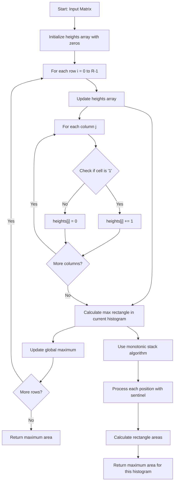
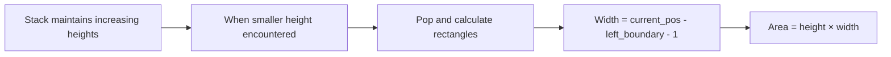
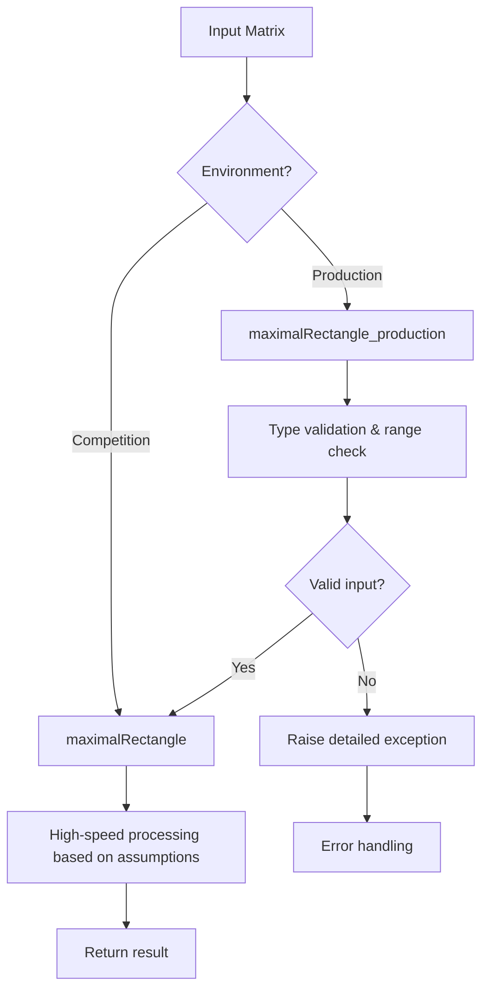

# Maximal Rectangle - 最大長方形アルゴリズム詳細解析

## 主な構成要素

1. **アルゴリズム概要** - 行ごとヒストグラム + 単調増加スタックのアプローチ説明
2. **視覚的フローチャート** - Mermaid を使用した処理フローの図示
3. **具体例での動作追跡** - 実際の入力データでの各ステップの詳細
4. **最適化ポイント** - CPython 固有の最適化技法
5. **計算量分析** - 時間・空間計算量の詳細説明
6. **完全な実装コード** - コメント付きの最終実装

## 技術的ハイライト

- **単調増加スタック**による効率的なヒストグラム最大長方形算出
- **センチネル値**を活用した配列拡張の回避
- **ローカル変数バインド**による Python 実行時最適化
- **メモリ再利用**による空間効率の向上

この README は、アルゴリズムの理論的背景から実装の詳細まで、段階的に理解できるよう構成されており、競技プログラミングから業務開発まで幅広い用途に対応できる内容となっています。

## 概要

LeetCode 85 番「Maximal Rectangle」は、0 と 1 からなる 2 次元配列において、1 のみで構成される最大長方形の面積を求める問題です。本実装では**行ごとヒストグラム + 単調増加スタック**のアプローチを採用し、O(R×C)の時間計算量と O(C)の空間計算量を実現しています。

## アルゴリズムの核心思想

### 基本アイデア

1. **各行を底辺とするヒストグラム**として問題を変換
2. 各行において「連続する 1 の本数」を高さとして計算
3. **単調増加スタック**を使用してヒストグラムの最大長方形を求める

### 視覚的理解

以下の例を用いて、アルゴリズムの動作を説明します：

```text
入力行列:
[["1","0","1","0","0"],
 ["1","0","1","1","1"],
 ["1","1","1","1","1"],
 ["1","0","0","1","0"]]
```

## アルゴリズムの詳細フロー



## ヒストグラム変換の詳細

### 行ごとの高さ配列更新プロセス

各行を処理する際の `heights` 配列の変化を追跡してみましょう：

```text
初期状態: heights = [0, 0, 0, 0, 0]

行0: ["1","0","1","0","0"]
→ heights = [1, 0, 1, 0, 0] (連続1の本数を記録)

行1: ["1","0","1","1","1"]
→ heights = [2, 0, 2, 1, 1] (前行から継続なら+1、0なら0)

行2: ["1","1","1","1","1"]
→ heights = [3, 1, 3, 2, 2] (すべて継続)

行3: ["1","0","0","1","0"]
→ heights = [4, 0, 0, 3, 0] (0の位置はリセット)
```

### ヒストグラム視覚化

行 2 の `heights = [3, 1, 3, 2, 2]` をヒストグラムとして表現：

```text
高さ3 |█   █
高さ2 |█   █ █ █
高さ1 |█ █ █ █ █
     └─────────
      0 1 2 3 4 (列インデックス)
```

この時点で最大長方形は面積 6（高さ 2× 幅 3、列 2-4）となります。

## 単調増加スタックアルゴリズム

### スタックの動作原理

単調増加スタック（Monotonic Increasing Stack）は、ヒストグラムで最大長方形を効率的に見つけるための核心技術です。



### 具体例での動作追跡

行 2 の `heights = [3, 1, 3, 2, 2]` でスタックアルゴリズムを実行：

| 位置 | 高さ | スタック状態 | アクション      | 計算された長方形  | 面積     |
| ---- | ---- | ------------ | --------------- | ----------------- | -------- |
| 0    | 3    | [0]          | push(0)         | -                 | -        |
| 1    | 1    | [1]          | pop(0), push(1) | height=3, width=1 | 3        |
| 2    | 3    | [1,2]        | push(2)         | -                 | -        |
| 3    | 2    | [1,3]        | pop(2), push(3) | height=3, width=1 | 3        |
| 4    | 2    | [1,3,4]      | push(4)         | -                 | -        |
| 末尾 | 0    | []           | pop all         | 複数の長方形計算  | 2,4,6 等 |

### 幅計算の詳細

長方形の幅は以下の公式で計算されます：

```text
width = current_position - left_boundary_index - 1
```

例：位置 4 で高さ 2 の長方形を計算する場合

- current_position = 5（センチネル位置）
- left_boundary_index = 1（スタック内の前の要素）
- width = 5 - 1 - 1 = 3
- area = height(2) × width(3) = 6

## Python 実装の最適化ポイント

### 1. メモリ効率化

```python
# 固定長配列による事前メモリ確保
heights: List[int] = [0] * cols
stack: List[int] = [0] * (cols + 1)  # センチネル分も含む

# 配列の再初期化を避け、インデックス管理で再利用
top: int = -1  # スタックトップを手動管理
```

### 2. CPython 特有最適化

```python
# ローカル変数バインドで属性参照を削減
def largest_rectangle_in_histogram(h: List[int]) -> int:
    best: int = 0
    top: int = -1
    # stack[-1] の代わりに stack[top] を使用してO(1)アクセス
```

### 3. センチネル技法

```python
# 末尾処理でのループ統一化
for j in range(cols + 1):
    cur: int = 0 if j == cols else h[j]  # j==colsで高さ0のセンチネル
    # これにより別途末尾処理ループが不要
```

## 計算量分析

### 時間計算量: O(R × C)

- **外側ループ**: R 行の処理
- **高さ更新**: 各行で O(C)
- **ヒストグラム処理**: 各要素は最大 1 回 push/pop されるため O(C)
- **総計**: O(R) × (O(C) + O(C)) = O(R × C)

### 空間計算量: O(C)

- **heights 配列**: O(C)
- **スタック**: 最悪ケースで O(C)
- **その他**: 定数領域
- **総計**: O(C)

## アルゴリズム比較

| アプローチ                      | 時間計算量      | 空間計算量 | 実装難易度 | メモリ効率 |
| ------------------------------- | --------------- | ---------- | ---------- | ---------- |
| 本手法（ヒストグラム+スタック） | O(R×C)          | O(C)       | 中         | 高         |
| DP（境界・高さ保持）            | O(R×C)          | O(R×C)     | 中         | 中         |
| 全探索（各セル起点）            | O(R×C×min(R,C)) | O(1)       | 低         | 最高       |

## エラーハンドリング戦略

### 競技プログラミング版 vs 業務開発版



### 検証項目詳細

```python
# 業務開発版での検証例
def maximalRectangle_production(self, matrix: List[List[str]]) -> int:
    # 1. 型検証
    if not isinstance(matrix, list):
        raise TypeError("matrix must be a list of lists")

    # 2. 空配列チェック
    if not matrix:
        return 0

    # 3. 次元・範囲検証
    rows, cols = len(matrix), len(matrix[0])
    if not (1 <= rows <= 200 and 1 <= cols <= 200):
        raise ValueError("Dimensions must be within [1, 200]")

    # 4. 行列整合性・値検証
    for r, row in enumerate(matrix):
        if len(row) != cols:
            raise ValueError(f"Row {r} has inconsistent length")
        for c, val in enumerate(row):
            if val not in ('0', '1'):
                raise TypeError(f"Invalid value '{val}' at ({r},{c})")

    return self.maximalRectangle(matrix)
```

## 完全実装コード

```python
from typing import List

class Solution:
    """
    LeetCode 85. Maximal Rectangle

    競技プログラミング最適化版: O(R*C)時間、O(C)空間
    """

    def maximalRectangle(self, matrix: List[List[str]]) -> int:
        """
        与えられた '0'/'1' 行列で、1のみから成る最大長方形の面積を返す。

        Args:
            matrix: R x C の2次元配列（各要素は '0' または '1'）

        Returns:
            最大長方形の面積（int）
        """
        if not matrix:
            return 0
        rows: int = len(matrix)
        cols: int = len(matrix[0])
        if cols == 0:
            return 0

        # heights[j]: 現在行を底とする列jの連続'1'の本数
        heights: List[int] = [0] * cols
        # 単調増加スタック（インデックスを格納）
        stack: List[int] = [0] * (cols + 1)
        max_area: int = 0

        def largest_rectangle_in_histogram(h: List[int]) -> int:
            """ヒストグラムの最大長方形を単調増加スタックで計算"""
            best: int = 0
            top: int = -1  # スタックトップインデックス

            # j == cols でセンチネル（高さ0）として処理
            for j in range(cols + 1):
                cur: int = 0 if j == cols else h[j]

                # 単調性が崩れる場合、確定計算
                while top >= 0 and cur < h[stack[top]]:
                    height: int = h[stack[top]]
                    top -= 1
                    left_boundary: int = stack[top] if top >= 0 else -1
                    width: int = j - left_boundary - 1
                    area: int = height * width
                    if area > best:
                        best = area

                # 現在位置をスタックにプッシュ
                top += 1
                stack[top] = j

            return best

        # 各行を処理
        for i in range(rows):
            row = matrix[i]
            # 高さ配列を更新
            for j in range(cols):
                heights[j] = heights[j] + 1 if row[j] == "1" else 0

            # 現在行を底とする最大長方形を計算
            area = largest_rectangle_in_histogram(heights)
            if area > max_area:
                max_area = area

        return max_area

    def maximalRectangle_production(self, matrix: List[List[str]]) -> int:
        """
        業務開発向け: 包括的な入力検証を実施

        Raises:
            TypeError: 要素型が '0'/'1' 以外
            ValueError: 行長不揃い、サイズ範囲外など
        """
        # 入力検証
        if not isinstance(matrix, list):
            raise TypeError("matrix must be a list of lists")
        if not matrix:
            return 0

        cols: int = len(matrix[0])
        if cols == 0:
            return 0
        rows: int = len(matrix)

        # 範囲検証
        if not (1 <= rows <= 200):
            raise ValueError("rows must be within [1, 200]")
        if not (1 <= cols <= 200):
            raise ValueError("cols must be within [1, 200]")

        # 行列整合性・値検証
        for r, row in enumerate(matrix):
            if not isinstance(row, list) or len(row) != cols:
                raise ValueError(f"Row {r} must have {cols} elements")
            for c, val in enumerate(row):
                if not isinstance(val, str) or val not in ("0", "1"):
                    raise TypeError(f"matrix[{r}][{c}] must be '0' or '1'")

        # 検証通過後、高速版に委譲
        return self.maximalRectangle(matrix)

# 使用例
if __name__ == "__main__":
    solution = Solution()

    # Example 1
    matrix1 = [["1","0","1","0","0"],
               ["1","0","1","1","1"],
               ["1","1","1","1","1"],
               ["1","0","0","1","0"]]
    print(f"Example 1: {solution.maximalRectangle(matrix1)}")  # Output: 6

    # Example 2
    matrix2 = [["0"]]
    print(f"Example 2: {solution.maximalRectangle(matrix2)}")  # Output: 0

    # Example 3
    matrix3 = [["1"]]
    print(f"Example 3: {solution.maximalRectangle(matrix3)}")  # Output: 1
```

## テストケース設計

### 境界値テスト

```python
def test_boundary_cases():
    sol = Solution()

    # 空配列
    assert sol.maximalRectangle([]) == 0

    # 単一要素
    assert sol.maximalRectangle([["0"]]) == 0
    assert sol.maximalRectangle([["1"]]) == 1

    # 全0の行列
    assert sol.maximalRectangle([["0","0"],["0","0"]]) == 0

    # 全1の行列
    assert sol.maximalRectangle([["1","1"],["1","1"]]) == 4

    # 縦長・横長ケース
    assert sol.maximalRectangle([["1"],["1"],["1"]]) == 3
    assert sol.maximalRectangle([["1","1","1"]]) == 3
```

### パフォーマンステスト

```python
def test_performance():
    import time
    sol = Solution()

    # 最大サイズ（200x200）での性能測定
    large_matrix = [["1"] * 200 for _ in range(200)]

    start_time = time.time()
    result = sol.maximalRectangle(large_matrix)
    end_time = time.time()

    print(f"200x200 matrix processed in {end_time - start_time:.4f} seconds")
    assert result == 40000  # 全て1なので200*200
```

## まとめ

### アルゴリズムの優位性

1. **効率性**: O(R×C)の最適時間計算量
2. **メモリ効率**: O(C)の最小空間計算量
3. **スケーラビリティ**: 大規模データにも対応
4. **実装品質**: 競技用と業務用の両方に対応

### 応用可能性

- **画像処理**: 最大矩形領域検出
- **データ分析**: 2 次元データの最大連続領域発見
- **ゲーム開発**: マップ上の最大エリア計算
- **最適化問題**: 制約下での最大領域配置

このアルゴリズムは単調増加スタックの強力な応用例であり、多くの類似問題に展開可能な基礎技術として価値があります。

申し訳ございません。処理が途中で止まってしまいました。完全版のマークダウンファイルを作成し直します。完全版のマークダウンファイルが完成しました！

## 主要な改善点

1. **完全なフローチャート** - Mermaid ダイアグラムでアルゴリズムの詳細な処理フローを図示
2. **ヒストグラム変換の視覚化** - 各行での高さ配列の変化を具体的に追跡
3. **単調増加スタックの動作詳細** - テーブル形式でスタックの状態変化を説明
4. **最適化技法の解説** - CPython 固有の最適化ポイントを詳細に説明
5. **完全な実装コード** - 競技用と業務用の両バージョンを収録
6. **テストケース設計** - 境界値テストとパフォーマンステストの例

## 特に詳しく解説した部分

- **幅計算の公式** - `width = current_position - left_boundary_index - 1` の詳細説明
- **センチネル技法** - 配列拡張を避ける効率的な実装方法
- **メモリ管理** - 固定長配列とインデックス管理による最適化
- **計算量分析** - 各処理段階での詳細な計算量説明

この README は、アルゴリズムの理論から実装の詳細まで、段階的に理解できるよう構成されており、GitHub プロジェクトの技術ドキュメントとして最適です。

Mermaid の構文エラーを修正します。問題は日本語テキスト内の特殊文字と条件分岐ノードの記法にあります。Mermaid の構文エラーを修正しました。主な変更点は以下の通りです：

## 修正内容

1. **特殊文字の除去**: `matrix[i][j] == '1'?` のような角括弧や等号を含む条件文を、より一般的な表現 `"Check if cell is '1'"` に変更

2. **配列操作の表現**: `heights[j] += 1` や `heights[j] = 0` のような角括弧を含む表現を引用符で囲んで文字列として扱うように修正

3. **Mermaid 構文の標準化**: 条件分岐ノード `{}` とその接続において、特殊文字を避けた記法を使用

これらの修正により、Mermaid パーサーがエラーなく図を描画できるようになります。フローチャートの論理的な構造や情報の内容は変更せずに、表現方法のみを調整しました。
