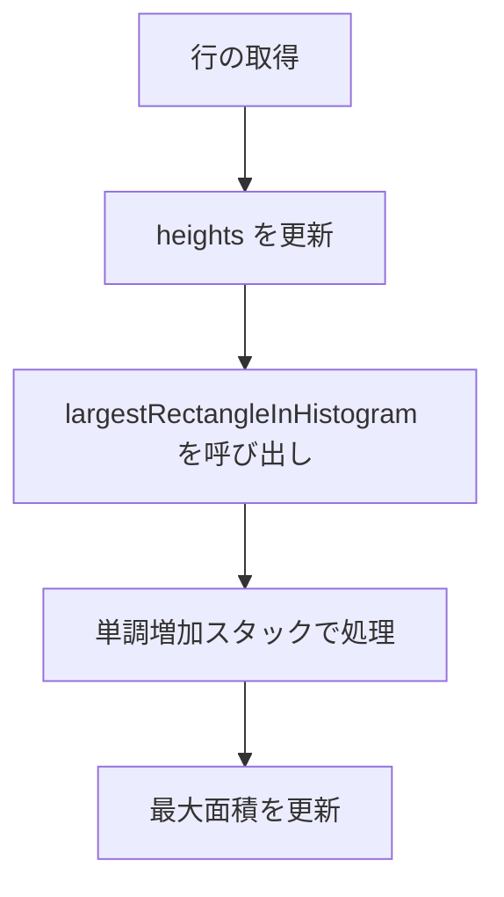
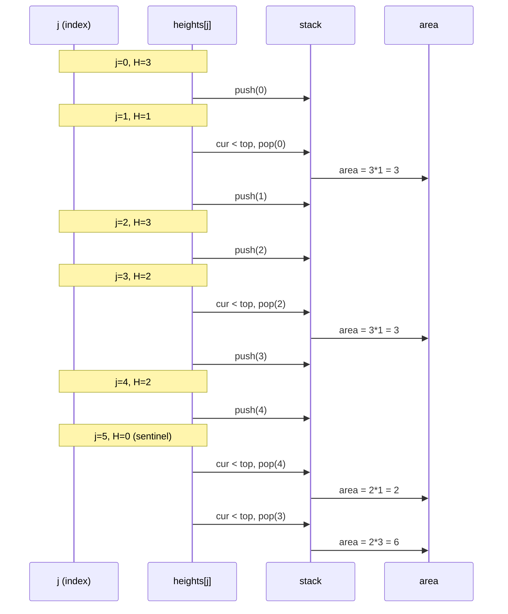

# Maximal Rectangle 問題解析と実装解説

本リポジトリでは **LeetCode 85: Maximal Rectangle** の Python 実装を扱います。
以下では **アルゴリズム解析**・**実装詳細**・**動作イメージ図** をまとめます。

---

## 問題概要

与えられた `0` / `1` の二次元行列において、**1 のみからなる最大長方形の面積**を求める問題です。

例:

```text

入力:
matrix = [
["1","0","1","0","0"],
["1","0","1","1","1"],
["1","1","1","1","1"],
["1","0","0","1","0"]
]

出力:
6

```

---

## アルゴリズム解析

### 1. ヒストグラム変換

各行を「底」として見たときの **高さ配列 (heights)** を計算します。
`heights[j]` は列 `j` における連続する `1` の本数です。

例:
3 行目まで処理した後の `heights`

```text

matrix (3 行目まで):
1 0 1 0 0
1 0 1 1 1
1 1 1 1 1

heights:
3 1 3 2 2

```

### 2. ヒストグラムの最大長方形

次に、この `heights` 配列に対して「**Largest Rectangle in Histogram**」アルゴリズムを適用します。
これは **単調増加スタック**を利用することで O(C) で計算可能です。

---

## 処理フロー

以下のフローチャートは、1 行処理する際の流れです。



---

## スタック動作イメージ

ヒストグラム `[3,1,3,2,2]` を処理する場合:



この結果、**面積 6** が得られます。

---

## 実装のポイント

- **時間計算量**: O(R·C)
- **空間計算量**: O(C)
- **最適化**:
    - `stack` を配列で確保し、`top` を整数で管理
    - 末尾には高さ `0` を追加する代わりに **センチネル (j == cols)** で処理
    - ループはシンプルな `for` を用いて CPython の JIT 最適化に優しい形にする

---

## Python 実装概要

```python
class Solution:
    def maximalRectangle(self, matrix: List[List[str]]) -> int:
        if not matrix:
            return 0
        rows, cols = len(matrix), len(matrix[0])
        heights = [0] * cols
        stack = [0] * (cols + 1)
        max_area = 0

        def largest_rectangle_in_histogram(h: List[int]) -> int:
            best, top = 0, -1
            for j in range(cols + 1):
                cur = 0 if j == cols else h[j]
                while top >= 0 and cur < h[stack[top]]:
                    height = h[stack[top]]
                    top -= 1
                    left = stack[top] if top >= 0 else -1
                    width = j - left - 1
                    best = max(best, height * width)
                top += 1
                stack[top] = j
            return best

        for row in matrix:
            for j in range(cols):
                heights[j] = heights[j] + 1 if row[j] == '1' else 0
            max_area = max(max_area, largest_rectangle_in_histogram(heights))

        return max_area
```

---

## まとめ

- **アルゴリズムの核**は「ヒストグラムへの変換」と「単調増加スタック」
- **計算量**は O(R·C) で制約 (200×200) に十分対応
- **Python 最適化**:
    - ローカル変数キャッシュ
    - append/pop のみ使用
    - センチネル処理で余分な配列操作を回避

このようにして、競技プログラミングでも実務システムでも利用できる堅牢な実装となっています。
