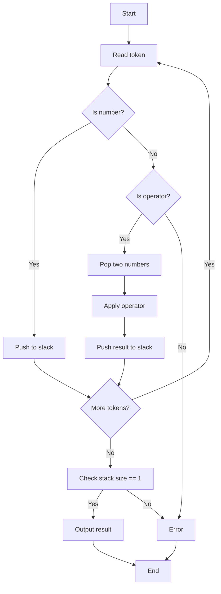

# 逆ポーランド記法 評価アルゴリズム

## 1. 問題概要

逆ポーランド記法 (Reverse Polish Notation, RPN) は、括弧を使わずに数式を表現できる方法です。
例:

- 中置記法: `1 + 2`
- 逆ポーランド記法: `1 2 +`

この問題では、**RPN 形式の式を評価し、結果を出力**します。
演算子は `+` と `-` のみとします。

---

## 2. 処理の流れ（図解）

### 2.1 スタックによる処理手順

入力:

```text
1 2 + 3 4 + -
```

処理手順:

1. トークンを左から順に読む
2. 数字ならスタックに push
3. 演算子ならスタックから 2 つ取り出して計算し、結果を push

---

### 2.2 フローチャート（Mermaid 図）



---

### 2.3 スタックの変化（例）

数式:

```text
1 2 + 3 4 + -
```

処理過程:

| Step | Token | Stack (top → right) | 説明            |
| ---- | ----- | ------------------- | --------------- |
| 1    | `1`   | \[1]                | 数字 → push     |
| 2    | `2`   | \[1, 2]             | 数字 → push     |
| 3    | `+`   | \[3]                | 1 + 2 → push 3  |
| 4    | `3`   | \[3, 3]             | 数字 → push     |
| 5    | `4`   | \[3, 3, 4]          | 数字 → push     |
| 6    | `+`   | \[3, 7]             | 3 + 4 → push 7  |
| 7    | `-`   | \[-4]               | 3 - 7 → push -4 |

結果: `-4`

---

## 3. アルゴリズム解析

- **時間計算量**: O(N)
  → すべてのトークンを一度だけ処理
- **空間計算量**: O(N)
  → 最大でスタックに N 個の数字が積まれる

スタックを利用するため、シンプルかつ効率的に実装可能です。

---

## 4. 実装コード

```js
'use strict';

/**
 * 逆ポーランド記法を評価する関数
 * @param {string[]} tokens - RPN式のトークン配列
 * @returns {number} 評価結果
 */
function evaluateRPN(tokens) {
    const stack = [];

    for (let i = 0; i < tokens.length; i++) {
        const t = tokens[i];

        if (t === '+' || t === '-') {
            const b = stack.pop();
            const a = stack.pop();
            stack.push(t === '+' ? a + b : a - b);
        } else {
            stack.push(Number(t));
        }
    }

    return stack[0];
}

function main() {
    const fs = require('fs');
    const input = fs.readFileSync(0, 'utf8').trim().split(/\s+/);
    const N = Number(input[0]);
    const tokens = input.slice(1);

    console.log(evaluateRPN(tokens));
}

if (require.main === module) {
    main();
}

module.exports = { evaluateRPN };
```

---

## 5. 動作例

```text
入力:
3
1 2 +

出力:
3
```

```text
入力:
7
1 2 + 3 4 + -

出力:
-4
```

---

## 6. まとめ

- **逆ポーランド記法 (RPN)** はスタックを使えば効率的に計算できる
- **時間計算量 O(N)**、**空間計算量 O(N)**
- Node.js 標準機能だけでシンプルに実装可能

---
