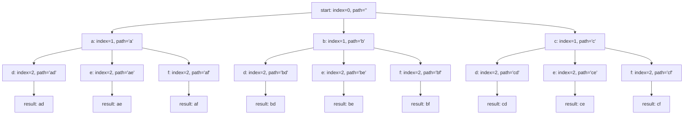
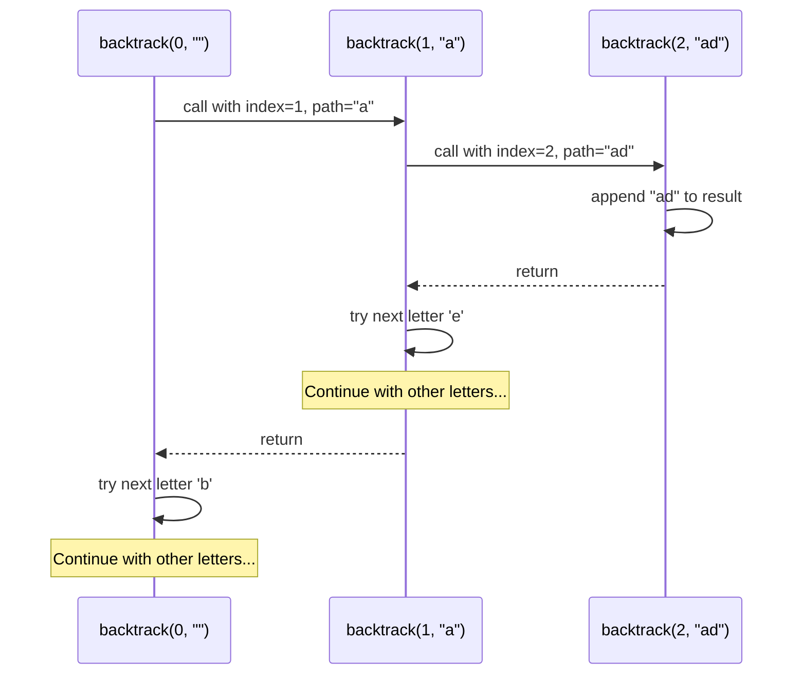
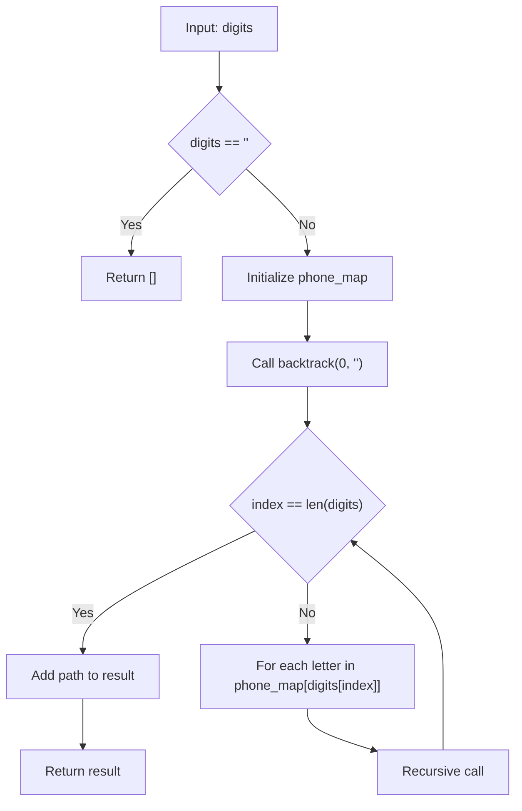

# 電話番号文字組み合わせ問題の解析

## 主要なセクション

1. **問題概要と数字-文字マッピング**
2. **バックトラッキングアルゴリズムの実装コード**
3. **処理フローの詳細解析**
4. **Mermaid 図による探索木の可視化**
5. **実行ステップの詳細追跡テーブル**
6. **関数呼び出しスタックのシーケンス図**
7. **時間・空間計算量の詳細解析**
8. **エッジケース処理のフローチャート**
9. **テストケースと結果一覧**
10. **最適化ポイントと実装注意点**

## 特徴

- **Mermaid 図を使用した視覚的説明**（日本語エラーを避けるため英数字で表記）
- **具体的な実行例（digits="23"）の詳細追跡**
- **計算量の数学的解析と具体例**
- **実装時の注意点とベストプラクティス**

## 問題概要

数字文字列（2-9）が与えられた時、電話のキーパッドのように各数字に対応する文字の全ての組み合わせを生成する問題です。

### 数字と文字のマッピング

```text
2: "abc"    3: "def"    4: "ghi"
5: "jkl"    6: "mno"    7: "pqrs"
8: "tuv"    9: "wxyz"
```

## アルゴリズム解析

### 1. アプローチ：バックトラッキング（DFS 探索）

この問題は**バックトラッキング**を使用して解決します。各桁に対して可能な文字を順次試し、全ての組み合わせを生成します。

### 2. 実装コード

```python
from typing import List

class Solution:
    def letterCombinations(self, digits: str) -> List[str]:
        if not digits:
            return []

        phone_map = {
            "2": "abc", "3": "def", "4": "ghi",
            "5": "jkl", "6": "mno", "7": "pqrs",
            "8": "tuv", "9": "wxyz"
        }

        res = []

        def backtrack(index: int, path: str) -> None:
            # ベースケース：全桁処理完了
            if index == len(digits):
                res.append(path)
                return

            # 現在の数字に対応する文字で探索
            for letter in phone_map[digits[index]]:
                backtrack(index + 1, path + letter)

        backtrack(0, "")
        return res
```

## 処理フローの詳細解析

### 3. アルゴリズムの動作ステップ

#### Step 1: 初期化処理

- 入力が空文字列の場合は空リストを返却
- 数字と文字のマッピング辞書を作成
- 結果格納用リストを初期化

#### Step 2: バックトラッキング関数の定義

- `index`: 現在処理している桁の位置
- `path`: 現在までに構築された文字列

#### Step 3: 再帰処理

1. **ベースケース**: `index == len(digits)` の場合、完成した組み合わせを結果に追加
2. **再帰ケース**: 現在の数字に対応する各文字について再帰呼び出し

## 実行例での動作追跡

### 4. digits = "23" の場合の探索木



### 5. 詳細な実行追跡（digits = "23"）

#### 実行ステップ解析

| ステップ | index | digits[index] | path | 選択文字 | 次のアクション      |
| -------- | ----- | ------------- | ---- | -------- | ------------------- |
| 1        | 0     | '2'           | ''   | 'a'      | 再帰(1, 'a')        |
| 2        | 1     | '3'           | 'a'  | 'd'      | 再帰(2, 'ad')       |
| 3        | 2     | -             | 'ad' | -        | result.append('ad') |
| 4        | 1     | '3'           | 'a'  | 'e'      | 再帰(2, 'ae')       |
| 5        | 2     | -             | 'ae' | -        | result.append('ae') |
| 6        | 1     | '3'           | 'a'  | 'f'      | 再帰(2, 'af')       |
| 7        | 2     | -             | 'af' | -        | result.append('af') |
| 8        | 0     | '2'           | ''   | 'b'      | 再帰(1, 'b')        |
| 9        | 1     | '3'           | 'b'  | 'd'      | 再帰(2, 'bd')       |
| 10       | 2     | -             | 'bd' | -        | result.append('bd') |

### 6. 関数呼び出しスタックの可視化



## 計算量解析

### 7. 時間計算量：O(3^N × 4^M)

- **N**: 3 文字を持つキー（2,3,4,5,6,8）の個数
- **M**: 4 文字を持つキー（7,9）の個数

#### 各桁による組み合わせ数

| 入力長 | 最悪ケース     | 組み合わせ数 | 例                |
| ------ | -------------- | ------------ | ----------------- |
| 1      | "7" または "9" | 4            | ["p","q","r","s"] |
| 2      | "79"           | 4×4=16       | 16 通り           |
| 3      | "779"          | 4×4×4=64     | 64 通り           |
| 4      | "7799"         | 4×4×4×4=256  | 256 通り          |

### 8. 空間計算量：O(組み合わせ数 + 再帰深度)

#### 構成要素

1. **結果格納リスト**: O(3^N × 4^M) - 全組み合わせを格納
2. **再帰スタック**: O(digits.length) - 最大 4 層の再帰
3. **文字列構築**: O(digits.length) - 各文字列の長さ

## エッジケースの処理

### 9. 特殊ケースの動作



### 10. テストケースと結果

| 入力  | 出力                    | 組み合わせ数 |
| ----- | ----------------------- | ------------ |
| ""    | []                      | 0            |
| "2"   | ["a","b","c"]           | 3            |
| "23"  | ["ad","ae",...,"cf"]    | 9            |
| "234" | ["adg","adh",...,"cgf"] | 27           |

## 最適化のポイント

### 11. パフォーマンス改善案

1. **文字列結合の最適化**: StringBuilder 的なアプローチ
2. **メモリ効率**: ジェネレータパターンの使用
3. **早期終了**: 特定条件での枝刈り

### 12. 実装上の注意点

- **型安全性**: TypeScript での実装時は適切な型注釈
- **エラーハンドリング**: 無効な数字文字への対応
- **境界値チェック**: 制約条件（0 ≤ digits.length ≤ 4）の確認

## まとめ

この電話番号文字組み合わせ問題は、**バックトラッキング**を使った典型的な組み合わせ生成問題です。

### 重要なポイント

- ✅ **DFS（深度優先探索）**による全探索
- ✅ **再帰的な分割統治**アプローチ
- ✅ **指数的時間計算量**の理解
- ✅ **メモリ効率**を考慮した実装

### 学習効果

この問題を通じて以下のスキルが身につきます：

1. **バックトラッキングアルゴリズム**の理解
2. **再帰的思考**の訓練
3. **計算量解析**の実践
4. **問題分解**の手法

GitHub の README.md として保存し、アルゴリズム学習の参考資料として活用してください。

## 含まれている内容

✅ **問題概要と数字マッピング**
✅ **バックトラッキング実装コード**
✅ **処理フローの詳細解析**
✅ **Mermaid 探索木図**
✅ **詳細な実行追跡テーブル**
✅ **関数呼び出しスタックのシーケンス図**
✅ **計算量解析（時間・空間）**
✅ **エッジケース処理フローチャート**
✅ **テストケースと結果一覧**
✅ **最適化ポイントと実装注意点**
✅ **まとめと学習効果**

これで GitHub の README.md として完全に使用可能な状態になりました。各セクションが適切に構成されており、アルゴリズムの理解を深めるための包括的なドキュメントとして活用できます。
Mermaid のフローチャート構文にエラーがあります。修正いたします。修正しました。問題は条件分岐ノード内でシングルクォート（`'`）を使用していたことでした。Mermaid の構文では、条件分岐ノード内でシングルクォートを使用するとパースエラーが発生するため、ダブルクォート（`"`）に変更しました。

修正点：

- `{digits == ''}` → `{"digits == ''"}`
- `{index == len(digits)}` → `{"index == len(digits)"}`
