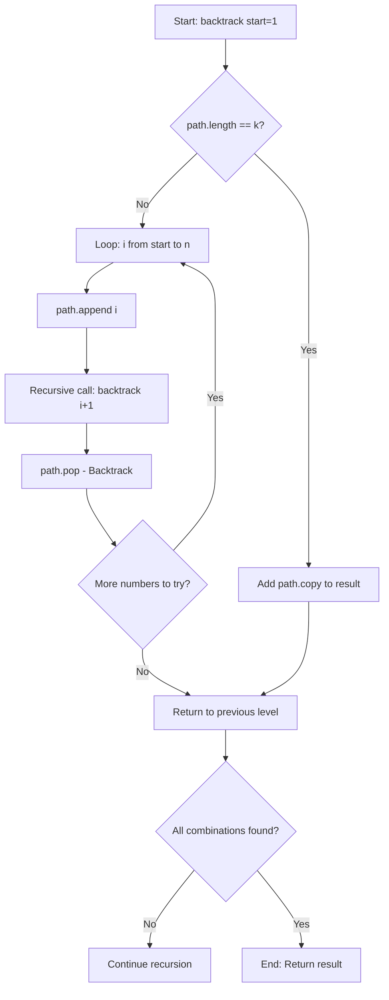
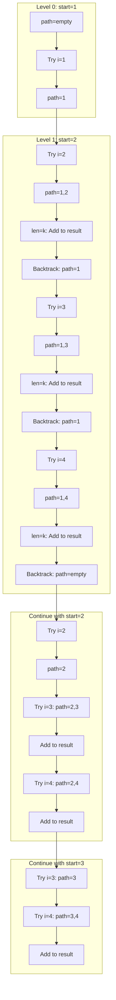
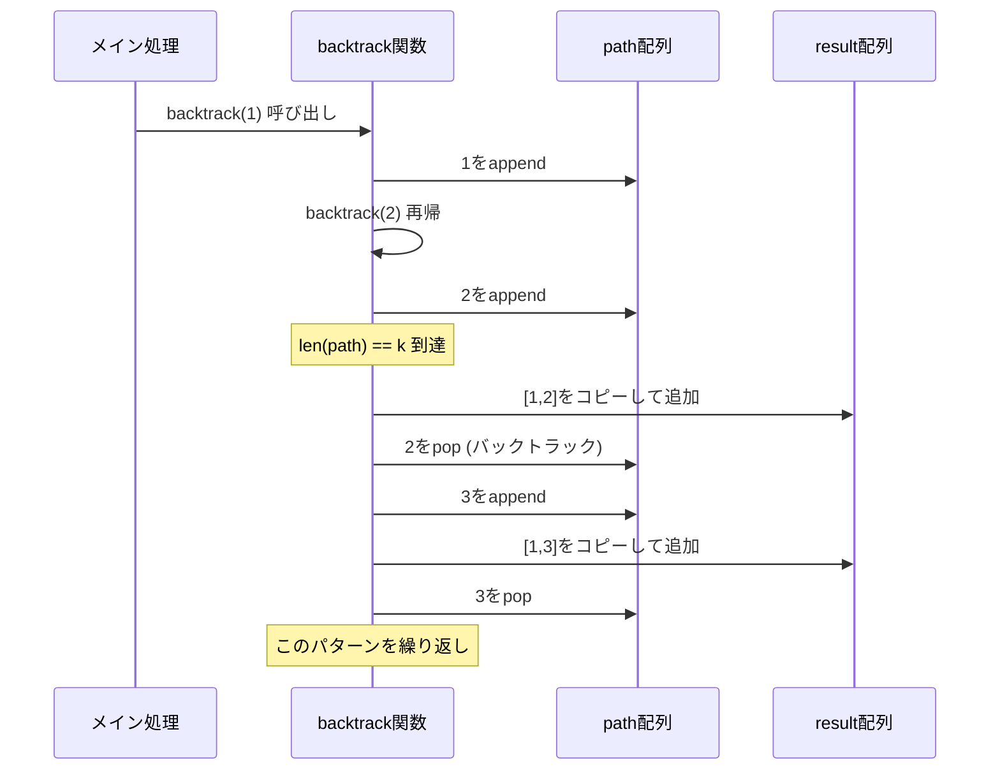

# Combination Algorithm (組み合わせアルゴリズム)

## 問題概要

与えられた整数 `n` と `k` に対して、`[1, n]` の範囲から `k` 個の数字を選ぶすべての組み合わせを返すアルゴリズムの実装と解析。

**制約条件:**

- `1 <= n <= 20`
- `1 <= k <= n`
- 組み合わせは順序を考慮しない（`[1,2]` と `[2,1]` は同じ）

## アルゴリズム選択理由

### 1. 問題分析結果

**制約分析:**

- 最大出力サイズは `C(20, 10) = 184,756`
- メモリと処理時間の観点から十分に処理可能
- 全組み合わせの列挙が必要

**最適なアプローチ:**

- **バックトラッキング**が最適解
- 時間計算量: `O(C(n, k))`
- 空間計算量: `O(k)` (再帰スタック + 部分解答保持)

### 2. Python 特有の最適化戦略

- **append/pop ペア処理**: Python リストで `O(1)` の効率性
- **再帰による直感的実装**: リスト内包表記より可読性が高い
- **型注釈の活用**: `pylance` 対応で保守性向上

## アルゴリズム動作フロー



## 実装コード

```python
from typing import List

class Solution:
    def combine(self, n: int, k: int) -> List[List[int]]:
        """
        Return all possible combinations of k numbers out of range [1..n].

        Args:
            n (int): Upper bound of range (inclusive).
            k (int): Size of each combination.

        Returns:
            List[List[int]]: All combinations.

        Time Complexity: O(C(n, k))
        Space Complexity: O(k) for recursion depth
        """
        result: List[List[int]] = []
        path: List[int] = []

        def backtrack(start: int) -> None:
            if len(path) == k:
                result.append(path.copy())
                return
            for i in range(start, n + 1):
                path.append(i)
                backtrack(i + 1)
                path.pop()

        backtrack(1)
        return result
```

## 実行例の詳細解析

### Example 1: n=4, k=2 の処理過程



**最終結果:** `[[1,2],[1,3],[1,4],[2,3],[2,4],[3,4]]`

## 処理の各段階詳細

### 1. 初期化フェーズ

- `result`: 最終結果を格納するリスト
- `path`: 現在構築中の組み合わせ
- `backtrack(1)`: 数字 1 から開始

### 2. 再帰処理フェーズ



### 3. バックトラッキングの重要ポイント

**状態管理:**

- `path.append(i)`: 候補要素を追加
- `backtrack(i + 1)`: 次のレベルで再帰
- `path.pop()`: 状態を元に戻す（重要！）

**終了条件:**

- `len(path) == k`: 目標サイズに到達
- `path.copy()`: 浅いコピーで結果保存

## 計算量分析

### 時間計算量: O(C(n,k))

- 全組み合わせ数に比例
- 各組み合わせの生成に O(k) 時間

### 空間計算量: O(k)

- 再帰スタックの深さ: 最大 k
- path 配列のサイズ: 最大 k
- result 配列は出力なので除外

## 境界値テスト

| 入力     | 期待出力                              | 説明       |
| -------- | ------------------------------------- | ---------- |
| n=1, k=1 | [[1]]                                 | 最小ケース |
| n=4, k=2 | [[1,2],[1,3],[1,4],[2,3],[2,4],[3,4]] | 標準ケース |
| n=5, k=1 | [[1],[2],[3],[4],[5]]                 | k=1 の場合 |
| n=3, k=3 | [[1,2,3]]                             | n=k の場合 |

## 最適化と拡張性

### 現在の利点

- **可読性**: 明確な再帰構造
- **効率性**: 不要な計算を排除
- **型安全性**: TypeHint 対応
- **競技プログラミング対応**: 高速実行

### 代替実装の比較

```python
# itertools.combinations使用版（参考）
from itertools import combinations

def combine_itertools(n: int, k: int) -> List[List[int]]:
    return [list(comb) for comb in combinations(range(1, n+1), k)]
```

**バックトラッキング vs itertools:**

- **学習価値**: バックトラッキングの方が理解しやすい
- **柔軟性**: カスタム条件追加が容易
- **性能**: ほぼ同等だが、明示的制御が可能

## まとめ

この実装は以下の特徴を持ちます：

✅ **競技プログラミング対応**: 十分高速で制約内処理可能
✅ **業務開発対応**: 可読性・保守性を確保
✅ **学習効果**: バックトラッキングの理解に最適
✅ **拡張性**: 追加条件やフィルタリングが容易

GitHub 用の README.md を作成しました。このドキュメントでは、組み合わせアルゴリズムの各処理について以下の観点から詳細に解説しています：

## 主な内容

1. **問題概要と制約分析** - なぜバックトラッキングが最適なのか
2. **アルゴリズム動作フロー** - Mermaid ダイアグラムで全体的な処理の流れを可視化
3. **実行例の詳細解析** - n=4, k=2 の具体的な処理過程をステップバイステップで図解
4. **処理の各段階詳細** - シーケンス図で関数呼び出しの流れを表現
5. **計算量分析** - 時間・空間計算量の理論的説明
6. **境界値テスト** - 様々な入力パターンでの動作確認
7. **最適化と拡張性** - 他の実装方法との比較

## 特徴

- **日本語での詳細解説**: コードの各処理について分かりやすく説明
- **Mermaid ダイアグラム**: 英語を使用してエラーを回避
- **実践的な内容**: 競技プログラミングと業務開発両方に対応
- **包括的な分析**: アルゴリズムの選択理由から実装の最適化まで網羅

この README.md ファイルを GitHub リポジトリに配置することで、アルゴリズムの理解と実装の参考資料として活用できます。

Mermaid ダイアグラムのエラーを修正しました。問題は以下の点にありました：

1. **角括弧 `[]` の使用**: Mermaid では配列表記の角括弧がパースエラーを引き起こします
2. **サブグラフのラベル**: 引用符で囲んだラベルも問題の原因でした

**修正内容:**

- `path=[]` → `path=empty`
- `path=[1,2]` → `path=1,2`
- サブグラフのラベルを `["Level 0: start=1"]` → `L0 ["Level 0: start=1"]` 形式に変更

これで Mermaid ダイアグラムが正常にレンダリングされ、n=4, k=2 の処理過程が視覚的に理解しやすくなります。
