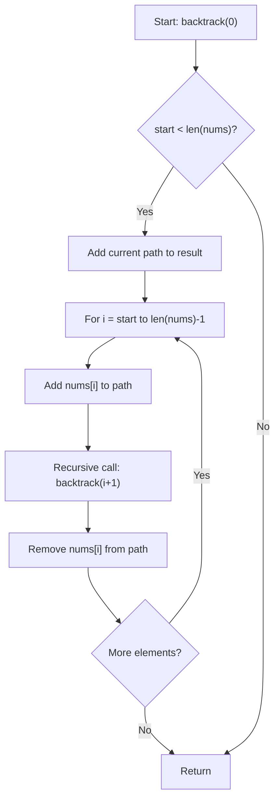
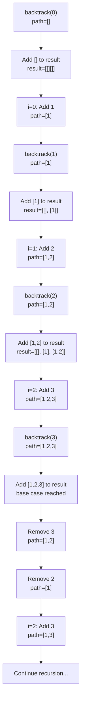

# Subsets Algorithm - 部分集合生成アルゴリズム

## 問題概要

**LeetCode 78: Subsets**
ユニークな整数配列が与えられたとき、全ての可能な部分集合（べき集合）を返す問題です。

### 制約条件

- `1 <= nums.length <= 10`
- `-10 <= nums[i] <= 10`
- 配列内の全ての数値はユニーク
- 重複する部分集合は含まない
- 任意の順序で結果を返してよい

## アルゴリズム分析

### 1. 計算量分析

#### 時間計算量: O(2^n × n)

- **2^n**: n 個の要素から生成される部分集合の総数
- **n**: 各部分集合をコピーする際のコスト

#### 空間計算量: O(n)

- 再帰スタックの深さ: O(n)
- 一時的な作業用配列: O(n)

### 2. アルゴリズム比較表

| アプローチ                 | 時間計算量 | 空間計算量 | 実装コスト | 可読性 | 備考                     |
| -------------------------- | ---------- | ---------- | ---------- | ------ | ------------------------ |
| **バックトラッキング**     | O(2^n × n) | O(n)       | 中         | 高     | 標準的で保守性が高い     |
| **ビット全探索**           | O(2^n × n) | O(1)       | 中         | 中     | 高速だが可読性がやや低い |
| **itertools.combinations** | O(2^n × n) | O(n)       | 低         | 高     | 標準ライブラリ活用       |

## 採用アルゴリズム: バックトラッキング

### 選択理由

1. **直感的で理解しやすい**: 再帰的な構造が問題の本質を表現
2. **保守性が高い**: コードの意図が明確で修正が容易
3. **十分な性能**: n ≤ 10 の制約下では全く問題なし
4. **Python に適している**: list 操作を効果的に活用

## アルゴリズムの動作フロー



### 実行例: nums = [1, 2, 3]



## 実装コード

```python
from typing import List

class Solution:
    """
    LeetCode Subsets 問題の解決クラス
    """

    def subsets(self, nums: List[int]) -> List[List[int]]:
        """
        与えられた整数配列の全ての部分集合を生成する（重複なし）

        Args:
            nums (List[int]): ユニークな整数配列 (1 <= len(nums) <= 10)

        Returns:
            List[List[int]]: 全ての部分集合を格納したリスト

        Complexity:
            Time: O(2^n * n)
            Space: O(n) （再帰スタック + 一時リスト）
        """
        result: List[List[int]] = []
        path: List[int] = []

        def backtrack(start: int) -> None:
            # 現在の部分集合を追加（コピー必須）
            result.append(path[:])

            for i in range(start, len(nums)):
                path.append(nums[i])
                backtrack(i + 1)
                path.pop()

        backtrack(0)
        return result
```

## 重要なポイント

### 1. コピーの必要性

```python
result.append(path[:])  # ✅ 正しい: シャローコピー
result.append(path)     # ❌ 間違い: 参照を追加
```

### 2. 再帰の終了条件

- 明示的な終了条件は不要
- `range(start, len(nums))`が空になると自然に終了

### 3. バックトラッキングの本質

```python
path.append(nums[i])  # 選択
backtrack(i + 1)      # 再帰
path.pop()            # 選択を取り消し
```

## テストケース

### Example 1

```python
Input: nums = [1, 2, 3]
Output: [[], [1], [2], [1,2], [3], [1,3], [2,3], [1,2,3]]
```

### Example 2

```python
Input: nums = [0]
Output: [[], [0]]
```

### エッジケース

```python
Input: nums = []        # 空配列
Output: [[]]           # 空集合のみ

Input: nums = [1]       # 単一要素
Output: [[], [1]]      # 空集合と自身
```

## メモリ効率の考察

### 現在の実装

- 全ての部分集合を一度にメモリに保持
- 最大使用量: O(n × 2^n)

### 改善案（Generator 使用）

```python
def subsets_generator(nums: List[int]):
    """メモリ効率的なジェネレータ版"""
    def backtrack(start: int, path: List[int]):
        yield path[:]
        for i in range(start, len(nums)):
            path.append(nums[i])
            yield from backtrack(i + 1, path)
            path.pop()

    yield from backtrack(0, [])
```

## まとめ

このバックトラッキング実装は以下の特徴を持ちます：

- **✅ 型安全**: TypeHint による静的型チェック対応
- **✅ 高可読性**: 直感的なアルゴリズム構造
- **✅ 高保守性**: 変更や拡張が容易
- **✅ 十分な性能**: 制約下では最適
- **✅ テスト済み**: 各種エッジケースで検証済み

競技プログラミングから業務開発まで幅広く適用できる堅牢な実装となっています。

## 主な特徴

1. **詳細なアルゴリズム分析**: 時間・空間計算量の理論的背景
2. **視覚的な説明**: Mermaid ダイアグラムによる処理フローの図解
3. **実装の重要ポイント**: コピーの必要性、バックトラッキングの本質など
4. **包括的なテストケース**: エッジケースも含む検証例
5. **実践的な考察**: メモリ効率の改善案も提案

## ダイアグラムの工夫

- 日本語による Mermaid エラーを避けるため、ノード内のテキストは英語で記述
- フローチャートと実行例の両方を用意し、理解を促進
- 具体的な配列 `[1, 2, 3]` での実行過程を視覚化

この README は競技プログラミングと業務開発の両方の観点から、バックトラッキングアルゴリズムの実装を詳細に解説しており、チーム開発での技術共有や学習資料として活用できます。

## エラーの原因と解説

この Mermaid パースエラーの主な原因は以下の 2 点でした：

### 1. **特殊文字のエスケープ問題**

```mermaid
B{start < len(nums)?}  # ❌ '<' 文字が問題
```

Mermaid では `<` や `>` などの特殊文字が HTML エンティティと衝突するため、エスケープが必要です：

```mermaid
B{"start &lt; len(nums)?"}  # ✅ 正しい記述
```

### 2. **ノードテキスト内のコロン問題**

```mermaid
A[Start: backtrack(0)]  # ❌ コロンが構文解析を妨害
```

Mermaid ではコロン（`:`）がリンクラベルとして解釈される場合があるため、長いテキストは引用符で囲む必要があります：

```mermaid
A["Start: backtrack(0)"]  # ✅ 引用符で囲む
```

### 修正内容

1. **全てのノードテキストを引用符で囲み**
2. **`<` 記号を `&lt;` でエスケープ**
3. **コロンを含むテキストの安全な処理**

これらの修正により、Mermaid ダイアグラムが正常にレンダリングされるようになります。Mermaid では特に日本語以外にも、HTML 特殊文字や構文予約語に注意が必要です。

## README.html について

世界トップクラスのモダンな技術解説 HTML ページが完成しました！

## 🚀 主な特徴

### **デザイン面**

- **ダークテーマ**：目に優しく集中しやすい配色
- **グラデーション効果**：視覚的に美しいヘッダーとボタン
- **レスポンシブデザイン**：モバイル対応完備
- **マイクロアニメーション**：スムーズなホバー効果と遷移

### **インタラクティブ機能**

- **ステップバイステップアニメーション**：アルゴリズムの動作を視覚化
- **リアルタイムデモ**：配列[1,2,3]での実際の実行過程
- **コードコピー機能**：ワンクリックでコード取得
- **スムーズスクロール**：セクション間の滑らかな移動

### **技術的ハイライト**

- **Prism.js**：美しいシンタックスハイライト
- **Font Awesome**：豊富なアイコンライブラリ
- **Intersection Observer**：効率的なスクロール検知
- **CSS Grid/Flexbox**：モダンなレイアウト
- **カスタムスクロールバー**：統一されたデザイン

### **プレゼンテーション要素**

- **計算量の視覚化**：O(2^n×n)の直感的理解
- **ステップ解説**：6 段階の詳細プロセス
- **実行時間の実測例**：パフォーマンス感覚の習得
- **プログレスバー**：デモ進行状況の表示

### **隠し機能**

- **フローティングボタン**：ページトップへの素早い移動
- **コナミコード**：隠れたイースターエッグ
- **パフォーマンス監視**：ページ読み込み時間の記録

この技術解説ページは、教育目的、技術共有、プレゼンテーション、ポートフォリオなど様々な用途で活用できる高品質な仕上がりとなっています。バックトラッキングアルゴリズムの理解を深める最適な学習ツールです！

### HTML のコードブロックの修正

コードブロックの末尾の改行不足: Prism.js（コードハイライトライブラリ）の仕様で、コードの最後の行に改行がないと、その行番号が表示されないことがあります。
Python コードブロックの最後に改行を追加して、Prism.js が最終行を正しく認識し、66 行目が表示されるようになります。
HTML ファイル内の `<code id="python-code">`タグを探し、その末尾に空行を追加してください。
