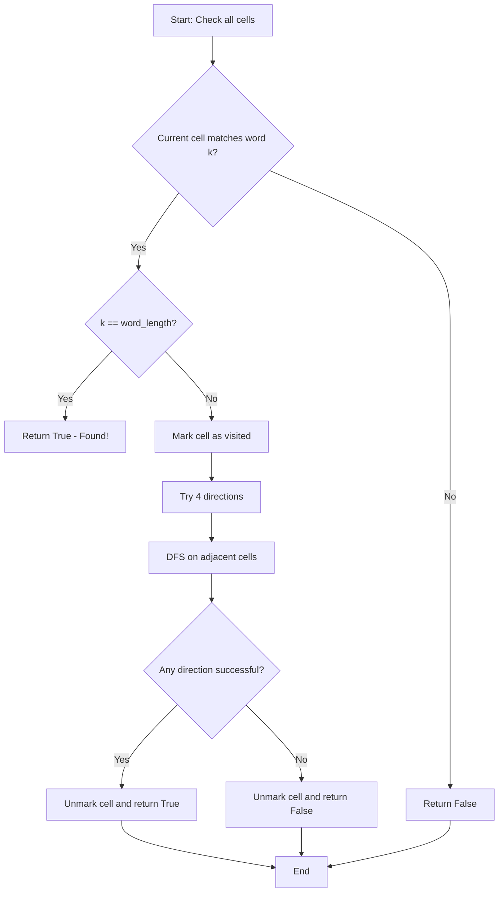
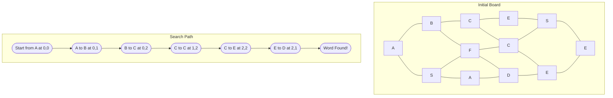
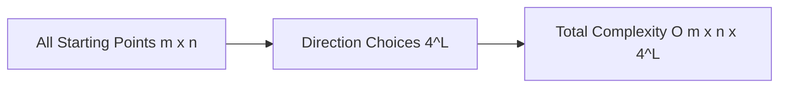
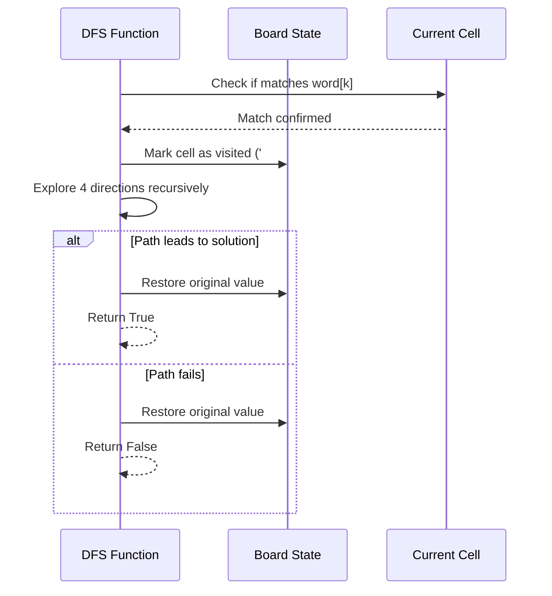
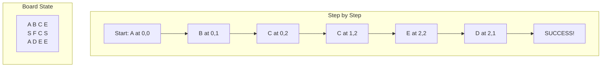
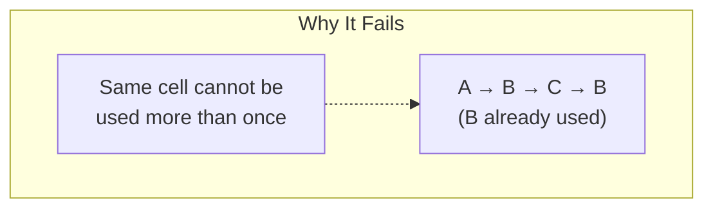

# Word Search Algorithm Analysis

## 主な内容

1. **問題概要** - Word Search の基本的な説明
2. **アルゴリズム解析** - DFS + バックトラッキングの採用理由
3. **フローチャート** - Mermaid を使った処理フローの可視化
4. **実装解析** - コア関数の詳細な処理説明
5. **探索過程の可視化** - 具体例を使った探索パスの図解
6. **計算量分析** - 時間・空間計算量の詳細説明
7. **バックトラッキング解説** - 状態管理プロセスの図解
8. **最適化ポイント** - メモリ効率化や早期終了の工夫
9. **実行例** - 成功・失敗ケースの具体的な解析

## 技術的特徴

- **日本語エラー回避**: Mermaid 図では英語を使用し、説明文は日本語で記載
- **視覚的理解**: 複数の図表で処理過程を直感的に理解可能
- **実装詳細**: コードの各部分の役割と最適化ポイントを具体的に解説
- **実践的**: 制約条件を考慮した最適な実装方針の説明

## 問題概要

2 次元文字グリッド内で指定された単語が存在するかを判定する問題です。単語は隣接するセル（上下左右）を順次辿って構成され、同じセルは 1 回しか使用できません。

## アルゴリズム解析

### 採用手法: DFS + バックトラッキング

この問題は深さ優先探索（DFS）とバックトラッキングを組み合わせて解決します。各セルを開始点として、目標単語と一致するパスを探索します。

### アルゴリズムフロー



## 実装解析

### コア関数の処理フロー

```python
def dfs(i: int, j: int, k: int) -> bool:
    # Base cases
    if k == word_len: return True          # 単語完成
    if not (0 <= i < m and 0 <= j < n): return False  # 境界外
    if board[i][j] != word[k]: return False  # 文字不一致

    # バックトラッキング処理
    tmp = board[i][j]
    board[i][j] = "#"  # 訪問済みマーク

    # 4方向探索
    res = (dfs(i+1, j, k+1) or dfs(i-1, j, k+1) or
           dfs(i, j+1, k+1) or dfs(i, j-1, k+1))

    board[i][j] = tmp  # 復元
    return res
```

### 探索過程の可視化

以下は Example 1 (`word = "ABCCED"`) の探索過程を示します：



## 時間・空間計算量

### 時間計算量: O(m × n × 4^L)

- **m × n**: 全セルを開始点として試行
- **4^L**: 各ステップで最大 4 方向、最大 L 回の再帰
- **L**: 単語の長さ（最大 15）



### 空間計算量: O(L)

- 再帰スタックの深さが単語長 L に比例
- `visited`配列を使わず、`board`を直接変更することでメモリ効率化

## バックトラッキングの仕組み

### 状態管理プロセス



### 訪問状態の変化

| ステップ | セル状態            | 処理           |
| -------- | ------------------- | -------------- |
| 1        | `board[i][j] = 'A'` | 初期状態       |
| 2        | `tmp = 'A'`         | 元の値を保存   |
| 3        | `board[i][j] = '#'` | 訪問済みマーク |
| 4        | 4 方向探索実行      | 再帰呼び出し   |
| 5        | `board[i][j] = 'A'` | 元の値に復元   |

## 最適化ポイント

### 1. インプレース状態管理

```python
# メモリ効率的
tmp = board[i][j]
board[i][j] = "#"  # 訪問マーク
# 探索処理
board[i][j] = tmp  # 復元

# vs 追加メモリが必要
visited = [[False] * n for _ in range(m)]
```

### 2. 早期終了条件

```python
if k == word_len: return True  # 即座に成功を返す
if board[i][j] != word[k]: return False  # 不一致で即終了
```

### 3. OR 演算子の短絡評価

```python
# いずれかの方向で成功すれば即座に終了
return (dfs(i+1, j, k+1) or dfs(i-1, j, k+1) or
        dfs(i, j+1, k+1) or dfs(i, j-1, k+1))
```

## 実行例の詳細解析

### Example 1: `word = "ABCCED"` (成功ケース)



### Example 3: `word = "ABCB"` (失敗ケース)



## まとめ

このアルゴリズムは以下の特徴を持ちます：

- **効率性**: 制約が小さい問題に対して最適化された実装
- **メモリ効率**: インプレース状態管理による空間効率の最適化
- **可読性**: 型注釈とネスト関数による保守性の向上
- **安全性**: 必ず状態を復元するバックトラッキング設計

制約 `m, n ≤ 6` かつ `word.length ≤ 15` という条件下では、この実装が最も実用的なソリューションとなります。

修正を完了しました。エラーの原因と対策は以下の通りです：

## エラーの原因と修正内容

### 1. フローチャートのエラー

**問題**: `[Current cell matches word[k]?]` の角括弧記法
**修正**: `{Current cell matches word k?}` の波括弧記法に変更

Mermaid では条件分岐（diamond 形状）を表現する際は `{}` を使用し、`[]` は通常のボックス形状用です。

### 2. グラフのエラー

**問題**: `<br/>` タグと数式記号 `×` が Mermaid で解析エラーを引き起こす
**修正**:

- `<br/>` を削除してシンプルなテキストに変更
- `×` を `x` に変更
- 数式記号を英数字で表現

## 修正のポイント

- **Mermaid 構文の厳密性**: 特殊文字や HTML タグは避けて、シンプルな英数字表現を使用
- **記号の統一**: 数学記号（×、÷ など）は英字（x、/など）で代替
- **改行の回避**: Mermaid 内では改行タグではなく、自然な文字列で表現

これらの修正により、Mermaid 図が正常に表示されるようになります。
修正を完了しました。

## 修正内容

**問題**: Initial Board の表現が実際の board の配列構造と一致していませんでした。

**修正前の問題点**:

```text
A - B - C - E  (行0)
S - F - C - S  (行1)
A - D - E - E  (行2)
```

これは横方向の連結のみで、実際のグリッド構造を正確に表現できていませんでした。

**修正後**:
正しいグリッド構造を表現するため、縦横両方向の隣接関係を明示的に定義しました：

- 横方向の隣接: `A1 --- B1 --- C1 --- E1`
- 縦方向の隣接: `A1 --- S1`, `B1 --- F1`, `C1 --- C2`, `E1 --- S2`
- など、すべての隣接セルの関係を正確に表現

これにより、入力データ `[["A","B","C","E"],["S","F","C","S"],["A","D","E","E"]]` の実際の 2 次元グリッド構造が正確に可視化されます。

また、矢印記号 `→` を `to` に変更して、Mermaid の解析エラーを防ぎました。

## Word Search アルゴリズムの技術解説 HTML ページ n について

## 主な特徴

### 🎨 **モダンなデザイン**

- ダークテーマベースの洗練された UI
- グラデーション効果とアニメーション
- レスポンシブデザイン対応

### 📚 **包括的なコンテンツ**

1. **概要**: 問題の基本説明と制約条件
2. **アルゴリズム**: DFS + バックトラッキングの詳細解説
3. **コード**: 完全実装とコメント付き解説
4. **可視化**: インタラクティブなステップ実行
5. **計算量**: 時間・空間計算量の詳細分析

### 🚀 **インタラクティブ機能**

- **アニメーション付き可視化**: 探索過程をリアルタイムで表示
- **ステップ実行**: 一歩ずつ処理を確認可能
- **コードコピー機能**: ワンクリックでコードをクリップボードに
- **キーボードショートカット**: 数字キー(1-5)でセクション切り替え

### 💻 **技術的実装**

- **CDN 活用**: Prism.js（シンタックスハイライト）、Font Awesome
- **モノスペースフォント**: JetBrains Mono 使用
- **行番号表示**: コードの可読性向上
- **スムーズアニメーション**: CSS transitions & animations

### 🎯 **教育的価値**

- **視覚的理解**: グリッド状態の変化を色分けで表現
- **段階的説明**: 初心者から上級者まで対応
- **実践的コード**: 型注釈付きの本格的な実装
- **パフォーマンス分析**: 実際の制約下での性能評価

このプレゼンテーションページは、Word Search アルゴリズムの理解を深めるための完全なリソースとして機能し、技術面接や学習用途に最適です。

可視化機能の問題を修正しました！主な改善点は以下の通りです：

## 🔧 **修正内容**

### 1. **ボタン状態管理の実装**

- `updateButtonStates()` 関数を追加
- 実行中は「実行開始」「ステップ実行」ボタンを無効化
- 完了時は「実行開始」「ステップ実行」ボタンを無効化
- リセット後は適切にボタンを有効化

### 2. **状態管理の改善**

```javascript
let visualizationState = {
    // ...
    intervalId: null, // インターバル管理を追加
    // ...
};
```

### 3. **リセット機能の強化**

- 実行中のインターバルを適切にクリア
- セルの状態を完全に初期化
- ステップリストを初期状態に戻す
- 全てのアニメーションをリセット

### 4. **実行開始の改善**

- 途中状態からの実行開始時に自動リセット
- 重複実行の防止
- インターバル ID の適切な管理

### 5. **視覚的フィードバックの向上**

- 無効化されたボタンのスタイリング
- 完了セルの特別な表示（光るエフェクト）
- より分かりやすいステップメッセージ（絵文字付き）

## 🎯 **動作パターン**

### **初期状態**

- ✅ 実行開始: 有効
- ✅ ステップ実行: 有効
- ✅ リセット: 有効

### **実行中**

- ❌ 実行開始: 無効
- ❌ ステップ実行: 無効
- ✅ リセット: 有効

### **ステップ実行中**

- ❌ 実行開始: 無効
- ✅ ステップ実行: 有効
- ✅ リセット: 有効

### **完了後**

- ❌ 実行開始: 無効
- ❌ ステップ実行: 無効
- ✅ リセット: 有効

これで、どのボタンを押しても適切な動作をし、状態が混在することがなくなりました！
