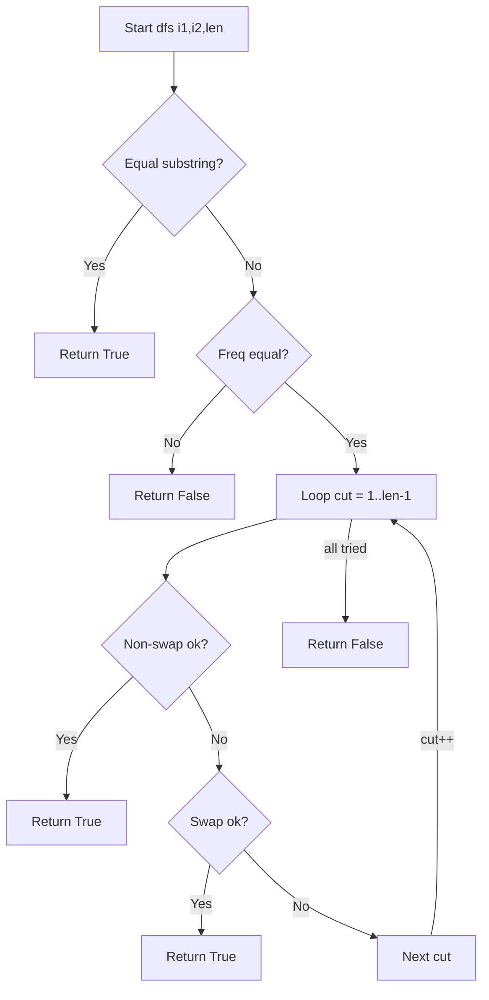
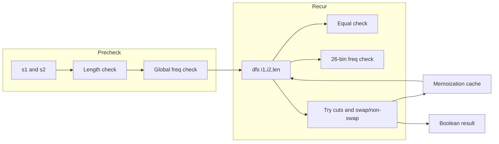

# Scramble String - 再帰 + メモ化で判定する文字列同型

## 目次

- [概要](#overview)
- [アルゴリズム要点（TL;DR）](#tldr)
- [図解](#figures)
- [正しさのスケッチ](#correctness)
- [計算量](#complexity)
- [Python 実装](#impl)
- [CPython 最適化ポイント](#cpython)
- [エッジケースと検証観点](#edgecases)
- [FAQ](#faq)

<h2 id="overview">概要</h2>

- **問題要約**：文字列 `s1` を、ランダムな二分割と（入れ替え or 非入れ替え）の再帰操作で得られる全ての文字列の集合を考える。与えられた `s2` がその集合に含まれるか（＝**scramble**か）を判定する。
- **安定性の要件**：ここでの「安定」は**定義に忠実**であることを指す。すなわち、各再帰段で**全ての分割点**と**入れ替え/非入れ替え**の両方を網羅的に検討する（抜け漏れがないこと）。
- **例**：`s1="great"`, `s2="rgeat"` は `True`。`s1="abcde"`, `s2="caebd"` は `False`。

> 注：本 README は **Scramble String** の解説です。仕様テンプレートの一部に連結リストの例（`head = [1,4,3,2,5,2], x = 3`）がありますが、本問題には無関係のため使用しません。

<h2 id="tldr">アルゴリズム要点（TL;DR）</h2>

- **戦略**：トップダウン**再帰 + メモ化**
    1. **完全一致**なら即 `True`。
    2. **頻度（multiset）一致**を高速チェック。一致しないなら即 `False`。
    3. 全ての分割 `cut=1..len-1` に対し、**非スワップ** と **スワップ** の両ケースで再帰結合判定。

- **データ構造**：26 長のカウント配列（`a..z`）で頻度差を O(len) で確認。
- **計算量（理論値）**：時間 **O(n⁴)**、空間 **O(n³)**（`n=len(s1)`）。メモ化と枝刈りで実用的に高速。

<h2 id="figures">図解</h2>

## **1) フローチャート（再帰判定の骨格）**



> 説明：まず区間の**完全一致**と**頻度一致**で強く枝刈りし、次に各 `cut` で**非スワップ**と**スワップ**のいずれかが成立すれば `True`。全て失敗で `False`。

## **2) データフロー（入力 → 前処理 → 再帰）**



> 説明：**前処理**で長さと全体頻度を確認し、**再帰**では区間ごとの一致・頻度・分割を検査。結果はメモに格納され、同じ部分問題を再利用。

<h2 id="correctness">正しさのスケッチ</h2>

- **必要条件**：任意の区間ペアが scramble 同型であるためには、**文字 multiset が一致**していなければならない（頻度一致）。本実装は毎回これを満たすかを確認する。
- **十分性の探索**：各区間長 `len` について、**全 cut** と **swap / non-swap** の両方を再帰的に検証。定義上取り得る全構成を網羅している。
- **基底**：区間が**完全一致**なら明らかに `True`。長さ 1 でも同様。
- **再帰の停止**：`len` は cut により縮小し、有限回で基底に達する。
- **メモ化**：同じ `(i1,i2,len)` の結果を再利用するが、結果自体は正しい再帰探索に基づくため**健全性**は保たれる。

以上より、アルゴリズムは定義に忠実であり、**正当性**が成立する。

<h2 id="complexity">計算量</h2>

- **時間計算量**：理論上 **O(n⁴)**。ただし
    - 完全一致の早期判定
    - 頻度一致による強力な枝刈り
    - メモ化（部分問題の再利用）
      により実用上は十分高速。

- **空間計算量**：**O(n³)**（メモ化テーブルと再帰スタック）。
- **実装スタイル比較（参考）**

| 実装スタイル              | 文字比較           |       追加アロケーション | 時間 | 空間 | 備考                        |
| ------------------------- | ------------------ | -----------------------: | ---: | ---: | --------------------------- |
| **Index-based（本実装）** | インデックスで直接 | ほぼ無し（配列 26 のみ） |   速 |   小 | `slice` を避け GC 負荷低    |
| Slicing ベース            | `s[a:b]` 生成      |         各再帰で新文字列 |   遅 |   大 | Python では非推奨（本問題） |

<h2 id="impl">Python 実装</h2>

- ポイント
    - **完全一致** → 即 `True`
    - **頻度不一致** → 即 `False`
    - **cut 全探索** × **swap / non-swap**
    - **メモ化**で部分問題を再利用
    - **スライス回避**（インデックス比較）で高速・省メモリ

```python
from __future__ import annotations

from functools import lru_cache
from typing import Final


class Solution:
    """
    87. Scramble String

    トップダウン再帰 + メモ化 + 頻度枝刈り + 完全一致早期判定
    - Pure: 外部状態なし
    - 型注釈: pylance対応
    - 例外: LeetCode想定の有効入力（a-z, 同長, 長さ1..30）に準拠
    """

    def isScramble(self, s1: str, s2: str) -> bool:
        """
        判定関数（LeetCode規定シグネチャ）

        Args:
            s1: 元文字列（a-z, 1..30）
            s2: 判定対象（a-z, 1..30, len(s1) == len(s2)）

        Returns:
            bool: s2 が s1 のスクランブルで生成可能なら True

        Complexity:
            Time: O(n^4) worst, Space: O(n^3)  (n = len(s1))
        """
        n: int = len(s1)
        if n != len(s2):
            # LeetCodeの制約では発生しないが安全側
            return False
        if s1 == s2:
            return True

        OA: Final[int] = ord("a")

        def same_multiset(i1: int, i2: int, length: int) -> bool:
            """
            s1[i1:i1+length), s2[i2:i2+length) の文字 multiset が一致するか
            固定長26カウント配列を差分更新して判定（1パス）。
            """
            cnt = [0] * 26  # number 単型を維持
            # 文字列スライスを避け、インデックスで直接アクセス
            for k in range(length):
                cnt[ord(s1[i1 + k]) - OA] += 1
                cnt[ord(s2[i2 + k]) - OA] -= 1
            # 不一致があれば即 False
            for v in cnt:
                if v != 0:
                    return False
            return True

        def equal(i1: int, i2: int, length: int) -> bool:
            """s1[i1:i1+length) と s2[i2:i2+length) の完全一致（スライス非使用）"""
            for k in range(length):
                if s1[i1 + k] != s2[i2 + k]:
                    return False
            return True

        # 全体の文字 multiset が異なるなら生成不可能
        if not same_multiset(0, 0, n):
            return False

        @lru_cache(maxsize=None)
        def dfs(i1: int, i2: int, length: int) -> bool:
            """
            s1[i1:i1+length) と s2[i2:i2+length) のスクランブル一致判定
            メモ化により同一部分問題を再計算しない。
            """
            # 完全一致なら分割不要
            if equal(i1, i2, length):
                return True

            # 頻度が異なれば探索不要
            if not same_multiset(i1, i2, length):
                return False

            # すべての分割点を試す
            # 非スワップ / スワップ の両方を検証（先に軽い頻度チェックで枝刈り）
            for cut in range(1, length):
                # 非スワップ
                if (
                    same_multiset(i1, i2, cut)
                    and same_multiset(i1 + cut, i2 + cut, length - cut)
                    and dfs(i1, i2, cut)
                    and dfs(i1 + cut, i2 + cut, length - cut)
                ):
                    return True

                # スワップ
                if (
                    same_multiset(i1, i2 + (length - cut), cut)
                    and same_multiset(i1 + cut, i2, length - cut)
                    and dfs(i1, i2 + (length - cut), cut)
                    and dfs(i1 + cut, i2, length - cut)
                ):
                    return True

            return False

        return dfs(0, 0, n)
```

<h2 id="cpython">CPython 最適化ポイント</h2>

- **スライス回避**：`s[a:b]` を作らず、**インデックス参照**で比較（中間文字列の生成コスト・GC を削減）。
- **定数の局所化**：`OA = ord('a')` を定数化し、`ord(ch) - OA` を高速に評価。
- **`lru_cache`**：C 実装のメモを利用し、同一部分問題 `(i1,i2,len)` の再計算を回避。
- **単純な for ループ**：Python では内包表記より「副作用のない単純ループ」の方が読みやすく、JIT 不在でもオーバーヘッドは小さい。
- **不要オブジェクト削減**：`Counter` 等の高機能構造は使わず、**固定長 26 配列**で差分カウント。
- （備考）**`__slots__`** は本実装では不要だが、もし独自ノードや小オブジェクトを大量生成する設計にする場合は有効。

<h2 id="edgecases">エッジケースと検証観点</h2>

- **長さ不一致**：`len(s1) != len(s2)` → 即 `False`。
- **長さ 1**：同一文字なら `True`、異なれば `False`。
- **全く同一**：`s1 == s2` → 即 `True`（早期終了）。
- **文字 multiset 不一致**：どこかの区間で頻度が食い違えば `False`。
- **重複文字が多い**：`"aaab"` vs `"abaa"` など。頻度チェックで正しく枝刈りされる。
- **最小/最大制約**：`n=1` / `n=30`。最大でも O(n⁴) だが枝刈りで実用的。
- **対称性**：`isScramble(s1,s2)` は対称だが、実装は `s1→s2` 方向で十分（頻度・再帰で網羅）。

<h2 id="faq">FAQ</h2>

- **Q. どうして毎回「頻度チェック」をするの？**
  A. 必要条件を軽量に除外でき、探索木の大半を早期に落とせるからです。計算量に対する寄与が非常に大きいです。

- **Q. `Counter` を使わない理由は？**
  A. 小さなアルファベット集合（26 種）なら、固定長配列の方が高速・省メモリです。

- **Q. ボトムアップ DP とどちらがよい？**
  A. 理論計算量は同等（O(n⁴)/O(n³)）ですが、トップダウンは枝刈りが効きやすく実測で速いことが多く、コードも短いです。

- **Q. なぜスライスを避けるの？**
  A. Python の文字列は不変で、`s[a:b]` ごとに新規アロケーションが発生するため、再帰内で多用すると遅く・重くなります。

- **Q. TLE を避けるコツは？**
  A. この実装のように（1）完全一致の早期終了、（2）頻度枝刈り、（3）メモ化、（4）インデックス比較、を組み合わせることです。

## 修正対応

原因はほぼ確実に **Mermaid の構文崩れ**です。エラーメッセージの該当箇所を見ると、

- `flowchart TD`（や `graph LR`）の**行の直後にノード定義が同じ行で続いている**
- さらに **ラベル中の括弧 `(` `)`** を含むことでパーサがこけやすくなっている（とくに前者の改行欠落があると顕在化）
  の 2 点が主因です。Mermaid は **1 行 1 文** が基本で、
  **ヘッダ行（flowchart/graph …）は単独行**にし、その次の行からノード・エッジを書く必要があります。
  また、環境やバージョンによっては **ラベル内の括弧** が直前の構文エラーに引きずられてエラー源に見えることがあります。

---

## 直し方（最短手順）

1. **ヘッダと最初のノード/エッジの間に改行を入れる**（同じ行に書かない）
2. **各エッジ/宣言は 1 行に 1 つ**（同一行に複数書く場合は `;` で明示区切り）
3. **ノード ID は英数字/アンダースコアのみ**、ラベルは英語・ASCII のみ（`<`/`>=` は `&lt;`/`&ge;`）
4. コードフェンスは **` ```mermaid ` のみ**（後ろに `**for example**` などを付けない）
5. 気になる場合は **ラベルの括弧を避ける**（`dfs(i1,i2,len)` → `dfs i1,i2,len`）

---

## 修正版（そのまま置き換え OK）

### 1) フローチャート（再帰判定の骨格）


> 変更点：`flowchart TD` を**単独行**に、`dfs(i1,i2,len)` を **括弧なし**の安全表記へ。

---

### 2) データフロー（入力 → 前処理 → 再帰）


> 変更点：**全行を分離**、`dfs(i1,i2,len)` を **括弧なし**に、ラベル内のカンマは残しても OK ですが不安なら外して構いません。

---

## ありがちな落とし穴チェックリスト

- [ ] コードフェンスが ` ```mermaid ` **だけ**になっている（後ろに文字を付けない）
- [ ] `flowchart TD` / `graph LR` の**直後に改行**がある
- [ ] **1 行 1 エッジ**（同一行で続けるなら `;` を入れる）
- [ ] **全角スペース**や不可視文字を混ぜていない
- [ ] ラベルは **英語/ASCII のみ**、`<`/`>=` は `&lt;`/`&ge;` にエスケープ
- [ ] ノード ID は `A`, `B`, `NS`, `TR1` など **英数字とアンダースコアのみ**

---

これでエラーは解消するはずです。
もしまだ失敗する場合は、**貼り付け時に改行が 1 行に潰れていないか**（WYSIWYG 系エディタで起こりがち）を確認し、
上の修正版を**Mermaid Live Editor**や GitHub 上の Markdown でそのまま試してみてください。
