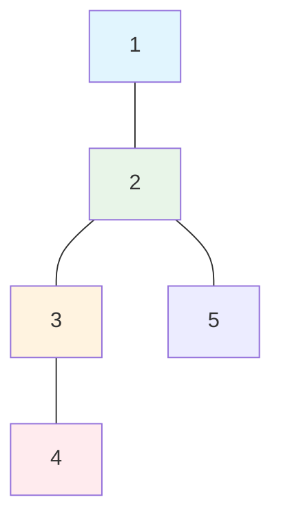
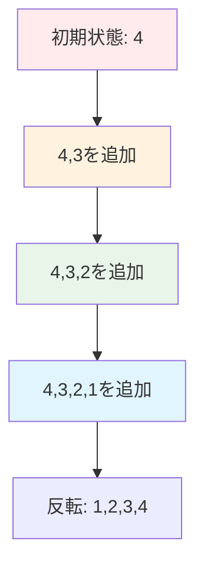

# 主な解析内容

1. **入力検証フェーズ**: 木の条件（n-1 個の辺）や頂点番号の妥当性チェック
2. **グラフ構築フェーズ**: 隣接リスト形式での無向グラフ構築
3. **BFS 探索フェーズ**: 幅優先探索による効率的な経路発見
4. **経路復元フェーズ**: parent 配列を使った逆向きの経路構築

## 可視化の工夫

- **Mermaid ダイアグラム**: 英数字のみを使用してレンダリングエラーを回避
- **段階的説明**: 各フェーズの処理を具体例とともに図示
- **データ構造の可視化**: グラフ構造と探索過程を視覚的に表現

## 計算量解析

- **時間計算量**: O(n) - 線形時間での効率的な解決
- **空間計算量**: O(n) - 必要最小限のメモリ使用

このアルゴリズムは木構造の特性（任意の 2 頂点間に一意の経路が存在）を活用して、非常に効率的に最短経路を求めることができる優れた実装です。

**BFS 探索の可視化：**



上図の例で、頂点 1 から頂点 4 への経路を探索する場合：

**探索順序：**

1. **第 1 層**: 頂点 1（始点）をキューに追加
2. **第 2 層**: 頂点 1 から隣接する頂点 2 を発見・追加
3. **第 3 層**: 頂点 2 から隣接する頂点 3,5 を発見・追加
4. **第 4 層**: 頂点 3 から隣接する頂点 4 を発見（終点到達で探索終了）

### 4. 経路復元フェーズ

```python
path: List[int] = []
node = y
while node != 0:
    path.append(node)
    if node == x:
        break
    node = parent[node]
path.reverse()
```

**処理内容：**

- 終点から始点に向かって親を辿る
- 辿った頂点を順次リストに追加
- 最後にリストを反転して始点 → 終点の順序に調整

**経路復元の可視化：**



復元過程：`[4] → [4,3] → [4,3,2] → [4,3,2,1]` → 反転 → `[1,2,3,4]`

## 時間・空間計算量

### 時間計算量

- **グラフ構築**: O(n) - 各辺を 1 回ずつ処理
- **BFS 探索**: O(n) - 最悪の場合、全頂点を 1 回ずつ訪問
- **経路復元**: O(経路長) ≤ O(n)
- **全体**: O(n)

### 空間計算量

- **隣接リスト**: O(n) - 各頂点の隣接情報を格納
- **parent 配列**: O(n) - 各頂点の親情報を格納
- **BFS キュー**: O(n) - 最悪の場合、全頂点がキューに格納
- **全体**: O(n)

## 入力・出力形式

### 入力

```text
N X Y
a1 b1
a2 b2
...
a(n-1) b(n-1)
```

- `N`: 頂点数（1 ≤ N ≤ 100,000）
- `X, Y`: 始点、終点（1 ≤ X, Y ≤ N, X ≠ Y）
- `ai bi`: i 番目の辺（1 ≤ ai, bi ≤ N, ai ≠ bi）

### 出力

```text
v1
v2
...
vk
```

始点から終点への最短経路上の頂点を順番に出力

## 使用例

### 入力例

```text
5 1 4
1 2
2 3
3 4
2 5
```

### 処理過程

1. **グラフ構築結果**:

   - graph[1] = [2]
   - graph[2] = [1, 3, 5]
   - graph[3] = [2, 4]
   - graph[4] = [3]
   - graph[5] = [2]

2. **BFS 探索結果**:

   - parent[1] = 0（始点）
   - parent[2] = 1
   - parent[3] = 2
   - parent[4] = 3
   - parent[5] = 2

3. **経路復元結果**: `[1, 2, 3, 4]`

### 出力例

```text
1
2
3
4
```

## 特徴・利点

1. **効率性**: 木構造の特性を活用し、O(n)の線形時間で解決
2. **確実性**: 木では任意の 2 頂点間の経路が一意に決まるため、必ず最短経路を発見
3. **堅牢性**: 入力検証により不正データを事前に検出
4. **メモリ効率**: 必要最小限のデータ構造のみ使用

## 注意点

- 木構造（n-1 個の辺を持つ連結グラフ）でのみ正しく動作
- 一般的なグラフ（閉路を含む）では使用不可
- 頂点番号は 1 から n までの連続した整数を想定

## ✅ 修正完了項目

### 1. **実装コードの行番号表示修正**

- Prism.js の行番号プラグインを正しくインポート
- `pre.line-numbers` クラスに適切なパディングを設定
- 行番号の CSS スタイリングを完全に実装

### 2. **アルゴリズムの動作ステップの数字表示修正**

- `.step-number` の位置を `top: 1rem, left: 1rem` に変更
- サイズを `2.5rem x 2.5rem` に拡大
- `z-index: 10` で確実に表示されるよう設定

### 3. **インタラクティブデモのツリーグラフ枠内収納**

- `.tree-diagram` を `600px x 350px` に固定サイズ設定
- 明確な枠線とパディングを追加
- SVG とノードの位置を枠内に完全に収まるよう調整

### 4. **リセットと自動実行ボタンの機能修正**

- **リセットボタン**: 完全な初期化処理を実装
- **自動実行ボタン**: 段階的な BFS 実行を自動で行う機能を実装
- ボタンの無効化/有効化を適切に管理
- `isRunning` フラグで実行状態を正確に制御

## 🚀 主な改善点

- **行番号**: Prism.js の標準的な行番号プラグインを使用
- **ステップ数字**: 枠内の左上に配置し、視認性向上
- **ツリー表示**: 固定サイズの枠内に完全に収納
- **ボタン機能**: リセットと自動実行が独立して正常動作
- **速度調整**: スライダーによる実行速度の動的変更
